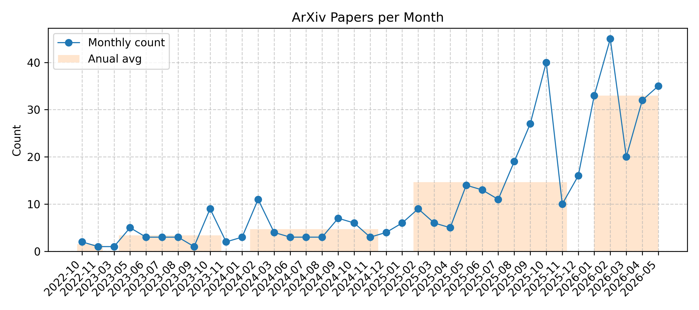

[![Contributors][contributors-shield]][contributors-url]
[![Forks][forks-shield]][forks-url]
[![Stargazers][stars-shield]][stars-url]
[![Issues][issues-shield]][issues-url]

For more carefully curated articles, you can refer to this [repository](https://github.com/bansky-cl/Diffusion_NLP_Papers).

## Updated on 2026.07.19

## diffusion

|Date|Title|label|Abstract|PDF|Code|
|---|---|---|---|---|---|
|**2026-07-16**|**Mask-Aware Policy Gradients for Diffusion Language Models**|cs.CL, cs.AI, cs.LG| 

Full Abstract
Reinforcement learning has proven effective for improving reasoning in large language models, but extending it to Masked Diffusion Language Models (MDLMs) remains challenging due to the intractability of the log-likelihood estimation. Existing approaches approximate this log-likelihood by modeling only the token predictions, ignoring the order in which positions are unmasked during generation. We observe that MDLM generation involves two decisions at each step: what tokens to place at each masked position and which positions to remask. We formalize this as a two-stage action MDP, showing that the policy gradient naturally decomposes into a token term and a masking term. Combining optimization of both terms leads to state-of-the-art outcomes on mathematical reasoning and coding benchmarks, with scores of 87.1% on GSM8K and 53.4% on MBPP.
|[2607.15200v1](http://arxiv.org/abs/2607.15200v1)| null|
|**2026-07-15**|**Discrete Diffusion Models: A Unified Framework from Tokenization to Generation**|cs.LG, cs.AI, cs.CL| 

Full Abstract
Discrete denoising diffusion models (DDMs) have recently emerged as a compelling alternative to autoregressive (AR) modeling for discrete data, offering parallel generation and iterative global refinement capabilities. Unlike continuous diffusion, where the state space is fixed, DDMs are fundamentally shaped by how the discrete state space is constructed: the tokenization scheme, the vocabulary topology, and domain-specific structural alphabets. This work introduces a unified conceptual framework that views discrete diffusion models through the construction of the underlying discrete state space. Within this framework, existing formulations, including transition-matrix, masking/absorbing-state, and score/ratio-based approaches, emerge as different instantiations of a common design space. The framework further exposes common design trade-offs across training objectives, inference algorithms, scaling behavior, systems optimization, and evaluation protocols, suggesting several promising directions for future research.
|[2607.13431v1](http://arxiv.org/abs/2607.13431v1)| null|
|**2026-07-14**|**Accelerating Masked Diffusion Large Language Models: A Survey of Efficient Inference Techniques**|cs.LG, cs.AI, cs.CL| 

Full Abstract
Diffusion large language models (dLLMs) offer a theoretical advantage in parallel generation over standard autoregressive models. However, parallel generation alone does not guarantee practical speedups. Realizing this efficiency requires specialized inference mechanisms, such as diffusion-aware caching and reuse. Consequently, as inference efficiency becomes a prerequisite for practical deployment, recent research has actively explored acceleration techniques across algorithms, architectures, and systems. However, rigorous comparisons remain difficult, as end-to-end latency stems from intricate trade-offs between algorithmic, architectural, and system-level factors that are often conflated in existing benchmarks. In this survey, we introduce a unified latency decomposition framework for dLLMs to disentangle these factors and analyze their impact on inference speed in real deployments. Guided by this framework, we categorize acceleration techniques along three axes covering algorithmic innovations, architectural and system optimizations, and inference-time scaling. Finally, we provide guidelines for reproducible benchmarking and highlight open challenges for realizing the full potential of parallel generation.
|[2607.12829v1](http://arxiv.org/abs/2607.12829v1)| null|
|**2026-07-07**|**Nemotron-Labs-Diffusion: A Tri-Mode Language Model Unifying Autoregressive, Diffusion, and Self-Speculation Decoding**|cs.CL| 

Full Abstract
We introduce Nemotron-Labs-Diffusion, a tri-mode language model (LM) that unifies AR, diffusion, and self-speculation decoding within a single architecture. Trained with a joint AR-diffusion objective, Nemotron-Labs-Diffusion can switch modes to sustain high throughput across deployment settings and concurrency levels. Our study shows that (1) AR and diffusion objectives are complementary: diffusion improves lookahead planning, while AR provides left-to-right linguistic priors. (2) In self-speculation mode, diffusion drafts while AR verifies, outperforming multi-token prediction (MTP) methods in both acceptance rate and real-device efficiency. (3) A speed-of-light analysis further demonstrates diffusion's long-term potential, with up to 76.5% more tokens per forward pass than self-speculation under an optimal sampler. Scaling to 3B, 8B, and 14B parameters, our Nemotron-Labs-Diffusion family, including base, instruct, and vision-language models, consistently outperforms state-of-the-art open-source AR and diffusion LMs in both accuracy and speed. For example, Nemotron-Labs-Diffusion-8B decodes 6x more tokens per forward than Qwen3-8B with comparable accuracy, translating to 4x higher throughput on SPEED-Bench with SGLang on a GB200 GPU.
|[2607.05722v1](http://arxiv.org/abs/2607.05722v1)| null|
|**2026-07-06**|**What Does a Discrete Diffusion Model Learn?**|cs.LG, cs.AI, cs.CL, cs.IT, stat.ML| 

Full Abstract
What does a discrete diffusion model learn: a denoiser, a score ratio, or a bridge plug-in predictor? At the level of jump rates, these are one object in different coordinates, and reading a neural network in the wrong coordinate changes the process being trained and sampled. Starting with a rigorous derivation of the continuous-time Markov chain (CTMC) ELBO for any noising process, boundary terms included, we prove the \emph{Oracle Distance} theorem: the negative ELBO is exactly equal to the data entropy plus the path KL from the oracle reverse process to the learned one, not merely a bound. Its unique optimizer is therefore the conditional expectation of the true reverse jump rate given the current noisy state, and its irreducible cost is the rate at which the forward process $Z_t$ destroys information about the clean data $Z_0$, $-\tfrac{d}{dt}I(Z_0; Z_t)$, so every noising process shares the same best achievable negative ELBO: the data entropy. For sequences with token-factorizing noise, the oracle projection yields three exact coordinates for the optimizer: denoiser, cavity (bridge plug-in), and score, with closed-form conversions among them. This framework identifies which law each loss in the literature actually optimizes, recovering MDM, UDM, SEDD, and GIDD as special cases; explains why denoiser and cavity coincide for masked diffusion but not for uniform diffusion; proves that a denoiser parameterization makes the uniform ELBO diverge at initialization while the bridge plug-in stays finite; and calibrates ELBO implementations exactly at initialization. Every identity is verified numerically, without approximation, on an exactly solvable model.
|[2607.05381v1](http://arxiv.org/abs/2607.05381v1)| null|
|**2026-07-05**|**Don't Commit Alone: Joint Token Commitment in Diffusion Large Language Models**|cs.CL| 

Full Abstract
Diffusion large language models (dLLMs) commit multiple tokens per denoising step by decoding each selected position independently from the shared context; when those positions are dependent, the resulting factorization error is captured by conditional total correlation, which confidence-based selection cannot observe from marginals alone. We propose CoCommit, a marker-gated coordination pass that briefly defers commitment: after the usual bundle selection, a learned marker announces the commit set and the backbone's last-$n$ layers are re-applied so marked positions coordinate -- approximating joint-mode decoding -- before greedy argmax writes tokens. The method reuses existing weights with one extra partial forward pass and no auxiliary model. On LLaDA2.1-mini with LoRA adapters and matched greedy inference, joint commitment improves accuracy on all six benchmarks we evaluate, with the largest gains on reasoning and exact-answer tasks.
|[2607.04469v1](http://arxiv.org/abs/2607.04469v1)| null|
|**2026-07-05**|**dOPSD: On-Policy Self-Distillation for Diffusion Language Models**|cs.CL, cs.AI| 

Full Abstract
Diffusion large language models (dLLMs) generate text by iteratively denoising a masked sequence, offering a parallel alternative to autoregressive models, but eliciting strong reasoning through post-training remains difficult: supervised fine-tuning is off-policy and suffers from exposure bias, while reinforcement learning gives only sparse, sequence-level rewards and is hard to apply without tractable sequence likelihoods. On-policy self-distillation (OPSD) offers a promising alternative, using one model as both student and teacher to provide dense, token-level, on-policy supervision, but its effectiveness hinges on giving the teacher privileged information (PI) - typically an instance-specific ground-truth reference unavailable at inference - so the student ends up distilling a weak PI-free consensus policy that yields little improvement on dLLM reasoning. We introduce dOPSD, which instead derives the teacher's privilege directly from the student's own denoising trajectory, evaluating masked positions using later, more-decoded steps of that same trajectory rather than an external label, so the teacher's advantage emerges from the model's own decoding process; on Dream and LLaDA, dOPSD improves both in-domain math reasoning and out-of-domain code generation, outperforming supervised and on-policy baselines.
|[2607.04428v1](http://arxiv.org/abs/2607.04428v1)| null|
|**2026-07-03**|**TACG: Trajectory-Aware Commit Gating for Diffusion Language Model Decoding**|cs.CL| 

Full Abstract
Diffusion language models (DLLMs) generate text by iteratively denoising masked positions, exposing a trajectory of predictive distributions rather than a single instantaneous belief. Most existing decoders ignore this trajectory and commit tokens from the current snapshot alone, conflating confidence with commitment readiness: a transient top-1 peak under incomplete context can be locked in, while candidates with consistent cross-step support are delayed. We propose Trajectory-Aware Commit Gating (TACG), a training-free gate-level decoder that anchors token identities to the base posterior and uses trajectory-aware signals only to decide whether the current proposal is ready to commit. TACG combines Temporal Implicit Logits Guidance (TILG), which keeps an exponential moving average of past logits as a self-reference and contrasts the current logits against this reference in natural-parameter space, with a History Gate (HG) that enforces short-term proposal persistence before commitment. Together with a capped extra-promotion budget, these components yield a stability-constrained commit rule without auxiliary networks or extra forward passes. We evaluate TACG on LLaDA, Dream, and LLaDA2-Mini across code (HumanEval, MBPP) and math (GSM8K, MATH500) benchmarks; it typically improves or preserves accuracy while reducing denoising steps and increasing tokens per forward (TPF). The code is publicly available at https://github.com/Clarence-CV/TACG-DLLM.
|[2607.03236v1](http://arxiv.org/abs/2607.03236v1)| null|
|**2026-07-03**|**Conditional Diffusion Guided Knowledge Transfer for Multi-Domain Knowledge Graph Completion**|cs.CL, cs.AI| 

Full Abstract
Multi-domain knowledge graph completion (MKGC) aims to improve missing triple prediction in a target KG by transferring knowledge from other support KGs. Existing methods typically enforce consistency constraints on equivalent entities across KGs to transfer knowledge, which risks suppressing domain-specific contextual information of entities. This design can also compromise entity representation information from all KG domains, impeding performance improvements, especially in low-resource data scenarios. To address this, we pioneer a generation-based paradigm for MKGC and propose DMKGC, a conditional diffusion-guided knowledge transfer framework. Our key insight is to treat each KG as a partial view of the entity entire information, and generate informative domain-general entity embeddings through diffusion models conditioned on support KGs. Particularly, we first initialize domain-agnostic entity embeddings as prior entity embeddings, and then encode them within individual KGs. Afterward, we fuse equivalent entities from support KGs as the conditional diffusion generation guidance. We leverage the prior entity embeddings as the proxy generation objective, which ensures this conditional generation to be unbiased towards any conditioned KGs. Simultaneously, we also train the generated embeddings to be predictive across KGs, thus preserving domain-specific information. Extensive experiments on 14 KGs in 3 benchmarks demonstrate a 4.3\% average MRR improvement in tail entity prediction over state-of-the-art methods, with sustained gains in low-resource data settings.
|[2607.03154v1](http://arxiv.org/abs/2607.03154v1)| null|
|**2026-07-02**|**Training Hybrid Block Diffusion Language Models with Partial Bidirectionality**|cs.LG, cs.AI, cs.CL| 

Full Abstract
High-throughput long-context generation is one of the central challenges for large language models. Generation is typically memory-bandwidth-bound rather than compute-bound: each decoding step must stream the accumulated key/value (KV) cache from memory, so bandwidth demand grows with context length while only one token is emitted. Two parallel approaches have therefore emerged: reducing memory access with efficient attention variants and linear-time mixers such as Mamba, or increasing parallel computation by generating blocks of tokens at once. However, technical challenges arise when combining these two ideas. Earlier hybrid diffusion models such as DiffuMamba use bidirectional Mamba mixing, including a reverse-direction scan relative to causal generation. This reverse scan needs to scan the entire sequence, so its states are not prefix-only and cannot be precisely reused as a cache even when diffusion is performed block by block. We propose a BDLM Mamba--attention hybrid that addresses this challenge by restricting the reverse Mamba scan to the active denoising block, which enables exact caching across blocks. In an 87M-parameter DCLM sweep, BDLM Mamba-H achieves the best C4-en validation perplexity compared to BDLM attention and full-sequence baselines. At 350M parameters, it remains competitive with BDLM attention. For long-context inference, BDLM Mamba-H reaches 19.7x the throughput of full-sequence DiffuMamba-H at 65K tokens and 3.7x the throughput of BDLM attention at 262K, showing that Mamba hybrids are a potential long-context diffusion architecture.
|[2607.02805v1](http://arxiv.org/abs/2607.02805v1)| null|
|**2026-07-02**|**Subliminal Clocks: Latent Time Modelling in Diffusion Language Models**|cs.AI, cs.CL| 

Full Abstract
Diffusion Language Models (DLMs) have recently emerged as a promising alternative to autoregressive models. Unlike standard diffusion-based approaches, DLMs are not explicitly conditioned on a timestep, raising a natural question: do these models internally represent denoising progress, and how is such information used downstream? In this work, we show that DLMs do in fact encode a latent representation related to the diffusion timestep within their residual streams. We find that this signal can be reliably extracted using probes across layers, indicating that denoising progress is decodable from internal activations. We further demonstrate that steering the model along a low-dimensional subspace associated with the inferred timestep allows us to systematically modulate its notion of denoising progress, leading to predictable changes in model confidence and entropy. Finally, we analyse the geometry of the identified representation, showing that it exhibits structured and interpretable properties in activation space, and shedding light on how such a signal is processed by these models.
|[2607.01774v1](http://arxiv.org/abs/2607.01774v1)| null|
|**2026-07-01**|**Low Perplexity is Repetition: A One-Dimensional Self-Conditioning Attractor in Continuous Diffusion LMs**|cs.CL| 

Full Abstract
Continuous diffusion language models such as ELF report record-low generative perplexity (Gen-PPL). We find a catch: these models repeat far more than human text, and Gen-PPL rewards rather than penalizes that repetition, so its low scores overstate quality. Strip the repetition and ELF-B's Gen-PPL rises from $19.5$ to $27.7$; the smallest model even posts the best Gen-PPL because it repeats most. We trace the repetition to its source: a contractive attractor along a \emph{single direction} in the self-conditioning feedback loop, the loop that feeds each step's clean estimate into the next. Because the failure is one-dimensional, a one-dimensional fix suffices, and we propose one. \textbf{ACE} (Attractor-Contrast-Escape) subtracts that single, label-free direction from the feedback at each step. Estimated once on the $105$M model, the direction cuts repetition to near the human level while keeping quality competitive, and transfers near-unchanged to the $342$M and $652$M models and across samplers; the same recipe recovers useful directions on other architectures. Since Gen-PPL itself rewards repetition, we instead measure the compute each fix needs to produce human-clean text, where ACE is $1.5$--$5\times$ cheaper.
|[2607.00588v1](http://arxiv.org/abs/2607.00588v1)| null|
|**2026-06-30**|**SLIM-RL: Risk-Budgeted Random-Masking RL for Diffusion LLMs Without Trajectory Slicing**|cs.CL, cs.AI, cs.LG| 

Full Abstract
Reinforcement learning for diffusion large language models (dLLMs) has largely moved to trajectory-aware methods. The current state of the art, TraceRL, holds that random masking is mismatched with the model's inference trajectory, and it reconstructs that trajectory during training by slicing each rollout into up to K/s trajectory-aligned training samples, a cost that grows with the block size K. We show that this mismatch can be mitigated without reconstructing the trajectory. Our method, SLIM-RL, bounds the commit risk of each rollout step with a tau-budget decoder, reducing aggregate commit risk in the training data. During optimization, SLIM-RL trains on these risk-controlled rollouts with a trace-free random-masking objective that adapts variance-reduction tools, combining sequence-level importance sampling, deterministic quadrature over masking levels under a mean-preserving, monotonically decreasing per-block mask schedule that we introduce. On SDAR-4B, SLIM-RL matches TraceRL's best MATH500 accuracy on only 0.46x its training samples at block size 16, improving over TraceRL by 6.32% on MATH500 and 11.05% on GSM8K under matched dynamic sampling. At block size 4, the 4B SLIM-RL surpasses the larger LLaDA-8B and Dream-7B dLLMs on math, exceeding LLaDA-8B by 10.76% on MATH500 while staying below the autoregressive Qwen2.5-7B. On code, it improves over TraceRL by 4.20% on MBPP and 3.65% on HumanEval. The tau-budget decoder transfers training-free across LLaDA, Dream, and SDAR. The source code is available at https://github.com/laolaorkkkkk/SLIM-RL .
|[2607.00208v1](http://arxiv.org/abs/2607.00208v1)| null|
|**2026-06-30**|**BlockPilot: Instance-Adaptive Policy Learning for Diffusion-based Speculative Decoding**|cs.CL| 

Full Abstract
Speculative decoding accelerates inference by using a lightweight draft model to generate candidate tokens in parallel, and are then verified by the target model, enabling lossless acceleration. Recently, diffusion-based speculative decoding further improves parallelism by generating multiple tokens per forward pass via block-level diffusion, achieving state-of-the-art (SOTA) performance. However, existing methods adopt a fixed inference block size and assume a uniform optimal decoding strategy across all inputs. In this paper, we show that this assumption is suboptimal, as the optimal block size varies across samples and plays a critical role in speculative decoding performance. Moreover, these values exhibit a clear local structure, concentrating around the training block size, which reduces the problem to a low-dimensional and structured decision space. Based on these insights, we propose BlockPilot, a sample-adaptive policy that predicts the optimal block size from the prefilling representation. Specifically, we formulate block size selection as a lightweight policy learning problem and propose an instance-adaptive decision mechanism that predicts the optimal block size based on the representation of the prefilling stage. The prediction is performed only once after prefilling, allowing for seamless integration. Extensive experiments demonstrate that our method is plug-and-play, introduces minimal overhead, and consistently improves efficiency, achieving an acceptance length of 5.92 and a 4.20$\times$ speedup on Qwen3-4B under temperature $T=1$.
|[2606.31315v1](http://arxiv.org/abs/2606.31315v1)| null|
|**2026-06-30**|**TAG-DLM: Diffusion Language Models for Text-Attributed Graph Learning**|cs.CL, cs.LG| 

Full Abstract
Text-attributed graphs (TAGs), where each node carries a natural language description, require models to jointly reason over text and graph topology. Existing approaches often handle the two modalities separately: graph neural networks operate on shallow text features, while hybrids of LLMs and graphs use the language model mainly as a text encoder and delegate structure learning to a separate graph module. We propose method that unifies textual reasoning and graph message passing within a masked diffusion language model, a language model with bidirectional attention and generative decoding. For each graph instance, method linearises a sampled local neighbourhood into a token sequence and injects graph structure through a topology attention mask, which realises message passing over the graph. Because the diffusion language model can both interpret and generate text, the method adapts to different tasks simply by changing the prompt, supporting node classification, link prediction, and cross-dataset transfer with no target-specific fine-tuning.   Experiments show that method outperforms graph neural networks, graph transformers, and LLM-based baselines on all three TAG benchmarks across two tasks, improving over the strongest baseline by up to 3.9 points.
|[2606.31166v1](http://arxiv.org/abs/2606.31166v1)| null|
|**2026-07-01**|**Understanding Evaluation Illusion in Diffusion Large Language Models**|cs.CL, cs.LG| 

Full Abstract
Despite the capability of parallel decoding, diffusion large language models (dLLMs) require many denoising steps to maintain generation quality, motivating recent research on efficient decoding strategies. However, existing studies have reported inconsistent evaluation results even under seemingly identical evaluation settings, risking biased conclusions about dLLM decoding methods. To understand this evaluation concern, we conduct a rigorous evaluation of current decoding methods for dLLMs across diverse evaluation settings. Surprisingly, our analysis reveals that the ranking of decoding methods is highly sensitive to the choice of prompt templates. Single-template evaluation can lead to an illusion that decoding methods improve inference efficiency without performance degradation. Through comprehensive experiments, we find that current parallel decoding methods consistently underperform the single-token decoding baseline, failing to overcome the speed-quality trade-off. We further identify this evaluation inconsistency as the high sensitivity of parallel decoding methods to minor variations in prompt templates. Our experiments show that an effective prompt template can achieve strong evaluation results even with fewer denoising steps, markedly outperforming the marginal gain from increasing denoising steps. Beyond prompt templates, our experiments indicate that overlooked evaluation settings can also notably affect the assessment of decoding methods. Based on these findings, we propose practical guidelines for the reliable evaluation of decoding methods in dLLMs.
|[2606.29228v2](http://arxiv.org/abs/2606.29228v2)| null|
|**2026-06-30**|**Multi-Block Diffusion Language Models**|cs.LG, cs.CL| 

Full Abstract
Block Diffusion Language Models (BD-LMs) improve diffusion-based text generation with KV caching and flexible-length generation. A natural next step is to extend them from Single-Block Diffusion (SingleBD) to Multi-Block Diffusion (MultiBD), where a running-set of consecutive blocks is decoded concurrently for inter-block parallelism. However, existing BD-LMs are mostly trained under teacher forcing, where the model observes only one noisy block conditioned on a clean prefix. While the recent diffusion forcing strategy introduces visibility among multiple noisy blocks, its training states still differ from MultiBD inference, where decoding operates on a bounded running-set with heterogeneous slot-wise noise patterns. To bridge this gap, we propose Multi-Block Diffusion Language Models (MBD-LMs), obtained by post-training BD-LMs with Multi-block Teacher Forcing (MultiTF). MultiTF integrates teacher forcing and diffusion forcing by training on bounded noise-groups conditioned on clean prefixes, with randomized noise-schedulers that better match MultiBD inference states. To make MultiBD practically executable, we further introduce an optimized decoding algorithm based on the Block Buffer mechanism that preserves prefix-cache reuse, keeps input shapes static, and translates increased decoding parallelism into wall-clock acceleration. Empirically, MBD-LLaDA2-Mini increases average Tokens Per Forward pass (TPF) from 3.47 to 6.19 and improves average accuracy from 79.95% to 81.03%; when combined with DMax, MBD-LLaDA2-Mini-DMax reaches an average TPF of 9.34 with only a 1.02% accuracy drop on math and code benchmarks.
|[2606.29215v2](http://arxiv.org/abs/2606.29215v2)| null|
|**2026-06-27**|**Masked Diffusion Decoding as $x$-Prediction Flow**|cs.CL| 

Full Abstract
Masked diffusion language models (MDLMs) generate text by iteratively unmasking tokens, but their standard decoder reduces each step to a binary action: a position is either committed to a single token or left fully masked, with no representation of partial belief in between. This all-or-nothing regime discards rich predictive information and forces premature, irrevocable commitments, leading to poor performance under a limited decoding budget. In this paper, we reinterpret mask prediction as clean-state prediction ($x$-prediction) and show that it can be used to induce a continuous flow in input embedding space. Building on this view, we propose a continuous decoding framework for MDLMs where tokens can accumulate partial progress at each diffusion step and remain revisable. To match the uneven contextual constraints across positions in language, we replace the globally synchronous schedule in image diffusion with a confidence-based asynchronous update in which the diffusion progress is token-wise accumulated. Additionally, we introduce a lightweight policy network and formulate its training as a reinforcement learning problem. Applied to pretrained LLaDA, our continuous decoder reaches 97% of its performance on the HumanEval dataset with 25% of decoding budget.
|[2606.29066v1](http://arxiv.org/abs/2606.29066v1)| null|
|**2026-06-25**|**Adversarial Diffusion Across Modalities: A Fusion Survey of Attacks, Defenses, and Evaluation for Text, Vision, and Vision-Language Models**|cs.CR, cs.CL| 

Full Abstract
Adversarial evaluation of AI systems has matured along four largely disconnected tracks: diffusion-based attacks on text and large language models (LLMs), diffusion-based attacks on image classifiers, jailbreak pipelines against vision-language models, and diffusion-based input purification defenses. Each has developed its own vocabulary, threat models, and benchmarks, with denoising diffusion models emerging as a shared generative mechanism whose recipes are now actively ported between communities. This survey performs an information-fusion exercise at the meta-research level: we integrate these four tracks into a single conceptual framework with a unified taxonomy, evaluation criteria, and research agenda, focusing on the LLM-side slice. We catalog fifty published papers across four scope areas (text/LLM, image classifier, vision-language model, defense), plus four diffusion-LLM-as-victim entries and ten non-diffusion baselines against which any new attack must be compared. We propose a six-class taxonomy of diffusion roles in adversarial pipelines, augmented by a threat-model axis recording attacker knowledge, query budget, and target accessibility, and apply a five-dimension framework (attack success rate, transferability, query budget, perplexity, defense-evasion) uniformly across modalities. The review adopts a dual attacker-defender perspective: alongside the attack catalog we cover four diffusion-based defenses that form the natural evaluation backdrop for new attacks. Our critical analysis identifies five recurring weaknesses of the current LLM-side literature, and we close with a research agenda of open questions and concrete experimental designs. The companion catalog and spreadsheet are released with the paper. We are explicit that this is a narrative review with quality assessment, not a PRISMA-compliant systematic review, and discuss the implications for replication.
|[2606.26566v1](http://arxiv.org/abs/2606.26566v1)| null|
|**2026-06-29**|**Nemotron-Labs-TwoTower: Diffusion Language Modeling with Pretrained Autoregressive Context**|cs.CL| 

Full Abstract
Diffusion language models offer a promising alternative to autoregressive models due to their potential for parallel and iterative generation. However, existing approaches use a single network for both context representation and iterative denoising, forcing one model to serve both roles and limiting its capacity for either role. We propose TwoTower, a block-wise autoregressive diffusion model that decouples these roles into two towers: a frozen AR context tower that causally processes clean tokens, and a trainable diffusion denoiser tower with bidirectional block attention that refines noisy blocks via cross-attention to the context. Built on Nemotron-3-Nano-30B-A3B, an open-weight 30B hybrid Mamba-Transformer MoE model, and trained on approximately 2.1T tokens, Nemotron-Labs-TwoTower retains 98.7% of the autoregressive baseline's quality while offering 2.42X higher wall-clock generation throughput. We release the code and model weights at https://huggingface.co/collections/nvidia/nemotron-labs-twotower.
|[2606.26493v2](http://arxiv.org/abs/2606.26493v2)| null|
|**2026-06-24**|**Improved Large Language Diffusion Models**|cs.CL, cs.AI, cs.LG| 

Full Abstract
Modern large language models are predominantly trained with autoregressive factorization and causal attention. We present \emph{iLLaDA}, an 8B masked diffusion language model trained from scratch with fully bidirectional attention. iLLaDA keeps the masked diffusion objective throughout pre-training and supervised fine-tuning (SFT), scaling pre-training to 12T tokens and fine-tuning on a 25B-token instruction corpus for 12 epochs. We further use variable-length generation for efficiency and introduce confidence-based scoring for multiple-choice evaluation. Compared with LLaDA, iLLaDA improves broadly across general, mathematical, and code benchmarks; for example, iLLaDA-Base improves by 21.6 points on BBH and 14.9 points on ARC-Challenge, while iLLaDA-Instruct improves by 14.5 points on MATH and 16.5 points on HumanEval. Despite its non-autoregressive training, iLLaDA also remains competitive with Qwen2.5 7B on several benchmarks. These results show that fully bidirectional diffusion training from scratch is a competitive path toward strong language models. Model weights and codes: https://github.com/ML-GSAI/LLaDA.
|[2606.25331v1](http://arxiv.org/abs/2606.25331v1)| null|
|**2026-06-23**|**When Top-1 Fails: Calibrating LoRA Monitors for Masked Diffusion LMs**|cs.LG, cs.CL| 

Full Abstract
Discrete diffusion language model (DLM) fine-tuning inherits inexpensive diagnostics from denoising-time confidence monitors, but their PEFT-training meaning is untested. We test top-1 argmax concentration as a collapse warning. Across 816 LoRA/PEFT configurations from three DLM families, the warning fires for every configuration while logs record 0/816 actual collapses at the 200 step horizon, giving zero precision. The cause is pre-equilibrium saturation: top-1 concentration is already high before optimization and quickly becomes insensitive to final training stability. We then evaluate max LoRA gradient norm, a parameter-side signal that samples gradient routing rather than token concentration. On a pooled held-out LLaDA-family split, a train-optimized threshold identifies top-decile final-loss configurations with precision 0.68 and F1=0.79, above the all-positive top-1 baseline even at the lower split-bootstrap confidence bound. Autoregressive controls and cross-family threshold failures bound the result to short-horizon DLM-LoRA inspection rather than a universal collapse detector. Workflow: drop top-1 as a PEFT alarm, log max-gradient early in training, and calibrate thresholds per DLM family before routing runs for inspection.
|[2606.24119v1](http://arxiv.org/abs/2606.24119v1)| null|
|**2026-06-22**|**Understanding Parallel Samplers in Masked Diffusion via Random Walks on Graphs**|cs.LG, cs.AI, cs.CL| 

Full Abstract
In this paper, we propose using random walks on graphs as a verifiable sandbox to study different parallel sampling strategies in masked diffusion models (MDMs). We train an MDM on random walk samples from a fixed graph. The graph or the transition kernel is never shown to the model explicitly and plays the role of latent structure in the sequences, albeit one that is controllable and can be used for quantitative evaluation. Thus, this framework enjoys a Sudoku-like validity check: verifying that an output is a valid walk and estimating the Markov kernel from the walks to measure distribution fidelity.   Using simple graphs, we theoretically prove that parallel unmasking via widely used scores like lowest entropy is not uniformly better than a random parallel sampler; the performance critically depends on the structure of the underlying graph. We develop a new bisection sampler for random walks, which takes logarithmic steps in the sequence length and is provably exact under perfect training. Experiments on various graph walk tasks show that different parallel samplers are better for different graphs even in practice. Our initial experiments on a pretrained OpenWebText MDM show that the bisection-style samplers improve speed-quality tradeoffs even for language generation. Together, these results position graph random walks as a mechanistic benchmark for diagnosing and designing parallel samplers for masked diffusion models.
|[2606.22976v1](http://arxiv.org/abs/2606.22976v1)| null|
|**2026-06-19**|**When to Plan, When to Polish: Noise Level as a Granularity Axis for Diffusion Language Models**|cs.CL| 

Full Abstract
Standard tokenwise diffusion LMs keep training corruption and inference commitment at token granularity throughout denoising. At high noise, this leaves scattered local fragments rather than coherent evidence, making it hard to form early coarse structure, exactly what planning-sensitive generation requires. Hierarchical planning methods add coarse stages to separate planning from wording, but they need extra planners, block latents, or two stage designs. We propose Noise Dependent Granularity Control (NDGC), a single-level diffusion method that uses the noise level as a granularity cue. NDGC aligns training exposure and inference commitment with denoising progress. High noise steps use coherent token groups to support early meaning commitment, while low noise steps return to token level refinement. This creates planning like coarse to fine denoising without an explicit planner or hierarchical architecture. Across controlled tests, ablations, and WritingPrompts, NDGC shows earlier skeleton formation, better ordered recovery, and healthier outputs.
|[2606.21802v1](http://arxiv.org/abs/2606.21802v1)| null|
|**2026-06-22**|**Diffusion Language Models: An Experimental Analysis**|cs.AI, cs.CL| 

Full Abstract
Large Language Models (LLMs) have revolutionized language modeling through autoregressive generation, enabling strong performance across a wide range of tasks. Recently, Diffusion Language Models (DLMs) have emerged as an alternative paradigm that generates text through iterative denoising rather than next-token prediction, allowing parallel refinement of entire sequences. While numerous diffusion-based architectures have been proposed, differences in evaluation protocols, datasets, inference budgets, and generation hyperparameters make it difficult to compare their capabilities and understand the trade-offs they offer. In this work, we present a systematic experimental analysis of modern DLMs. Specifically, we evaluate eight state-of-the-art DLMs across eight benchmarks spanning reasoning, coding, translation, knowledge, and structured problem solving, while explicitly considering both generation quality and computational efficiency. Beyond downstream evaluation, we analyze the impact of key inference-time factors, including denoising steps, context length, block size, and parallel unmasking strategies, and complement large-scale experiments with controlled comparisons of smaller models trained under identical conditions. Our analysis highlights the strengths and limitations of diffusion-based language modeling across different tasks, architectures, and inference budgets. We show that the behavior of DLMs is strongly influenced by generation-time design choices, leading to distinct trade-offs between performance and computational efficiency. Overall, our study provides practical insights into the capabilities and deployment characteristics of contemporary DLMs.
|[2606.19475v2](http://arxiv.org/abs/2606.19475v2)| null|
|**2026-06-17**|**DreamReasoner-8B: Block-Size Curriculum Learning for Diffusion Reasoning Models**|cs.CL| 

Full Abstract
Block diffusion language models accelerate decoding through parallel block-wise denoising, yet whether they can be reliably scaled for long chain-of-thought (CoT) reasoning remains unresolved. To this end, we develop DreamReasoner-8B, an open-source block diffusion reasoning model, and conduct a systematic study of how training and inference block sizes affect long-CoT reasoning. Our analysis reveals a stark performance disparity: training with large block sizes yields remarkably poor reasoning, whereas small block sizes preserve effective reasoning. To bridge this granularity gap, we propose block-size curriculum learning, which gradually transitions training from fine-grained to coarse-grained block sizes, thereby overcoming this limitation and enabling strong reasoning performance that generalizes across diverse inference block sizes. On mathematical and code reasoning benchmarks, DreamReasoner-8B achieves results competitive with leading open autoregressive models such as Qwen3-8B. This work establishes a practical foundation for efficient, reasoning-capable diffusion language models. We release our model at https://github.com/DreamLM/DreamReasoner.
|[2606.19257v1](http://arxiv.org/abs/2606.19257v1)| null|
|**2026-06-17**|**Sumi: Open Uniform Diffusion Language Model from Scratch**|cs.CL, cs.LG| 

Full Abstract
Diffusion models have become a promising alternative to autoregressive models. Among these, uniform diffusion language models (UDLMs) permit any token to be updated at any step, in principle enabling more flexible generation. However, no UDLM has yet been pretrained from scratch at both large parameter scale and large token budget. Both autoregressive modeling and masked diffusion modeling already have capable models at scale that the community can study and build on; uniform diffusion has none. A scratch-pretrained UDLM at scale would provide a clean reference point for studying scaling behavior, generation dynamics, controllability, and trade-offs against established autoregressive and masked diffusion models. To this end, we introduce Sumi ("ink" in Japanese), a fully open 7B uniform diffusion language model pretrained from scratch on 1.5T tokens. Sumi performs competitively with autoregressive models trained at comparable token budgets on knowledge, reasoning, and coding benchmarks, while under-performing on commonsense benchmarks, where our education-heavy data mixture is a likely contributor. We release our model weights, checkpoints, and full training recipe, including a complete specification of the data mixture over publicly available corpora. We hope this release enables the community to study native uniform diffusion at scale and catalyzes work on its as-yet poorly understood aspects.
|[2606.19005v1](http://arxiv.org/abs/2606.19005v1)| null|
|**2026-06-24**|**Approximate Structured Diffusion for Sequence Labelling**|cs.CL, cs.LG| 

Full Abstract
Sequence labelling, a core task of Natural Language Processing (NLP), consists in assigning each token of an input sentence a label.   From a Machine Learning point of view, sequence labelling is often cast as a Linear-Chain Conditional Random Field (CRF) parametrised by a neural network.   While this approach gives good empirical results, CRFs assume a finite decision span (eg label bigrams) which can limit their expressivity and hurt performance when long-range dependencies are required.   We show we can leverage diffusion to train a CRF conditioned on an entire label sequence, with the caveat that the condition is on a noisy version of labels.   We show experimentally that this method, in conjunction with approximate CRF inference, improves label accuracy with a 16.5% error reduction for POS-tagging.
|[2606.18856v2](http://arxiv.org/abs/2606.18856v2)| null|
|**2026-06-22**|**VoidPadding: Let [VOID] Handle Padding in Masked Diffusion Language Models so that [EOS] Can Focus on Semantic Termination**|cs.CL| 

Full Abstract
MDLMs generate text by denoising a preallocated masked response canvas, making response-length modeling central to instruction tuning. Existing MDLMs often inherit the autoregressive convention of using repeated \texttt{[EOS]} tokens for padding during instruction tuning, giving \texttt{[EOS]} a dual role as both a semantic terminator and a padding token. We show that this dual role is a root cause of \texttt{[EOS]} overflow under large-block decoding. To decouple these roles, we propose VoidPadding, which introduces \texttt{[VOID]} for padding and reserves \texttt{[EOS]} for termination. During inference, the learned \texttt{[EOS]} signal enables early stopping, while the learned \texttt{[VOID]} signal guides adaptive response canvas expansion. On Dream-7B-Instruct, VoidPadding improves the block-size-averaged four-task mean across mathematical reasoning and code generation benchmarks by \(+17.84\) points over the original model and \(+6.95\) points over RainbowPadding, while reducing decoding NFE by 55.7\% on average. Code is available at https://github.com/Haru-LCY/VoidPadding.
|[2606.17999v2](http://arxiv.org/abs/2606.17999v2)| null|
|**2026-06-15**|**Self-Generated Error Training for Token Editing in Diffusion Language Models**|cs.CL| 

Full Abstract
Token-to-token (T2T) editing lets LLaDA2.1 revise committed tokens during block-diffusion decoding. The released recipe trains this editor on random vocabulary corruptions, but at inference the editor sees the model's own fluent, high-confidence draft errors instead. We study this training-inference mismatch and propose self-generated T2T, which performs a no-gradient draft pass, fills masked positions with predicted tokens, and supervises recovery in a second pass under these self-generated corruptions. We implement the update as a short LoRA continued-pretraining pass on LLaDA2.1-mini and evaluate on several benchmarks under the official Q-Mode T2T procedure with unchanged inference parameters. The method generally improves accuracy while reducing T2T edit intensity, mitigating failure modes such as final-digit transcription errors after otherwise correct reasoning and excessive self-correction before short factual answers.
|[2606.17175v1](http://arxiv.org/abs/2606.17175v1)| null|
|**2026-06-15**|**LESS Is More: Mutual-Stability Sampling for Diffusion Language Models**|cs.CL| 

Full Abstract
Diffusion large language models (dLLMs) offer a promising alternative to autoregressive decoding by iteratively refining masked sequences, enabling parallel token updates and bidirectional conditioning. Their practical efficiency, however, is limited by sampling procedures that execute a fixed number of reverse denoising steps selected before decoding, spending computation on already-stable positions and sometimes committing unstable ones too early. We present \textsc{LESS}, a training-free, model-agnostic adaptive sampler that treats token commitment as an online stopping problem. \textsc{LESS} implements mutual-stability sampling through a joint stability rule that makes a masked position eligible for unmasking only when its top-1 prediction has high confidence, its top-1 token persists across recent reverse steps, and its predictive distribution is stable under top-$K$ inter-step Jensen--Shannon divergence. We evaluate \textsc{LESS} on Dream-7B, LLaDA-8B, and LLaDA-1.5-8B, covering full-sequence diffusion and semi-autoregressive blockwise sampling regimes, across seven benchmarks spanning general knowledge, math, and code. \textsc{LESS} improves average accuracy over strong training-free adaptive samplers while using $72.1\%$ fewer reverse steps than fixed-budget decoding. Since each reverse step requires a Transformer forward pass, these step-count reductions translate into fewer forward evaluations, lower measured wall-clock latency, and lower estimated inference compute.
|[2606.16908v1](http://arxiv.org/abs/2606.16908v1)| null|
|**2026-06-20**|**Follow the Latent Roadmap: Navigating Revocable Decoding for Diffusion LLMs with Anchor Tokens**|cs.CL, cs.AI| 

Full Abstract
Diffusion Large Language Models (dLLMs) offer a promising avenue for parallel generation but face a trade-off between decoding speed and quality. While revocable decoding strategies attempt to mitigate errors by verifying and remasking tokens, they typically operate within a mixed-quality context. This leads to two critical failures: \textit{Error Propagation}, where new tokens absorb toxic information from erroneous context, and \textit{Local Error Reinforcement}, where errors mutually reinforce each other to evade detection. To alleviate these challenges, we propose ASRD (Anchor Supervised Revocable Decoding), a training-free framework that operates within the embedding space. ASRD explicitly decouples the decoding context into trusted \textit{Anchor Tokens}, which are identified via temporal consistency, and uncertain candidates. Leveraging a dynamic Anchor Tokens Cache, we introduce two complementary mechanisms: (1) Anchor-Guided Generation, which injects entropy-weighted anchor signals into masked positions to implicitly rectify attention toward the reliable global skeleton; and (2) Anchor-Perturbed Verification, which applies orthogonal perturbations to uncertain candidate tokens, destabilizing and remasking errors driven by fragile local consensus. Extensive experiments on math and coding benchmarks demonstrate that ASRD outperforms recent remasking baselines, achieving accuracy improvements of up to 6.4\% while accelerating inference throughput by up to 7.2$\times$.
|[2606.16847v2](http://arxiv.org/abs/2606.16847v2)| null|
|**2026-06-15**|**Multi-Turn Reflective Masking Elicits Reasoning in Mask Diffusion Models**|cs.CL| 

Full Abstract
While reasoning on autoregressive (AR) models is often performed by chain-of-thought reasoning and reflection, their refinement of previous outputs still relies on fully sequential generation, even when only local edits are needed. In contrast, the masking mechanism in Mask Diffusion Models (MDMs) naturally supports explicit local edits on previous outputs, allowing selective refinement without discarding previous answers and generating another from scratch. While this property more closely aligns with how humans correct mistakes by iterative local refinement, existing MDMs do not support multi-turn masking and denoising. We propose Reflective Masking (RM), which elicits such an intrinsic reasoning capability in MDMs via lightweight post-training. RM provides a native test-time scaling, where an MDM iteratively revisits and revises its prior outputs based on evolving context. To exploit insights from previous turns like AR reasoning, we further introduce History Reference, a parameter-free mechanism that leverages intermediate denoising states during revision. Our approach requires no architectural changes and is easily applicable to existing MDMs. Across diverse tasks and modalities, including text generation, Sudoku, and image editing, Reflective Masking consistently outperforms standard masking-based baselines and demonstrates strong generality, positioning RM as a fundamental primitive for reasoning on MDMs.
|[2606.16700v1](http://arxiv.org/abs/2606.16700v1)| null|
|**2026-06-15**|**Fast When, Careful Who: Dual-Process Multiparty Turn-Taking with Diffusion Augmentation**|cs.CL, cs.AI| 

Full Abstract
Reliable turn-taking is essential for spoken dialogue systems. However, most existing methods are designed for two-speaker interaction and struggle with realistic multiparty audio containing overlap and rapid speaker changes. We study multiparty turn-taking on the VoxConverse dataset and propose an audio-only two-stage pipeline that separates when to trigger a turn boundary from whether the floor is actually transferring. A fast trigger scans the audio and proposes candidate end-of-turn times, while a lightweight verifier runs only at those times to decide \textsc{Hold} or \textsc{Shift} and support next-speaker prediction. We report results in the full multiparty setting and a controlled dyadic top-2 projection for comparability. We also investigate diffusion-based, label-preserving background-audio mixing as a data augmentation strategy. Results show improved shift detection over a baseline, with further improvements from diffusion augmentation.
|[2606.16568v1](http://arxiv.org/abs/2606.16568v1)| null|
|**2026-06-15**|**Who Should Lead Decoding Now? Tracking Reliable Trajectories for Ensembling Masked Diffusion Language Models**|cs.CL, cs.AI| 

Full Abstract
Masked Diffusion Language Models (MDLMs) have emerged as a distinct paradigm for sequence generation. As MDLMs become diverse in capabilities and knowledge coverage, an important question is how to combine their knowledge. Toward this, we first investigate the unique decoding dynamics of MDLMs. We find that successful generations exhibit stable confidence dynamics over answer-relevant positions, while unreliable trajectories can often be corrected by injecting promising intermediate states from other models. Guided by this observation, we propose $\textbf{TIE}$ ($\textbf{T}$rajectory-based $\textbf{I}$terative $\textbf{E}$nsembling), a knowledge fusion framework in which MDLMs iteratively identify reliable decoding trajectories and relay them across models. TIE tracks confidence dynamics over answer-relevant positions to determine which model currently follows a more reliable trajectory and selectively transfers partially denoised sequences across models. As the model on the more promising trajectory often changes across denoising steps, TIE allows different models to contribute complementary strengths at different stages of generation. Strong performance across diverse reasoning tasks, along with our analyses, suggests that TIE offers a practical approach to the underexplored problem of MDLM ensembling.
|[2606.16281v1](http://arxiv.org/abs/2606.16281v1)| null|
|**2026-06-11**|**Detect, Remask, Repair: Diffusion Editing for Faithful Summarization of Evolving Contexts**|cs.CL| 

Full Abstract
Summaries of real-world events can become outdated as contexts evolve and new information arrives. A common response is to generate a new summary from the updated context, but full regeneration discards the previous draft, can obscure what changed, and may be unnecessary when only a few claims are unsupported. We study localized faithfulness repair: updating outdated spans in an existing summary while preserving supported content. We propose DETECT-REMASK-REPAIR, a diffusion-based framework that identifies, remasks, and repairs outdated regions with masked diffusion language models. To evaluate evolving-context summarization, we introduce StreamSum, a benchmark of synthetic event timelines. Experiments on DialogSum and StreamSum show that localized diffusion repair provides a controllable alternative to full rewriting: faithfulness-steered repair improves early drafts, one-step repair reduces repair cost to under half a second, with the framework enabling faithfulness-speed-preservation tradeoffs across datasets. We also find that the framework can provide a post-hoc correction step that improves faithfulness for autoregressive systems.
|[2606.12807v1](http://arxiv.org/abs/2606.12807v1)| null|
|**2026-06-10**|**Beyond Fully Random Masking: Attention-Guided Denoising and Optimization for Diffusion Language Models**|cs.CL| 

Full Abstract
Diffusion large language models (dLLMs) offer an efficient alternative to autoregressive models through parallel decoding, yet existing post-training methods largely rely on random masking strategies that overlook intrinsic token dependencies. In this work, we present an empirical analysis of attention in dLLMs and show that tokens attending more strongly to unmasked context exhibit greater generation stability and play a critical role in reasoning. Motivated by these findings, we propose AGDO, an attention-guided denoising and optimization framework that aligns both training and optimization with attention-derived dependencies. AGDO determines the denoising order based on attention structure and emphasizes attention-critical tokens during supervised fine-tuning and reinforcement learning. Experiments on mathematical and coding benchmarks demonstrate that AGDO consistently improves reasoning performance, outperforming state-of-the-art post-training methods for dLLMs.
|[2606.12273v1](http://arxiv.org/abs/2606.12273v1)| null|
|**2026-06-10**|**Teaching Diffusion to Speculate Left-to-Right**|cs.CL, cs.LG| 

Full Abstract
Large language models (LLMs) achieve remarkable performance across a wide range of tasks, but their autoregressive decoding process incurs substantial inference costs due to inherently sequential token generation. Speculative decoding addresses this bottleneck by employing a lightweight draft model to propose multiple future tokens that are subsequently verified in parallel by a larger target model. Recent work has demonstrated that diffusion language models are well suited for this setting, as they can generate entire blocks of draft tokens in parallel and thereby alleviate the sequential constraints of autoregressive drafting. A subtlety of this regime is that block-diffusion drafters generate tokens bidirectionally within a block, whereas verification is performed by an autoregressive target model that evaluates tokens in a strictly left-to-right manner, leaving a gap between the symmetric training-time objective and the asymmetric verification-time reward. In this work, we offer an empirical analysis of three training-time interventions that narrow this gap: token positional weighting, a first-error focal loss that targets the position that breaks the accepted prefix within each block, and a chain loss term that substitutes a differentiable surrogate for the expected accepted length. The three interventions act along orthogonal axes (position, block-conditional first error, joint prefix) and compose additively; they are likewise orthogonal to test-time alignment mechanisms such as multi-draft self-selection, with which they can in principle be combined. Across four target models and six reasoning, code, and dialogue benchmarks, the three interventions raise accepted draft length by 21-76% per benchmark over a position-uniform baseline, without adding additional forward passes and without changing the inference pipeline or the rejection-sampling exactness contract.
|[2606.11552v1](http://arxiv.org/abs/2606.11552v1)| null|
|**2026-06-09**|**Attention-Discounted Adaptive Sampler for Masked Diffusion Language Models**|cs.CL, cs.AI| 

Full Abstract
Masked diffusion language models can reduce inference steps by revealing multiple tokens per denoising iteration, but this parallelism is fragile: positions that are individually confident may be unsafe to commit together when their predictions are coupled. Existing training-free samplers such as Top-\(k\), Fast-dLLM, and EB-Sampler mainly control how many tokens to reveal, while often ranking candidates by token-wise scores that ignore interactions within the selected set. We propose ADAS, a training-free reranking rule for parallel masked diffusion decoding. ADAS leaves the base sampler's stopping rule unchanged and modifies only subset construction: it greedily discounts a candidate when it attends strongly to already selected positions whose predictions remain uncertain. Unlike graph-constrained methods that turn attention into hard compatibility constraints, ADAS keeps attention continuous and uses it as a soft marginal penalty. Across LLaDA-8B-Base and Dream-7B-Base on GSM8K, MATH500, HumanEval, and MBPP, plugging ADAS into Top-\(k\), Fast-dLLM, and EB-Sampler improves low-NFE performance at matched denoiser evaluations by \(9.11\) and \(10.46\) percentage points on average, respectively, with \(3.1\%\) per-forward runtime overhead. These results show that soft attention-discounted reranking is a simple and modular way to improve quality in highly parallel decoding for masked diffusion language models.
|[2606.10829v1](http://arxiv.org/abs/2606.10829v1)| null|
|**2026-06-09**|**Prefilling-dLLM: Predictive Prefilling for Long-Context Inference in Diffusion Language Models**|cs.CL| 

Full Abstract
Diffusion large language models (dLLMs) re-encode the entire prefix at every denoising step, causing recomputation that scales   quadratically with context length and becomes prohibitive for long-context scenarios. We propose Prefilling-dLLM, a training-free   prefill-decode disaggregation framework for dLLMs that partitions the prefix into N chunks, caches their KV representations once,   and selects the top-K most relevant chunks with intra-chunk token sparsity for decoding, showing that sparse prefilling can   outperform dense attention while reducing per-step complexity from quadratic in the full sequence length to quadratic only in the   decode length. On LongBench and InfiniteBench, Prefilling-dLLM achieves state-of-the-art quality among dLLM acceleration methods,   and an attention kernel that parallelizes decoding over the non-contiguously cached chunk KV yields 9.1--28.0x speedup at 8K--32K   contexts. We further show that beginning-of-sequence tokens prepended to each chunk act as periodic attention anchors that eliminate   the lost-in-the-middle phenomenon. Code is available at https://github.com/menik1126/Prefilling-dLLM.
|[2606.10537v1](http://arxiv.org/abs/2606.10537v1)| null|
|**2026-06-08**|**Automated IEP Generation from Traditional Chinese Parent-Teacher Interviews via Corpus-Grounded Feature Diffusion**|cs.CL| 

Full Abstract
Writing Individualized Education Programs (IEPs) is a high-labor, knowledge-intensive document burden; English-language research has demonstrated that generative AI can significantly reduce drafting time, yet automated IEP generation in Traditional Chinese remains virtually unexplored due to domain data scarcity, strict privacy regulations, and the absence of local evaluation benchmarks. We propose a low-resource fine-tuning pipeline centered on Corpus-Grounded Feature Diffusion (CGFD): (1) 25 dual-expert high-score seed transcripts are selected via a tau threshold with flag-aware score caps; (2) a FeatureProfile (sentence length, structure, quantification templates) is extracted from seeds and injected into LLM prompts alongside Verbalized-Sampling-style diversity control to drive diffusion; (3) 15 expert gold seeds are used as diffusion anchors, targeting 585 samples; 567 valid diffusion samples are obtained, yielding a 582-sample training set used to fine-tune Breeze-7B with QLoRA; (4) schema-constrained inference via Grammar-Constrained Decoding (GCD) enforces a hierarchical SMART Goal Ladder schema at inference time. Ablation results on a 55-sample schema stress set reveal an unexpected finding: GCD is counterproductive under Traditional Chinese token budgets -- the no-GCD path achieves 100% schema pass rate at 34% lower median latency, outperforming GCD on both reliability and speed. On the n=10 formal hold-out, the no-GCD inference path achieves BERTScore F1 = 0.779, exceeding GPT-5.4 (0.726), DeepSeek-V3.2 (0.703), Gemini-3-Flash-Preview (0.703), and Llama-4-Maverick (0.700) zero-shot baselines while maintaining fully local, air-gapped inference. This system addresses a gap in Traditional Chinese special-education NLP and offers a scalable, privacy-preserving local inference solution under an industrial engineering paradigm.
|[2606.09603v1](http://arxiv.org/abs/2606.09603v1)| null|
|**2026-06-08**|**Unified Energy for Invariant and Independent Decoding in Diffusion Language Models**|cs.CL, cs.AI| 

Full Abstract
Diffusion Language Models (DLMs) enable parallel text generation by iteratively denoising a full sequence, offering attractive flexibility compared to auto-regressive (AR) decoding. However, existing methods fail to fully capture token relationships, leading to a performance gap relative to AR baselines, especially as the degree of parallelism increases. In this paper, we give a systematic analysis of the gap, identifying three key factors: (i) model capacity, (ii) dependency, and (iii) invariance. To address these issues, we first propose an invariant energy (Inv-E) together with an effective sampling-based estimator to handle the invariance issue. By further combining with the independent energy (Ind-E), we obtain a unified energy (Uni-E), that accounts for all these factors. Uni-E enjoys a unique advantage: it can be computed exactly without sampling-based partition estimation. Besides, Uni-E is model agnostic and can therefore be scaled to models of arbitrary size. We further prove that Uni-E can correct the distribution shift caused by dependency and invariance. Extensive experiments across Diffusion Language Models (DLMs) and Diffusion Large Language Models (DLLMs) demonstrate the effectiveness of the proposed Uni-E.
|[2606.09159v1](http://arxiv.org/abs/2606.09159v1)| null|
|**2026-06-15**|**Continuous Language Diffusion as a Decoder-Interface Problem**|cs.CL, cs.LG| 

Full Abstract
Gaussian-corrupted sentence embeddings have no direct linguistic interpretation, yet continuous diffusion language models can generate fluent text from them. We study this puzzle through Embedded Language Flows (ELF) and identify a decoder-basin mechanism: our evidence suggests that denoising becomes reliable when trajectories reach regions where the native decoder can read stable tokens. We introduce a diagnostic protocol for denoisability, semantic recoverability, order sensitivity, decoder compatibility, and trajectory reliability. It exposes failures hidden by scalar metrics: low mean-squared error can discard linguistic content, low perplexity can reflect low-entropy collapse, and clean latent reconstruction can coexist with a narrow decoder basin. A decoder-margin bound explains why token recovery depends on margin and local decoder sensitivity, not latent error alone. Auditing public ELF checkpoints reveals an interface phase diagram: early predictions are weakly readable, mid-trajectory disagreement marks a competition region, and late predictions enter a high-margin decoder basin. Once inside, token realization is surprisingly simple on generated ELF states: frozen T5 (Text-to-Text Transfer Transformer) token-embedding lookup recovers $93$--$96\%$ of native decoder decisions, and a single linear readout reaches $97.9\%$ agreement at 32k samples, leaving an $\approx1.1$--$1.2$ perplexity gap in a structured residual tail. Under conservative held-out gates, a margin rule exits roughly $17$--$28\%$ earlier in denoising steps under an explicit diagnostic monitor. Boundary checks on LangFlow, BitstreamDiffusion, and the Continuous Latent Diffusion Language Model (Cola-DLM) show that the same interface questions remain meaningful when the state object and decoder change. Continuous and latent diffusion language models should therefore be evaluated as representation-decoder systems.
|[2606.08810v2](http://arxiv.org/abs/2606.08810v2)| null|
|**2026-06-07**|**Back on Track: Aligning Rewards and States for Reasoning in Diffusion Large Language Models**|cs.CL| 

Full Abstract
Reinforcement learning (RL) holds immense promise for enhancing the reasoning capabilities of diffusion large language models (dLLMs). However, progress is fundamentally constrained by a dual misalignment between authentic generation trajectory and the gradient update process: (i) Process-reward misalignment. Sparse, terminal rewards are indiscriminately assigned to all intermediate steps of the generation process, failing to provide discriminative credit assignment. (ii) State-trajectory misalignment. Policy updates are often diverted toward artificial, out-of-trajectory states, squandering gradients on less informative samples. To address these limitations, we introduce Process Aligned Policy Optimization (PAPO), a novel framework that holistically aligns the RL update with the dLLM's generative trajectory via Step-Aware Process Rewards (SPR) that transform sparse terminal rewards into dense, step-wise credit, and Entropy-Guided Historical Re-enactment (EHR) that replays authentic trajectories at high-uncertainty steps. Extensive experiments on four benchmarks demonstrate that PAPO significantly outperforms baselines, achieving gains of up to 4.5% on GSM8K, 4.8% on MATH500, 42.2% on Countdown and 16.1% on Sudoku.
|[2606.08501v1](http://arxiv.org/abs/2606.08501v1)| null|
|**2026-06-07**|**AsyncLane: Decoupling Refinement from Advancement in Diffusion Language Model Decoding**|cs.CL| 

Full Abstract
Block-wise semi-autoregressive decoding is the standard inference paradigm for diffusion large language models (DLMs), but it imposes a strict dependency between blocks: the next block cannot begin until the current block is fully decoded or its denoising budget is exhausted. We observe that once a block exposes a reliable delimiter boundary or stable semantic prefix, continuation generation need not wait for every residual token to be resolved. We propose AsyncLane, a training-free decoding scheduler that decouples refinement from advancement. AsyncLane forks a generate lane at observed delimiter boundaries into a refine lane and a continuation generate lane: the prefix remains editable, while the continuation advances before prefix refinement finishes. The resulting lane tree records decoding dependencies and output order, while execution proceeds over the active lane set. To make this asynchronous schedule efficient under bidirectional attention, AsyncLane combines shared-prefix lane batching, lookahead draft reuse, cascading termination, and compact cache refresh with refresh-logit reuse, preventing model-call cost from scaling directly with the number of lanes. AsyncLane is a drop-in replacement for block-wise DLM samplers and requires no retraining. Experiments on mathematical reasoning and code generation show that AsyncLane consistently improves throughput while maintaining competitive quality. Across LLaDA and Dream backbones, AsyncLane achieves the highest TPS in all evaluated benchmark-length settings; relative to the fastest competing baseline, it reaches peak speedups of 2.95x on LLaDA and 3.04x on Dream, with especially large gains under longer generation budgets.
|[2606.08411v1](http://arxiv.org/abs/2606.08411v1)| null|
|**2026-06-07**|**TimpaTeks: Automatic In-place Text Sequence Modification via Diffusion Language Model Steering**|cs.CL, cs.AI| 

Full Abstract
We extend activation steering to diffusion language models (DLMs) and study a novel problem that arose due to the inference mechanism of DLMs: Modifying a text in-place to manifest a different concept. We propose TimpaTeks, an automatic in-place text modification mechanism using DLMs. Experiments on IMDB movie reviews (sentiment) and a synthetic Cats and Dogs Dataset (arbitrary, more unconventional concept steering) show that TimpaTeks provides a feasible novel mechanism to steer diffusion language model outputs in-place. TimpaTeks enables in-place modification while simultaneously lowers sentence perplexity and retaining the original sentence structre without the need of instruction tuned models. TimpaTeks is also computationally cheaper than prompt-based DLM steering, as it performs denoising in-place rather than constructing an additional prompt-conditioned output sequence.
|[2606.08408v1](http://arxiv.org/abs/2606.08408v1)| null|
|**2026-06-06**|**Forward-Free Diffusion Language Models**|cs.CL| 

Full Abstract
Diffusion language models generate text through iterative denoising, offering a powerful alternative to autoregressive generation. However, discrete language spaces lack a natural neighborhood structure for defining effective perturbations, so some artificial corruption schemes are proposed in the forward process. Such prescribed forward processes often produce states that are mathematically convenient but misaligned with drafts and errors encountered during generation, resulting in degraded sample quality. To address this limitation, we propose FReDA, a forward-free diffusion language model that eliminates the need for a hand-designed forward process. We formulate diffusion language modeling as recursive distribution refinement, in which model-generated drafts serve as implicit intermediate states, and the learned refinement model progressively moves the draft distribution toward the target distribution. Concretely, FReDA refines drafts by proposing candidate draft sequences and either directly performing self-refinement or selecting among parallel candidates via best-of-N refinement. With this design, FReDA is neighborhood-agnostic, model-complexity-aware, and compatible with flexible refinement parameterizations. Extensive evaluations in the sub-8B regime show that FReDA-4B outperforms larger diffusion base models on reasoning and coding benchmarks, achieving absolute gains of up to 15%, while reaching a 1.5-1.8x average speedup over diffusion baselines and scaling effectively with additional refinement computation.
|[2606.08357v1](http://arxiv.org/abs/2606.08357v1)| null|
|**2026-06-06**|**Diffusion Language Model Parallel Decoding via Product-of-Experts Bridge**|cs.CL| 

Full Abstract
Diffusion language models (DLMs) offer substantial speed advantages through parallel decoding, but the lack of token dependencies limits generation quality compared to autoregressive (AR) models. Recent progress attempts to bridge the gap via importance sampling, with DLM being the proposal and AR being the target. However, due to the huge gap between their distributions, the sampling requires a large number of particles and is thus expensive to compute. In this paper, we introduce PoE-Bridge, a novel decoding framework that drastically improves generation speed and accuracy by introducing an intermediate distribution to bridge the gap. The distribution is constructed as a Product-of-Experts (PoE) of the DLM proposal and the AR target. With the intermediate distribution, we first use the DLM to draft multiple continuations in parallel, then apply rejection sampling to verify the drafted tokens and move the resulting candidates toward the PoE. We then use importance sampling to further correct the PoE-aligned candidates toward the AR target. We further propose several improved techniques, including mixed-temperature sampling for enhanced diversity and elastic rejection windows for reducing wasted verification. Empirically, PoE-Bridge achieves significantly improved accuracy with $5\times$ speedup over the standard DLM decoding approach, and recovers at least 95% of the target AR model's performance, efficiently advancing most of the quality gap on challenging mathematical reasoning and coding tasks. Our code is available at https://github.com/juntongshi48/poe-bridge.
|[2606.08048v1](http://arxiv.org/abs/2606.08048v1)| null|
|**2026-06-04**|**Data-Efficient Autoregressive-to-Diffusion Language Models via On-Policy Distillation**|cs.CL, cs.AI| 

Full Abstract
We study the transformation of autoregressive models (ARLMs) into diffusion language models (DLMs). Rather than pretraining from scratch, prior work replaces the causal attention in ARLMs with bidirectional attention and then trains the resulting model using a DLM objective. However, these approaches incur two distribution shifts. First, transitioning from a next-token prediction objective to a DLM objective can discard knowledge acquired by the ARLM during training. Second, standard DLMs suffer from a train-inference mismatch, as the training loss is defined on randomly masked sequences rather than the trajectories encountered at inference produced by confidence-based decoding. To address both challenges, we introduce an On-Policy Diffusion Language Model (OPDLM) in which On-Policy Distillation (OPD) is employed for ARLM-to-DLM transformation. Specifically, OPDLM is trained via self-OPD, where the student, an ARLM with bidirectional attention, generates its own trajectories, and the teacher, the original frozen ARLM, distills its knowledge by providing target logits on these trajectories. By training directly in an on-policy manner, OPDLM eliminates the train-inference mismatch in DLMs, while distillation from the original model enhances knowledge retention from the ARLM. Empirical results demonstrate that OPDLM requires 15x to 7,000x fewer training tokens with strong performance across a wide variety of tasks. OPDLM avoids the prohibitive cost of DLM pretraining and positions DLM transformation as a form of ARLM post-training.
|[2606.06712v1](http://arxiv.org/abs/2606.06712v1)| null|
|**2026-06-04**|**Self-Augmenting Retrieval for Diffusion Language Models**|cs.CL, cs.AI, cs.LG| 

Full Abstract
Discrete diffusion language models generate text by iteratively denoising an entire response in parallel. At each step, they predict tentative tokens for every masked position, committing the confident predictions to the output and discarding the unconfident ones. We show that the discarded tokens are in fact a useful lookahead signal for retrieval-augmented generation: even low-confidence tokens often surface salient entities early in the denoising trajectory, enabling retrieval of stronger evidence before the output is finalized. We exploit this through Self-Augmenting Retrieval for Diffusion Language Models (SARDI), a dynamic RAG framework that uses these lookahead tokens to guide retrieval during denoising. SARDI is training-free, retriever-agnostic, and applicable to any reasoning-capable discrete diffusion language model. Across five multi-hop QA benchmarks, SARDI outperforms current training-free diffusion and autoregressive retrieval baselines at up to $8\times$ higher throughput.
|[2606.06474v1](http://arxiv.org/abs/2606.06474v1)| null|
|**2026-06-04**|**NAVIRA: Decoupled Stochastic Remasking for Masked Diffusion Language Models**|cs.CL| 

Full Abstract
Masked diffusion language models generate text by iteratively unmasking many tokens in parallel, but this speed comes with a correction problem: tokens generated in the same step are predicted from marginal distributions, and early local dependency errors can later contaminate the context. PRISM addresses this by learning token-level quality scores and remasking unreliable tokens, but its inference rule is coupled: the same forward pass both detects low-quality tokens and computes logits for their replacements, so the erroneous tokens still condition regeneration. We propose NAVIRA, an inference-time decoding policy that separates these two operations and samples remasking positions stochastically. A first forward pass scores tokens; selected tokens are masked; a second forward pass regenerates from the cleaned context. Temperature-controlled remasking reduces repeated correction of the same positions and balances fluency against diversity. In controlled experiments with a 170M masked diffusion language model, decoupling improves fluency, while scheduled stochastic remasking preserves entropy and achieves stronger LLM-judge scores under larger forward-pass budgets. These results show that remasking policy, not only the learned quality signal, is central to reliable masked-diffusion text generation.
|[2606.06031v1](http://arxiv.org/abs/2606.06031v1)| null|
|**2026-06-04**|**DiG-Plan: Mitigating Early Commitment for Tool-Graph Planning via Diffusion Guidance**|cs.AI, cs.CL| 

Full Abstract
Generating executable tool plans requires selecting appropriate subsets from tool libraries, a combinatorial search problem with an exponentially large solution space. However, we identify a critical misalignment in predominant approaches: standard autoregressive (AR) decoding suffers from early commitment, where initial token choices rigidly constrain the search trajectory. A controlled study shows that masked denoising raises Pass@10 solution coverage from 0.320 to 0.943 over AR sampling under matched compute. Motivated by this, we propose DiG-Plan, a framework that decouples combinatorial exploration from structural refinement. DiG-Plan employs a diffusion-based proposer to generate diverse tool sets via iterative refinement, followed by an AR refiner for dependency prediction. On TaskBench, DiG-Plan improves over AR baselines by a 10% relative margin, with the largest gains on complex compositional tasks; API-Bank results show that the propose-refine-select design remains effective across domains. Code is available at https://github.com/puddingyeah/DiG-Plan.
|[2606.05728v1](http://arxiv.org/abs/2606.05728v1)| null|
|**2026-06-03**|**SAID: Accelerating Diffusion-Based Language Models via Scaffold-Aware Iterative Decoding**|cs.CL| 

Full Abstract
Diffusion large language models (DLLMs) enable non-autoregressive generation by iteratively denoising corrupted token sequences with bidirectional context. Despite their ability to update multiple positions in parallel, inference remains costly due to the many denoising steps required for high-quality generation. We propose SAID, a Scaffold-Aware Iterative Decoding framework that accelerates DLLMs by reallocating computation across tokens. SAID first spends denoising computation on scaffold tokens to establish the coarse semantic structure, and then completes predictable detail tokens with fewer steps. We further adapt SAID to block-wise diffusion decoding and introduce Confidence-Hierarchical Layered Generation (CHLG), which assigns additional steps only to low-confidence tokens. Experiments on LLaDA-8B and LLaDA 1.5 across math, coding, and knowledge benchmarks show that SAID significantly accelerates DLLM inference with a maximum speedup of 9.1x while maintaining competitive performance. Our code is publicly available: https://github.com/TH-AI-Lab-PKU/SAID.
|[2606.04974v1](http://arxiv.org/abs/2606.04974v1)| null|
|**2026-06-03**|**SemBlock: Semantic Boundary Dynamic Blocks for Diffusion LLMs**|cs.CL| 

Full Abstract
Diffusion language models (DLMs) generate text through iterative denoising, and blockwise decoding improves their practicality by committing tokens in local blocks. However, existing blockwise methods typically rely on fixed block sizes or delimiter-based runtime signals, which do not necessarily align with semantic boundaries. In this paper, we propose SemBlock, a semantic-boundary-driven dynamic block decoding framework for diffusion LLMs. SemBlock formulates dynamic block construction as semantic boundary prediction and trains lightweight predictors on frozen LLaDA hidden states. To provide supervision, we construct SemBound, a semantic-boundary dataset that derives boundary labels from discourse units, reasoning steps, and implementation spans across natural language, math, and code tasks. During inference, SemBlock uses predicted boundary probabilities to select the ending position of each dynamic block. Experiments on GSM8K, IFEval, MATH, and HumanEval show that SemBlock consistently improves over fixed-block decoding and AdaBlock. Our code is publicly available: https://github.com/TH-AI-Lab-PKU/SemBlock.
|[2606.04964v1](http://arxiv.org/abs/2606.04964v1)| null|
|**2026-06-03**|**Dynamic Infilling Anchors for Format-Constrained Generation in Diffusion Large Language Models**|cs.CL, cs.AI| 

Full Abstract
Diffusion large language models (dLLMs) offer bidirectional attention and parallel generation, enabling them to exploit global context and naturally support format-constrained tasks like parseable JSON or reasoning templates. While straightforward fixed anchors can enforce such constraints, they often impose rigid spans, leading to truncated reasoning or redundant content. To overcome this, we propose Dynamic Infilling Anchors (DIA), a training-free method that dynamically estimates end-anchor positions to adjust generation length before iterative infilling. This flexible mechanism ensures structural correctness and semantic coherence, avoiding the inefficiencies of fixed-span methods. Experiments on reasoning benchmarks demonstrate that DIA substantially improves format compliance and answer accuracy, achieving significant zero-shot gains on GSM8K and MATH. These results establish DIA as a robust pathway toward reliable, structure-aware generation.
|[2606.04535v1](http://arxiv.org/abs/2606.04535v1)| null|
|**2026-06-03**|**Global Sketch-Based Watermarking for Diffusion Language Models**|cs.CR, cs.CL, cs.LG, stat.ML| 

Full Abstract
Watermarking methods for language models have been studied extensively in the autoregressive setting, where tokens are generated sequentially. These works largely focus on local-context schemes that perturb the next token's distribution as a function of its preceding tokens. In diffusion language models, distributions over many unresolved positions are jointly sampled, allowing additive statistics of the entire sequence to be tractable during generation. We propose a watermark for masked diffusion language models that controls a global, vector-valued sketch representation of the text. Compared to context-dependent watermarking, the sketch formulation decouples detection from the local contexts seen during generation, resulting in an order-agnostic statistic and a watermarking rule which does not manifest as a simple token bias. We analyze the distortion, soundness, and robustness properties of the method.
|[2606.04486v1](http://arxiv.org/abs/2606.04486v1)| null|
|**2026-06-03**|**Read the Trace, Steer the Path: Trajectory-Aware Reinforcement Learning for Diffusion Language Models**|cs.CL| 

Full Abstract
Diffusion large language models (dLLMs) generate responses by iteratively unmasking and revising many positions in parallel. This process leaves a rich denoising trace depicting which tokens become confident, which remain unstable, and when commitments form. Existing dLLM reinforcement learning methods use this signal only weakly. Flat rollouts are cheap, but assign a single outcome reward to the whole trajectory. Tree rollouts provide finer, verifiable training signals by branching partial trajectories and propagating leaf rewards upward, but are compute intensive. We ask whether the denoising trace itself can provide tree-like supervision without tree-level compute. We introduce CAPR (Cached-Amortized Path Refinement), a dLLM-RL algorithm that summarizes the denoising trace into a compact path state, uses cached trajectory states to generate cheap sibling continuations, and trains a block-level value head for local block-wise supervision. Under a block-wise unmasking schedule, CAPR records path-state and block-progress features, then redistributes the final outcome reward across blocks according to the tokens revealed in each block. This trains the value head to convert one sparse reward into block-level PPO weights. CAPR therefore recovers much of the granularity of tree search while avoiding full tree expansion, reducing rollout-generation cost to roughly 0.75x that of flat rollouts and 0.6x that of tree rollouts (under standard settings). Across 4x4 Sudoku, Countdown, GSM8K, and Math500, on dense and mixture-of-experts LLaDA backbones, CAPR sets a new state of the art for RL-tuned dLLMs at 256- and 512-token budgets. On Sudoku, it matches the strongest tree-structured baseline at less than one third of the per-step compute.
|[2606.04396v1](http://arxiv.org/abs/2606.04396v1)| null|
|**2026-06-02**|**Supportive Token Revealing for Fast Diffusion Language Model Decoding**|cs.CL, cs.AI, cs.LG| 

Full Abstract
Discrete diffusion language models can generate text efficiently by updating multiple masked positions in parallel, but this parallelism introduces a quality-latency trade-off. Aggressive decoding may commit mutually dependent tokens too early, while conservative decoding requires many denoising steps. Existing methods address this tension by deciding which tokens are safe to reveal using confidence or dependency criteria. However, avoiding unsafe commits does not necessarily make the remaining masked sequence easy to decode, since uncertain tokens may depend on masked tokens, creating a bottleneck for denoising steps. We propose AXON, a training-free module that can be added on top of existing parallel decoding strategies for diffusion language models. Rather than replacing the base decoder, AXON monitors the remaining uncertain masked tokens and intervenes only when their current state suggests that additional context is needed. It then shifts the criterion from which tokens are safest to reveal to which confident reveals would best support later denoising. AXON selects anchors, confident masked tokens that uncertain positions attend to, using attention, uncertainty, and confidence signals. Experiments on reasoning and code-generation benchmarks across multiple diffusion language models show that AXON improves the quality-latency trade-off of existing parallel decoders, often reducing the number of function evaluations while maintaining or improving accuracy.
|[2606.04236v1](http://arxiv.org/abs/2606.04236v1)| null|
|**2026-06-02**|**Knowledge Editing in Masked Diffusion Language Models**|cs.CL| 

Full Abstract
Knowledge editing aims to update or correct factual knowledge in a language model. A widely used approach, locate-then-edit, does this in two steps: it first localizes a fact within the model, then edits the weights there. To date, such methods have been developed exclusively on autoregressive models (ARMs). Whether their underlying assumptions hold for masked diffusion models (MDMs), which model text bidirectionally and generate by iterative denoising rather than next-token prediction, remains an open question. We address it by transferring locate-then-edit to MDMs and comparing two MDMs (LLaDA, Dream) with two ARMs (LLaMA, Qwen) at matched scale. Our central finding has two parts. First, where an edit is applied transfers across paradigms: causal tracing highlights the same early-to-mid-layer MLP at the last subject token in both, and editing is most effective there. Second, this shared location does not guarantee a shared outcome. Single-token edits succeed in both, but as targets grow longer, editing degrades systematically in the MDMs but not the ARMs. The failure stems from how the edited fact is generated: producing a multi-token target requires passing through partially unmasked intermediate states for which the edit was never optimized. Guided by this diagnosis, we introduce a simple correction that optimizes the edit for these states, substantially restoring multi-token performance.
|[2606.03924v1](http://arxiv.org/abs/2606.03924v1)| null|
|**2026-06-01**|**Fast-dLLM++: Fréchet Profile Decoding for Faster Diffusion LLM Inference**|cs.CL, cs.AI, cs.LG| 

Full Abstract
Diffusion large language models promise parallel token generation, yet inference remains bottlenecked by deciding which masked tokens can be safely committed together. Fast-dLLM addressed this with KV caching and confidence-guided parallel decoding, but its decoding theory uses a homogeneous high-confidence assumption that effectively reduces each candidate set to its weakest selected token. We argue that this leaves speed on the table because real decoding steps exhibit heterogeneous confidence profiles. We propose \textbf{Fast-dLLM++}, a training-free extension that introduces \emph{Fréchet profile decoding}: selecting parallel commit sets from the full sorted confidence profile rather than a single worst-case confidence. The resulting rule is a heterogeneous-confidence generalization of Fast-dLLM's factor selector and it recovers the previous rule exactly in the equal-confidence case and adds a provable \emph{heterogeneity bonus} when the selected tokens have uneven confidences. Fast-dLLM++ leaves the model, diffusion process, and cache implementation entirely unchanged, making it a drop-in replacement for existing Fast-dLLM decoding. Experiments on GSM8K, MATH, HumanEval, and MBPP with the LLaDA-8B model show that the theoretical improvement translates directly into empirical gains: profile-aware selection improves the accuracy--throughput frontier by exploiting safe parallelism that weakest-token rules miss, achieving up to 37\% higher throughput at comparable accuracy. Our anonymous code release is at https://github.com/Ringo-Star/FastdLLM_plusplus.
|[2606.02955v1](http://arxiv.org/abs/2606.02955v1)| null|
|**2026-06-01**|**SimSD: Simple Speculative Decoding in Diffusion Language Models**|cs.CL, cs.AI| 

Full Abstract
Diffusion large language models (dLLMs) have recently emerged as a promising alternative to autoregressive (AR) LLMs, offering faster inference through parallel or blockwise decoding. However, their masked language modeling formulation remains incompatible with standard token-level speculative decoding, one of the most effective acceleration techniques for AR models. In AR decoding, the causal mask preserves temporally valid token-level contexts, enabling a target model to verify multiple drafted tokens in a single forward pass. In contrast, dLLMs rely on mask tokens and bidirectional attention, causing the effective context to change across denoising steps and preventing direct token-level speculative verification. To bridge this gap, we propose a simple but effective speculative decoding algorithm for diffusion language models, named SimSD, which mainly adopts a plug-and-play masking strategy that equips dLLMs with temporally valid token-level contexts for speculative decoding. Our method explicitly introduces reference tokens from draft-model predictions and designs an attention mask that regulates their interaction with current-step tokens, allowing dLLMs to compute valid logits for drafted tokens in a single forward pass. This restores the key verification ability provided by causal masking in AR models while preserving the parallel decoding advantages of dLLMs. The proposed method is training-free and can be flexibly integrated with other acceleration techniques such as KV cache and blockwise decoding. Experiments on SDAR-family dLLMs across four benchmarks show that our method achieves up to 7.46x higher decoding throughput while maintaining and even improving average generation quality.
|[2606.02544v1](http://arxiv.org/abs/2606.02544v1)| null|
|**2026-06-02**|**DFlare: Scaling Up Draft Capacity for Block Diffusion Speculative Decoding**|cs.CL| 

Full Abstract
Block diffusion speculative decoding accelerates LLM inference by predicting all tokens within a block simultaneously for the target model to verify in parallel. Predicting an entire block at once requires a sufficiently capable draft model and effective utilization of the target model's internal knowledge. However, the state-of-the-art method DFlash constrains all draft layers to share a single fused representation derived from only a few target layers, limiting per-layer expressiveness and hindering further scaling of draft capacity. In this paper, we present \modelname, which flares out the narrow conditioning bottleneck of DFlash through a lightweight layer-wise fusion mechanism: each draft layer attends to its own learnable combination of a broad set of target layers at negligible overhead, simultaneously injecting richer target knowledge and providing every draft layer with a distinct input. This enhanced per-layer expressiveness enables scaling the draft model to deeper architectures with consistent gains. We further scale training data from 800K to 2.4M samples to fully exploit the enlarged capacity. On six benchmarks spanning mathematical reasoning, code generation, and conversation, \modelname attains average wall-clock speedups of 5.52x on Qwen3-4B, 5.46x on Qwen3-8B, and 3.91x on GPT-OSS-20B, improving over DFlash by roughly 11\%, 8\%, and 5\% respectively. Our code is available at https://github.com/Tencent/AngelSlim.
|[2606.02091v2](http://arxiv.org/abs/2606.02091v2)| null|
|**2026-06-01**|**Cost-Aware Diffusion Draft Trees for Speculative Decoding**|cs.CL| 

Full Abstract
Speculative decoding accelerates inference by having a lightweight drafter propose tokens verified in parallel by the target language model. Block diffusion drafters such as DFlash generate an entire draft block in one pass, yielding per-position marginals; DDTree uses these to build a candidate tree that maximizes expected acceptance length under a fixed node budget. We observe, however, that acceptance length is non-decreasing in budget: it always favors larger trees regardless of verification cost, offering no principled basis for budget selection. We introduce \textbf{CaDDTree} (Cost-aware Diffusion Draft Tree), a method that directly optimizes token throughput (expected tokens generated per unit time) by jointly selecting the tree structure and node budget. We model draft and verification latencies explicitly, show that the throughput objective decomposes into a per-round one-dimensional search over the budget, and prove that under a convex verification cost the throughput function is \emph{unimodal}, enabling an efficient greedy stopping rule. CaDDTree requires no offline budget search, adapting the budget each round from the current per-position distributions and verification cost. Experiments on Qwen3-4B and Qwen3-8B across eight benchmarks spanning reasoning, coding, and instruction-following tasks show that \caDDTree{} matches or surpasses DDTree with oracle budget selection on nearly all tasks.
|[2606.01813v1](http://arxiv.org/abs/2606.01813v1)| null|
|**2026-05-31**|**DiffuSent: Towards a Unified Diffusion Framework for Aspect-Based Sentiment Analysis**|cs.CL, cs.AI| 

Full Abstract
Aspect-Based Sentiment Analysis (ABSA) encompasses seven distinct subtasks, each focusing on different extracted elements. Despite the proven success of generative models in unified aspect sentiment analysis, existing approaches often rely on auto-regressive token-by-token generation without grasping the whole information of the aspect and opinion terms, resulting in boundary insensitivity, particularly in context of multi-word aspect and opinion terms. To address these issues, we present DiffuSent, a non-auto-regressive diffusion framework that systematically formulates all ABSA subtasks as boundary denoising diffusion processes, progressively refining boundaries over noisy states. Furthermore, we introduce a contrastive denoising training strategy which effectively address duplicate predictions with subtle variations introduced by diffusion process. Extensive experiments across 28 settings (7 subtasks x 4 datasets) demonstrate that DiffuSent achieves delivers consistent improvements over the strongest generative and span-based systems. DiffuSent exhibits notable gains on multi-word triplets, achieving an average improvement of +2.48 F1, and maintains robust extraction accuracy in sentences containing multiple sentiment triplets. Moreover, the non-auto-regressive decoding enables substantial efficiency benefits, reaching up to 181 times faster inference than auto-regressive generative baselines
|[2606.01323v1](http://arxiv.org/abs/2606.01323v1)| null|
|**2026-05-31**|**Revise, Don't Freeze: Sampler-Matched Training for Self-Correcting Masked Diffusion Language Models**|cs.CL| 

Full Abstract
Masked diffusion language models (MDLMs) re-predict every position at each denoising step, but standard samplers commit tokens once revealed, leaving this revision capability unused. Existing approaches either add heuristic or learned mechanisms to revise committed tokens, or remask them back to [MASK] before re-predicting; a principled sampler that directly revises visible tokens without auxiliary modules remains underexplored. We introduce D3IM, a parameter-free sampler derived as a corrector-style reverse update that permits direct visible-to-visible revision without additional modules or auxiliary passes. D3IM also reveals a model-side obstacle we term preservation bias: the model tends to reproduce its own wrong committed tokens rather than correct them. We address this with SCOPE (Self-Conditioned On Prediction Errors), a lightweight post-training procedure that simulates D3IM's sampling process. On LLaDA-8B at 64 denoising steps, SCOPE+D3IM improves over the original LLaDA-8B with standard unmasking by +13.0 on GSM8K (68.3%), +4.8 on MATH-500 (23.6%), +15.3 on HumanEval (29.3%), and +10.4 on MBPP (30.8%), with gains that increase as more denoising steps are used on math and HumanEval.
|[2606.01026v1](http://arxiv.org/abs/2606.01026v1)| null|
|**2026-05-31**|**DSL-LLaDA: Scaling Continuous Denoising to 8B Masked Diffusion LMs**|cs.CL, cs.AI| 

Full Abstract
Discrete Masked diffusion language models generate text by iterative parallel decoding, but few-step decoding suffers from a tradeoff between length and quality: with a fixed step budget, standard methods can generate a short, high-quality output, or they can produce long but repetitive text. Continuous denoising can sidestep this tradeoff by evolving all positions jointly in embedding space, but building such a model from scratch at scale remains an open problem. We show that a pretrained masked DLM can instead be lightly adapted to support continuous embedding-space denoising. Starting from LLaDA-8B-Instruct, we continue-pretrain for only 1,000 steps with Discrete Stochastic Localization (DSL), replacing binary masking with continuous per-token Gaussian noise as a soft mask. The adapted model supports continuous inference that evolves all positions jointly in embedding space and defers hard token commitment to the final step. On zero-shot summarization at low step budgets (<=16 forward passes), DSL-LLaDA-SDE achieves the best ROUGE-1 on all four benchmarks and largely avoids the premature-termination / repetition tradeoff of iterative unmasking. The same adaptation also yields selective noisy-state robustness: the model corrects corrupted tokens while preserving clean ones. Control experiments using standard masked diffusion training with the same compute demonstrate neither behavior.
|[2606.01024v1](http://arxiv.org/abs/2606.01024v1)| null|
|**2026-05-30**|**WaveFilter: Enhancing the Long-Context Capability of Diffusion LLMs via Wavelet-Guided KV Cache Filtering**|cs.CL, cs.AI| 

Full Abstract
Diffusion Large Language Models (DLMs) have demonstrated significant advantages across various tasks. However, constrained by their multi-step iterative inference mechanism, their computational overhead and inference latency in long-context tasks have become core bottlenecks restricting their large-scale deployment. When processing long sequences, existing Key-Value (KV) caching mechanisms often face a dilemma where generation quality degrades drastically, where the core challenge lies in precisely and efficiently filtering critical tokens within ultra-long contexts. Inspired by the human reading process, we propose \textbf{WaveFilter}, a universal and training-free caching framework. This framework innovatively introduces the wavelet transform for decomposition of long sequences to achieve precise identification of key tokens, based on which a sparse KV Cache is constructed to compute the final contextual representation. Experimental results demonstrate that WaveFilter, as a plug-and-play generic framework, significantly enhances the performance of existing mainstream KV Cache methods in complex long-context tasks.
|[2606.00724v1](http://arxiv.org/abs/2606.00724v1)| null|
|**2026-05-27**|**When Confidence Misleads: Suffix Anchoring and Anchor-Proximity Confidence Modulation for Diffusion Language Models**|cs.CL| 

Full Abstract
Diffusion language models decode text by iteratively denoising masked token sequences, making the choice of which positions to decode a central inference-time decision. Most training-free decoding strategies use model confidence for position selection, assuming that high-confidence positions are ready to be decoded. In this work, we revisit this assumption by studying when confidence misleads fully non-autoregressive (fully non-AR) decoding. EOT tokens can receive high confidence and cause incomplete generation; inserting a suffix anchor can mitigate this issue but introduces local overconfidence near the anchor, causing anchor-adjacent tokens to be decoded too early. To address these issues, we propose Suffix-Anchored Confidence Modulation, a simple training-free method that inserts a short suffix anchor to encourage response completion and modulates confidence near the anchor according to decoding progress. This preserves the response-completion benefit of suffix anchoring while reducing premature decoding of anchor-adjacent tokens. Across text-only reasoning, vision-language reasoning, and code-generation benchmarks, our method consistently improves confidence-based fully non-AR decoding, outperforms explicit EOT suppression, and preserves the parallel decoding advantage of fully non-AR generation.
|[2605.28181v1](http://arxiv.org/abs/2605.28181v1)| null|
|**2026-05-22**|**DiLaDiff: Distilled Latent-Augmented Diffusion for Language Modeling**|cs.LG, cs.AI, cs.CL| 

Full Abstract
Diffusion language models intrinsically fail to capture correlations between decoded tokens, which leads to a harsh trade-off between sampling quality and throughput. To solve this issue, we propose DiLaDiff, a variant of masked diffusion language models with three components: (1) a continuous latent space with semantic capabilities, learned by an auto-encoder fine-tuned from an existing masked diffusion language model; (2) a latent diffusion model learning the prior over the encoder distribution; (3) a consistency model distilling the learned prior into a few-step latent generative model. We show that, even without distillation, our latent-guided diffusion model outperforms the masked diffusion baseline while significantly accelerating inference. Consistency distillation further lowers the computational overhead of continuous diffusion, such that the latent is generated in negligible time compared to discrete decoding.
|[2605.23605v1](http://arxiv.org/abs/2605.23605v1)| null|
|**2026-05-22**|**Fast-dDrive: Efficient Block-Diffusion VLM for Autonomous Driving**|cs.CL| 

Full Abstract
End-to-end autonomous driving via Vision-Language-Action (VLA) models demands a precarious balance between high-fidelity trajectory planning and efficient inference. Existing paradigms typically fall short: autoregressive (AR) VLAs are memory-bandwidth-bound on edge hardware and prone to exposure-bias drift, while full-sequence diffusion models preclude KV-cache reuse and suffer from "logical leakage" that violates the fundamental perceive-then-plan causality. We present Fast-dDrive, a block-diffusion VLA that performs bidirectional refinement within semantic units while enforcing strict causal ordering across them. Leveraging the observation that driving VLAs often emit structured JSON-like outputs, Fast-dDrive freezes structural tokens into a section scaffold and employs a section-aware training recipe that prioritizes safety-critical planning. We further introduce Scaffold Speculative Decoding to achieve AR-equivalent quality at significantly higher throughput. Finally, we propose a low-overhead test-time scaling scheme: by forking $N$ stochastic trajectory rollouts from a single shared-prefix KV cache and averaging them, we effectively suppress prediction variance at a fractional computational cost. Empirical results demonstrate that Fast-dDrive redefines the speed-accuracy frontier for driving agents. On the WOD-E2E test set, Fast-dDrive achieves SOTA ADE@3s and ADE@5s, alongside the highest RFS among diffusion-based VLAs; on nuScenes, it reduces average L2 error to $0.32$m (a $22\%$ improvement). When integrated with SGLang, our framework delivers $12\times$ throughput speedup over the AR baseline, narrowing the gap between high-capacity VLAs and the efficiency demands of real-time on-vehicle deployment.
|[2605.23163v1](http://arxiv.org/abs/2605.23163v1)| null|
|**2026-05-21**|**Learnability-Informed Fine-Tuning of Diffusion Language Models**|cs.CL, cs.LG| 

Full Abstract
We aim to improve the reasoning capabilities of diffusion language models (DLMs). While SFT is a popular post-training recipe for autoregressive models, its use in DLMs faces challenges and can even hurt performance, though the underlying causes remain understudied. Our analysis reveals that vanilla SFT overlooks learnability, namely what and when tokens are learned. Specifically, rare tokens are difficult to learn when most of the input is masked, whereas it is straightforward and thus of little value to learn common tokens when most of the input is unmasked. Motivated by our analysis, we propose LIFT, an efficient SFT-based post-training algorithm for DLMs. LIFT learns easy tokens when most of the input is masked and hard tokens when more context is available, thus aligning the training with the information available at different diffusion time steps. Our results show that LIFT outperforms existing SFT baselines across six reasoning benchmarks, achieving up to a 3x relative gain on AIME'24 and AIME'25. Our code is publicly available at https://github.com/divelab/LIFT.
|[2605.22939v1](http://arxiv.org/abs/2605.22939v1)| null|
|**2026-05-21**|**A Tutorial on Diffusion Theory: From Differential Equations to Diffusion Models**|cs.LG, cs.CL| 

Full Abstract
This tutorial develops diffusion models from the viewpoint of differential equations. We begin with the conditional Gaussian forward process and show that this path admits both an ordinary differential equation (ODE) representation and a stochastic differential equation (SDE) representation. Averaging the conditional process over the data distribution then yields marginalized forward ODE and SDE formulations that transport the data distribution $p_0=p_{\mathrm{data}}$ to a Gaussian prior $p_1=\mathcal{N}(0,I)$. We next derive the corresponding reverse-time dynamics, namely the reverse SDE and the reverse probability-flow ODE, both of which are governed by the marginal score $\grad\log p_t(x)$. This leads to a training objective for score estimation and shows that the standard noise-prediction objective is equivalent to score matching up to an additive constant independent of the model parameters. We then discuss sampling methods for the learned reverse dynamics, including DPM-Solver, as well as guided sampling through classifier guidance and classifier-free guidance. Finally, we compare DDPM and DDIM with the reverse SDE/ODE framework and show that they share the same training objective, while DDPM sampling corresponds to discrete reverse-SDE sampling and DDIM sampling corresponds to reverse-ODE sampling.
|[2605.22586v1](http://arxiv.org/abs/2605.22586v1)| null|
|**2026-05-20**|**PulseCol: Periodically Refreshed Column-Sparse Attention for Accelerating Diffusion Language Models**|cs.CL| 

Full Abstract
Inference in diffusion large language models (dLLMs) is computationally expensive, as full self-attention must be repeatedly executed at each step of the denoising process without KV cache. Recent sparse attention methods for dLLMs mitigate this cost via block-sparse computation, which is applied only in later iterations when model performance is less sensitive to coarse-grained sparse approximation, but yields limited improvements in computational efficiency and acceleration. This motivates a finer-grained sparsification strategy that can be applied from earlier iterations and leverages reusable sparsity patterns, enabling further efficiency gains. In this work, we introduce PulseCol, a periodically refreshed column-sparse attention method for accelerating diffusion language models. PulseCol replaces coarse block-level sparsity with a finer-grained column-sparse structure, allowing important attention interactions to be retained more precisely while exposing greater sparsity. Built on this column-level formulation, PulseCol further identifies sparse patterns at the early denoising step and reuses them across subsequent iterations, refreshing them only at a small number of intermediate steps to track the evolution of sparse attention patterns during denoising. Experiments show that PulseCol achieves higher sparsity and greater practical speedup than prior sparse attention methods for dLLMs, while maintaining model quality. Enabled by optimized GPU kernels for column-sparse attention, PulseCol delivers up to 1.95$\times$ end-to-end speedup over FlashAttention across several context lengths.
|[2605.20813v1](http://arxiv.org/abs/2605.20813v1)| null|
|**2026-05-19**|**TIDE: Efficient and Lossless MoE Diffusion LLM Inference with I/O-aware Expert Offload**|cs.CL| 

Full Abstract
Diffusion Large Language Models (dLLMs) have emerged as a competitive alternative to autoregressive (AR) models, offering better hardware utilization and bidirectional context through parallel block-level decoding. However, as dLLMs continue to scale up with mixture-of-experts (MoE) architectures, their deployment on resource-constrained devices remains an open challenge. Existing AR-based methods often incur either prohibitive I/O overhead or significant compute bottlenecks. In this work, we propose TIDE, a novel resource-efficient inference system that leverages the temporal stability of expert activations during the diffusion process within the block. Specifically, we leverage the temporal stability of expert activations during the diffusion process within the block and introduce an interval-based expert refresh strategy that updates the expert placement in an I/O-aware fashion. To ensure optimal performance, we formulate the inference scheduling as a mathematical programming problem, solving for the optimal interval that minimizes I/O traffic and CPU computation. Most importantly, TIDE is a lossless optimization that requires no model training, providing a "free lunch" acceleration for dLLM inference. In a single GPU-CPU system, we demonstrate that TIDE achieves up to 1.4$\times$ and 1.5$\times$ throughput improvements over prior baselines on LLaDA2.0-mini and LLaDA2.0-flash models, respectively.
|[2605.20179v1](http://arxiv.org/abs/2605.20179v1)| null|
|**2026-05-19**|**Drifting Objectives for Refining Discrete Diffusion Language Models**|cs.CL, cs.LG| 

Full Abstract
Discrete diffusion language models (DDLMs) generate text by iteratively denoising categorical token sequences, while recent drifting methods for continuous generators suggest that part of this sampling-time correction can instead be absorbed into training through an anti-symmetric fixed-point objective. We study how to transfer this principle to DDLMs, where the main challenge is the interface with discrete text: hard token samples are non-differentiable, and categorical predictions do not directly provide continuous samples to drift. We formulate TokenDrift, a drifting objective that lifts categorical predictions to soft-token features, applies anti-symmetric drifting in a frozen semantic space, and backpropagates the resulting stop-gradient feature target to DDLM logits. In controlled continual-training experiments with masked and uniform-state diffusion backbones, TokenDrift improves fixed-NFE generation quality over matched continuation baselines, reducing Gen.-PPL at 4 NFEs by 89% on MDLM and 86% on DUO. These results suggest that drifting can provide a practical refinement objective for DDLMs.
|[2605.19470v1](http://arxiv.org/abs/2605.19470v1)| null|
|**2026-05-18**|**Continuous Diffusion Scales Competitively with Discrete Diffusion for Language**|cs.CL, cs.AI, cs.LG, stat.ML| 

Full Abstract
While diffusion has drawn considerable recent attention from the language modeling community, continuous diffusion has appeared less scalable than discrete approaches. To challenge this belief we revisit Plaid, a likelihood-based continuous diffusion language model (DLM), and construct RePlaid by aligning the architecture of Plaid with modern discrete DLMs. In this unified setting, we establish the first scaling law for continuous DLMs that rivals discrete DLMs: RePlaid exhibits a compute gap of only $20\times$ compared to autoregressive models, outperforms Duo while using fewer parameters, and outperforms MDLM in the over-trained regime. We benchmark RePlaid against recent continuous DLMs: on OpenWebText, RePlaid achieves a new state-of-the-art PPL bound of $22.1$ among continuous DLMs and superior generation quality. These results suggest that continuous diffusion, when trained via likelihood, is a highly competitive and scalable alternative to discrete DLMs. Moreover, we offer theoretical insights to understand the advantage of likelihood-based training. We show that optimizing the noise schedule to minimize the ELBO's variance naturally yields linear cross-entropy (information loss) over time. This evenly distributes denoising difficulty without any case-specific time reparameterization. In addition, we find that optimizing embeddings via likelihood creates structured geometries and drives the most significant likelihood gain.
|[2605.18530v1](http://arxiv.org/abs/2605.18530v1)| null|
|**2026-05-18**|**Machine Unlearning for Masked Diffusion Language Models**|cs.CL, cs.AI| 

Full Abstract
Recent masked diffusion language models (MDLMs), such as LLaDA and Dream, have achieved performance comparable to autoregressive large language models. Unlike autoregressive models, which generate text sequentially, MDLMs generate text by iteratively denoising masked positions in parallel. During fine-tuning, MDLMs learn to recover responses from masked response states conditioned on a prompt, thereby shifting their predictions from a prompt-masked unconditional distribution toward a prompt-conditional distribution. Despite this distinct generative and fine-tuning mechanism, machine unlearning for MDLMs remains largely unexplored. In this paper, we propose Masked Diffusion Unlearning (MDU), the first unlearning framework for MDLMs, by revisiting the process of learning specific knowledge in terms of diffusion. Specifically, MDU minimizes a forward KL divergence from the prompt-conditional prediction to a prompt-masked unconditional anchor at every masked response position, with a temperature scaling parameter to control the privacy-utility trade-off. Our empirical results on standard benchmarks and MDLM backbones show that MDU achieves high unlearning performance compared to existing LLM unlearning methods. Code is available at https://github.com/leegeoru/MDU.
|[2605.18253v1](http://arxiv.org/abs/2605.18253v1)| null|
|**2026-05-18**|**Prompt Compression in Diffusion Large Language Models: Evaluating LLMLingua-2 on LLaDA**|cs.CL, cs.AI| 

Full Abstract
Prompt compression reduces inference cost and context length in large language models, but prior evaluations focus primarily on autoregressive architectures. This study investigates whether prompt compression transfers effectively to diffusion large language models (DLLMs) using LLMLingua-2, specifically the 8B-parameter DLLM LLaDA. We evaluate compression performance on GSM8K, DUC2004, and ShareGPT using 250 prompts per dataset at an approximate 2$\times$ compression ratio, across mathematical reasoning, prompt reconstruction, and summarization tasks. Outputs generated from original prompts, compressed prompts, reconstructed prompts, and reconstructed-prompt reasoning were compared using exact-match accuracy, BLEU, ROUGE, and BERTScore. Results show that semantic preservation does not necessarily imply stable downstream behavior in diffusion models. Summarization tasks remained comparatively robust under compression, while mathematical reasoning degraded substantially despite high semantic similarity scores. Reconstruction experiments further showed that semantically similar prompts may still omit reasoning-critical information required for stable denoising. Across tasks, BERTScore recall was consistently lower than precision, suggesting that compression failures are primarily driven by information omission rather than semantic drift. These findings indicate that prompt compression methods designed for autoregressive models do not transfer uniformly to diffusion large language models and motivate the development of diffusion-aware compression strategies.
|[2605.17932v1](http://arxiv.org/abs/2605.17932v1)| null|
|**2026-05-16**|**Roll Out and Roll Back: Diffusion LLMs are Their Own Efficiency Teachers**|cs.CL| 

Full Abstract
Diffusion Large Language Models (DLLMs) promise fast parallel generation, yet open-source DLLMs still face a severe quality-speed trade-off: accelerating decoding by revealing multiple tokens often causes substantial quality degradation. We attribute this dilemma to a train-inference mismatch amplified by irreversible decoding. While training reconstructs tokens from randomly corrupted states, efficient inference requires an adaptive denoising order, where easier tokens are revealed earlier and context-dependent ones are deferred. This view motivates two complementary methods: an inference-time method that makes parallel decoding revokable, and a training-time extension that distills the reliable order exposed by this revokable process. Accordingly, we first propose Wide-In, Narrow-Out (WINO), a training-free decoding algorithm that enables revokable parallel generation. WINO aggressively drafts multiple tokens, verifies generated tokens with enriched global context, and re-masks unreliable ones for later refinement. Building on this discovered order, we further introduce WINO+, which injects the verified denoising trajectories produced by WINO into model parameters, aligning training with efficient inference. Experiments on LLaDA and MMaDA show that WINO improves both quality and efficiency, while WINO+ further strengthens this progression. On GSM8K, WINO improves accuracy from 73.24% to 75.82% with a 6.10x step reduction, and WINO+ further achieves 76.58% with a 6.83x reduction. On Flickr30K, WINO+ reaches a 16.22x step reduction with improved CIDEr. These results demonstrate that DLLMs can serve as their own efficiency teachers by first discovering reliable denoising orders through revokable decoding and then learning to follow them for faster generation. Code is available at https://github.com/Feng-Hong/WINO-DLLM/tree/WINO-plus.
|[2605.16941v1](http://arxiv.org/abs/2605.16941v1)| null|
|**2026-05-16**|**Constrained Code Generation with Discrete Diffusion**|cs.CL, cs.PL| 

Full Abstract
Discrete diffusion models are a powerful, emerging paradigm for code generation. They construct programs through iterative refinement of partially corrupted token sequences and enable parallel token refinement. Importantly, this paradigm exposes a global program state at each denoising step, which provides a natural intervention point for enforcing program-level functionality and security constraints, guiding the generation before the final code is committed. Building on this observation, the paper introduces Constrained Diffusion for Code (CDC), a training-free neurosymbolic inference framework that integrates constraint satisfaction directly into the reverse denoising process. CDC augments the base discrete diffusion sampler with constraint-aware denoising operators that combine mathematical optimization with program analysis to identify constraint-relevant regions of the intermediate program state and locally adjust the denoising trajectory, steering generation toward feasible programs while remaining close to the base model. Across code generation benchmarks, CDC consistently improves constraint satisfaction in functional correctness, security, and even syntax, outperforming discrete diffusion and autoregressive baselines with less corrective computation and more localized edits.
|[2605.16829v1](http://arxiv.org/abs/2605.16829v1)| null|
|**2026-05-15**|**Dynamic Chunking for Diffusion Language Models**|cs.CL| 

Full Abstract
Block discrete diffusion language models factorize a sequence autoregressively over fixed-size positional blocks, decoupling within-block parallel denoising from across-block conditioning. We argue that this rigid partition wastes structure already present in the sequence: blocks defined by position rather than by content separate semantically coherent tokens and group unrelated ones together. We introduce the \textbf{D}ynamic \textbf{C}hunking \textbf{D}iffusion \textbf{M}odel (DCDM), which replaces positional blocks with content-defined semantic chunks. At its core is Chunking Attention, a differentiable layer that routes tokens into $K$ clusters parameterized by learnable subspaces and shaped end-to-end by the diffusion objective. The resulting cluster assignments induce a chunk-causal attention mask under which a discrete diffusion denoiser factorizes the sequence likelihood autoregressively over semantic chunks, strictly generalizing block discrete diffusion. On downstream benchmarks at parameter scales up to 1.5B, DCDM consistently improves over both unstructured and positional-block diffusion baselines, with the advantage stable across scales and visible early in training.
|[2605.15676v1](http://arxiv.org/abs/2605.15676v1)| null|
|**2026-05-15**|**PSD: Pushing the Pareto Frontier of Diffusion LLMs via Parallel Speculative Decoding**|cs.CL| 

Full Abstract
Diffusion large language models (dLLMs) generate text by iteratively denoising masked token sequences. Although dLLMs can predict all masked positions in parallel within each step, the large number of denoising iterations still makes inference expensive. This cost can be reduced spatially by unmasking multiple tokens per step, or temporally by collapsing multiple denoising steps into one verification call. We propose Parallel Speculative Decoding (PSD), a training-free framework that jointly improves inference along both axes. Using the confidence scores from a single forward pass, PSD selects positions to unmask via a configurable, adaptive unmasking policy and constructs multi-depth speculative drafts without extra model calls. A final batched verification pass then applies hierarchical acceptance, keeping the deepest draft that remains consistent with the updated predictions. Experiments on three dLLMs across reasoning and code generation tasks show that PSD achieves favorable trade-offs between inference efficiency and generation quality, reaching up to $5.5\times$ tokens per forward pass with accuracy comparable to greedy decoding.
|[2605.15609v1](http://arxiv.org/abs/2605.15609v1)| null|
|**2026-05-14**|**Uncertainty Quantification for Large Language Diffusion Models**|cs.CL| 

Full Abstract
Large Language Diffusion Models (LLDMs) are emerging as an alternative to autoregressive models, offering faster inference through higher parallelism. Similar to autoregressive LLMs, they remain prone to hallucinations, making reliable uncertainty quantification (UQ) crucial for safe deployment. However, existing UQ methods are fundamentally misaligned with this new paradigm: they assume autoregressive factorization or use expensive repeated sampling, negating the efficiency of LLDMs. In this work, we present the first systematic study of UQ for LLDMs and propose lightweight, zero-shot uncertainty signals derived from the iterative denoising process, leveraging intermediate generations, token remasking dynamics, and denoising complexity. We further adapt a state-of-the-art UQ method to LLDMs by combining masked diffusion likelihoods with trajectory-based semantic dissimilarity. We prove that expected trajectory dissimilarity lower bounds the masked diffusion training objective, which motivates its usage as an uncertainty score. Comprehensive experiments across three tasks, eight datasets, and two models show that our method achieves a great cost-performance trade-off: it approaches the strongest sampling-based baselines while incurring up to 100x lower computational overhead. Our work demonstrates that LLDMs can deliver both fast inference and reliable hallucination detection simultaneously.
|[2605.14570v1](http://arxiv.org/abs/2605.14570v1)| null|
|**2026-05-15**|**Language Generation as Optimal Control: Closed-Loop Diffusion in Latent Control Space**|cs.CL| 

Full Abstract
This work reformulates language generation as a stochastic optimal control problem, providing a unified theoretical perspective to analyze autoregressive and diffusion models and explain their limitations (Efficiency-Fidelity Paradox, Irreversibility Error Propagation, Optimization Tractability and Fidelity) in terms of combination of trajectory singularity, adjoint state vanishing, and gradient absence. To address these issues, we approximate the solution to the Hamilton-Jacobi-Bellman (HJB) equation, yielding an optimal policy that acts as a closed-loop controller. To bypass the intractability of directly solving the HJB PDE, we employ Flow Matching as the optimal trajectory solver within the rectified latent control space. This allows our Manta-LM with Global Integral Operator to approximate the global vector field, effectively realizing a model that simultaneously achieves high-fidelity text generation and efficient, low-cost parallel sampling. Empirically, our method achieves strong performance on language modeling and conditional generation tasks, while exhibiting improved stability, efficiency, and controllability.
|[2605.14531v2](http://arxiv.org/abs/2605.14531v2)| null|
|**2026-05-14**|**Where Should Diffusion Enter a Language Model? Geometry-Guided Hidden-State Replacement**|cs.CL, cs.AI| 

Full Abstract
Continuous diffusion language models lag behind autoregressive transformers, partly because diffusion is applied in spaces poorly suited to language denoising and token recovery. We propose DiHAL, a geometry-guided diffusion-transformer hybrid that asks where diffusion should enter a pretrained transformer. DiHAL scores layers with geometry-based proxies, selects a diffusion-friendly hidden-state interface, and replaces the lower transformer prefix with a diffusion bridge while retaining the upper layers and original LM head. By reconstructing the selected-layer hidden state rather than tokens, DiHAL avoids direct continuous-to-discrete recovery. Experiments on 8B-scale backbones show that the geometry score predicts effective shallow insertion layers under a fixed bridge-training protocol and that hidden-state recovery improves over continuous diffusion baselines in a diagnostic comparison matching the diffusion/recovery training budget. These results suggest that hidden-state geometry helps identify where diffusion-based replacement is feasible inside pretrained language models.
|[2605.14368v1](http://arxiv.org/abs/2605.14368v1)| null|
|**2026-05-14**|**Factorization-Error-Free Discrete Diffusion Language Model via Speculative Decoding**|cs.CL| 

Full Abstract
Discrete diffusion language models improve generation efficiency through parallel token prediction, but standard $X_0$ prediction methods introduce factorization errors by approximating the clean token posterior with independent token-wise distributions. This paper proposes Factorization-Error-Free Discrete Diffusion Language Modeling (FeF-DLLM), which replaces independent clean-token prediction with an exact prefix-conditioned factorization of the clean posterior to better preserve token dependencies. To reduce the sequential cost introduced by prefix conditioning, FeF-DLLM further incorporates speculative decoding within diffusion denoising, accelerating inference while maintaining the parallel prediction and re-masking properties of DLLMs. Theoretically, we prove that FeF-DLLM generates from the true joint distribution and derive its expected acceleration ratio. Experiments on GSM8K, MATH, HumanEval, and MBPP demonstrate that our method improves accuracy by an average of 5.04 percentage points while achieving an average inference speedup of $3.86\times$.
|[2605.14305v1](http://arxiv.org/abs/2605.14305v1)| null|
|**2026-05-13**|**Beyond Mode-Seeking RL: Trajectory-Balance Post-Training for Diffusion Language Models**|cs.LG, cs.CL| 

Full Abstract
Diffusion language models are a promising alternative to autoregressive models, yet post-training methods for them largely adapt reward-maximizing objectives. We identify a central failure mode in this setting we call trajectory locking: sampled reward-driven updates over-concentrate probability mass onto a narrow set of denoising paths, reducing coverage of alternative correct solutions under repeated sampling. To address this, we propose TraFL (Trajectory Flow baLancing), a trajectory-balance objective that trains the policy toward a reward-tilted target distribution anchored to a frozen reference model. We make this practical for diffusion language models with a diffusion-compatible sequence-level surrogate and a learned prompt-dependent normalization. Across mathematical reasoning and code generation benchmarks, TraFL is the only evaluated post-training method that improves over the base model in every benchmark-length setting, with gains that persist as the sampling budget increases. The improvements transfer to held-out evaluations: TraFL stays above the base model on Minerva Math and is the strongest method on every LiveCodeBench difficulty split.
|[2605.13935v1](http://arxiv.org/abs/2605.13935v1)| null|
|**2026-05-13**|**Adaptive Steering and Remasking for Safe Generation in Diffusion Language Models**|cs.CL| 

Full Abstract
Diffusion Language Models (DLMs) provide a promising alternative to autoregressive language models by generating text through iterative denoising and bidirectional refinement. However, this iterative generation paradigm also introduces unique safety vulnerabilities when harmful tokens generated at intermediate denoising steps propagate through subsequent refinement processes and eventually induce unsafe outputs. While there are a few attempts to remedy this issue, they either fail to generate safe outputs or generate safe yet low-quality outputs. This motivates us to propose an inference-time defense framework based on the step-wise intervention during the denoising process, which then improves the safety without compromising the output quality. The key component of our framework is a contrastive safety direction (SGD), a latent direction that captures the semantic boundary between harmful and safe generations. We leverage SGD to assess the alignment of generated tokens with harmful semantics at each denoising step. When harmful alignment is detected, our method remasks the corresponding tokens and resumes the denoising process with adaptive steering, where the steering strength is modulated according to the estimated degree of harmfulness. As a plug-and-play module, our method circumvents the need for additional fine-tuning and can be directly incorporated into off-the-shelf diffusion models. The experimental results show that our approaches reduce jailbreak success rates to 0.64% while preserving generation quality close to the original model performance. This confirms the effectiveness of step-wise intervention for safe diffusion language model generation. Our code is available at https://github.com/leeyejin1231/DLM_Steering_Remasking.
|[2605.13043v1](http://arxiv.org/abs/2605.13043v1)| null|
|**2026-05-13**|**Understanding and Accelerating the Training of Masked Diffusion Language Models**|cs.LG, cs.AI, cs.CL| 

Full Abstract
Masked diffusion models (MDMs) have emerged as a promising alternative to autoregressive models (ARMs) for language modeling. However, MDMs are known to learn substantially more slowly than ARMs, which may become problematic when scaling MDMs to larger models. Therefore, we ask the following question: how can we accelerate standard MDM training while maintaining its final performance? To this end, we first provide a detailed analysis of why MDM training is slow. We find that the main factor is the locality bias of language: the predictive information for a token is concentrated in nearby positions. We further investigate how this bias slows learning and suggest a simple yet effective remedy: bell-shaped time sampling as a training strategy. Notably, MDMs trained with our training recipe reach the same validation negative log-likelihood (NLL) up to $\sim4\times$ faster than standard training on One Billion Word Benchmark (LM1B). We also show faster improvements in generative perplexity, zero-shot perplexity, and downstream task performance on various benchmarks.
|[2605.13026v1](http://arxiv.org/abs/2605.13026v1)| null|
|**2026-05-18**|**Self-Distilled Trajectory-Aware Boltzmann Modeling: Bridging the Training-Inference Discrepancy in Diffusion Language Models**|cs.CL| 

Full Abstract
Diffusion Language Models (DLMs) have recently emerged as a promising alternative to autoregressive language models, offering stronger global awareness and highly parallel generation. However, post-training DLMs with standard Negative Evidence Lower Bound (NELBO)-based supervised fine-tuning remains inefficient: training reconstructs randomly masked tokens in a single step, whereas inference follows a confidence-guided, multi-step easy-to-hard denoising trajectory. Recent trajectory-based self-distillation methods exploit such inference trajectories mainly for sampling-step compression and acceleration, often improving decoding efficiency without substantially enhancing the model's underlying capability, and may even degrade performance under full diffusion decoding. In this work, we ask whether self-distilled trajectories can be used not merely for faster inference, but for genuine knowledge acquisition. Although these trajectories lie on the pretrained DLM's own distributional manifold and thus offer a potentially lower optimization barrier, we find that naively fine-tuning on them with standard NELBO objectives yields only marginal gains. To address this limitation, we propose \textbf{T}rajectory-\textbf{A}ligned optimization via \textbf{Bo}ltzmann \textbf{M}odeling (\textbf{TABOM}), a self-distilled trajectory-based post-training framework that aligns training with the easy-to-hard structure of inference. TABOM models the inference unmasking preference as a Boltzmann distribution over predictive entropies and derives a tractable pairwise ranking objective to align the model's certainty ordering with the observed decoding trajectory. Empirically, TABOM achieves substantial gains in new domains, expands the effective knowledge boundary of DLMs, and significantly mitigates catastrophic forgetting compared with standard SFT.
|[2605.11854v2](http://arxiv.org/abs/2605.11854v2)| null|
|**2026-05-12**|**BitLM: Unlocking Multi-Token Language Generation with Bitwise Continuous Diffusion**|cs.CL| 

Full Abstract
Autoregressive language models generate text one token at a time, yet natural language is inherently structured in multi-token units, including phrases, n-grams, and collocations that carry meaning jointly. This one-token bottleneck limits both the expressiveness of the model during pre-training and its throughput at inference time. Existing remedies such as speculative decoding or diffusion-based language models either leave the underlying bottleneck intact or sacrifice the causal structure essential to language modeling. We propose BitLM, a language model that represents each token as a fixed-length binary code and employs a lightweight diffusion head to denoise multiple tokens in parallel within each block. Crucially, BitLM preserves left-to-right causal attention across blocks while making joint lexical decisions within each block, combining the reliability of autoregressive modeling with the parallelism of iterative refinement. By replacing the large-vocabulary softmax with bitwise denoising, BitLM reframes token generation as iterative commitment in a compact binary space, enabling more efficient pre-training and substantially faster inference without altering the causal foundation that makes language models effective. Our results demonstrate that the one-token-at-a-time paradigm is not a fundamental requirement but an interface choice, and that changing it can yield a stronger and faster language model. We hope BitLM points toward a promising direction for next-generation language model architectures.
|[2605.11577v1](http://arxiv.org/abs/2605.11577v1)| null|
|**2026-05-08**|**Steering Without Breaking: Mechanistically Informed Interventions for Discrete Diffusion Language Models**|cs.LG, cs.AI, cs.CL| 

Full Abstract
Discrete diffusion language models (DLMs) generate text by iteratively denoising all positions in parallel, offering an alternative to autoregressive models. Controlled generation methods for DLMs, imported from autoregressive models, apply uniform intervention at every denoising steps. We show this uniform schedule degrades quality, and the damage compounds when multiple attributes are steered jointly. To diagnose the failure, we train sparse autoencoders on four DLMs (124M-8B parameters) and find that different attributes commit on distinct schedules, varying in timing, sharpness, and magnitude. For instance, topic commits within the first 2\% of denoising, whereas sentiment emerges gradually over 20\% of the process. Consequently, uniform intervention wastes steering capacity on steps where the target attribute has already solidified or has yet to emerge. We propose a novel adaptive scheduler that concentrates interventions on the steps where an attribute is actively forming and leaves the rest of generation untouched. The cost-control trade-off admits a closed-form characterization: the advantage of adaptive over uniform scheduling is governed by a single dispersion statistic of the commitment distribution. Across four DLMs and seven steering tasks, our method achieves precise control without the degradation typical of uniform interventions. Especially on challenging simultaneous three-attribute control, it reaches up to 93\% steering strength, beating the strongest baseline by up to 15\% points while preserving generation quality.
|[2605.10971v1](http://arxiv.org/abs/2605.10971v1)| null|
|**2026-05-11**|**Infinite Mask Diffusion for Few-Step Distillation**|cs.CL, cs.AI| 

Full Abstract
Masked Diffusion Models (MDMs) have emerged as a promising alternative to autoregressive models in language modeling, offering the advantages of parallel decoding and bidirectional context processing within a simple yet effective framework. Specifically, their explicit distinction between masked tokens and data underlies their simple framework and effective conditional generation. However, MDMs typically require many sampling iterations due to factorization errors stemming from simultaneous token updates. We observe that a theoretical lower bound of the factorization error exists, which standard MDMs cannot reduce due to their use of a deterministic single-state mask. In this paper, we propose the Infinite Mask Diffusion Model (IMDM), which introduces a stochastic infinite-state mask to mitigate the theoretical bound while directly inheriting the benefits of MDMs, including the compatibility with pre-trained weights. We empirically demonstrate that MDM fails to perform few-step generation even in a simple synthetic task due to the factorization error bound, whereas IMDM can find an efficient solution for the same task. Finally, when equipped with appropriate distillation methods, IMDM surpasses existing few-step distillation methods at small step counts on LM1B and OpenWebText. Code is available at https://Ugness.github.io/official_imdm.
|[2605.10518v1](http://arxiv.org/abs/2605.10518v1)| null|
|**2026-05-11**|**Relative Score Policy Optimization for Diffusion Language Models**|cs.CL| 

Full Abstract
Diffusion large language models (dLLMs) offer a promising route to parallel and efficient text generation, but improving their reasoning ability requires effective post-training. Reinforcement learning with verifiable rewards (RLVR) is a natural choice for this purpose, yet its application to dLLMs is hindered by the absence of tractable sequence-level log-ratios, which are central to standard policy optimization. The lack of tractable sequence-level log-ratios forces existing methods to rely on high-variance ELBO-based approximations, where high verifier rewards can amplify inaccurate score estimates and destabilize RL training. To overcome this issue, we propose \textbf{R}elative \textbf{S}core \textbf{P}olicy \textbf{O}ptimization (RSPO), a simple RLVR method that uses verifiable rewards to calibrate noisy likelihood estimates in dLLMs. The core of our algorithm relies on a key observation: a reward advantage can be interpreted not only as an update direction, but also as a target for the relative log-ratio between the current and reference policies. Accordingly, RSPO calibrates this noisy relative log-ratio estimate by comparing its reward advantage with the reward-implied target relative log-ratio, updating the policy according to the gap between the current estimate and the target rather than the raw advantage alone. Experiments on mathematical reasoning and planning benchmarks show that RSPO yields especially strong gains on planning tasks and competitive mathematical-reasoning performance.
|[2605.10218v1](http://arxiv.org/abs/2605.10218v1)| null|
|**2026-05-10**|**Edit-Based Refinement for Parallel Masked Diffusion Language Models**|cs.CL| 

Full Abstract
Masked diffusion language models enable parallel token generation and offer improved decoding efficiency over autoregressive models. However, their performance degrades significantly when generating multiple tokens simultaneously, due to a mismatch between token-level training objectives and joint sequence consistency. In this paper, we propose ME-DLM, an edit-based refinement framework that augments diffusion generation with lightweight post-editing steps. After producing an initial complete response, the model refines it through minimal edit operations, including replacement, deletion, and insertion, conditioned on the full sequence. Training supervision is derived from edit distance, providing a deterministic signal under a fixed canonicalization scheme for learning minimal corrections. This approach encourages sequence-level consistency through globally conditioned edits while preserving the efficiency benefits of parallel diffusion decoding. Extensive experiments demonstrate that ME-DLM improves the quality and robustness of multi-token parallel generation. In particular, when built upon LLaDA, our method achieves consistent gains of 11.6 points on HumanEval and 33.6 points on GSM8K while using one-eighth of the total diffusion steps. Code is available at https://github.com/renhouxing/ME-DLM.
|[2605.09603v1](http://arxiv.org/abs/2605.09603v1)| null|
|**2026-05-10**|**TAD: Temporal-Aware Trajectory Self-Distillation for Fast and Accurate Diffusion LLM**|cs.CL, cs.AI| 

Full Abstract
Diffusion large language models (dLLMs) offer a promising paradigm for parallel text generation, but in practice they face an accuracy-parallelism trade-off, where increasing tokens per forward (TPF) often degrades generation quality. Existing acceleration methods often gain speed at the cost of accuracy. To address this limitation, we propose TAD, a Temporal-Aware trajectory self-Distillation framework. During data construction, we condition a teacher model on both the prompt and the ground-truth response to generate decoding trajectories, recording the intermediate masked states throughout the process. Based on how many decoding steps remain before each masked token is revealed, we partition masked positions into near and distant subsets. For near tokens, we train the student with a hard cross-entropy loss using the teacher trajectory tokens as labels, encouraging confident predictions for tokens that are about to be decoded. For distant tokens, we apply a soft KL divergence loss between the teacher and student token distributions, providing softer supervision and preserving future planning knowledge. This temporal-aware partition naturally gives rise to two deployment configurations: a Quality model that prioritizes accuracy and a Speed model that favors more aggressive acceleration. Experiments show that TAD consistently improves the accuracy-parallelism trade-off. On LLaDA, it raises average accuracy from 46.2\% to 51.6\% with the Quality model and average AUP from 46.2 to 257.1 with the Speed model. Our code is available at: https://github.com/BHmingyang/TAD
|[2605.09536v1](http://arxiv.org/abs/2605.09536v1)| null|
|**2026-05-08**|**How to Train Your Latent Diffusion Language Model Jointly With the Latent Space**|cs.CL| 

Full Abstract
Latent diffusion models offer an attractive alternative to discrete diffusion for non-autoregressive text generation by operating on continuous text representations and denoising entire sequences in parallel. The major challenge in latent diffusion modeling is constructing a suitable latent space. In this work, we present the Latent Diffusion Language Model (LDLM), in which the latent encoder, diffusion model, and decoder are trained jointly. LDLM builds its latent space by reshaping the representations of a pre-trained language model with a trainable encoder, yielding latents that are easy to both denoise and decode into tokens. We show that naive joint training produces a low-quality diffusion model, and propose a simple training recipe consisting of an MSE decoder loss, diffusion-to-encoder warmup, adaptive timestep sampling, and decoder-input noise. Ablations show that each component substantially impacts generation performance. On OpenWebText and LM1B, LDLM achieves better generation performance than existing discrete and continuous diffusion language models while being $2{\text -}13\times$ faster, indicating that jointly learning the latent space is a key step toward making latent diffusion competitive for text generation.
|[2605.07933v1](http://arxiv.org/abs/2605.07933v1)| null|
|**2026-05-08**|**TextLDM: Language Modeling with Continuous Latent Diffusion**|cs.CL| 

Full Abstract
Diffusion Transformers (DiT) trained with flow matching in a VAE latent space have unified visual generation across images and videos. A natural next step toward a single architecture for both generation (visual synthesis) and understanding (text generation) is to apply this framework to language modeling. We propose TextLDM, which transfers the visual latent diffusion recipe to text generation with minimal architectural modification. A Transformer-based VAE maps discrete tokens to continuous latents, enhanced by Representation Alignment (REPA) with a frozen pretrained language model to produce representations effective for conditional denoising. A standard DiT then performs flow matching in this latent space, identical in architecture to its visual counterpart. The central challenge we address is obtaining high-quality continuous text representations: we find that reconstruction fidelity alone is insufficient, and that aligning latent features with a pretrained language model via REPA is critical for downstream generation quality. Trained from scratch on OpenWebText2, TextLDM substantially outperforms prior diffusion language models and matches GPT-2 under the same settings. Our results establish that the visual DiT recipe transfers effectively to language, taking a concrete step toward unified diffusion architectures for multimodal generation and understanding.
|[2605.07748v1](http://arxiv.org/abs/2605.07748v1)| null|
|**2026-05-08**|**Guidance Is Not a Hyperparameter: Learning Dynamic Control in Diffusion Language Models**|cs.CL| 

Full Abstract
Classifier-Free Guidance (CFG) is a widely used mechanism for controlling diffusion-based generative models, yet its guidance scale is typically treated as a fixed hyperparameter throughout generation. This static design yields a suboptimal controllability and quality tradeoff, as the optimal degree of guidance varies across tasks and across different stages of the diffusion process, especially in NLP domain. We recast CFG scale selection as a sequential decision-making problem and propose to learn dynamic guidance trajectories via reinforcement learning. Specifically, we model the guidance scale as a discrete control action selected at each generation step based on the evolving diffusion state, and optimize a policy using Proximal Policy Optimization (PPO) under task-level rewards. Experiments on three controlled NLP generation tasks using discrete diffusion language models demonstrate that adaptive guidance consistently achieves a better balance between controllability and generation quality than fixed-scale strategies. Further analysis of the learned policies reveals distinct and interpretable guidance trajectories across tasks, underscoring the importance of treating guidance as a dynamic control process rather than a static design choice.
|[2605.07701v1](http://arxiv.org/abs/2605.07701v1)| null|
|**2026-05-08**|**DiffRetriever: Parallel Representative Tokens for Retrieval with Diffusion Language Models**|cs.IR, cs.CL| 

Full Abstract
PromptReps showed that an autoregressive language model can be used directly as a retriever by prompting it to generate dense and sparse representations of a query or passage. Extending this to multiple representatives is inefficient for autoregressive models, since tokens must be generated sequentially, and prior multi-token variants did not reliably improve over single-token decoding.   We show that the bottleneck is sequential generation, not the multi-token idea itself. DiffRetriever is a representative-token retriever for diffusion language models: it appends K masked positions to the prompt and reads all K in a single bidirectional forward pass. Across in-domain and out-of-domain evaluation, multi-token DiffRetriever substantially improves over single-token on every diffusion backbone we test, while autoregressive multi-token is flat or negative and pays a latency cost that scales with K where diffusion does not. After supervised fine-tuning, DiffRetriever on Dream is the strongest BEIR-7 retriever in our comparison, ahead of PromptReps, the encoder-style DiffEmbed baseline on the same diffusion backbones, and the contrastively fine-tuned single-vector RepLLaMA. A per-query oracle on the frozen base model exceeds contrastive fine-tuning at the same fixed budget, pointing to adaptive budget selection as future work. Code is available at https://github.com/ielab/diffretriever.
|[2605.07210v1](http://arxiv.org/abs/2605.07210v1)| null|

(<a href=#Updated-on-20260719>back to top</a>)

[contributors-shield]: https://img.shields.io/github/contributors/bansky-cl/diffusion-nlp-paper-arxiv.svg?style=for-the-badge
[contributors-url]: https://github.com/bansky-cl/diffusion-nlp-paper-arxiv/graphs/contributors
[forks-shield]: https://img.shields.io/github/forks/bansky-cl/diffusion-nlp-paper-arxiv.svg?style=for-the-badge
[forks-url]: https://github.com/bansky-cl/diffusion-nlp-paper-arxiv/network/members
[stars-shield]: https://img.shields.io/github/stars/bansky-cl/diffusion-nlp-paper-arxiv.svg?style=for-the-badge
[stars-url]: https://github.com/bansky-cl/diffusion-nlp-paper-arxiv/stargazers
[issues-shield]: https://img.shields.io/github/issues/bansky-cl/diffusion-nlp-paper-arxiv.svg?style=for-the-badge
[issues-url]: https://github.com/bansky-cl/diffusion-nlp-paper-arxiv/issues

