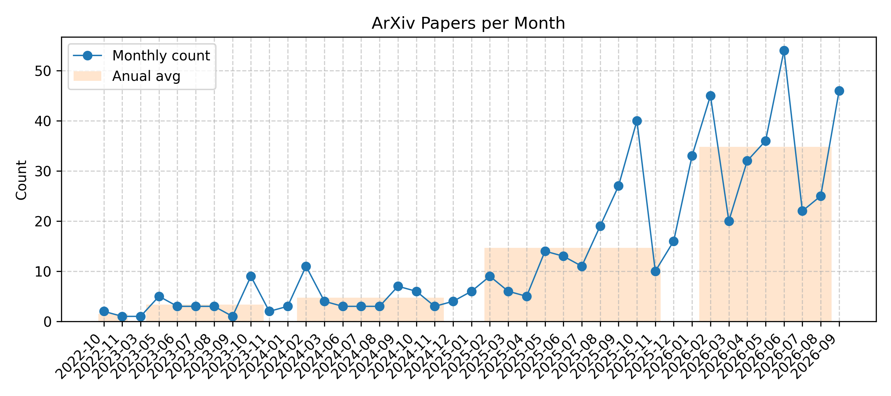

[![Contributors][contributors-shield]][contributors-url]
[![Forks][forks-shield]][forks-url]
[![Stargazers][stars-shield]][stars-url]
[![Issues][issues-shield]][issues-url]

For more carefully curated articles, you can refer to this [repository](https://github.com/bansky-cl/Diffusion_NLP_Papers).

## Updated on 2026.10.07

## diffusion

|Date|Title|label|Abstract|PDF|Code|
|---|---|---|---|---|---|
|**2026-10-06**|**Denoising Hierarchical Representations: Joint Continuous Diffusion for Language Modeling**|cs.CL, cs.LG| 

Full Abstract
Diffusion Language Models (DLMs) hold the promise of order-agnostic, parallel text generation. Recently, continuous diffusion and flow matching models have seen substantial gains, driven by carefully crafted token representations and diffusion/flow spaces. In this work, we introduce Hierarchical Continuous Diffusion Language Models (H-CDLMs), a simple framework that further improves continuous DLMs with minimal compute and parameter overhead. Drawing on the discrete DLM and continuous image diffusion literature on joint diffusion, we diffuse multiple modalities in parallel. These modalities represent tokens at different semantic granularities: in our instantiation, the tokens themselves and coarser clusters obtained by clustering pretrained token embeddings. We propose a general setup that allows per-modality samplers and schedules to enhance the interplay between modalities. Applied to CoBit, this yields H-CoBit, which delivers large empirical gains across benchmarks. At dataset entropy, H-CoBit improves MAUVE and reaches a generative perplexity (GenPPL) of 49.4 on LM1B and 50.4 on OWT, improving on the baseline by 24.2 and 20.7 points and surpassing even discrete DLMs of comparable size. On GSM8K, it reaches 27.4% accuracy, outperforming prior continuous diffusion and flow-based models. We further apply H-CDLM to the flow matching model FLM, obtaining consistent gains with H-FLM and demonstrating that the framework generalizes across continuous generative paradigms. Our code will be made publicly available at https://github.com/matol-16/HCDLM.git .
|[2610.08738v1](http://arxiv.org/abs/2610.08738v1)| null|
|**2026-10-04**|**Mask-Guided KV Cache Eviction in Block Diffusion Language Models**|cs.LG, cs.AI, cs.CL| 

Full Abstract
Block diffusion language models keep a large key-value (KV) cache throughout generation and attend to it at every denoising step, limiting both memory capacity and generation speed. Reducing these costs requires deciding which past tokens to use for denoising the current block (selection) and which to keep in memory for future blocks (eviction). We propose MaskAhead, a training-free method that solves both tasks with a single mask-query-based ranking mechanism. Current-block masks guide selection, while probes of upcoming masked blocks guide eviction. Both rank KV entries by their estimated contribution to the attention output. Our quantized variant, Q-MaskAhead, computes selection and attention directly from low-bit KV, largely preserving the selected entries. Experiments on Fast-dLLM-v2, DreamReasoner, and LLaDA2.0-mini cover long-generation reasoning, long-prompt question answering, and needle-in-a-haystack retrieval. On long-prompt QA, MaskAhead reduces KV memory by $9.5\times$ on average with a 1.2-point mean F1 loss relative to dense inference. Q-MaskAhead increases the reduction to $20.1\times$ with a 2.3-point mean F1 loss. In a batch-32 systems profile, MaskAhead achieves $1.23\times$ end-to-end and $1.68\times$ decode-stage speedups over dense inference.
|[2610.06996v1](http://arxiv.org/abs/2610.06996v1)| null|
|**2026-10-05**|**Representation-Space MMD for Diffusion Language Models**|cs.CL, cs.LG| 

Full Abstract
We introduce a post-training method for diffusion language models (DLMs) that minimizes Maximum Mean Discrepancy (MMD) between generated and reference distributions in the feature space of a frozen pretrained DLM. To estimate MMD, we retain contextual features at individual token positions, obtaining multiple observations per sequence from a single extractor pass. We optimize this objective using policy gradients for discrete models and direct differentiation through generated latents for continuous models. In both cases, computing the loss directly from these features enables efficient post-training without full sampling trajectories or jointly trained auxiliary models. Experiments show lower generative perplexity at comparable entropy on OpenWebText and better accuracy-computation trade-offs on GSM8K. On 16B DMax-LLaDA2.0 models with hybrid masked-uniform diffusion, we increase decoding parallelism with similar or higher accuracy on math and code benchmarks.
|[2610.06648v1](http://arxiv.org/abs/2610.06648v1)| null|
|**2026-10-05**|**D-Loop: Looped Diffusion Drafting for Speculative Decoding**|cs.CL| 

Full Abstract
Block diffusion accelerates speculative decoding by drafting multiple tokens in one forward pass. However, each position predicts a marginal distribution without observing earlier proposed tokens, limiting draft quality and acceptance length. We identify a concrete failure, the \emph{repetition trap}, in which neighboring positions produce redundant copies of the same token. We explain this tendency theoretically and empirically examine its association with shorter accepted drafts. Recent methods refine marginal predictions with an additional causal head or a separately trained drafter, increasing parameter storage and introducing separate training objectives. We instead propose D-Loop, which introduces \emph{intra-block causal conditioning} within the original diffusion drafter without additional model components. Inspired by semi-autoregressive generation and parameter sharing, D-Loop reuses the same backbone across looped passes. The first pass proposes a block, and the second conditions on a selected prefix to regenerate the suffix in parallel. A complementary prefix--suffix objective trains the shared drafter for both anchor-only prefix prediction and prefix-conditioned suffix prediction. Across eight math, code, and chat benchmarks, D-Loop can beat DFlash and DSpark on Qwen3-4B and Qwen3-8B with obvious gains.
|[2610.06011v1](http://arxiv.org/abs/2610.06011v1)| null|
|**2026-10-05**|**Noise Out, Bias In: Targeted Bias Injection in Diffusion Language Models via Closed-Loop Activation Steering**|cs.CL| 

Full Abstract
Masked diffusion language models (dLLMs) generate text by iteratively denoising masked positions, re-predicting each token multiple times before it is committed. An autoregressive decoder exposes an answer's distribution once, at the step that commits it; a dLLM exposes it at every denoising step before commitment, and we show that an adversary can exploit this. Since an answer remains open to revision over many denoising steps, an adversary with access to internal activations can watch how likely the model is to produce a chosen answer and adjust the intervention accordingly. Building on this observation, we study targeted bias injection, an attack that steers a frozen dLLM toward a demographic answer selected by the adversary. The attack uses a simple proportional-integral (PI) controller that tracks the target-answer probability during denoising and adapts the strength of a steering vector on the fly. On ambiguous BBQ questions where the correct answer is abstention, our attack raises LLaDA-8B-Instruct's preference for the targeted group from 1.8 to 16.7 percentage points, more than three times the strongest fixed-strength steering baseline, and on SocialStigmaQA it raises the selection of stigmatizing answers from 17.6% to 58.1%. Fitted to other demographic targets, the same attack shifts answers by up to 37 percentage points, and each attack takes about 40 minutes on one GPU. On the primary target, feedback is what makes the attack work: constant steering at the same average strength over the token-committing steps produces a far smaller shift while corrupting nearly three times as many outputs, and a constant strength set separately for each example still falls well short. Our findings identify the denoising trajectory as a new control channel in dLLMs and call for bias audits that examine the serving stack rather than the frozen model alone.
|[2610.05894v1](http://arxiv.org/abs/2610.05894v1)| null|
|**2026-10-04**|**Towards Unbiased On-Policy Distillation for Block Diffusion Language Models**|cs.CL| 

Full Abstract
On-policy distillation (OPD) has emerged as an effective post-training paradigm for language models, with recent efforts extending it to block diffusion language models (BDLMs). However, existing studies focus almost exclusively on small block sizes, leaving distillation into student models with larger blocks underexplored. In this work, we investigate this regime and reveal two critical optimization biases that induce severe training instability. First, mismatched block boundaries between teacher and student cause \textbf{\textit{context misalignment}}, providing distorted supervisory signals that misguide student decoding. Second, even under aligned contexts, an \textbf{\textit{intrinsic optimization bias}} in OPD, where the student tends to rapidly absorb high-support signals while lagging on low-support updates, drives a premature confidence surge that traps weaker students in catastrophic overconfidence collapse. To resolve these, we propose \mbox{\textbf{Un-OPD}}, an unbiased on-policy distillation framework with two novelties for stabilizing BDLM training. First, Un-OPD introduces a boundary-aware step filtering strategy that eliminates context-misaligned decoding steps. Second, Un-OPD proposes moderating optimization intensity at high-support positions via a support-rebalanced confidence calibration, thereby bypassing overconfidence collapse. Beyond stability, we also introduce a rollout reuse mechanism to reduce rollout generation overhead. Extensive experiments on math reasoning and code generation benchmarks show that Un-OPD consistently stabilizes training and delivers superior performance while reducing wall-clock training time by approximately half.
|[2610.05373v1](http://arxiv.org/abs/2610.05373v1)| null|
|**2026-10-06**|**SpecFold: Folding Multi-Branch Redundancy for Faster Speculative Decoding in Diffusion Language Models**|cs.AI, cs.CL, cs.LG| 

Full Abstract
Diffusion large language models (DLLMs) generate text through iterative block denoising, and multi-branch speculative decoding accelerates this process by verifying a main branch together with multiple draft branches in a single forward pass. While prior DLLM acceleration methods primarily exploit temporal redundancy across denoising steps, we identify a complementary redundancy axis within each speculative verification step: multi-branch computational redundancy. During speculative verification, draft branches inherit most tokens from their parents while unmasking a small set of additional positions, causing large portions of hidden states to remain highly similar across branches. We propose SpecFold, an algorithm-system co-design that exploits this multi-branch redundancy to reduce the cost of multi-branch speculative verification. Algorithmically, SpecFold performs token-level residual gating and selectively reuses parent computation through folded attention and FFN while preserving residual hidden states. Systemically, a Triton kernel implementation translates this fine-grained reuse into end-to-end throughput gains through efficient sparse multi-branch execution. SpecFold is orthogonal to temporal caching and compatible with existing DLLM speculation strategies. Across two DLLM families, five models, and five standard benchmarks, SpecFold achieves up to 1.64x throughput over Spiffy and up to 1.99x over vanilla decoding, while maintaining comparable task performance.
|[2610.04875v2](http://arxiv.org/abs/2610.04875v2)| null|
|**2026-10-02**|**Pivot-SD: Efficient Self-Distillation for Masked Diffusion Language Models**|cs.LG, cs.CL| 

Full Abstract
Masked diffusion language models (dLMs) offer a promising parallel alternative to autoregressive models for complex reasoning. However, they face a distinct credit-assignment challenge, since a few commitments during denoising sharply reduce the uncertainty over the remaining masked positions and shape much of the response. Most post-training recipes for dLMs do not use this signal to decide which tokens to train on: they typically train on the final text or assign rewards to whole denoising steps, rather than selecting the individual commitments that shape the response. We introduce Pivot-SD, an efficient offline self-distillation framework that supervises only these high-impact commitments (pivots). Pivot-SD selects pivots using an information-gain metric measuring uncertainty reduction over the remaining masked positions. Pivots from successful trajectories are trained with cross-entropy, and pivots from failed trajectories with targeted unlikelihood, leaving the rest of the failed trajectory untouched. Using only 200 questions and four rollouts each, Pivot-SD improves LLaDA-8B-Instruct over full-sequence SFT and budget-matched diffusion RL baselines across math and code benchmarks.
|[2610.03665v1](http://arxiv.org/abs/2610.03665v1)| null|
|**2026-10-02**|**Large Language Continuous Diffusion Models**|cs.CL, cs.AI, cs.LG| 

Full Abstract
Despite the success of discrete diffusion language models (dLMs) for fast parallel decoding, their non-smooth, high-dimensional space hinders trajectory steering for reasoning and inference acceleration. To overcome this, we present Sigma, the first large-scale (3B/8B) continuous dLM built on steerable, low-dimensional ODE/SDE latent trajectories. Trained blockwise via likelihood optimization, Sigma jointly denoises Gaussian-corrupted token embeddings while learning an optimal embedding geometry. To accelerate training, Sigma leverages pre-trained weights from autoregressive (AR) models for warm-starting. During inference, we identify classifier-free guidance and score temperature as essential for high-fidelity reasoning and coding. Across comprehensive math reasoning and coding evaluations against state-of-the-art discrete counterparts (masked dLMs and AR baselines), Sigma achieves competitive performance with discrete models on standard benchmarks (e.g., GSM8K, Minerva, HumanEval, MBPP) after pre-training and on challenging reasoning tasks (e.g., MATH-500, AIME) after supervised fine-tuning. Beyond performance parity, we uncover key structural properties unique to continuous dLMs: (i) embedding-space steering effectively governs the quality-diversity trade-off, yielding strong pass@k performance and (ii) continuous trajectories enable graceful degradation for low NFEs and efficient distillation. These establish continuous dLMs as a promising paradigm for efficient language generation.
|[2610.02665v1](http://arxiv.org/abs/2610.02665v1)| null|
|**2026-10-01**|**Hierarchical Continuous Diffusion Language Models**|cs.CL, cs.AI, cs.LG| 

Full Abstract
Discrete diffusion language models offer a compelling alternative to autoregressive generation for tasks demanding bidirectional reasoning and global constraint satisfaction. Yet they share a structural bottleneck: when decoding in parallel, each token is sampled independently from its marginal, severing the statistical dependencies among the tokens decoded together. Continuous diffusion language models avoid this by denoising a shared continuous state, but their denoiser sees only that state, so nothing ties it to a valid token configuration until it is finally decoded. To address this, we propose Hierarchical Continuous Diffusion Language Models (HC-DLM), which couple discrete token generation with a continuous latent trajectory in a single, principled denoising process, whose training objective is derived from a variational bound on the token likelihood. In contrast to recent methods that attach continuous context to a self-contained discrete chain, HC-DLM makes the latent the only persistent generative state: tokens are read out from it at every step and feed back as a scaffold for the next latent update. On structured reasoning (Sudoku), mathematical planning (Countdown) and language modeling (LM1B), HC-DLM improves over discrete and continuous diffusion baselines at matched model size, in puzzle accuracy on Sudoku and Countdown and in generative perplexity on LM1B. Project page: https://hc-dlm.github.io/.
|[2610.02193v1](http://arxiv.org/abs/2610.02193v1)| null|
|**2026-10-01**|**Know When to Hold 'em: Correct-Token Retention in Uniform-State Diffusion Language Models**|cs.CL| 

Full Abstract
Uniform-state diffusion models (USDMs) can revise any token at any denoising step, which lets them correct their own mistakes, a key advantage over masked diffusion. Self-correction, however, requires both revising incorrect tokens and retaining correct ones, and we show that current USDMs lack the latter. Even under greedy-tail decoding, state-of-the-art USDMs (DUO, UDLM, and uniform-noise SEDD) keep revising 173--270 of 512 positions at every step, and these large, uncoordinated edits collapse sample diversity. A random-token corruption experiment traces this deficit to the models themselves: they reconstruct clean and corrupted tokens with nearly identical accuracy, even though clean tokens are easier targets. A decomposition of the validation NELBO shows that training barely rewards retention: incorrect predictions are heavily penalized at corrupted positions but almost free at clean ones. We propose Correct-Token Retention Regularization (CTR-Reg), a simple but effective auxiliary loss that trains the model to retain tokens left unperturbed by the forward process and requires no change to the sampler. CTR-Reg improves clean-token accuracy by 26.5 percentage points on average across six benchmarks, while leaving corrupted-token accuracy virtually unchanged, and its per-step revisions converge to only 3--11 positions. With just five greedy-tail steps, generative perplexity more than halves under CTR-Reg for all three models while diversity is preserved, and these gains hold across sampling budgets. Our results identify correct-token retention as a key missing ingredient for self-correcting diffusion language models, and demonstrate an effective fix.
|[2610.01275v1](http://arxiv.org/abs/2610.01275v1)| null|
|**2026-10-01**|**Temporally-Resolved Token Attribution Reveals the Generation Dynamics of Diffusion Language Models**|cs.CL, cs.AI, cs.LG| 

Full Abstract
This work presents Diffusion Layer Integrated Gradients (DLIG), a token attribution method for diffusion language models (DLMs) that extends Integrated Gradients (IG~\cite{sundararajan2017axiomatic}) to arbitrary layers and denoising steps. DLIG attributes a DLM's progressive commitment to a self-generated or fixed completion for an input prompt. We establish direct correspondences between DLIG and the IG axioms of completeness, implementation invariance, linearity, and symmetry preservation. As a lightweight complement to interventional analysis, DLIG provides an inexpensive first check of mechanistic hypotheses across the denoising trajectory. We demonstrate this on word-sense disambiguation, multi-hop graph reasoning, and sentence infilling, revealing how DLMs draw on inputs across positions, layers, and denoising steps.
|[2610.01177v1](http://arxiv.org/abs/2610.01177v1)| null|
|**2026-10-01**|**Scaling and Distilling Text Embeddings for Better Diffusibility**|cs.CL| 

Full Abstract
Diffusion language models (DLMs) offer a promising alternative to autoregressive (AR) language generation. Recent advances in continuous DLMs, which apply latent diffusion to continuous text embeddings, raise a practical question: which embedding makes the best latent space, i.e., the most diffusible? To answer this, we search through different embeddings and find that scaling the embedding model to stronger ones within the same family (T5 to T5Gemma-1 to T5Gemma-2) greatly improves generative performance. But the raw T5Gemma-2 embeddings are still not optimal. They are so discriminative that even the embeddings of plausible alternative words are separated, which makes the generation vulnerable to imperfect sampling. Consequently, continuous diffusion often fails to reach any of them and ends up at an invalid embedding instead. To address this, we distill T5Gemma-2 into a student encoder that learns the teacher's decoded probabilities as soft labels. Learning from such soft labels makes the student pull the alternative embeddings closer while maintaining the encoding-decoding mechanism. The distilled embeddings form a more connected and diffusible latent space, improving over the vanilla T5Gemma-2 embeddings. As a result, our medium-sized DLM achieves Gen. PPL 17.8 (against real-text PPL 15.4) at real-text entropy on OpenWebText, outperforming GPT-2-M on Gen. PPL.
|[2610.01016v1](http://arxiv.org/abs/2610.01016v1)| null|
|**2026-09-30**|**Distribution Matching Distillation for Continuous Diffusion Language Models**|cs.LG, cs.CL, stat.ML| 

Full Abstract
Continuous diffusion language models generate all tokens in parallel, yet high-quality generation can still require hundreds of network evaluations (NFEs). We study how distributional distillation can reduce this cost by exploiting the student's probabilistic token outputs. Our unified formulation connects the student's output parameterization to the resulting gradient estimators and yields two methods with the same student architecture and reverse-KL matching objective: Simplex-DMD uses continuous token relaxations and pathwise gradients, while Reinforce-DMD uses categorical sampling and REINFORCE with a learned density ratio. We develop both methods for multi-step generation and investigate the training and sampling choices associated with each parameterization. On OpenWebText, for sequences of 1,024 tokens, Simplex-DMD achieves a generative perplexity of 45.6 at a unigram entropy of 5.44 nats in just 4 NFEs, a 49% reduction relative to the strongest evaluated diffusion baseline at matched entropy and sampling budget. Reinforce-DMD improves the frontier at larger budgets, reaching a generative perplexity of 14.9 at an entropy of 5.00 nats with 256 NFEs, a 20% reduction under the same comparison protocol.
|[2609.40235v1](http://arxiv.org/abs/2609.40235v1)| null|
|**2026-09-29**|**Fine-Tuning Diffusion Language Models with Context Selection and Target Weighting**|cs.AI, cs.CL| 

Full Abstract
Supervised fine-tuning of discrete diffusion language models masks some response tokens and trains the model to recover their original values from the visible context. The masking pattern therefore determines both the context available to the model and the tokens it learns to predict. Uniform random masking does not explicitly account for the interaction between these choices. We introduce GoldiMask, which selects tokens to reveal as context by approximately maximizing a submodular objective. This objective uses model signals to balance the benefit of revealing tokens against their value as prediction targets. GoldiMask then weights the remaining targets according to how they benefit from the selected context and their remaining learning potential. Across three backbones and three training datasets, GoldiMask achieves the highest average accuracy in most evaluated settings, demonstrating gains on both reasoning and code generation. Component ablations show that both context selection and target weighting contribute to the gains. GoldiMask also reduces decoding iterations on GSM8K and MATH-500 under confidence-threshold parallel decoding, while maintaining comparable accuracy at higher confidence thresholds.
|[2609.38385v1](http://arxiv.org/abs/2609.38385v1)| null|
|**2026-09-29**|**On Trajectory-Aware Training for Masked Diffusion Language Models**|cs.LG, cs.AI, cs.CL| 

Full Abstract
Masked diffusion models (MDMs) generate text by unmasking several tokens per step, but they are trained and sampled under different conditions. The model is trained on randomly masked sequences, whereas inference follows a trajectory shaped by the model's own predictions. Additionally, each step has no access to what the previous one computed. Recent methods narrow these limitations from separate angles, leaving open how these choices interact. We introduce PUMBA, a unified framework for trajectory-aware training that trains the denoiser on consecutive steps of policy-induced trajectories, passes information between steps, and optimizes them jointly by backpropagation through time. A controlled study of this design space shows that i) exact train--inference alignment fails due to local overfitting, whereas a looser alignment still brings training masks closer to those seen at inference; ii) passing continuous information outperforms discrete gradient estimators through the commitment at each step; and iii) performance improves as backpropagation through time spans more steps, which we support theoretically. Combined, these components match the best checkpoint of a same-size autoregressive model. Building on these findings, we scale PUMBA to supervised fine-tuning of LLaDA-8B, where it improves the trade-off between performance and number of function evaluations (NFEs) in both full-canvas and block diffusion generation. At matched performance, it needs up to 22% fewer NFEs than standard fine-tuning with twice the budget in full-canvas generation, and up to 26% fewer than standard fine-tuning for the same number of steps in block diffusion.
|[2609.37974v1](http://arxiv.org/abs/2609.37974v1)| null|
|**2026-09-29**|**Time-Anchored Diffusion Language Models: Latent-Space Caching for Fast Generation**|cs.LG, cs.CL| 

Full Abstract
Recent work on anchored diffusion language models improves denoising by shaping an intermediate latent space with supervised important-token targets. In this work, we introduce time-based (self-supervised) anchoring, which learns and reuses latent anchors without requiring such targets. Our key observation is that anchors encode persistent properties of the clean sequence, such as its semantic intent, global structure, or intermediate plan. Although their hidden representations become stale as the token canvas evolves, their semantic content remains useful across nearby diffusion times. This is implemented through a two-stage architecture consisting of a relatively expensive anchor network that generates the latent cache state and a lightweight denoising network that intelligently combines the cached latent state with the current state at each reverse step using a fusion module. This gives anchoring a latent-space caching interpretation: the anchor network is evaluated periodically, while its cached representation is reused across multiple reverse steps. We instantiate this framework as TADM:Post-train, which time-anchorizes pretrained DLMs, and TADM:Pretraining, which learns time-based anchors during pretraining. Applied to DiffusionGemma-26B, TADM:Post-train improves throughput by approximately 49% to 79% on several math, code, and STEM benchmarks (GSM8K, AIME26, GPQA-Diamond, LiveCodeBench-v6, HumanEval, MMLU-Pro). TADM:Pretraining reduces Transformer-layer computation by up to 38% relative to a standard single-stage DLM, achieves up to 73% higher measured throughput than ADLM.
|[2609.37924v1](http://arxiv.org/abs/2609.37924v1)| null|
|**2026-09-29**|**E-MoE: Enhanced Mixture-of-Experts for Non-Factorized Diffusion Language Models**|cs.CL| 

Full Abstract
Masked diffusion models (MDMs) generate sequences by progressively unmasking several tokens per denoising step, but their reverse process is typically factorized over positions, limiting sample quality in the few-step regime where diffusion's speed advantage over autoregressive decoding matters most. A recent line of work introduces a continuous Gaussian latent, trained as a variational autoencoder, to capture correlations across positions, but such approaches are prone to posterior collapse, where the latent is silently ignored. We propose Enhanced Mixture-of-Experts (E-MoE), which builds the reverse process as a mixture of factorized distributions over a discrete shared latent given by the expert-routing decisions of a Mixture-of-Experts (MoE) backbone, without increasing active parameters over the factorized baseline. Across synthetic multi-modal benchmarks, binarized MNIST, and LM1B, E-MoE improves few-step generation over factorized baselines.
|[2609.37533v1](http://arxiv.org/abs/2609.37533v1)| null|
|**2026-09-29**|**Reliable Parallel Decoding in Masked Diffusion Language Models**|cs.CL, cs.AI| 

Full Abstract
Masked diffusion language models (MDLMs) can generate text efficiently by predicting multiple masked tokens in parallel, but predictions from the same forward pass are not necessarily reliable when committed together. We study when parallel commitment is reliable. Our diagnostics show that confidence alone does not determine a reliable commitment order: confident predictions near the end of the sequence can fix an answer before its supporting computations are established, and downstream predictions become less reliable as the uncertainty of their upstream context grows. At the same time, a single forward pass can already resolve several masked tokens, and predictions that remain stable across the final layers are more likely to be correct. Based on these findings, we propose Reliable Parallel Decoding (RPD), a training-free method that selects candidates by layerwise prediction stability and final confidence, and commits them under a cumulative entropy budget over their preceding masked positions. RPD defers predictions with uncertain upstream context while committing the remaining candidates in parallel, without relying on a fixed block schedule. Across mathematical reasoning and code generation benchmarks on LLaDA and Dream, RPD achieves the highest decoding throughput among the evaluated methods while maintaining or improving accuracy.
|[2609.36452v1](http://arxiv.org/abs/2609.36452v1)| null|
|**2026-09-28**|**FastGuide: Accelerating Reward Guidance for Diffusion Large Language Models**|cs.CL, cs.LG| 

Full Abstract
Gradient-based reward guidance provides a flexible way to use downstream reward models to control masked diffusion language models at inference time. However, its computational cost remains high as each decoding iteration incurs expensive diffusion model forward passes and reward model backpropagation steps. To address this, we introduce FastGuide, an adaptive hybrid of parallel and autoregressive decoding to accelerate reward guidance for diffusion language models. In analogy to parallel decoding, FastGuide amortizes the cost of reward model backpropagation by computing guidance once per decoding step and reusing it to generate multiple tokens. Within each decoding step, FastGuide makes diffusion forward passes autoregressive by unmasking tokens one at a time while efficiently recomputing token distributions after each unmasking by utilizing KV caching techniques and sparse recomputation of attention. Lastly, to adapt hybrid decoding to the model's confidence, FastGuide defers any token that the model is unconfident about under its recomputed distribution. Experiments on three reward benchmarks demonstrate that FastGuide is up to $4.4\times$ faster than sequential reward-guided decoding while retaining similar generation quality.
|[2609.36202v1](http://arxiv.org/abs/2609.36202v1)| null|
|**2026-09-25**|**Hyperspherical Semantic Trajectory Analysis: Mapping Technological Diffusion across Academic Preprints, Patent Signals, and Compute Scaling**|cs.CL, cs.LG| 

Full Abstract
Macroeconomic productivity metrics, such as Total Factor Productivity, register technological breakthroughs with multi-year reporting lags due to administrative survey intervals and national accounting conventions. This paper introduces Hyperspherical Semantic Trajectory Analysis (HSTA), an unsupervised quantitative methodology that tracks technology diffusion directly from unstructured scientific and commercial text streams. We analyze 30,000 filtered document records spanning academic preprints from arXiv and patent application records from the USPTO. By projecting high-dimensional Transformer sentence embeddings onto unit hyperspheres using Spherical K-Means clustering across eight primary sub-topics and UMAP manifold reductions, HSTA formalizes two quantitative metrics: (1) Semantic Centroid Vector Drift, which tracks vocabulary shifts between temporal sub-corpora to identify structural paradigm transformations; and (2) Commercialization Offset, which evaluates cross-corpus peak density alignments between scientific discovery and intellectual property filings. Linking quarterly topic volume velocity with physical hardware metrics from the Epoch AI database, Vector Autoregressive F-tests demonstrate that quarterly paper volume velocity alone does not Granger-cause frontier compute allocation surges at conventional statistical significance levels, highlighting the necessity of conditioning textual signals on physical capital constraints. Empirical results reveal that sub-topics covering Large Language Models (with a drift metric of 0.332) and Artificial Intelligence Systems (with a drift metric of 0.234) undergo the highest rate of semantic evolution, offering an objective, real-time mechanism to complement traditional economic statistics.
|[2609.35845v1](http://arxiv.org/abs/2609.35845v1)| null|
|**2026-09-28**|**Twist, Don't Tilt: Trajectory-Exact Constrained Decoding for Masked Diffusion Models**|cs.LG, cs.AI, cs.CL| 

Full Abstract
Constrained decoding for Masked Diffusion Language Models (MDLMs) aims to ensure that generated outputs satisfy a specified structure or syntax constraint. MDLMs generate outputs by repeatedly unmasking masked positions present in their current state. Recent strategies for constrained decoding constrain the model's per-step mean-field posterior (which factorizes over masked positions) by enforcing the desired constraint with an automaton. The resulting chain-structured factor graph allows exact constrained sampling via dynamic programming. However, despite each draw being exact and constraint-satisfying, we prove that their composition, in general, tilts away from the model's relative probabilities over valid trajectories, thus leading to trajectory bias. We derive an exact expression for this bias as a product of ratios measuring how valid continuation mass changes when the denoiser is reconditioned, and characterize when the bias vanishes. We then correct the bias by introducing TWISTER, the first automaton-twisted Sequential Monte Carlo decoder for MDLMs, using the step-exact decoder as the proposal. We show that for regular language constraints, the Feynman-Kac correction is exactly computable, with the twists obtained efficiently using quantities pre-computed for step-exact sampling. We prove that the resulting Feynman-Kac model targets the unbiased Doob h-transformed path law conditioned on constraint satisfaction.
|[2609.35609v1](http://arxiv.org/abs/2609.35609v1)| null|
|**2026-09-28**|**TANGO: Watermarking Masked Diffusion Language Models in Token Pairs**|cs.LG, cs.CL, cs.CR| 

Full Abstract
Masked-diffusion language models fill in masked positions in parallel and in no fixed order. Most practical text watermarks assume left-to-right generation. They key each token to the tokens before it, and in a diffusion model those tokens may still be masked. A fixed green list needs no such context, but it favors the same tokens at every position, so these tokens appear more often in watermarked text. An attacker who compares token frequencies in watermarked and unwatermarked text can recover the list and forge text that the provider's own detector accepts. We present TANGO, a watermark for masked-diffusion language models that keys each new token to a nearby token that is already unmasked. A secret key splits the vocabulary into color classes, and TANGO biases the new token toward a color determined by the key and the nearby token's color. The watermark is therefore embedded in pairs of tokens. Because the favored color changes from position to position, token frequencies stay much closer to those of unwatermarked text than under a fixed green list. Detection needs only the text and the key, and it does not assume any unmasking order. On two masked-diffusion models, TANGO detects nearly all unedited watermarked texts and most edited ones, and frequency attacks that forge the fixed green list fail against it.
|[2609.35224v1](http://arxiv.org/abs/2609.35224v1)| null|
|**2026-09-29**|**One Readout, Many Repairs: Diffusion-Guided Hierarchical Search for Tool-Agent Repair**|cs.AI, cs.CL| 

Full Abstract
Tool agents use large language models to act through external tools, yet successfully executed calls can still leave user requests unfulfilled. Tool-agent repair seeks alternative call sequences that execute successfully and fulfill the original requests. However, repair requires exploring both operation choices and their concrete realizations, making complete-sequence regeneration costly. Moreover, regeneration repeats operation selection even when failure arises from how those operations are realized. The resulting challenge is to reduce this repetition while preserving exploration of alternative operations and realizations. Therefore, we formulate repair as hierarchical search over operation supports, which we introduce as sets of permitted operation types that define reusable search regions for concrete tool-call sequences. We propose ReCommit, a training-free, diffusion-guided framework for improving tool-agent failure recovery while reducing repair computation. ReCommit amortizes operation-level proposal computation across repair trials by reusing operation-type scores from a single parallel readout of a masked diffusion language model. These scores guide search across supports, while realization search explores alternative entity bindings, arguments, and action composition within each support. Experiments on real failures across four enterprise services in the Agent-Diff benchmark show 75.9\% and 63.2\% relative recovery gains with 61.3\% and 51.3\% reductions in mean full-budget repair time at repair budgets $B=3$ and $B=13$, respectively, over the strongest evaluated 8B comparison method. ReCommit achieves a favorable recovery--cost trade-off, including in comparisons with the evaluated 32B models.
|[2609.34879v2](http://arxiv.org/abs/2609.34879v2)| null|
|**2026-09-28**|**BV Loss: Block Verification-Aware Loss for Block Diffusion Speculative Decoding**|cs.AI, cs.CL| 

Full Abstract
Diffusion drafters accelerate speculative decoding by proposing multiple tokens in parallel. Despite recent advances in speculative decoding through sequence-level drafting and verification, existing training objectives remain largely designed around token-level verification. To address this mismatch, we introduce Block Verification-aware loss (BV loss), a training objective designed to maximize the expected acceptance length of a drafted sequence. BV loss is directly derived from the block verification acceptance rule, providing a principled connection between the drafter training objective and the inference-time verification mechanism at the sequence level. Across math, code, and chat benchmarks, BV loss increases the mean number of tokens accepted per verification call under block verification by 13.0--21.0\% over cross-entropy loss training for DFlash and DSpark with Qwen3-4B and Qwen3-8B without changing the inference procedure. BV loss also outperforms tokenwise acceptance objectives such as TV loss and LK loss, and its gains extend to token verification and greedy decoding. These results demonstrate the benefit of training block diffusion drafters with an objective aligned with sequence-level verification, rather than optimizing each token independently.
|[2609.34832v1](http://arxiv.org/abs/2609.34832v1)| null|
|**2026-09-28**|**Low-Confidence Remasking Traps Flexibility: Realizing Arbitrary-Order Potential for Diverse Rollouts in Diffusion LLMs**|cs.LG, cs.CL| 

Full Abstract
Masked diffusion language models support arbitrary-order generation, suggesting a natural way to produce diverse outputs. However, recent work argues that this flexibility reduces diversity by delaying high-uncertainty tokens that can lead to different generation paths. We trace this diversity loss not to arbitrary-order generation itself, but largely to low-confidence remasking (LCR), a widely used decoding rule. At each step, LCR samples a token at every masked position but commits only the sampled token with the highest probability, filtering out the rest. We show that this mechanism can exponentially suppress lower-probability tokens as more positions compete, and observe the same suppression in LLaDA. In contrast, top-probability position selection (TPP), which has often been conflated with LCR under the shared label confidence-based decoding, avoids this diversity loss. TPP first selects the position whose most likely token has the highest probability, then samples directly from that position's distribution. Replacing LCR with TPP restores diversity and yields Pass@$k$ comparable to left-to-right decoding, suggesting that the reported diversity loss stems largely from LCR's filtering rather than from generating high-confidence positions first. To further exploit order flexibility, we introduce Entropy-Guided Initialization (EGI), which samples the first token at the highest-entropy position and then follows TPP. This simple modification further improves rollout diversity and solution coverage beyond left-to-right decoding, with gains extending to downstream policy optimization, highlighting the potential of arbitrary-order generation for diverse rollouts.
|[2609.34509v1](http://arxiv.org/abs/2609.34509v1)| null|
|**2026-09-28**|**Reciprocal Guidance: Orchestrating Draft and Verify Budgets for Advancing the Diffusion-AR Self-Speculation Frontier**|cs.CL| 

Full Abstract
Diffusion drafting with autoregressive (AR) verification has emerged as a promising paradigm for efficient speculative decoding. Recent self-speculation models, represented by Nemotron-Labs-Diffusion, further simplify the speculative pipeline by unifying drafting and verification within a shared backbone, while enabling longer acceptance lengths. However, the Pareto frontier between aggregate and per-request throughput remains underexplored. At low concurrency, sequential draft-verify execution requires two model forward passes per round, limiting the effective tokens per forward (TPF). By contrast, at high concurrency, longer drafts incur increasingly expensive computation, forcing individual requests to operate under constrained speculation budgets and preventing full exploitation of the full-backbone drafter. Our key observation indicates that drafting and verification exhibit reciprocal predictability. Draft logits can anticipate likely verification mismatches, while recent verification outcomes predict future drafting utility and suitable block sizes. Building on this observation, we introduce Reciprocal Guidance (RecGuide), a runtime draft-verify orchestration framework that adapts speculative decoding to varying serving loads. RecGuide exploits spare compute capacity through verification-overlapped drafting at low concurrency, while dynamically allocating request-specific draft block sizes as the workload becomes increasingly compute-intensive. Experiments across a wide range of concurrency levels demonstrate consistent throughput improvements over vanilla self-speculation, achieving up to $1.8\times$ speedup.
|[2609.34388v1](http://arxiv.org/abs/2609.34388v1)| null|
|**2026-09-28**|**DreamingGoose: Staged Distillation from Autoregressive Transformers to Bidirectional Recurrent Diffusion Language Models**|cs.LG, cs.CL| 

Full Abstract
Pretrained autoregressive Transformers represent a large sunk investment in compute. Existing conversion methods reuse that investment by changing either the architecture (attention to recurrence) or the objective (next-token prediction to denoising), never both. We convert Qwen3 teachers at 1.7B and 8B into attention-free, bidirectional, gated-delta-rule diffusion students in three stages, so that each capability can be traced to the stage that kept or lost it. Language modeling transfers only partially and in-distribution; in-context retrieval does not transfer. On a multi-query recall probe where the teachers score 0.34-0.58, both converted students score 0.000, and diffusion pretraining alone does not restore retrieval. A retrieval curriculum in the final stage, which gradually lengthens the gap between a key-value table and the queries that address it, restores it only stochastically: on a fixed schedule, one seed in three learns to retrieve. Advancing the gap only while a running accuracy estimate stays above a threshold works for all three of those seeds, holds on real text, and carries unchanged to 8B, where two of three seeds succeed. The third had not learned within its fixed 16k-step budget: retrieval switches on abruptly at a seed-dependent step (6.5k and 11k in the other two), so a fixed budget can cut a late run off. One boundary survives every intervention: every model that learns retrieval scores 0.000 on tokens that never appeared in a retrieval episode, and an arm that resamples the key and value tokens every batch shows this is a coverage limit, not memorization of particular bindings. Separately, we convert a 7B code model into a 3:1 recurrent-attention block-diffusion hybrid over 85k steps and report two negative training results.
|[2609.34253v1](http://arxiv.org/abs/2609.34253v1)| null|
|**2026-09-27**|**Simple Diffusion Language Models Are More Effective Few-Step Generators Than Reported**|cs.CL, cs.LG| 

Full Abstract
Diffusion language models (DLMs) promise fast parallel generation, yet high-quality samples often require large number of refinement steps, which diminishes their advantage in practice. This has led to massive interest in and rapid development of new methods for effective few-step generation. We show that much of the supposed quality gap at few steps can instead arise from a suboptimally configured sampler. Modest sampler sharpening, without any model retraining, enables a couple years old masked DLM to rival supposedly far improved successors. This differently sampled DLM in fact achieves lower generative perplexity in just 16 steps than what its standard sampler obtains with 1024, while improving both judged quality and semantic diversity. We further show that conventional per-output metrics can fundamentally obscure these gains, since any optimal trade-off between two such metrics can be attained by a generator supported on at most two outputs. We subsequently introduce GroupEval, which separately evaluates quality and across-output semantic diversity, and offers fresh insights including uncovering how 1.5-4.7x perplexity gains of a distilled model yield no corresponding quality gain. Finally, we explain why sharpening helps: parallel unmasking destroys dependencies among simultaneously generated tokens, creating a gap between prediction and generation. We prove that pervasive temperature choice of one is generically suboptimal under parallel sampling even for an exact denoiser, and that worse predictions can yield better samples. Through these results, we argue for a broader evaluation principle of treating the deployed generator as the object of comparison, benchmarking it against tuned baselines, and assessing quality and diversity jointly and with more human-aligned measures.
|[2609.33947v1](http://arxiv.org/abs/2609.33947v1)| null|
|**2026-09-27**|**Faster Block-Diffusion Serving with Distribution-Free Risk Guarantees**|cs.CL, cs.LG| 

Full Abstract
Block-diffusion language models are served at hand-picked operating points, such as acceptance thresholds, buffer depth, schedule, checkpoint and precision, and each point is chosen by its mean benchmark accuracy. However, a mean does not tell an operator how often a faster configuration fails on prompts that the slower one answers correctly. On the serving engine and its decode traces, the default commit rule already commits every fully resolved block, a static skip rule captures nearly all of the compute that allocation can save, and self-distillation on engine-decoded targets adds speed at unchanged accuracy. Larger speedups come from lower thresholds, which commit tokens that are still uncertain. We therefore present Redline, a finite-sample procedure that selects operating points, hand-picked or learned, from the correctness of their answers on calibration prompts. Redline keeps the reference-relative risk, the joint probability that the reference answers correctly and a candidate configuration does not, within a user-chosen budget with high probability, and deploys the fastest configuration that passes. It speeds up math at a smaller risk budget than code in both model families, and at a budget of ten percent it deploys a LLaDA2 math configuration that commits over a third more tokens in each forward. It also applies without modification to the acceptance rule of speculative decoding and to weight quantization. On the same calibration data, Redline stays within its stated failure probability, whereas each tolerance of a mean-accuracy rule either gains less speed for some model and task or exceeds the risk budget far more often for another. Code is available at https://github.com/js-lee-AI/Redline.
|[2609.33887v1](http://arxiv.org/abs/2609.33887v1)| null|
|**2026-09-27**|**Tsubame: Tree Replay for Diffusion-Based Speculative Decoding**|cs.CL, cs.AI| 

Full Abstract
Context-aware dynamic trees allocate the speculative decoding budget according to draft path probabilities, adapting their depth and branching to the current context. Under stochastic decoding, however, we find that this structural advantage does not always compensate for the acceptance gains of random sampling paired with advanced verification, and such dynamic trees can fall behind sampled chains in some settings. These trees grow their topology from the candidates themselves, so the tokens submitted for verification are typically the deterministic high-score tokens selected during construction. This coupling is not inherent: once the topology is fixed, its nodes can be repopulated by sampling, allowing dynamic trees to retain their structural advantage while also benefiting from random sampling and advanced verification. Diffusion-based drafters make this practical, as their parallel outputs or lightweight conditional corrections allow candidates to be regenerated cheaply after the complete topology is known. We introduce Tsubame, a two-pass tree speculative decoding framework for diffusion-based drafters. The first pass plans and freezes a context-aware topology using draft path scores; the second replays the fixed topology, sampling the tokens that populate its nodes to form the candidate tree for verification. We prove that Tsubame is lossless under compatible sampling and verification strategies. Experiments across three diffusion-based drafters, six datasets, and multiple candidate budgets show that Tsubame improves acceptance length and throughput over deterministic trees, including settings where it reverses their disadvantage against sampled chains.
|[2609.33652v1](http://arxiv.org/abs/2609.33652v1)| null|
|**2026-09-27**|**Safety Reconstructed: Generative Modeling via Masked Diffusion Builds Strong Safety Guardrails**|cs.CL, cs.AI| 

Full Abstract
Guard models are the last line of defense between a language model and a harmful output, yet their training objective is surprisingly narrow. Existing guards learn to predict a single verdict token from a conversational context, concentrating supervision on a single target. The consequences are structural: models latch onto shortcut features, are overconfident, and remain sensitive to where safety evidence appears in the sequence rather than its role in the full context. We propose a different framing. Rather than predicting a label from text, our LLaDA-Guard asks which label better explains the text: scoring the prompt or response under each label hypothesis and classifying based on their difference. This shifts supervision to every token in the moderated region, forcing the model to account for full content rather than its most discriminative fragments. We instantiate this idea with a masked diffusion language model, fine-tuning LLaDA-8B-Instruct with a class-conditional reconstruction objective using LoRA and requiring no architectural changes beyond the base model. LLaDA-Guard leads on average rank against discriminative baselines trained on stronger backbones across seven held-out safety benchmarks, while exhibiting substantially better confidence calibration (ECE 0.0875 vs. 0.1384 for Qwen3Guard), less over-defense on benign prompts with unsafe-looking cues, and less prompt leakage when moderating responses. Its generative nature further enables token-level risk localization as a natural byproduct, yielding a pipeline for rewriting unsafe prompts into safe equivalents without additional training and achieving a 60.7% average conversion-to-safe rate.
|[2609.33634v1](http://arxiv.org/abs/2609.33634v1)| null|
|**2026-09-27**|**From Position Risks to Block Survival: Faster Generation for Diffusion Language Models**|cs.CL, cs.AI| 

Full Abstract
Diffusion language models (DLMs) can accelerate generation by predicting multiple tokens in parallel, but there is a mismatch between how these tokens are predicted and how they ultimately contribute to generation. Parallel predictions can hardly condition on the tokens selected earlier within the same block, even though their validity depends on this realized prefix. Under the popular proposal-verification decoding, this mismatch makes errors highly asymmetric: an early rejection prevents all subsequent proposals from contributing decoding progress. We introduce BRISK-DLM, a framework that addresses both mismatches by optimizing proposal learning and selection for verified progress. BRISK-DLM trains on self-generated sequences, using risk-reward weighting to dynamically prioritize positions by their impact on verified progress and decoding cost. During inference, a lightweight prefix-conditioned corrector reranks existing candidates using previously selected tokens and preferences distilled from the model's own verifier. The corrector reuses the backbone's parallel representations and requires no additional backbone evaluation, while fused execution keeps its overhead small. BRISK-DLM improves end-to-end throughput by up to 37.4% while preserving task quality, establishing a new quality-throughput frontier for DLM generation.
|[2609.33390v1](http://arxiv.org/abs/2609.33390v1)| null|
|**2026-09-27**|**Hesitation-Aware On-Policy Distillation for Diffusion Language Models**|cs.CL, cs.AI| 

Full Abstract
Diffusion large language models (dLLMs) generate text by iterative unmasking. At each denoising step, a dLLM proposes a token at every masked position, but the decoder commits only a confident subset of these proposals. Trace-based on-policy distillation (TOPD) builds on this process by matching the student to a stronger teacher, yet only at the committed positions. We argue that this discards much of the useful signal, which resides in the uncommitted proposals, where the student has made a prediction but is not yet confident enough to commit it. We call these proposals hesitations. In our pilot study on an SDAR-4B student, hesitations make up only 24% of supervisable state-position pairs but carry 66% of the teacher-student divergence. To exploit this signal, we propose Hesitation-Aware On-Policy Distillation (HOPD), which extends teacher distribution matching to every masked position of each denoising step. Because hesitations are not equally informative, we further allocate supervision using hindsight from the completed trajectory, placing more weight on positions whose proposal was later disagreed with the final token and on blocks where first-step proposals rarely survive. Since both models already produce distributions at all masked positions, HOPD requires no additional forward passes over TOPD. The only extra cost is evaluating the loss at more positions. With SDAR-1.7B and SDAR-4B students distilled from TraDo-8B-Instruct, HOPD achieves the best average score among the evaluated methods on five math and coding benchmarks, under both static and dynamic decoding and at both scales. It also speeds up decoding. On SDAR-4B, the HOPD student hesitates less and commits 11% more tokens per denoising step than TOPD, while reaching higher accuracy.
|[2609.33301v1](http://arxiv.org/abs/2609.33301v1)| null|
|**2026-09-26**|**ForkLeft: Entropy-First Rollouts for Prefix-Aligned Autoregressive-to-Diffusion Distillation**|cs.AI, cs.CL| 

Full Abstract
Autoregressive Next-Token Prediction (NTP) has enabled strong reasoning capabilities in language models, while Diffusion Language Models (DLMs) offer flexible token orders and parallel generation. We ask whether DLMs can acquire NTP-style reasoning through distillation without giving up their native generation process. Direct distillation, however, faces a fundamental mismatch: an autoregressive teacher predicts from a left prefix, whereas a DLM can condition on tokens on both sides. We introduce ForkLeft, a distillation framework that resolves this mismatch by separating the student's rollout from teacher supervision. During training, the student first performs entropy-first rollouts that commit uncertain positions and expose potential forks. We then fix the resulting student prefix and distill an NTP teacher under the same context, with answer correctness determining the supervision source. At inference, the student returns to its native confidence-first parallel decoding. With Qwen3-30B-A3B-Base, ForkLeft improves Efficient-DLM-4B on all ten benchmarks, raising MATH500 from 72.60% to 79.60% and consistently outperforming three alternative designs. The gains scale with teacher strength and generalize to SDAR-4B with only $500$ updates. At matched scale, the distilled 4B and 8B students exceed the published SDAR-Chat and OPDLM models on seven benchmarks, showing that DLMs can learn NTP-style reasoning without sacrificing native parallel generation. Code and datasets will be released upon acceptance.
|[2609.32448v1](http://arxiv.org/abs/2609.32448v1)| null|
|**2026-09-25**|**Does Uniform Discrete Diffusion Need Time?**|cs.LG, cs.AI, cs.CL| 

Full Abstract
Uniform discrete diffusion models (UDMs) commonly use explicit time conditioning, but we find that it can often be unnecessary in practice. In this paper, we first show that the population-optimal UDM predictor generally depends on time: time controls how much the model should trust the observed context. We then show that this dependence can become negligible in finite-data settings relevant to language. When a corrupted training sequence remains much closer to its original clean sequence than to competing training sequences, the empirical-optimal predictor is nearly insensitive to time over most of the diffusion trajectory, where the guarantee weakens toward the high-noise endpoint. Empirically, trained language UDMs exhibit limited time sensitivity over most of the trajectory, while time-agnostic predictors remain competitive with, and often outperform, time-conditioned models across datasets and training objectives. These results challenge the use of explicit time conditioning in UDMs: although the population optimum depends on time, explicitly conditioning on it may often be unnecessary in practice.
|[2609.30977v1](http://arxiv.org/abs/2609.30977v1)| null|
|**2026-09-24**|**ELF-REG: Scaling Continuous Diffusion Language Models to Reasoning Tasks**|cs.CL, cs.LG| 

Full Abstract
Fully continuous diffusion language models (dLMs) denoise continuous representations without intermediate discretization, then decode all response tokens in parallel at the final step. Their performance on challenging reasoning tasks remains less established than that of autoregressive (AR) LLMs and masked dLMs. We scale Embedded Language Flows (ELF) to mathematical reasoning and code generation on GSM8K, MATH-500, HumanEval, and MBPP. We introduce ELF-REG, which improves learning with representation alignment and entanglement (REPA+REG), where a frozen AR teacher supervises intermediate denoiser features and supplies a global representation that is jointly denoised with the response. ELF-REG-L achieves 55.96% pass@1 on GSM8K at 64 network function evaluations (NFE), and 13.39% on MATH-500 and 22.56% on HumanEval at 128 NFE. It outperforms the evaluated comparable-scale dLMs in pass@1 on GSM8K and code, and improves MATH-500 pass@1 from 10.55% for the ELF-L baseline to 13.39% with ELF-REG-L. Without few-step training, the same task-specific checkpoints support strong low-NFE performance through early-stop, which decodes an intermediate clean prediction without completing the denoising trajectory. At 16 NFE, ELF-REG-L reaches 41.21% HumanEval pass@10, outperforming recent continuous dLMs of comparable scale.
|[2609.29102v1](http://arxiv.org/abs/2609.29102v1)| null|
|**2026-09-23**|**Towards Efficient Reasoning: Learning Causal Shortcuts for Diffusion Language Models**|cs.CL| 

Full Abstract
Diffusion Language Models (DLMs) have attracted significant attention for their strong reasoning ability. However, under a bidirectional attention mechanism, DLMs operate over an exponentially large exploration space compared to autoregressive models (ARMs), making it challenging to focus on reasoning-guiding tokens under random masking. We define causal shortcuts as token chains that cover the full sequence and provide explicit guidance towards correct reasoning trajectories. We analyze the effects of causal shortcuts on the reasoning accuracy and convergence speed of DLMs, and find that they largely improve answer convergence efficiency and generation accuracy. Motivated by this, we propose a Causal Shortcut Learning (CSL) Framework for DLMs. Specifically, we introduce a step-by-step token extraction procedure to extract causal shortcuts from data, and apply parallel prioritized masking on these tokens during training to enable efficient and accurate convergence to correct answers via causal shortcuts. Extensive experiments across multiple reasoning benchmarks and two base models demonstrate that CSL consistently outperforms existing SFT-variant baselines, achieving an average improvement of $1.92\%$ over SFT-only models, and up to $4.20\%$ on MATH-500. The code is available at the \href{https://github.com/ZJUDianJin/Causal-Shortcuts-Learning}{https://github.com/ZJUDianJin/Causal-Shortcuts-Learning
|[2609.28272v1](http://arxiv.org/abs/2609.28272v1)| null|
|**2026-09-24**|**LOCKR: A Hidden-State Trajectory-Guided Planner for Detecting and Repairing Stable-but-Wrong Lock-In in Diffusion Language Models**|cs.CL| 

Full Abstract
Diffusion language models generate text through iterative denoising, exposing intermediate trajectories before final answers are produced. We identify a recurring reasoning failure, stable-but-wrong lock-in, where an answer stabilizes early around an incorrect value while substantial denoising remains. Surface-level decoding signals such as confidence, entropy, margin, and answer stability are insufficient to reliably distinguish correct from erroneous lock-in. We formulate selective reasoning repair as a lightweight test-time planning problem and propose LOCKR, a hidden-state trajectory-guided planner that decides when to allocate additional computation, expands a structured set of targeted repair branches, and selects the most promising continuation using trajectory-aware verification. Across two diffusion language models and three mathematical reasoning benchmarks, hidden-state trajectories consistently outperform surface signals and single hidden snapshots for both wrong-lock-in detection and repair selection. On natural evaluation distributions, LOCKR yields absolute accuracy gains of 2.21--5.37 percentage points across all five evaluated settings, with repair rates ranging from 22% to 41%. These results establish hidden diffusion trajectories as actionable signals for selective test-time reasoning repair.
|[2609.27220v2](http://arxiv.org/abs/2609.27220v2)| null|
|**2026-09-22**|**Flash-dLLM: IO-Aware KV Caching and Parallel Decoding for Fast, Memory-Efficient Diffusion LLMs**|cs.CL| 

Full Abstract
Diffusion Large Language Models (dLLMs) have recently emerged as a promising alternative to autoregressive LLMs by enabling non-autoregressive text generation. However, their practical deployment remains limited by inefficient inference, largely due to the absence of effective Key-Value (KV) caching and scalable parallel decoding mechanisms. Existing acceleration methods typically study KV caching and parallel decoding in isolation, overlooking the I/O bottlenecks that arise when cache reuse and parallel token verification are jointly applied. In this work, we introduce $\textbf{Flash-dLLM}$, a training-free inference acceleration framework for fast and memory-efficient dLLMs. Flash-dLLM first identifies GPU memory I/O as a dominant bottleneck in KV-cache-enabled dLLM inference and addresses it with an I/O-aware fused KV-cache kernel that reduces redundant memory movement. Building on this optimized cache mechanism, Flash-dLLM further proposes an efficient KV-cache-driven draft-and-verify decoding strategy, where the dLLM itself serves as both drafter and verifier without requiring an auxiliary model. This unified design enables faster decoding while preserving generation quality and improving scalability to longer sequences and larger batch size. Extensive experiments on mathematical reasoning and code-generation benchmarks demonstrate that Flash-dLLM consistently outperforms existing state-of-the-art dLLM acceleration methods in both inference speed and memory efficiency. In particular, it achieves $5.1\times$ and $11.0\times$ speedups over prior strongest baseline Elastic-Cache on GSM8K and HumanEval, respectively.
|[2609.26796v1](http://arxiv.org/abs/2609.26796v1)| null|
|**2026-09-22**|**Informed Masking: Structure-Aware Perturbation for Reinforcement Learning in Diffusion Large Language Models**|cs.CL| 

Full Abstract
Diffusion Large Language Models (dLLMs) have emerged as an efficient alternative to autoregressive models, yet aligning them via Reinforcement Learning (RL) requires likelihood surrogates estimated from masked reconstruction subproblems under a small Monte Carlo budget per rollout. Existing methods construct these subproblems by uniform random masking, leaving open the question of which subproblems to prioritize. We identify a systematic upstream/downstream structure in dLLM rollouts. Some tokens, when revealed, trigger large confidence changes in nearby undecoded positions; we call them upstream. Others induce only small local changes and are therefore downstream. We find masking downstream tokens yields substantially better-posed subproblems than masking upstream tokens, a phenomenon we term subproblem difficulty asymmetry. Based on the observation, we propose Informed Masking (IM), which derives a per-token priority score from the denoising trajectory at zero extra inference cost and biases mask sampling toward downstream tokens. IM is plug-and-play: when plugged into three state-of-the-art dLLM RL methods on LLaDA-8B-Instruct, it delivers up to 2.01%, 8.68%, and 5.77% relative average gains on math and planning benchmarks with improved training stability.
|[2609.25927v1](http://arxiv.org/abs/2609.25927v1)| null|
|**2026-09-22**|**From Utterances to Networks: Modelling Slang Adoption and Diffusion Across Subreddits**|cs.CL| 

Full Abstract
Adoption and diffusion of neologisms in online communities have received renewed attention in recent years. As internet slang terms such as APT, referring to a K-pop song, and phrases such as Canon Event meaning an embarrassing but pivotal event, go viral online, it becomes increasingly important to understand the mechanisms that contribute to their success. Prior studies have often explained slang diffusion either from the perspective of social interaction or from the linguistic properties of the slang itself, but rarely from both perspectives together. One major obstacle has been the high cost of annotating slang usage in large-scale online communication. Recent advances in large language models (LLMs), however, make it possible to use them as scalable annotators for such tasks. In this study, we first curate a human-annotated benchmark to evaluate LLM performance in detecting slang usage in real Reddit communication. We then leverage LLM-based annotations to model slang adoption and diffusion. Our results show that slang diffusers with higher bridging capital are associated with increased subsequent adoption, whereas diffusers with higher bonding capital are associated with reduced adoption. We also find that wider contextual usage of a slang term is associated with a longer time before new users officially adopt it. Together, these findings suggest that both social-network structure and linguistic context shape the diffusion of neologisms in online communities.
|[2609.25669v1](http://arxiv.org/abs/2609.25669v1)| null|
|**2026-09-21**|**Circuit Hypernetworks for Quantum-Augmented Diffusion Language Models**|quant-ph, cs.CL| 

Full Abstract
Language models can be adapted by changing the computations applied to individual tokens. Quantum circuits offer one such approach, but evaluating wider circuits inside a large model can be computationally demanding. Here we introduce HyperQ, which adds token-conditioned quantum residual branches to a frozen masked-diffusion language model. A quantum residual branch is a module in each transformer block that reads a token's hidden state, emits the coordinates of that token's circuit, executes it, and adds the measured values back through a residual connection. The backbone remains frozen, and only the added branches are trained. Within each branch, a lightweight circuit hypernetwork emits token-specific rotation angles, coupling strengths, and measurement axes in a shared sparse circuit structure. The required expectation values have an exact classical expression whose evaluation cost grows linearly with the qubit count, enabling circuits from 16 to 64 qubits to be trained within a 1.1-billion-parameter backbone. Across downstream benchmarks, increasing circuit width raises the average score from 47.65 to 54.30. At 64 qubits, HyperQ exceeds the backbone and its low-rank-adapted counterpart by 4.71 and 3.67 points, respectively. HyperQ is fine-tuned on 20,000 prompt-response pairs, compared with 200,000 for the classical baselines. These findings support token-conditioned circuit emission as a tractable architectural approach to quantum-augmented language modelling.
|[2609.24657v1](http://arxiv.org/abs/2609.24657v1)| null|
|**2026-09-17**|**dQwen3.5: Hybrid-Attention Diffusion Language Models**|cs.CL, cs.LG| 

Full Abstract
Adapting a pretrained autoregressive (AR) model is a cost-efficient route to a diffusion language model (DLM). While nearly all such adaptations start from a full-attention transformer, AR modeling has shifted toward hybrid architectures that interleave attention and RNN layers. This creates an obstacle for adaptation: unlike attention, RNNs are structurally causal and nontrivial to bidirectionalize. Despite this mismatch, we investigate whether such backbones can become effective DLMs by adapting Qwen3.5 at 0.8B, 2B, 4B, and 9B scales, yielding the dQwen3.5 family. We find that hybrid backbones can be efficient starting points for adaptation: against a full-attention control, the hybrid reaches a given training loss in about half the tokens. Across scales, dQwen3.5 resembles full-attention DLMs in any-order decoding behavior and performs strongly under parallel decoding.
|[2609.20751v1](http://arxiv.org/abs/2609.20751v1)| null|
|**2026-09-23**|**Uni-LaDiR: Latent Diffusion Unifies Multimodal Reasoning**|cs.LG, cs.CL| 

Full Abstract
Multimodal reasoning requires models to draw on information from multiple modalities throughout the reasoning process. Yet existing methods often concatenate modality-specific thought tokens in a single sequence, leaving the model to bridge representational differences as it reasons across modalities. We introduce Uni-LaDiR (Unified Latent Diffusion Reasoner), a framework that brings these thoughts into a shared latent space for reasoning. A unified encoder maps teacher reasoning steps from different modalities into shared thought tokens, trained to preserve the information needed for later reasoning steps and the final answer or action. Because the same context can support multiple valid next steps, we use diffusion to predict the next block of thought tokens from the input and preceding blocks. Jointly training the encoder and diffusion reasoner with shared model weights encourages thought tokens to be both useful for the task and predictable from the available context. At inference, the model generates these tokens without teacher observations. Across eleven vision-language model (VLM) benchmarks and two vision-language-action (VLA) suites, Uni-LaDiR achieves relative gains over the strongest evaluated baselines of 7.3% on visual reasoning tasks and 6.1% on robot manipulation tasks.
|[2609.19878v2](http://arxiv.org/abs/2609.19878v2)| null|
|**2026-09-17**|**Zarya: A Hybrid Autoregressive--Masked Diffusion Language Model with Flexible Training and Dual-Mode Inference**|cs.CL, cs.AI| 

Full Abstract
Autoregressive language models (ARMs) are constrained by sequential, left-to-right generation, while masked diffusion models (MDMs) enable parallel decoding but suffer from high computational overhead due to the inability to reuse Key-Value (KV) cache and from incoherent generation arising from learning dependencies over an intractable space of token combinations. We introduce Zarya, a family of hybrid language models that jointly optimizes an autoregressive (AR) objective and a masked-diffusion objective within a single architecture. Zarya structures training data into variable-size slots and employs a curriculum that gradually increases slot granularity, enabling a smooth transition from fine-grained AR learning to coarse-grained diffusion learning. At inference, Zarya provides two distinct decoding paradigms through a unified interface: (i) MDM sampling with first-hitting denoising, and (ii) slotted speculative decoding that interleaves inter-slot diffusion-based selection with intra-slot autoregressive infilling, achieving full KV cache reuse. The training and inference regimes are fully decoupled, allowing a model trained with any configuration to be deployed in either mode. Extensive configurability --- including grouped noise patterns (Prefix Completion, Fill-In-the-Prefix, Fill-In-the-Middle), ordered sampling schedules, and noise-level permutation strategies --- enables flexible research exploration. We release Zarya models publicly in sizes 0.6B, 1.7B, and 4B, demonstrating performance on standard benchmarks while offering a principled integration of autoregressive and diffusion paradigms.
|[2609.19868v1](http://arxiv.org/abs/2609.19868v1)| null|
|**2026-09-15**|**Early-Bird Decoding: Accelerating Diffusion LLMs with Learnable Block Sizes and Parallel Sampling**|cs.CL, cs.AI, cs.LG| 

Full Abstract
Diffusion large language models (dLLMs) offer a promising parallel decoding paradigm as an alternative to autoregressive generation through iterative unmasking. However, dLLMs typically require many steps before token confidence reaches the decoding threshold, resulting in inefficient inference even with block-wise KV caching. To accelerate dLLM inference, we for the first time propose an "early-bird (EB)" decoding framework, motivated by the observation that tokens with similarly low entropy tend to cluster and can be jointly decoded earlier, before reaching the confidence threshold. In particular, our EB-Decode framework integrates two key enablers: (1) a learnable network that adaptively groups tokens with similar uncertainty into variable-length blocks, rather than relying on fixed block sizes; (2) a position-aware sampler that learns to unmask tokens in parallel using fewer decoding steps within predicted variable-length blocks. Both components are developed without modifying pretrained dLLM weights and can therefore be directly deployed as plug-ins during serving, with negligible training and inference overhead. Extensive experiments across three models and four benchmarks consistently validate our observation and the effectiveness of EB-Decode, achieving 3.53-18.76$\times$ higher throughput than the vanilla decoding method and up to 1.58$\times$ higher throughput over the strongest baseline, Fast-dLLM, with comparable accuracy.
|[2609.16450v1](http://arxiv.org/abs/2609.16450v1)| null|
|**2026-09-14**|**Register Tokens for Bounded-State Reasoning in Diffusion Language Models**|cs.CL| 

Full Abstract
Masked diffusion language models (dLLMs) generate text by iteratively denoising masked tokens with bidirectional attention. Extending reasoning across generation chunks normally requires keeping earlier generated text in context. We ask whether a dLLM can instead continue reasoning after that text is cleared, using only a fixed-size carried state. We implement this state as a small number of register tokens: dedicated fixed-position tokens whose continuous hidden states are trained to carry reasoning progress across generation chunks. We post-train dLLMs to decode a chunk of text, clear it while preserving the register values, and continue decoding from the prompt and carried state. In our main comparisons on LLaDA and Dream, registers outperform discrete-text carry on every benchmark, with gains of up to 8.5 points on math and 19.5 points on code. Registers are especially effective for bounded code generation, where correct programs usually span several chunks. Finally, registers can be further refined with reinforcement learning on long-horizon reasoning tasks.
|[2609.16372v1](http://arxiv.org/abs/2609.16372v1)| null|
|**2026-09-14**|**Efficient One-to-Many Translation with Joint Multi-Stream Diffusion**|cs.CL, cs.AI| 

Full Abstract
One-to-many machine translation (MT) is computationally expensive for autoregressive (AR) systems, which suffer from linear latency scaling with both sequence length and the number of target languages. We explore how diffusion can enable multilingual translation with a discrete diffusion framework that refines all target languages in parallel, achieving sublinear latency scaling with the number of targets, and supports deployment as a single unified model to replace multiple independent systems. Conditioned on a continuous semantic anchor rather than source tokens, our framework supports zero-shot transfer to unseen source languages without retraining, maintaining approximately $75\%$ of its supervised translation quality on zero-shot sources. We investigate the quality-latency frontier and find that with accelerated sampling, it achieves comparable supervised quality to AR baselines with a $2 \times$ speedup and $11.9\%$ better zero-shot BLEU. These results highlight the potential of joint multi-stream diffusion as a practical and flexible alternative for efficient one-to-many translation.
|[2609.16312v1](http://arxiv.org/abs/2609.16312v1)| null|
|**2026-09-14**|**DA-DLM: Explicitly Modeling Token Dependencies in Diffusion Language Models**|cs.CL| 

Full Abstract
Diffusion Language Models (DLMs) generate text by iteratively denoising a masked sequence, independently predicting multiple tokens at each step. This conditional independence discards inter-token dependencies and degrades coherence-an issue that parallels the multi-modality problem in Non-Autoregressive Translation (NAT). Drawing on the Directed Acyclic Transformer (DAT), which tackles this problem in NAT via a Directed Acyclic Graph (DAG), we propose DA-DLM, a model that adapts DAG-based dependency modeling to DLMs' iterative setting through a position-oriented DAG design. The position-oriented DAG binds node groups to fixed output positions so that tokens fixed in earlier steps anchor neighboring predictions via learned transitions, and evolves with denoising to focus on remaining uncertainty as anchors accumulate. On language modeling, open-ended generation, and summarization, DA-DLM consistently outperforms Block Diffusion, especially under fewer denoising steps, and matches autoregressive models while preserving the parallel generation advantage. Our code is publicly available at https://github.com/jipy0222/DA-DLM.
|[2609.15070v1](http://arxiv.org/abs/2609.15070v1)| null|
|**2026-09-13**|**DenMark: Robust Semantic Watermarking for Diffusion Language Models**|cs.CL| 

Full Abstract
Semantic text watermarks encode signals in meaning rather than surface token choices, offering robustness to paraphrasing and other semantic-preserving edits. Existing semantic watermarking methods are primarily designed for autoregressive language models (ARLMs), where completed candidate units can be generated and scored before generation proceeds. This paradigm does not naturally extend to diffusion language models (DLMs), where semantic units remain incomplete during intermediate denoising steps and tokens may be updated in flexible orders. We propose DenMark, a semantic watermarking framework that injects key-dependent signals directly into the DLM denoising process. DenMark partitions the output into fixed token regions and uses temporary rollouts as semantic lookahead: conditional completions estimate the eventual semantics of an incomplete region, enabling DenMark to select local updates with higher estimated semantic watermark scores. Repeating this procedure across denoising steps progressively accumulates watermark evidence in the final output. For detection, DenMark uses calibrated scanning over candidate unit sizes to remain robust to boundary shifts introduced by semantic attacks. Across four DLMs, three datasets, and four semantic attacks, DenMark achieves the best results across all reported detection metrics in all 48 backbone-dataset-attack combinations. These results demonstrate that DenMark provides an effective mechanism for robust semantic watermarking in DLMs.
|[2609.14257v1](http://arxiv.org/abs/2609.14257v1)| null|
|**2026-09-11**|**Representation-based Masked Diffusion Model**|cs.CL, stat.ML| 

Full Abstract
Masked Diffusion Models (MDMs) have emerged as a compelling paradigm for language modeling, offering the capability for efficient parallel text generation. However, existing parallel sampling methods typically update multiple masked tokens independently and ignore the complex mutual dependencies among the masked tokens. This independent updating mechanism lacks global coordination and might lead to incoherent outputs. To address this limitation, we propose Representation-based Masked Diffusion Model (RMDM), a framework that leverages the text representation to explicitly encode global semantics and help to parallel update tokens more precisely. Specifically, we first encode text into a continuous semantic space using a pretrained encoder and learn an invertible transformation that normalizes the representation distribution to a Gaussian prior, facilitating efficient sampling during generation. Conditioned on this latent semantic representation, we train a masked diffusion model to learn the conditional text distribution, where the representation serves as global semantic guidance to coordinate parallel token updates and faithfully approximate the target distribution. Empirical results demonstrate that RMDM significantly improves generation quality, particularly in aggressive few-step sampling regimes.
|[2609.12382v1](http://arxiv.org/abs/2609.12382v1)| null|
|**2026-09-07**|**In-Place Instruction Following in Diffusion Language Models**|cs.CL, cs.AI| 

Full Abstract
Diffusion Large Language Models (dLLMs) generate text via bidirectional iterative denoising, naturally supporting user-specified constraints anchored at arbitrary output positions, a paradigm known as In-place Prompting (IPP). We formalize this as the In-place Instruction Following (IIF) task and construct IIF-Bench, a hierarchical benchmark spanning literal, style, and discourse-function constraints, paired with a rubric-based local-global evaluation protocol. An inference-time attention-bias probe suggests that vanilla dLLMs often under-prioritize constraint spans during denoising. We then propose GRAFT, an IPP-oriented post-training framework combining constraint-aware SFT and preference optimization. On four representative dLLMs, GRAFT raises the average IIF score from 57.75 to 73.10 (+15.35 points), with absolute gains of 15.91 and 15.57 points on literal and discourse-function constraints, while preserving general generation ability.
|[2609.07160v1](http://arxiv.org/abs/2609.07160v1)| null|
|**2026-09-06**|**DFlow: Enabling Verifier Information Flow in Block Diffusion Speculative Decoding**|cs.CL| 

Full Abstract
Block diffusion speculative decoding improves LLM inference efficiency by proposing a block of future tokens in parallel and verifying them with a single forward pass through the target model. However, existing methods retain only the accepted prefix and discard the rejected suffix, preventing the computation spent on these positions from benefiting subsequent drafting rounds and forcing the drafter to repeatedly reconstruct representations for future tokens from scratch. We observe that rejection only determines whether a proposed token can be committed, while the verifier representations at rejected positions can still provide useful information for subsequent predictions. Based on this observation, we propose DFlow, a simple yet effective framework that enables verifier information to flow across drafting rounds. DFlow reuses the hidden states produced by the target verifier for the rejected suffix to guide subsequent drafting without additional target computation. To effectively learn this information flow across drafting rounds, we introduce a self-condition train strategy that feeds verifier representations from earlier predictions back into subsequent predictions. Experiments on Qwen3 models across diverse benchmarks demonstrate that DFlow consistently improves draft quality and acceptance length over DFlash.
|[2609.06498v1](http://arxiv.org/abs/2609.06498v1)| null|
|**2026-09-11**|**A Ticket from Marginals to Joints: Coupled-Noise Distillation for One-Step Block Generation in Diffusion Language Models**|cs.CL| 

Full Abstract
Diffusion language models (dLLMs) predict all tokens of a block in parallel, but a single forward pass samples each position from its own marginal distribution, so the tokens need not form a coherent block. We ask whether a discrete masked model can commit an entire block in one pass when its mask embeddings are perturbed by a sampled Gaussian noise field: the same noise should give the same coherent continuation, and different noise should give different ones. We propose CONDOR (Coupled-Noise Distillation for One-Step Readout), which trains such a model from scratch without a target-side encoder or an autoregressive teacher. Training combines two signals. On real text, the model predicts masked tokens under several noise samples and is supervised only through the sample that fits the ground truth best, so different noise can specialize to different continuations. For the remaining samples, the model refines its own one-pass prediction over several decoding steps under the same fixed noise and then distills that refined block back into a single pass. On a controlled TinyStories setting, this recipe yields coherent one-pass continuations that vary with the noise, both for a single block and, with a block-causal variant, when blocks are generated one after another.
|[2609.06324v2](http://arxiv.org/abs/2609.06324v2)| null|
|**2026-09-02**|**DiffIE: Diffusion-based Open Information Extraction**|cs.CL, cs.AI| 

Full Abstract
A single sentence often expresses multiple valid relational triplets, which makes Open Information Extraction (OpenIE) fundamentally a multi-output task. Existing neural systems handle this by autoregressive generation, which is flexible but slow and prone to redundancy, or by fixed-slot prediction, which is efficient but couples the extraction budget to training. We introduce DIFFIE which instead treats the stochasticity of conditional discrete diffusion as the extraction mechanism itself: independent reverse-diffusion trajectories over per-token role tags produce a pool of candidate triplets, which are clustered under lenient matching and ranked to form the output. Both the pool size and the number of returned extractions are inference-time choices, decoupling the extraction budget from training and exposing test-time compute as a tunable axis. DIFFIE achieves the new state of the art in CaRB (1-1) both F1 and AUC, and outperforms the strongest rule-based system (ClausIE) in BenchIE; it also remains competitive in standard CaRB and WiRe57 evaluations, giving the best average score among systems that report all four benchmarks. Ablations show that uniform discrete diffusion outperforms absorbing state diffusion in our setting, and that a matched non-diffusion stochastic tagger does not reproduce its gains. Our results indicate that diffusion stochasticity is an effective mechanism for structured prediction tasks with multiple valid outputs.
|[2609.02315v1](http://arxiv.org/abs/2609.02315v1)| null|
|**2026-09-02**|**Predict, Don't Iterate: Efficient Adaptive-Length Infilling for Diffusion Language Models**|cs.CL, cs.AI| 

Full Abstract
Diffusion language models (DLMs) have emerged as a promising alternative to the auto-regressive paradigm. With bidirectional attention and any-order generation, DLMs naturally fit infilling tasks, which require generating a middle span conditioned on both the prefix and the suffix. However, infilling is sensitive to the length of the span, while DLMs require the length to be fixed before generation. Although prior studies extend DLMs to dynamic lengths, they still suffer from two limitations. (i) Sensitivity to initial length. These methods require a preset length to initialize the search and are highly sensitive to this initial length, often yielding suboptimal results. (ii) Inference inefficiency. They either insert length-changing operations during generation or repeatedly search for an appropriate length using multi-step denoising confidence, both of which introduce substantial extra forward passes and computational cost. Therefore, we propose PILL (Probing-based InfiLling with preset-Length-free decoding), an efficient infilling method for DLMs that requires no preset initial length and adds far fewer extra forward passes than baselines, substantially reducing inference time. Experiments show that, across five DLMs spanning different families, architectures, and training recipes on eight infilling benchmarks, PILL improves over the strongest baseline by +4.8 average pass rate on code and +6.0 BLEU-2 on text, while running 1.82x faster than that baseline. The code is available at https://github.com/Hsu1023/PILL.
|[2609.02108v1](http://arxiv.org/abs/2609.02108v1)| null|
|**2026-09-01**|**Membership Inference in Fine-tuned Diffusion Language Models via Token-level Memorization Asymmetry**|cs.CL, cs.CR| 

Full Abstract
Diffusion language models (DLMs) have recently emerged as an alternative modeling paradigm to autoregressive LMs, offering advantages such as parallel generation and bidirectional context modeling. Despite growing interest in their generative capabilities, the privacy risks of DLMs remain underexplored. We identify a phenomenon termed token-level memorization asymmetry through theoretical analysis of diffusion training dynamics. Building on this finding, we propose Q-Skew, a quantile-weighted skewness-based indicator for membership inference on finetuned DLMs. Experiments across multiple fine-tuning datasets and models show that our method outperforms existing baselines. Moreover, we show that Q-Skew can also facilitate other privacy violations, such as PII extraction. Our findings reveal a previously underexplored privacy attack surface and highlight the need for systematic privacy evaluation of DLMs.
|[2609.00873v1](http://arxiv.org/abs/2609.00873v1)| null|
|**2026-08-31**|**Beyond Token Positions: Safety Alignment Across Denoising Steps in Diffusion Language Models**|cs.CL, cs.AI| 

Full Abstract
Diffusion large language models (dLLMs) generate text through iterative denoising rather than left-to-right decoding. This generation paradigm introduces two axes that can influence safety alignment: when tokens are generated during denoising and where they appear in the response. In this paper, we measure dLLM safety behavior under harmful prompts by tracing intermediate token distributions and commitment decisions throughout denoising. Our analysis shows that refusal signals are concentrated in early denoising steps and leading response positions, and the tokens committed early can strongly shape the final safety outcome. Our measurements further show that the denoising step and persistence of refusal-token commitment are important for understanding dLLM safety. Based on these findings, we propose Refusal-Aware Early Commitment (RAEC), a simple training-free decoding method that commits persistent refusal signals from early steps. Experiments on LLaDA and Dream show that RAEC reduces attack success rates while largely preserving utility. The code is available at https://github.com/Glresearch1/RAEC.
|[2609.00495v1](http://arxiv.org/abs/2609.00495v1)| null|
|**2026-08-31**|**Ceiling-Clipped Acceptance Histograms Indicate Stranded Speed-up in Block-Diffusion Speculative Decoding**|cs.CL, cs.LG| 

Full Abstract
Speculative decoding speeds up generation with an efficient draft model (drafter) that proposes tokens for a target model to verify in one pass, preserving the target's output distribution. High-acceptance block-diffusion drafters such as DFlash and DFlare fill an entire block in one parallel pass. In many cycles, the target accepts the whole block, so the drafter exhausts its trained block horizon before verification fails. We call this unrealized acceptance stranded speed-up. A mean committed length, per prompt or per cycle, hides it, whereas the acceptance histogram exposes it as a spike in the ceiling bin, the fraction of cycles that accept the entire block. We recommend the histogram as a preflight check before spending training compute. Naively widening the block at inference does not recover the speed-up, because once the block outgrows its training size, the drafter's bidirectional attention shifts its distribution even at early positions and erodes front-of-block verification. Instead, we post-train the drafter on a longer block with a short curriculum that emphasizes the newly exposed positions, a method we call DBloom. Expanding the pretrained DFlash and DFlare drafters from block size 16 to 24 across Qwen3-8B and Qwen3-4B targets raises the per-prompt committed length on the high-ceiling benchmarks by a median of +0.8 tokens (up to +1.1). Once continuation fine-tuning precedes expansion, the increase reaches 1.37 tokens. The same expansion also lifts committed length on all seven benchmarks for Gemma-4-12B-IT, a different model family, by a median of +0.41 tokens (Arm A), and the full continuation-then-expand pipeline (Arm B) adds +0.29 to +0.98 tokens over the same B16 drafter. In a prompt-matched comparison against JetSpec, a contemporary tree-based drafter not used in our design, DBloom commits more tokens on every benchmark at tree budgets up to 64 nodes.
|[2608.30427v1](http://arxiv.org/abs/2608.30427v1)| null|
|**2026-08-27**|**Trajectory-Level Speculative Decoding for Diffusion Language Models**|cs.CL, cs.AI| 

Full Abstract
Diffusion-based language models (dLLMs) enable parallel token generation through iterative denoising, but existing decoding strategies collapse to single-token generation under low confidence, severely limiting throughput. Unlike autoregressive models where speculative decoding operates on token sequences in a fixed left-to-right order, dLLMs require speculating over denoising trajectories-sequences of multi-token updates with explicit positions and unmasking orders. We develop a trajectory-level speculative framework that constructs draft denoising trajectories via confidence-stratified tree exploration and verifies them through blockwise parallel evaluation with bidirectional attention masking. Our method further introduces inter-block speculation, exploiting diffusion models' bidirectional structure to perform cross-block lookahead. We formally characterize when this approach is exact and identify trajectory drift as the fundamental cost of increased parallelism. Building on Fast-dLLM's dual-cache infrastructure, our framework reduces denoising iterations by 30-40% and increases tokens-per-step from 2.6 to 4.3, achieving 7-14x speedup over vanilla dLLMs and 1.3x over Fast-dLLM with less than 1% accuracy change across reasoning and code benchmarks.
|[2608.27514v1](http://arxiv.org/abs/2608.27514v1)| null|
|**2026-08-27**|**Dependency-Aware Revocable Decoding for Efficient Diffusion Large Language Model Inference**|cs.CL| 

Full Abstract
Diffusion large language models (dLLMs) offer a promising alternative to autoregressive generation by decoding multiple tokens in parallel through iterative denoising. However, increasing decoding parallelism often degrades generation quality, as early errors can contaminate later contexts. Revocable decoding mitigates this issue by re-evaluating decoded tokens and remasking unreliable ones, but existing methods overlook that unreliable tokens may also corrupt the verification context itself. We identify this failure mode and propose Dependency-Aware Revocable Decoding (DARD), a training-free framework that separates tokens into masked, candidate, and unmasked states. DARD verifies candidate tokens using a selective context that excludes less reliable tokens and adaptively regulates their influence on subsequent decoding. Experiments across 12 textual and multimodal benchmarks on 3 open-source dLLMs show that DARD consistently improves the speed-quality Pareto frontier over recent revocable decoding methods, achieving a 2.71$\times$ speedup and a 4.35-point CIDEr score gain over Saber on Flickr30K.
|[2608.26574v1](http://arxiv.org/abs/2608.26574v1)| null|
|**2026-08-26**|**Survival-Guided Length Control for Efficient Diffusion Language Models**|cs.CL| 

Full Abstract
Diffusion language models (DLMs) generate text by iteratively denoising masked sequences, but standard decoding either fixes the sequence length or relies on ad hoc stopping rules, often leading to unnecessary denoising steps. We recast length selection as a discrete-time survival problem over the end-of-sequence token and propose a plug-in, training-free length predictor that can be added to any existing DLM. Across reasoning and code-generation benchmarks, survival-guided length decoding speeds up inference by up to 7 times while preserving task accuracy. We further find that predicted lengths vary widely even within the same dataset, making model performance sensitive to the chosen length.
|[2608.26374v1](http://arxiv.org/abs/2608.26374v1)| null|
|**2026-08-26**|**DCGC: Draft-Conditioned Global Correction for Complex Reasoning with Masked Diffusion Models**|cs.CL, cs.AI| 

Full Abstract
Correcting flawed reasoning traces remains a significant challenge for Large Language Models (LLMs), whose autoregressive generation can propagate early mistakes into subsequent reasoning. We introduce DCGC, a Masked Diffusion Model (MDM) framework for global correction that uses an imperfect solution draft from an upstream solver as auxiliary context. DCGC combines task-specific Supervised Fine-Tuning (SFT) with a novel inference-time mechanism called Dynamic Dual-CFG. This mechanism separates problem-only and joint problem-draft branches and scales the draft-conditioned residual using a relative confidence gap. Across math, code, and knowledge reasoning benchmarks, DCGC outperforms standard sampling and simpler CFG variants, with additional results suggesting transfer to different diffusion backbones. In test-time setting where ground-truth failure labels are unavailable, DCGC improves full test set accuracy by correcting low-consensus upstream outputs, highlighting its utility as a verifier-free global correction module for difficult reasoning instances.
|[2608.25428v1](http://arxiv.org/abs/2608.25428v1)| null|
|**2026-08-24**|**Accelerating Diffusion Language Models via Structured Suffix Modeling**|cs.CL| 

Full Abstract
Diffusion Language Models (DLMs) exhibit strong parallel decoding capabilities by denoising multiple tokens in a single generation step. However, this parallelism comes with substantial computational overhead, as each step requires interactions with all suffix tokens. Existing methods typically reduce this cost by retaining only a local suffix window as a substitute for the full suffix. Despite their effectiveness, these methods overlook the structural heterogeneity across suffix regions and re-initialize suffix tokens with identical representations at each timestep. To this end, we propose a structured suffix modeling method for efficient DLM inference. Specifically, we divide the suffix into three regions, i.e., the local, middle, and tail regions, and retain different numbers of suffix tokens in each region according to their structural roles. Moreover, we incorporate the decoding results from the previous step into the suffix token representations at the current step, allowing them to carry evolving denoising information across generation steps. Notably, our method is training-free and orthogonal to several existing acceleration techniques, such as parallel decoding strategies and KV cache. Empirical results across multiple benchmarks on three DLMs demonstrate that our method can further accelerate DLM inference and improve performance in most cases. In particular, in long-sequence inference, our method achieves up to a \(72.81\times\) speedup when combined with other acceleration techniques. Our code is available at https://github.com/zifengcheng/SSM.
|[2608.23167v1](http://arxiv.org/abs/2608.23167v1)| null|
|**2026-08-24**|**SelFusion: Self-distillation for Diffusion Language Models**|cs.CL| 

Full Abstract
Diffusion language models (DLMs) alleviate the inherent latency bottleneck of autoregressive (AR) large language models (LLMs), but their degraded generation quality limits practical applicability. Although knowledge distillation (KD) can be a promising direction for improving performance, we empirically find that naively applying conventional KD yields only marginal gains, or even degrades generation quality. Based on these observations, we propose a novel self-distillation framework for DLMs, namely SelFusion. To enable effective KD without an external teacher model, SelFusion performs two forward passes with different masking levels, defining the hard mode with a larger masking probability and the easy mode with a smaller masking probability. However, the easy mode is not always more accurate than the hard mode and can be overconfident on incorrect tokens. Thus, we introduce bidirectional KD between the two modes, which can dynamically determine the distillation direction based on token-level correctness. Experimental results on instruction-following tasks show that the proposed self-distillation substantially outperforms other KD methods with external LLM and DLM teachers. In many configurations, the student trained with SelFusion even surpasses the performance of the LLM teacher, providing a practical path toward improving DLM generation quality. Source code can be found at https://github.com/scai-research/SelFusion_official
|[2608.22898v1](http://arxiv.org/abs/2608.22898v1)| null|
|**2026-08-23**|**Length-Adaptive Decoding for Masked Diffusion Machine Translation**|cs.CL, cs.AI, cs.LG| 

Full Abstract
Machine translation tests masked diffusion language models (dLLMs) because every source token must be rendered faithfully, while fixed canvas decoding must choose target length before denoising. Existing masked diffusion decoding work mainly studies token unmasking order, leaving this length decision under-explored despite its direct effect on coverage and redundancy. We introduce Entropy-Valley (EV), a training-free length selector that scores candidate target canvases by mean predictive entropy from all-mask forward passes and selects the canvas the backbone is most prepared to fill. Relative to a baseline using training corpus length statistics, EV recovers 64.9%, 65.3%, and 33.0% of the COMET-22 gain from reference target lengths on En$\to$Zh, Zh$\to$En, and En$\to$De. Our diagnostics show that denoising-friendly lengths need not match reference lengths. Evaluation by three translation experts supports the En$\leftrightarrow$Zh adequacy gains, with stronger evidence on Zh$\to$En. Compared with a LLaMA-3-8B autoregressive (AR) model trained on the same fine-tuning data, the EV system ties on En$\to$Zh and leads on Zh$\to$En; an oracle-length diagnostic further shows that, in this masked diffusion MT setting, deciding which tokens to reveal first matters less than how the target length is supplied.
|[2608.22274v1](http://arxiv.org/abs/2608.22274v1)| null|
|**2026-08-21**|**SAC-Copula: Quality-Preserving Watermarking for Diffusion Language Models via Smooth Correlated Gumbel Fields**|cs.CL, cs.CR, cs.LG| 

Full Abstract
Watermarking diffusion language models (DLMs) requires mechanisms compatible with iterative parallel unmasking rather than autoregressive decoding. Existing sampling-based watermarking methods typically inject position-wise i.i.d. perturbations, which can be poorly aligned with DLM decoding dynamics and degrade generation quality. We propose SAC-Copula, a quality-preserving watermarking method for DLMs based on smooth, locally correlated Gumbel perturbation fields constructed via a Gaussian copula. We further develop a SAC-aware detector using covariance-aware filtering and native-sample calibration. Mechanism-level analysis shows that local correlation reduces latent perturbation roughness and better matches iterative refinement dynamics. Experiments on LLaDA show that SAC-Copula achieves a favorable quality-detectability trade-off compared with existing baselines. In particular, further evaluations on Dream-7B and additional datasets show that SAC-Copula substantially improves PPL tail stability over the i.i.d. Gumbel baseline, while maintaining strong low-FPR detectability and competitive overall generation quality. Additional token-edit stress tests further assess watermark robustness under controlled synchronization drift.
|[2608.20839v1](http://arxiv.org/abs/2608.20839v1)| null|
|**2026-08-25**|**Denoising the Future: Context-Aware Spectral Diffusion for Temporal Knowledge Graph Extrapolation**|cs.CL, cs.AI| 

Full Abstract
Temporal Knowledge Graph (TKG) extrapolation seeks to infer future facts from time-varying relational histories. Recent diffusion-based approaches improve uncertainty modeling through generative denoising, but their aggregated conditioning on subject histories may insufficiently distinguish query-specific evidence from non-salient historical facts, thereby diluting target-discriminative signals. To bridge this gap, we propose FreqDiff, a Frequency-aware Diffusion framework for TKG extrapolation. Specifically, FreqDiff formulates future object prediction as query-slot denoising and develops a dual-stream denoiser that integrates temporal dependency modeling with context-aware spectral calibration. The spectral branch synthesizes history-conditioned filters from learnable bases to adaptively re-calibrate denoising representations, while a frequency-domain regularizer is proposed to align the denoised target with the gold object in spectral space. Experiments on four public TKG benchmarks demonstrate that FreqDiff achieves state-of-the-art performance.
|[2608.20804v2](http://arxiv.org/abs/2608.20804v2)| null|
|**2026-08-12**|**Ripple-Pivot Search: Active Parallel Decoding for Diffusion Large Language Models**|cs.CL| 

Full Abstract
Diffusion Large Language Models (dLLMs) have emerged as a competitive alternative to autoregressive language models, offering the potential for substantially faster inference through parallel decoding. Existing parallel decoding schedulers typically commit positions only after they meet a per-position criterion, overlooking how early commitments may benefit subsequent decoding. We identify a ripple effect in dLLM decoding: proactively committing a mid-entropy pivot position can induce a pronounced reduction in uncertainty across the remaining masked positions. This uncertainty reduction allows subsequent steps to unmask more tokens in parallel, thereby accelerating the overall decoding process. To exploit the ripple effect, we propose Ripple-Pivot Search (RPS), a novel training-free decoding method that seeks mid-entropy positions as promising candidate pivots (where to decode), and determines their token assignment that yields the greatest downstream benefit via lookahead evaluation (what to decode). Across 3 dLLMs and 4 reasoning and code-generation benchmarks, RPS achieves 4-10$\times$ wall-clock speedup over the standard decoder while preserving generation quality, and improves accuracy over the previous lookahead baseline by up to 5.49% while delivering higher throughput in most settings. When integrated with KV caching, RPS further achieves up to 18$\times$ wall-clock speedup over the standard decoder.
|[2608.11742v1](http://arxiv.org/abs/2608.11742v1)| null|
|**2026-08-04**|**Diffuse to Compress: Leveraging Diffusion LMs for Lossless Compression**|cs.CL, cs.AI, cs.IT, cs.LG| 

Full Abstract
We study the problem of lossless text compression, motivated by the rapid growth in the collection and storage of digital textual data - including plain text, source code, and structured formats such as XML - and by recent advances in neural language model-based compression. In particular, recent LLM-based approaches, whether built on symbol-ranking pipelines or paired with a statistical compressor, have demonstrated compression ratios significantly superior to general-purpose compressors such as zstd, gzip, or bzip on text and code. However, these neural approaches suffer from severe throughput limitations, making them not yet practically usable.   For the first time in the context of lossless neural text compression, we introduce Diffusion Language Models (DLMs) as an alternative inference paradigm to autoregressive LLM-based approaches. We argue that replacing autoregressive LLMs with DLMs within the same compression framework could overcome the throughput bottleneck caused by their one-symbol-per-step limitation. However, achieving these improvements requires addressing algorithmic challenges introduced by applying DLMs to lossless compression, where the architecture allows the number and positions of symbols encoded at each forward pass to be decided independently. We design efficient and effective strategies to solve these challenges and evaluate them experimentally against LLM-based and general-purpose compressors on enwik8, a well-established textual benchmark.   Our results show that the newly proposed DLM-based framework advances the state of the art in lossless text compression. Moreover, as DLMs are still a relatively young paradigm, recent advances toward increasingly capable and efficient models suggest substantial room for further improvements.
|[2608.11249v1](http://arxiv.org/abs/2608.11249v1)| null|
|**2026-08-11**|**Simplex Relaxation for Discrete Diffusion**|cs.CL| 

Full Abstract
Discrete diffusion models for categorical generation are defined by a corruption kernel, which determines the intermediate state space and the associated reverse prediction problem. We study uniform discrete diffusion and ask whether its training objective and reverse transitions can be enriched without changing the underlying categorical corruption process. We introduce Simplax, an exact Dirichlet--categorical augmentation that couples each corrupted categorical state with an auxiliary simplex-valued variable while preserving the original uniform diffusion process as its categorical marginal. This augmentation yields a tractable Rao--Blackwellized reverse-bridge objective and a corresponding stochastic reverse sampler, while retaining the corrupted categorical state as the denoiser input. Empirically, Simplax improves the generative perplexity--entropy tradeoff on unconditional OpenWebText generation. On Sudoku, a model trained exclusively on $30$-clue puzzles achieves the highest accuracy among the compared methods across all evaluated clue densities, including the minimum uniquely solvable $17$-clue regime, and also achieves the highest validity in unconditional generation.
|[2608.10615v1](http://arxiv.org/abs/2608.10615v1)| null|
|**2026-08-10**|**Reducing Pretraining-Generation Mismatch in Diffusion Language Models**|cs.CL| 

Full Abstract
Autoregressive language models align training and use: generation conditions on a clean prompt, and training predicts future tokens from clean left context. Diffusion language models offer parallel denoising, but native dLLM pretraining can randomly corrupt prompt and continuation tokens together, weakening the clean-prefix interface needed for prompt-conditioned generation. We identify this mismatch for prompt continuation and propose PCD (Prefix-Conditioned Diffusion), a pretraining objective that combines AR prefix supervision with no-shift suffix denoising. At the training-objective level, PCD changes the attention mask, corruption mask, and label construction in continued pretraining; it does not require an autoregressive decoder, verifier, or new inference mode. By supervising the clean-prefix side autoregressively and applying diffusion only to the unknown continuation, PCD makes the local training interface resemble how block-diffusion models are queried at evaluation time. We further separate intra-sample prefix conditioning from inter-sample objective mixing, allowing us to identify the local alignment signal separately from the optional batch-level mixing knob. Across LLaDA2-Mini and Qwen-1.7B backbones, PCD consistently improves over same-family native dLLM stable baselines, reaching a 4.2% relative gain on the main LLaDA2-Mini six-benchmark average (+2.56 points) and a 14.2% relative gain in the primary Qwen mechanism comparison (+4.86 points). These results suggest that aligning the pretraining context distribution with prompt-conditioned generation can recover a measurable part of the dLLM continuation gap without changing inference.
|[2608.09424v1](http://arxiv.org/abs/2608.09424v1)| null|
|**2026-08-09**|**Unsure but Certain: Uncovering the Representation-Confidence Gap in Diffusion Language Models**|cs.CL| 

Full Abstract
Diffusion language models use broad context to create text, suggesting they might handle input noise better than standard models. Testing reveals this is only partially true. Internally, diffusion models detect text errors highly accurately. Externally, their reported certainty ignores this signal. As accuracy drops due to noise, confidence stays near its maximum and the ability to correctly rank answers degrades toward random chance. We call this mismatch the representation confidence gap. The visible concentration of high certainty scores is a misleading surface symptom. Standard math adjustments remove this concentration but fail to fix the underlying loss of ranking order. This ranking deficit favors standard models under noisy conditions and resists common remedies. Matching training recovers accuracy but not ranking, while score recalibration and input level error signals cannot reorder the final answers. However, the information needed to properly evaluate an answer survives in the hidden states. A lightweight extraction tool uses this signal to improve ranking. This approach is highly efficient because it leaves the base model completely frozen and requires zero additional text generation steps. We present this tool to prove the signal exists, while clearly noting its limits. Ultimately, certainty reliability is a more pressing limit than overall accuracy under noisy conditions.
|[2608.08791v1](http://arxiv.org/abs/2608.08791v1)| null|
|**2026-08-09**|**LibraSpec: Dynamic Diffusion-Based Speculative Decoding via Marginal-Gain-Driven Optimization**|cs.CL, cs.AI| 

Full Abstract
Speculative decoding accelerates large language model inference by drafting multiple tokens for parallel verification, with efficiency critically determined by the speculative length selected at each decoding round. Existing dynamic speculation methods select the speculation length by estimating how many tokens will be accepted, which is reasonable for autoregressive drafters that generates tokens sequentially. The recent wave of diffusion-based drafters, however, generates candidate blocks in parallel at substantially lower drafting cost, shifting the key question from how many tokens to generate to how many generated tokens are worth verifying. We therefore reformulate dynamic speculative-length selection as expected-speedup optimization and derive a marginal criterion that extends the speculative sequence only when its acceptance gain outweighs the additional verification cost. Building on this criterion, we develop \textit{LibraSpec}, a training-free and plug-and-play algorithm that iteratively determines the speculative length using drafter confidence scores. Theoretically, we prove that LibraSpec monotonically converges toward the optimal speculative length. Experiments across six target models, three diffusion-based speculative decoding methods, and math, coding, and chat benchmarks show consistent improvements under both greedy and sampling settings, achieving a further $0.5\sim1.5\times$ improvement over baselines and up to $8.49\times$ speedup over autoregressive decoding.
|[2608.08721v1](http://arxiv.org/abs/2608.08721v1)| null|
|**2026-08-11**|**Archer: Adaptive Reuse of Cached Hidden States for Efficient Rollback in Diffusion Language Models**|cs.CL| 

Full Abstract
Diffusion language models (DLMs) iteratively refine a sequence, allowing earlier predictions to be revised as context evolves. This rollback capability distinguishes them from irreversible autoregressive generation, but makes inference costly. Every denoising update alters the global context, forcing both prompt and response states to be recomputed even though only response tokens are revisable. Key-value (KV) caching could reduce this cost, yet conventional caching assumes immutable historical states and is therefore difficult to reconcile with rollback. In this paper, we introduce Adaptive Reuse of Cached Hidden States for Efficient Rollback (Archer), a training-free KV caching method for rollback-capable DLMs. Archer asymmetrically keeps the mutable response synchronized with the current hypothesis while reusing prompt K/V within a bounded state neighborhood. Although prompt representations also change under bidirectional attention, their token identities remain fixed; bounded reuse therefore amortizes repeated prompt computation without caching mutable response states. It also delays feedback from tentative tokens, reducing premature reinforcement of transient high-confidence errors and giving rollback more opportunity to correct them. Our analysis characterizes prompt reuse as a reversibility-aligned cache boundary, bounds its state-dependent approximation error, and gives a decoder-margin condition for preserving full-refresh decisions. Existing DLM acceleration often trades quality for speed. Archer shifts this frontier, attaining the best mean performance of 33.63% together with a 2.57x mean speedup on the main suite. Across evaluated settings, it improves Pass@1 by up to 3.05 points and reaches up to 2.95x speedup. Controlled analyses connect the quality gain to delayed prompt feedback and validate state-aware refresh. Our code is available at https://github.com/Hxnng/Archer.
|[2608.08086v2](http://arxiv.org/abs/2608.08086v2)| null|
|**2026-08-08**|**Commitment Before Realization: When Classifier-Free Guidance Becomes Unnecessary in Masked Diffusion Language Models**|cs.CL| 

Full Abstract
Classifier-free guidance (CFG) is usually kept on throughout masked diffusion language model decoding, although its benefit varies across prompts and over time. We study when CFG is actually needed by comparing, from any partial output, the probability of eventual constraint satisfaction under continued CFG and under base-only continuation. Their difference defines the remaining value of guidance. Guidance dependence is highly prompt-specific. Many prompts already succeed without CFG, while for others it provides no measurable benefit or can be harmful. For prompts that do benefit, the gain is often concentrated early. We define the commitment horizon $\astar$ as the earliest point from which switching all remaining decoding to the base model reduces final success by no more than a chosen tolerance. Under the base model, the corresponding success probability, or committor, is a martingale. To first order, CFG's per-step effect is governed by the covariance between the guidance logit direction and the successor committor. This gives a local account of when guidance can help, but it does not by itself locate the horizon. Among prompts with an observed preterminal horizon, $\astar$ is usually early and varies more within constraint families than between them. Freezing each prompt at its own cross-fitted horizon is noninferior to full CFG on all 13 subtasks at the prespecified margin, even while many tokens remain masked. This separates commitment from realization. The boundary also identifies a later region in which higher parallelism adds only a small cost in constraint success, although fluency still degrades with parallel width. For failed trajectories, reopening committed positions improves recovery in both failure modes.
|[2608.08082v1](http://arxiv.org/abs/2608.08082v1)| null|
|**2026-08-07**|**Stoicheia: Character-Level Masked Diffusion for Ancient Greek Textual Restoration, Parsing, and Metrical Scansion**|cs.CL| 

Full Abstract
We introduce Stoicheia, a 405M-parameter character-level masked-diffusion encoder for Ancient Greek whose input factors into five aligned, independently maskable planes: letters, word and sentence boundaries, diacritics, capitalization, and punctuation. A single backbone can therefore restore lacunae, re-segment, accentuate, and punctuate unspaced text without task-specific retokenization. We pretrain it on an open, revision-pinned corpus of 380M words and release eleven checkpoints: ten rotated, decontaminated folds, guaranteeing that for any given literary passage at least one released model has never seen its text, and one with no exposure to documentary texts. Three experiments - reconstruction of damaged inscriptions and papyri, morphosyntactic tagging and dependency parsing, and macronization with metrical scansion - each carry a matched random-initialization control, isolating what character-level diffusion pretraining contributes: 5.6 CER points on inscription reconstruction, 12.9 LAS on parsing, and 6.0 points of balanced accuracy on macronization. On Ithaca's own test split, with identical frozen samples and strict scoring, Stoicheia reduces character error relative to both prior state-of-the-art systems, from 24.6 (Ithaca) and 23.5 (its 2025 Aeneas-framework successor) to 15.5, and raises top-1 accuracy from 63.0 and 64.0 to 74.5.
|[2608.07249v1](http://arxiv.org/abs/2608.07249v1)| null|
|**2026-08-06**|**Lost in Interpolation: Why Predictive Feedback Fails in Diffusion Language Models**|cs.CL| 

Full Abstract
Soft-masking accelerates the convergence of Masked Diffusion Language Models (MDLMs). Existing formulations build this blend with linear interpolation (LERP) in the raw embedding space, which implicitly treats that space as Euclidean. We analyze the embedding space of MDLMs and find that the mask and predicted-token embeddings maintain a near-constant angle of (\approx 73^\circ) throughout training, while embedding norms remain essentially flat across vocabulary-frequency rank. These indicate a hyperspherical geometry, for which LERP is the wrong interpolation primitive. We introduce Spherical Soft-Masking (S-SM), a drop-in replacement that aggregates the top-(k) predictions with a Fr'echet mean on the hypersphere and blends this mean with the mask direction using spherical linear interpolation (SLERP), then restores the native mask norm. We evaluate S-SM on continued pre-training of a released 169M-parameter MDLM checkpoint across a wide range of inference-time step budgets, SLERP feedback avoids the training degradation that LERP feedback induces and delivers MAUVE gains of up to 2x over the vanilla MDLM baseline and 27.5-56.1% over TopK/LERP at various sampling budgets, alongside consistently lower generative perplexity (16.9-19.6% over the baseline), while leaving output entropy and convergence essentially unchanged.
|[2608.06529v1](http://arxiv.org/abs/2608.06529v1)| null|
|**2026-08-06**|**Answer First, Reason Later: Commitment Order in Diffusion LLMs**|cs.CL, cs.AI| 

Full Abstract
Masked diffusion language models (dLLMs) can commit tokens in any order -- a freedom marketed as their core advantage over autoregressive decoding. We show that on reasoning tasks this freedom is instead the axis of failure. Logging every commitment during decoding of LLaDA-8B on GSM8K, we find that unconstrained (pure) decoding commits the final answer at 15-24% of the trajectory while half the reasoning region is still masked, and collapses to answer-only outputs on up to 90% of problems as the canvas grows. The cause is not the model's termination beliefs -- EOS "pressure" is nearly identical across decoders -- but reachability: whether the sampler may act on those beliefs at distant positions. A 2x2 prompt-decoder design shows that chain-of-thought helps only under ordered commitment (interaction +34.8 percentage points, 95% CI [26.8, 42.8]; without reasoning text the decoders are indistinguishable), an interaction we decompose into a collapse channel and an order channel and replicate on Dream-7B and MATH-500. A single-knob intervention -- frontier-gated commitment -- causally recovers the full gap (0.528 to 0.852) while preserving up to 4x parallel decoding, along a measured frontier whose optimal window flips from w=1 at full refinement to unconstrained at 8 tokens/step. Our results reframe existing window-style samplers, previously motivated by efficiency, as the minimal fix for a reasoning pathology they were never designed to address.
|[2608.05687v1](http://arxiv.org/abs/2608.05687v1)| null|
|**2026-08-04**|**MDLMPE: Distribution Aware Positional Encoding for Masked Diffusion Language Models**|cs.CL, cs.AI| 

Full Abstract
Masked diffusion language models (MDLMs) enable parallel generation and bidirectional context modeling, but their positional context differs fundamentally from that of autoregressive (AR) models. Whereas AR decoding exposes a contiguous prefix, MDLM denoising produces dynamic, non-contiguous configurations of revealed and masked tokens. Conventional positional encodings such as RoPE capture sequence order and pairwise displacement but remain insensitive to this evolving token-availability structure. To address this limitation, we propose MDLMPE, a positional encoding designed specifically for masked diffusion. To the best of our knowledge, MDLMPE is the first method to make positional representations explicitly aware of the changing revealed/masked configuration. It represents token availability as a binary sequence, applies distance-aware Gaussian weighting, and projects the resulting pattern through a cosine basis to obtain distribution-aware positional features. These features are added to token embeddings and mapped by a lightweight MLP to angular offsets that modulate the standard RoPE phases. Extensive experiments on LLaDA and DREAM demonstrate that MDLMPE generally outperforms conventional positional encoding methods across supervised fine-tuning, pretraining, zero-shot evaluation, and block-diffusion settings. Further ablations show that the complete combination of availability state, Gaussian locality, spectral basis, and embedding injection yields the strongest result. These results establish the evolving token-availability distribution as a useful positional signal for masked diffusion language models.
|[2608.03769v1](http://arxiv.org/abs/2608.03769v1)| null|
|**2026-08-03**|**OPTD: On-Policy Transition Distillation with Consistency-Guided Adaptive Compression for Few-Step Diffusion Language Models**|cs.CL| 

Full Abstract
Diffusion language models (dLLMs) can predict many tokens in parallel, but accurate generation still requires many iterative denoising steps. Few-step distillation accelerates decoding by compressing multiple teacher steps into a single student transition. However, existing methods construct supervision on off-policy trajectories. At inference, the student's early parallel commitments alter the context of later predictions, so the states it actually visits drift away from the supervised ones--precisely when step compression is most aggressive. On-policy distillation is a natural remedy for this mismatch, but it leaves open how far each transition should advance: matching only the teacher's next action limits compression, while indiscriminately merging future actions can violate intermediate dependencies. To address this limitation, we propose OPTD, On-Policy Transition Distillation with consistency-guided adaptive compression. It samples partial states from the few-step student's own trajectories, uses a frozen, question-only teacher to identify outcome-aligned future candidates, and orders them by current-state confidence. The method then selects the longest prefix whose joint commitment preserves the teacher's rollout outcome. A set-bottleneck objective promotes every verified future candidate to the decoder's release threshold, while a frozen-teacher KL anchor regularizes all other active positions. Neither target construction nor training uses a gold response. Across four mathematical reasoning and code-generation benchmarks, OPTD consistently improves the quality--efficiency trade-off and attains the strongest overall quality-constrained AUP among the evaluated few-step baselines.
|[2608.02942v1](http://arxiv.org/abs/2608.02942v1)| null|
|**2026-08-03**|**AURORA-LM: Autoencoding Unified Representation for Continuous-Latent Diffusion Language Modeling**|cs.CL| 

Full Abstract
Language remains an outlier in generative modeling: while images, video, and audio are increasingly modeled in continuous latent spaces, text generation still relies predominantly on discrete tokens. Existing continuous language models either inherit embedding spaces not designed for joint generation and decoding, or compress autoencoded latents to ease diffusion, sacrificing token-level fidelity. Instead of simplifying the representation to suit the generative model, we preserve a high-capacity, decodable text latent and design the diffusion model to learn its distribution directly.   We introduce AURORA-LM, a continuous-latent diffusion language model that separates the construction of a decodable text representation from the modeling of its distribution. A Query-based Encoder-Decoder organizes text into a high-capacity, prefix-aligned latent sequence, and a Block-causal Diffusion Transformer learns its distribution through flow matching, generating blocks left to right while denoising positions within each block in parallel. Because such a latent is harder for diffusion to model, AURORA-LM restricts only the noisy-input pathway while retaining the full clean-latent prediction target, accommodating full-width latents without reducing decoder-facing capacity. We further calibrate the noise-level distribution to the latent width, and introduce self-trajectory consistency to bridge independently sampled training noise and iterative denoising at inference.   AURORA-LM achieves the strongest performance among evaluated continuous and diffusion-based language models on OpenWebText free generation and XSum summarization. Scaling to 1B parameters with about 1500 EFLOPs of total compute yields further gains, surpassing a larger publicly released latent-diffusion language model under a matched evaluation protocol. All experiments are conducted on Ascend NPUs.
|[2608.02602v1](http://arxiv.org/abs/2608.02602v1)| null|
|**2026-08-03**|**REFLEX: Rethinking MoE Inference as Refinement-Aware Compute Allocation in Diffusion Language Models**|cs.AI, cs.CL| 

Full Abstract
Mixture-of-experts (MoE) models increase parameter capacity by activating only a small subset of experts for each token. This conditional-computation paradigm has enabled autoregressive language models to scale model capacity without a proportional increase in per-token computation. In diffusion language models (DLMs), however, each denoising forward jointly revisits all token positions despite their sharply different refinement demands, while the default fixed token-choice routing assigns them a uniform expert budget, creating a mismatch between expert computation and refinement demand. We argue that MoE inference in DLMs should therefore be viewed as refinement-aware compute allocation across heterogeneous token refinement states. We propose REFLEX (\textbf{RE}finement-aware \textbf{FLEX}ible expert allocation), a training-free method that keeps the default router unchanged while reorganizing expert computation around the evolving refinement process. Specifically, REFLEX introduces a coarse-to-fine hierarchy for expert-budget allocation that aligns computation with block-relative refinement roles while using the Frontier-Progress Score to resolve active-block priorities. Across multiple widely used benchmarks on two representative MoE-based DLMs, LLaDA-MoE and LLaDA2.0-mini, REFLEX reduces allocated expert computation by 15\% on average while preserving or even improving generation quality on most benchmarks relative to default routing. Compared with autoregressive-style variable-expert routing methods, REFLEX also yields a more consistent quality--computation trade-off, further supporting the importance of allocating expert computation according to the heterogeneous refinement demands exposed within each denoising forward.
|[2608.01784v1](http://arxiv.org/abs/2608.01784v1)| null|
|**2026-07-31**|**Faster but Different: Diagnosing and Controlling Content Drift in Accelerated Multimodal Diffusion Language Models**|cs.CL| 

Full Abstract
Training-free acceleration makes diffusion-based multimodal large language models (dMLLMs) more deployable, but it may silently change generated content. We study this serving-time consistency problem on 300 real images, comparing Fast-dLLM outputs with the same model's unaccelerated outputs. Across the mild parallelism induced in our long-form setting (1.05--1.25 committed tokens per step), confidence-threshold tuning changes decoding behavior but not baseline agreement. State-refresh ablations and an image-swap intervention instead identify stale visual and generated-text states as contributors to drift. For the tested Fast-dLLM implementation, shortening the KV-cache refresh interval yields a monotonic speed--agreement frontier and near-exact agreement at a measured 1.3x speedup. The initial diagnosis also appears with dLLM-Cache and LaViDa, although dLLM-Cache recovers agreement only after both caches are tightened, which removes its speed advantage. Independent prompts and images reproduce the threshold-insensitivity and refresh recovery. A targeted audit finds genuine content substitution in half of 50 low-agreement pairs. In a separate blinded two-annotator evaluation, the pooled accelerated-minus-baseline factual-error difference is 0.00 (95% CI [-0.17,+0.17]); this sample detects no difference but does not establish factual equivalence. Finally, none of the tested adaptive or smoothed-refresh variants beats the fixed interval at matched compute. Our contribution is a paired diagnostic and an implementation-scoped consistency control, not an accuracy or safety guarantee.
|[2607.29079v1](http://arxiv.org/abs/2607.29079v1)| null|
|**2026-07-30**|**Where and When to Commit: Candidate-Aware Decoding for Diffusion Language Models**|cs.CL, cs.AI| 

Full Abstract
Diffusion language models (DLMs) expose a provisional prediction at every denoising step, creating an opportunity for generation-time early exit that stops decoding before the schedule is exhausted. Existing early-exit gates decide termination from fixed-region confidence statistics or schedule-dependent rules, evidence too coarse for a decision that freezes every remaining position at once, so they fire prematurely on long chain-of-thought outputs whose answers stabilize only near the end. Adaptive sampling, the other axis of training-free acceleration, paces how quickly positions commit while decoding continues but never verifies that the output itself has stabilized. We introduce a training-free, candidate-aware early-exit framework that keeps the two axes separate and matches each decision to evidence of its own scope. Confidence-Verified Commit (CVC) governs when the sequence may stop by verifying confidence and sustained argmax stability over the dynamically extracted candidate span using a deterministic parser specified from each task's output format. Block-Wise Early Commit (BWEC) governs where to accelerate by applying a cheaper local rule to non-final blocks, while leaving the final block and global termination under CVC. We refer to their combination as LATCH (Localized Acceleration with Tracked-Candidate Halting). Unlike prior methods, LATCH needs no suffix-prompt construction; it is prompt-anchor-free but format-aware. We evaluate LATCH end to end on 11 tasks under zero-shot settings using LLaDA and Dream. LATCH stays within 2.0 percentage points of full-decoding accuracy across all 22 evaluation settings, with one frozen hyperparameter set that transfers cross-backbone untuned, while achieving end-to-end TPS speedups of 9.3-17.8x on short-answer tasks and 2.0-3.3x on long-reasoning tasks.
|[2607.28166v1](http://arxiv.org/abs/2607.28166v1)| null|
|**2026-07-30**|**Training Skills Like Parameters via Self-Supervised Semantic Diffusion**|cs.CL| 

Full Abstract
While Large Language Models (LLMs) demonstrate remarkable general instruction-following capabilities, they often fall short of human experts in highly specialized, open-ended domains such as creative screenwriting. Prior approaches typically adopt post-training, yet both supervised fine-tuning and reinforcement learning require weight access that closed-source frontier models do not offer, and demand heavy compute. Moreover, what is learned is tied to a single checkpoint and cannot be inspected by humans. Recent advancements in agentic continual learning instead attempt to bridge this gap by accumulating external textual skills. However, these methods heavily rely on costly human expert annotations or unreliable LLM-as-a-judge feedback for reflection. To overcome this bottleneck, we propose a novel, unsupervised self-evolving agent framework inspired by the corruption-and-reconstruction paradigm of diffusion models. Instead of relying on explicit external scoring, we leverage existing high-quality human artifacts to construct self-supervised signals. Training then follows the familiar loop of neural network training, forward, loss, and backward, with the loss coming from contrasting the agent's reconstruction against the human original. What is updated is not model weights but an external library of textual skills. We evaluate our framework on the challenging task of short drama screenwriting. Experimental results demonstrate that our method enables the agent to autonomously extract and internalize highly generalizable skills, significantly enhancing its domain-specific generation capabilities. Furthermore, this self-contrastive reflection paradigm offers a scalable pathway for agents to teach themselves the production of complex, high-quality human artifacts, without requiring external supervision.
|[2607.27557v1](http://arxiv.org/abs/2607.27557v1)| null|
|**2026-07-27**|**Rethinking the Generation Order of Block Diffusion Language Models**|cs.CL| 

Full Abstract
Diffusion language models enable flexible arbitrary-order generation, but existing sampling methods are mostly designed for early masked diffusion models (MDMs). In this work, we study sampling for recent block diffusion language models (BDLMs). We show empirically and analytically that these models are naturally more aligned with left-to-right decoding than MDMs. Based on this observation, we propose Parallel Autoregressive Decoding (PARD), a simple training-free sampling method that preserves left-to-right unmasking structure while allowing parallel token commitment. Extensive experiments show that PARD consistently outperforms existing parallel samplers in generation quality, while achieving substantial speedups over pure AR decoding with only a small quality gap.
|[2607.24306v1](http://arxiv.org/abs/2607.24306v1)| null|
|**2026-07-24**|**Multi-Mask Diffusion Language Models for Few-Step Generation**|cs.CL, cs.LG| 

Full Abstract
Masked diffusion models (MDMs) are a promising family of language generators, but achieving high-quality few-step generation remains challenging. In MDMs, all forward trajectories collapse to a single fully masked state, leaving no terminal entropy for consistency-style few-step generation. While recent few-step alternatives based on uniform-state diffusion avoid this degeneracy, it becomes harder to distinguish clean tokens from noise than MDMs, which usually harms modeling quality and training efficiency. In this work, we propose a multi-mask diffusion model (MultiMDM) that preserves the masking structure towards few-step generation. In the forward process, each clean token is first pushed towards a designated mask and then gradually mixes over the mask set. As a result, the backward process has a drafting capability by predicting a designated mask before refining to a clean token. We derive a closed-form ELBO training objective for MultiMDM that supports continual training from pretrained MDMs. In addition, we formulate a purely discrete-state consistency distillation scheme, with a shared-Gumbel coupling to reduce pathwise entropy. Experiments on pretraining and distillation show that MultiMDM provides an effective foundation for principled few-step generation.
|[2607.19686v2](http://arxiv.org/abs/2607.19686v2)| null|
|**2026-07-21**|**AdaFlash: Adaptive Speculative Decoding via On-Policy Distilled Diffusion Drafters**|cs.LG, cs.CL| 

Full Abstract
Speculative decoding, in which a lightweight draft model first generates a draft sequence that is then verified in parallel by the target model, has become a prevalent paradigm for accelerating large language model inference. Recent work such as DFlash further boosts drafting efficiency by leveraging diffusion drafters, whose parallel denoising mechanism enables draft generation in a single forward pass. In this work, we uncover a central pitfall of diffusion drafters: bidirectional attention is a double-edged sword. On one hand, it endows the model with parallel generation and global contextual modeling capabilities; on the other hand, this inherent global dependency introduces high variance at both the domain-level and the token-level: acceptance rates fluctuate substantially across different domains, and draft token quality also varies heterogeneously at different token positions. To tackle this issue, we propose AdaFlash framework, comprising two components: (i) an on-policy distillation (OPD) algorithm with reverse-KL divergence tailored for diffusion drafters, bringing stable convergence and effectively reducing domain-level variance; and (ii) an adaptive length head that dynamically adjusts the candidate sequence length on the fly, substantially lowering the verification cost of the target model and handling token-level variance. Experiments demonstrate that AdaFlash consistently improves speedup rate during deployment, with especially significant gains in high-concurrency scenarios, achieving up to approximately 66% higher throughput than previous state-of-the-art methods.
|[2607.19223v1](http://arxiv.org/abs/2607.19223v1)| null|
|**2026-07-18**|**Trace-Based On-Policy Distillation for Masked Diffusion Language Models**|cs.CL, cs.AI, cs.LG| 

Full Abstract
Diffusion large language models (dLLMs) are a promising alternative to autoregressive generation. However, reasoning-oriented post-training for dLLMs remains challenging. Supervised fine-tuning (SFT) for dLLMs requires dense but often off-policy masked states, while reinforcement learning (RL) relies on sparse rewards or value modeling. This paper proposes \textbf{trace-based on-policy distillation (TOPD)}, a teacher-supervised framework that transfers reasoning ability to a target dLLM without reward estimation. The key idea is to supervise a dLLM on its own denoising trajectory, focusing on the trace-aligned token decisions that form the final response. Specifically, TOPD samples on-policy diffusion trajectories from the target dLLM, obtains teacher token distributions from a teacher model on the corresponding partially denoised states, and updates the target dLLM with a token-level Reverse Kullback-Leibler (Reverse-KL) objective. This design preserves dense teacher supervision while aligning training with the model's own denoising states. On mathematical reasoning benchmarks, TOPD enables SDAR-4B-Chat to match the MATH500 accuracy of its RL-trained counterpart TraDo-4B-Instruct, with gains of +5.7 under static evaluation and +4.5 under dynamic evaluation. Compared with the RL-trained counterpart, TOPD achieves this with 4$\times$ fewer rollout rounds, corresponding to an estimated 96.0$\times$ to-accuracy model-compute speedup.
|[2607.16872v1](http://arxiv.org/abs/2607.16872v1)| null|
|**2026-07-20**|**Induction in Both Directions: A Mechanistic Analysis of In-Context Learning in Masked Diffusion Language Models**|cs.CL, cs.AI, cs.LG| 

Full Abstract
While the internal mechanisms of autoregressive (AR) transformers have been studied extensively, much less is known about diffusion language models (DLMs), an emerging alternative that generates text by iterative denoising. In this work, we study how DLMs implement induction, a mechanism behind in-context learning in which the model finds a repeated context and copies the token that followed it. Our analysis compares attention-only AR models and absorbing-mask DLMs with matched architectures. We find that DLMs learn a bidirectional induction circuit, where previous-token and next-token heads write local context into the residual stream and later induction heads use it to find and copy the answer from the matching source position. The circuit is direction-symmetric, working whether the source appears in the past or in the future. When only left context is visible, matching what an AR model sees, the DLM does not outperform its AR counterpart in induction capabilities. However, we observe it has stronger induction when both sides of the masked token are visible, pointing to bidirectional context access rather than a stronger one-sided mechanism. Beyond induction, we provide causal evidence that DLMs compute the global fraction of masked tokens and use it as an implicit timestep, even though they are given no explicit timestep embedding.
|[2607.15893v2](http://arxiv.org/abs/2607.15893v2)| null|
|**2026-07-17**|**Adaptive Multi-Step Lookahead Decoding for Diffusion Language Models**|cs.CL, cs.LG| 

Full Abstract
Masked diffusion language models (DLMs) enable parallel text generation by iteratively refining masked tokens, offering a promising alternative to autoregressive decoding. Recent lookahead-based decoding methods improve the accuracy--efficiency trade-off by exploring future decoding states before committing token updates. However, existing approaches mainly rely on shallow one-step lookahead, which optimizes immediate information gain but can be suboptimal for longer-horizon decoding trajectories. Meanwhile, we find that a naive extension for deeper lookahead is also ineffective, as fixed-depth rollout introduces additional computation and cannot adapt to heterogeneous intermediate decoding states. Thus, in this work, we propose AdaLook, an adaptive lookahead framework for DLM decoding. AdaLook dynamically determines whether to continue rollout based on candidate-score variance and further enables branch expansion when intermediate rollout states require additional exploration. This design avoids unnecessary deep rollout while allowing the decoder to re-trigger lookahead from informative intermediate states. Experiments on various benchmarks and models demonstrate that AdaLook achieves a better accuracy--decoding steps trade-off than existing one-step lookahead decoding methods.
|[2607.15655v1](http://arxiv.org/abs/2607.15655v1)| null|
|**2026-07-16**|**Mask-Aware Policy Gradients for Diffusion Language Models**|cs.CL, cs.AI, cs.LG| 

Full Abstract
Reinforcement learning has proven effective for improving reasoning in large language models, but extending it to Masked Diffusion Language Models (MDLMs) remains challenging due to the intractability of the log-likelihood estimation. Existing approaches approximate this log-likelihood by modeling only the token predictions, ignoring the order in which positions are unmasked during generation. We observe that MDLM generation involves two decisions at each step: what tokens to place at each masked position and which positions to remask. We formalize this as a two-stage action MDP, showing that the policy gradient naturally decomposes into a token term and a masking term. Combining optimization of both terms leads to state-of-the-art outcomes on mathematical reasoning and coding benchmarks, with scores of 87.1% on GSM8K and 53.4% on MBPP.
|[2607.15200v1](http://arxiv.org/abs/2607.15200v1)| null|
|**2026-07-15**|**Discrete Diffusion Models: A Unified Framework from Tokenization to Generation**|cs.LG, cs.AI, cs.CL| 

Full Abstract
Discrete denoising diffusion models (DDMs) have recently emerged as a compelling alternative to autoregressive (AR) modeling for discrete data, offering parallel generation and iterative global refinement capabilities. Unlike continuous diffusion, where the state space is fixed, DDMs are fundamentally shaped by how the discrete state space is constructed: the tokenization scheme, the vocabulary topology, and domain-specific structural alphabets. This work introduces a unified conceptual framework that views discrete diffusion models through the construction of the underlying discrete state space. Within this framework, existing formulations, including transition-matrix, masking/absorbing-state, and score/ratio-based approaches, emerge as different instantiations of a common design space. The framework further exposes common design trade-offs across training objectives, inference algorithms, scaling behavior, systems optimization, and evaluation protocols, suggesting several promising directions for future research.
|[2607.13431v1](http://arxiv.org/abs/2607.13431v1)| null|
|**2026-07-14**|**Accelerating Masked Diffusion Large Language Models: A Survey of Efficient Inference Techniques**|cs.LG, cs.AI, cs.CL| 

Full Abstract
Diffusion large language models (dLLMs) offer a theoretical advantage in parallel generation over standard autoregressive models. However, parallel generation alone does not guarantee practical speedups. Realizing this efficiency requires specialized inference mechanisms, such as diffusion-aware caching and reuse. Consequently, as inference efficiency becomes a prerequisite for practical deployment, recent research has actively explored acceleration techniques across algorithms, architectures, and systems. However, rigorous comparisons remain difficult, as end-to-end latency stems from intricate trade-offs between algorithmic, architectural, and system-level factors that are often conflated in existing benchmarks. In this survey, we introduce a unified latency decomposition framework for dLLMs to disentangle these factors and analyze their impact on inference speed in real deployments. Guided by this framework, we categorize acceleration techniques along three axes covering algorithmic innovations, architectural and system optimizations, and inference-time scaling. Finally, we provide guidelines for reproducible benchmarking and highlight open challenges for realizing the full potential of parallel generation.
|[2607.12829v1](http://arxiv.org/abs/2607.12829v1)| null|
|**2026-07-07**|**Nemotron-Labs-Diffusion: A Tri-Mode Language Model Unifying Autoregressive, Diffusion, and Self-Speculation Decoding**|cs.CL| 

Full Abstract
We introduce Nemotron-Labs-Diffusion, a tri-mode language model (LM) that unifies AR, diffusion, and self-speculation decoding within a single architecture. Trained with a joint AR-diffusion objective, Nemotron-Labs-Diffusion can switch modes to sustain high throughput across deployment settings and concurrency levels. Our study shows that (1) AR and diffusion objectives are complementary: diffusion improves lookahead planning, while AR provides left-to-right linguistic priors. (2) In self-speculation mode, diffusion drafts while AR verifies, outperforming multi-token prediction (MTP) methods in both acceptance rate and real-device efficiency. (3) A speed-of-light analysis further demonstrates diffusion's long-term potential, with up to 76.5% more tokens per forward pass than self-speculation under an optimal sampler. Scaling to 3B, 8B, and 14B parameters, our Nemotron-Labs-Diffusion family, including base, instruct, and vision-language models, consistently outperforms state-of-the-art open-source AR and diffusion LMs in both accuracy and speed. For example, Nemotron-Labs-Diffusion-8B decodes 6x more tokens per forward than Qwen3-8B with comparable accuracy, translating to 4x higher throughput on SPEED-Bench with SGLang on a GB200 GPU.
|[2607.05722v1](http://arxiv.org/abs/2607.05722v1)| null|
|**2026-07-06**|**What Does a Discrete Diffusion Model Learn?**|cs.LG, cs.AI, cs.CL, cs.IT, stat.ML| 

Full Abstract
What does a discrete diffusion model learn: a denoiser, a score ratio, or a bridge plug-in predictor? At the level of jump rates, these are one object in different coordinates, and reading a neural network in the wrong coordinate changes the process being trained and sampled. Starting with a rigorous derivation of the continuous-time Markov chain (CTMC) ELBO for any noising process, boundary terms included, we prove the \emph{Oracle Distance} theorem: the negative ELBO is exactly equal to the data entropy plus the path KL from the oracle reverse process to the learned one, not merely a bound. Its unique optimizer is therefore the conditional expectation of the true reverse jump rate given the current noisy state, and its irreducible cost is the rate at which the forward process $Z_t$ destroys information about the clean data $Z_0$, $-\tfrac{d}{dt}I(Z_0; Z_t)$, so every noising process shares the same best achievable negative ELBO: the data entropy. For sequences with token-factorizing noise, the oracle projection yields three exact coordinates for the optimizer: denoiser, cavity (bridge plug-in), and score, with closed-form conversions among them. This framework identifies which law each loss in the literature actually optimizes, recovering MDM, UDM, SEDD, and GIDD as special cases; explains why denoiser and cavity coincide for masked diffusion but not for uniform diffusion; proves that a denoiser parameterization makes the uniform ELBO diverge at initialization while the bridge plug-in stays finite; and calibrates ELBO implementations exactly at initialization. Every identity is verified numerically, without approximation, on an exactly solvable model.
|[2607.05381v1](http://arxiv.org/abs/2607.05381v1)| null|
|**2026-07-05**|**Don't Commit Alone: Joint Token Commitment in Diffusion Large Language Models**|cs.CL| 

Full Abstract
Diffusion large language models (dLLMs) commit multiple tokens per denoising step by decoding each selected position independently from the shared context; when those positions are dependent, the resulting factorization error is captured by conditional total correlation, which confidence-based selection cannot observe from marginals alone. We propose CoCommit, a marker-gated coordination pass that briefly defers commitment: after the usual bundle selection, a learned marker announces the commit set and the backbone's last-$n$ layers are re-applied so marked positions coordinate -- approximating joint-mode decoding -- before greedy argmax writes tokens. The method reuses existing weights with one extra partial forward pass and no auxiliary model. On LLaDA2.1-mini with LoRA adapters and matched greedy inference, joint commitment improves accuracy on all six benchmarks we evaluate, with the largest gains on reasoning and exact-answer tasks.
|[2607.04469v1](http://arxiv.org/abs/2607.04469v1)| null|
|**2026-07-05**|**dOPSD: On-Policy Self-Distillation for Diffusion Language Models**|cs.CL, cs.AI| 

Full Abstract
Diffusion large language models (dLLMs) generate text by iteratively denoising a masked sequence, offering a parallel alternative to autoregressive models, but eliciting strong reasoning through post-training remains difficult: supervised fine-tuning is off-policy and suffers from exposure bias, while reinforcement learning gives only sparse, sequence-level rewards and is hard to apply without tractable sequence likelihoods. On-policy self-distillation (OPSD) offers a promising alternative, using one model as both student and teacher to provide dense, token-level, on-policy supervision, but its effectiveness hinges on giving the teacher privileged information (PI) - typically an instance-specific ground-truth reference unavailable at inference - so the student ends up distilling a weak PI-free consensus policy that yields little improvement on dLLM reasoning. We introduce dOPSD, which instead derives the teacher's privilege directly from the student's own denoising trajectory, evaluating masked positions using later, more-decoded steps of that same trajectory rather than an external label, so the teacher's advantage emerges from the model's own decoding process; on Dream and LLaDA, dOPSD improves both in-domain math reasoning and out-of-domain code generation, outperforming supervised and on-policy baselines.
|[2607.04428v1](http://arxiv.org/abs/2607.04428v1)| null|

(<a href=#Updated-on-20261007>back to top</a>)

[contributors-shield]: https://img.shields.io/github/contributors/bansky-cl/diffusion-nlp-paper-arxiv.svg?style=for-the-badge
[contributors-url]: https://github.com/bansky-cl/diffusion-nlp-paper-arxiv/graphs/contributors
[forks-shield]: https://img.shields.io/github/forks/bansky-cl/diffusion-nlp-paper-arxiv.svg?style=for-the-badge
[forks-url]: https://github.com/bansky-cl/diffusion-nlp-paper-arxiv/network/members
[stars-shield]: https://img.shields.io/github/stars/bansky-cl/diffusion-nlp-paper-arxiv.svg?style=for-the-badge
[stars-url]: https://github.com/bansky-cl/diffusion-nlp-paper-arxiv/stargazers
[issues-shield]: https://img.shields.io/github/issues/bansky-cl/diffusion-nlp-paper-arxiv.svg?style=for-the-badge
[issues-url]: https://github.com/bansky-cl/diffusion-nlp-paper-arxiv/issues

