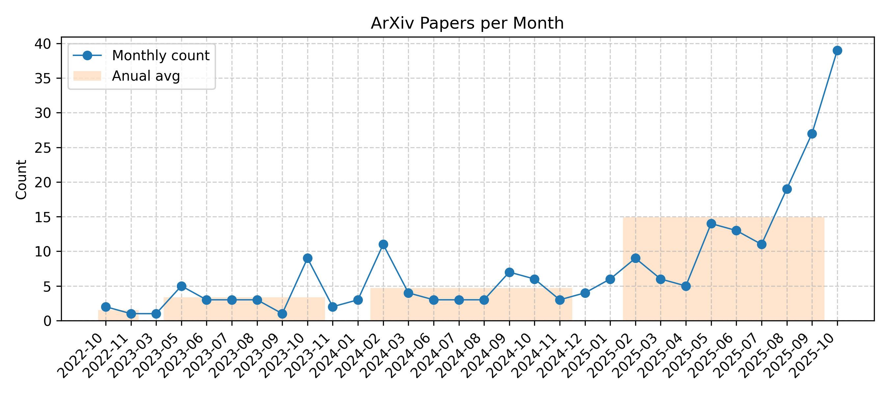

[![Contributors][contributors-shield]][contributors-url]
[![Forks][forks-shield]][forks-url]
[![Stargazers][stars-shield]][stars-url]
[![Issues][issues-shield]][issues-url]

For more carefully curated articles, you can refer to this [repository](https://github.com/bansky-cl/Diffusion_NLP_Papers).

## Updated on 2026.02.02

## diffusion

|Date|Title|label|Abstract|PDF|Code|
|---|---|---|---|---|---|
|**2026-01-30**|**FourierSampler: Unlocking Non-Autoregressive Potential in Diffusion Language Models via Frequency-Guided Generation**|cs.CL| 

Full Abstract
Despite the non-autoregressive potential of diffusion language models (dLLMs), existing decoding strategies demonstrate positional bias, failing to fully unlock the potential of arbitrary generation. In this work, we delve into the inherent spectral characteristics of dLLMs and present the first frequency-domain analysis showing that low-frequency components in hidden states primarily encode global structural information and long-range dependencies, while high-frequency components are responsible for characterizing local details. Based on this observation, we propose FourierSampler, which leverages a frequency-domain sliding window mechanism to dynamically guide the model to achieve a "structure-to-detail" generation. FourierSampler outperforms other inference enhancement strategies on LLADA and SDAR, achieving relative improvements of 20.4% on LLaDA1.5-8B and 16.0% on LLaDA-8B-Instruct. It notably surpasses similarly sized autoregressive models like Llama3.1-8B-Instruct.
|[2601.23182v1](http://arxiv.org/abs/2601.23182v1)| null|
|**2026-01-30**|**Residual Context Diffusion Language Models**|cs.CL, cs.AI| 

Full Abstract
Diffusion Large Language Models (dLLMs) have emerged as a promising alternative to purely autoregressive language models because they can decode multiple tokens in parallel. However, state-of-the-art block-wise dLLMs rely on a "remasking" mechanism that decodes only the most confident tokens and discards the rest, effectively wasting computation. We demonstrate that recycling computation from the discarded tokens is beneficial, as these tokens retain contextual information useful for subsequent decoding iterations. In light of this, we propose Residual Context Diffusion (RCD), a module that converts these discarded token representations into contextual residuals and injects them back for the next denoising step. RCD uses a decoupled two-stage training pipeline to bypass the memory bottlenecks associated with backpropagation. We validate our method on both long CoT reasoning (SDAR) and short CoT instruction following (LLaDA) models. We demonstrate that a standard dLLM can be efficiently converted to the RCD paradigm with merely ~1 billion tokens. RCD consistently improves frontier dLLMs by 5-10 points in accuracy with minimal extra computation overhead across a wide range of benchmarks. Notably, on the most challenging AIME tasks, RCD nearly doubles baseline accuracy and attains up to 4-5x fewer denoising steps at equivalent accuracy levels.
|[2601.22954v1](http://arxiv.org/abs/2601.22954v1)| null|
|**2026-01-30**|**Relaxing Positional Alignment in Masked Diffusion Language Models**|cs.CL, cs.LG| 

Full Abstract
Masked diffusion language models (MDLMs) have emerged as a promising alternative to dominant autoregressive approaches. Although they achieve competitive performance on several tasks, a substantial gap remains in open-ended text generation. We hypothesize that one cause of this gap is that strict positional prediction makes MDLM decoding highly sensitive to token misalignment, and we show through controlled interventions that a one-position shift can severely disrupt semantics. This observation suggests that enforcing strict positional supervision during training is misaligned with the irreversible denoising dynamics of MDLM decoding. Motivated by this mismatch, we adopt an alignment-flexible supervision strategy during fine-tuning. Specifically, we introduce a special token <slack> via the connectionist temporal classification objective. We apply this approach to the widely used MDLM model and conduct experiments on five open-ended text generation benchmarks. Our method consistently outperforms the original model and improves robustness to positional shifts, indicating that relaxing strict positional supervision is an important factor in improving generation quality in MDLMs.
|[2601.22947v1](http://arxiv.org/abs/2601.22947v1)| null|
|**2026-01-30**|**Time-Annealed Perturbation Sampling: Diverse Generation for Diffusion Language Models**|cs.CL, cs.AI| 

Full Abstract
Diffusion language models (Diffusion-LMs) introduce an explicit temporal dimension into text generation, yet how this structure can be leveraged to control generation diversity for exploring multiple valid semantic or reasoning paths remains underexplored. In this paper, we show that Diffusion-LMs, like diffusion models in image generation, exhibit a temporal division of labor: early denoising steps largely determine the global semantic structure, while later steps focus on local lexical refinement. Building on this insight, we propose Time-Annealed Perturbation Sampling (TAPS), a training-free inference strategy that encourages semantic branching early in the diffusion process while progressively reducing perturbations to preserve fluency and instruction adherence. TAPS is compatible with both non-autoregressive and semi-autoregressive Diffusion backbones, demonstrated on LLaDA and TraDo in our paper, and consistently improves output diversity across creative writing and reasoning benchmarks without compromising generation quality.
|[2601.22629v1](http://arxiv.org/abs/2601.22629v1)| null|
|**2026-01-30**|**$ρ$-$\texttt{EOS}$: Training-free Bidirectional Variable-Length Control for Masked Diffusion LLMs**|cs.CL| 

Full Abstract
Beyond parallel generation and global context modeling, current masked diffusion large language models (dLLMs) suffer from a fundamental limitation: they require a predefined, fixed generation length, which lacks flexibility and forces an inevitable trade-off between output quality and computational efficiency. To address this, we study the denoising dynamics and find that the implicit density ($ρ$) of end-of-sequence ($\texttt{EOS}$) tokens serves as a reliable signal of generation sufficiency. In particular, the evolving implicit $\texttt{EOS}$ density during denoising reveals whether the current masked space is excessive or insufficient, thereby guiding the adjustment direction for generation length. Building on this insight, we propose $\textbf{$ρ$-$\texttt{EOS}$}$, a training-free, single-stage strategy that enables bidirectional variable-length generation for masked dLLMs. Unlike prior two-stage approaches--which require separate length adjustment and iterative mask insertion phases while supporting only unidirectional expansion--$\textbf{$ρ$-$\texttt{EOS}$}$ achieves bidirectional length adjustment within a unified denoising process by continuously estimating the implicit $\texttt{EOS}$ density: excessively high density triggers $\texttt{MASK}$ token contraction, while insufficient density induces expansion. Extensive experiments on mathematics and code benchmarks demonstrate that $\textbf{$ρ$-$\texttt{EOS}$}$ achieves comparable performance while substantially improving inference efficiency and token utilization.
|[2601.22527v1](http://arxiv.org/abs/2601.22527v1)| null|
|**2026-01-29**|**Thinking Out of Order: When Output Order Stops Reflecting Reasoning Order in Diffusion Language Models**|cs.CL, cs.AI| 

Full Abstract
Autoregressive (AR) language models enforce a fixed left-to-right generation order, creating a fundamental limitation when the required output structure conflicts with natural reasoning (e.g., producing answers before explanations due to presentation or schema constraints). In such cases, AR models must commit to answers before generating intermediate reasoning, and this rigid constraint forces premature commitment. Masked diffusion language models (MDLMs), which iteratively refine all tokens in parallel, offer a way to decouple computation order from output structure. We validate this capability on GSM8K, Math500, and ReasonOrderQA, a benchmark we introduce with controlled difficulty and order-level evaluation. When prompts request answers before reasoning, AR models exhibit large accuracy gaps compared to standard chain-of-thought ordering (up to 67% relative drop), while MDLMs remain stable ($\leq$14% relative drop), a property we term "order robustness". Using ReasonOrderQA, we present evidence that MDLMs achieve order robustness by stabilizing simpler tokens (e.g., reasoning steps) earlier in the diffusion process than complex ones (e.g., final answers), enabling reasoning tokens to stabilize before answer commitment. Finally, we identify failure conditions where this advantage weakens, outlining the limits required for order robustness.
|[2601.22035v1](http://arxiv.org/abs/2601.22035v1)| null|
|**2026-01-29**|**Causal Autoregressive Diffusion Language Model**|cs.CL| 

Full Abstract
In this work, we propose Causal Autoregressive Diffusion (CARD), a novel framework that unifies the training efficiency of ARMs with the high-throughput inference of diffusion models. CARD reformulates the diffusion process within a strictly causal attention mask, enabling dense, per-token supervision in a single forward pass. To address the optimization instability of causal diffusion, we introduce a soft-tailed masking schema to preserve local context and a context-aware reweighting mechanism derived from signal-to-noise principles. This design enables dynamic parallel decoding, where the model leverages KV-caching to adaptively generate variable-length token sequences based on confidence. Empirically, CARD outperforms existing discrete diffusion baselines while reducing training latency by 3 $\times$ compared to block diffusion methods. Our results demonstrate that CARD achieves ARM-level data efficiency while unlocking the latency benefits of parallel generation, establishing a robust paradigm for next-generation efficient LLMs.
|[2601.22031v1](http://arxiv.org/abs/2601.22031v1)| null|
|**2026-01-29**|**Zonkey: A Hierarchical Diffusion Language Model with Differentiable Tokenization and Probabilistic Attention**|cs.CL| 

Full Abstract
Large language models (LLMs) have revolutionized natural language processing, yet they remain constrained by fixed, non-differentiable tokenizers like Byte Pair Encoding (BPE), which hinder end-to-end optimization and adaptability to noisy or domain-specific data. We introduce Zonkey, a hierarchical diffusion model that addresses these limitations through a fully trainable pipeline from raw characters to document-level representations. At its core is a differentiable tokenizer (Segment Splitter) that learns probabilistic beginning-of-sequence (BOS) decisions, enabling adaptive splits that emerge as linguistically meaningful (e.g., word boundaries at spaces, sentence starts at periods) without explicit supervision. This differentiability is enabled by our novel Probabilistic Attention mechanism, which incorporates position-specific existence probabilities to simulate soft masking over theoretically infinite sequences while preserving gradients. Sequences decay probabilistically rather than relying on end-of-sequence tokens, supporting variable-length outputs. Hierarchical levels compress sequences into higher abstractions (e.g., character n-grams to word-like vectors, then sentence-like), with reconstruction via our Denoising Diffusion Mixed Model (DDMM) for stable and efficient denoising in latent space. A Stitcher ensures overlap invariance across segments. Trained end-to-end on Wikipedia, Zonkey generates coherent, variable-length text from noise, demonstrating emergent hierarchies and promising qualitative alignment to data distributions compared to entropy-based learnable tokenizers. Our approach advances toward fully gradient-based LLMs, with potential for better domain adaptation and scalable generation. We release the source code for training and reproducing our experiments.
|[2601.21768v1](http://arxiv.org/abs/2601.21768v1)| null|
|**2026-01-29**|**ILRR: Inference-Time Steering Method for Masked Diffusion Language Models**|cs.CL, cs.AI, cs.LG| 

Full Abstract
Discrete Diffusion Language Models (DLMs) offer a promising non-autoregressive alternative for text generation, yet effective mechanisms for inference-time control remain relatively underexplored. Existing approaches include sampling-level guidance procedures or trajectory optimization mechanisms. In this work, we introduce Iterative Latent Representation Refinement (ILRR), a learning-free framework for steering DLMs using a single reference sequence. ILRR guides generation by dynamically aligning the internal activations of the generated sequence with those of a given reference throughout the denoising process. This approach captures and transfers high-level semantic properties, with a tunable steering scale enabling flexible control over attributes such as sentiment. We further introduce Spatially Modulated Steering, an extension that enables steering long texts using shorter references by regulating guidance intensity across the sequence. Empirically, we demonstrate that ILRR achieves effective attribute steering on LLaDA and MDLM architectures with a minor computational overhead, requiring only one additional parallel forward pass per denoising step. Under the same compute budget, ILRR improves attribute accuracy over comparable baselines by 10$\%$ to 60$\%$ points, while maintaining high generation quality.
|[2601.21647v1](http://arxiv.org/abs/2601.21647v1)| null|
|**2026-01-28**|**Improving Diffusion Language Model Decoding through Joint Search in Generation Order and Token Space**|cs.CL, cs.LG| 

Full Abstract
Diffusion Language Models (DLMs) offer order-agnostic generation that can explore many possible decoding trajectories. However, current decoding methods commit to a single trajectory, limiting exploration in trajectory space. We introduce Order-Token Search to explore this space through jointly searching over generation order and token values. Its core is a likelihood estimator that scores denoising actions, enabling stable pruning and efficient exploration of diverse trajectories. Across mathematical reasoning and coding benchmarks, Order-Token Search consistently outperforms baselines on GSM8K, MATH500, Countdown, and HumanEval (3.1%, 3.8%, 7.9%, and 6.8% absolute over backbone), matching or surpassing diffu-GRPO post-trained d1-LLaDA. Our work establishes joint search as a key component for advancing decoding in DLMs.
|[2601.20339v1](http://arxiv.org/abs/2601.20339v1)| null|
|**2026-01-29**|**One Token Is Enough: Improving Diffusion Language Models with a Sink Token**|cs.CL, cs.AI| 

Full Abstract
Diffusion Language Models (DLMs) have emerged as a compelling alternative to autoregressive approaches, enabling parallel text generation with competitive performance. Despite these advantages, there is a critical instability in DLMs: the moving sink phenomenon. Our analysis indicates that sink tokens exhibit low-norm representations in the Transformer's value space, and that the moving sink phenomenon serves as a protective mechanism in DLMs to prevent excessive information mixing. However, their unpredictable positions across diffusion steps undermine inference robustness. To resolve this, we propose a simple but effective extra sink token implemented via a modified attention mask. Specifically, we introduce a special token constrained to attend solely to itself, while remaining globally visible to all other tokens. Experimental results demonstrate that introducing a single extra token stabilizes attention sinks, substantially improving model performance. Crucially, further analysis confirms that the effectiveness of this token is independent of its position and characterized by negligible semantic content, validating its role as a robust and dedicated structural sink.
|[2601.19657v2](http://arxiv.org/abs/2601.19657v2)| null|
|**2026-01-27**|**DART: Diffusion-Inspired Speculative Decoding for Fast LLM Inference**|cs.CL| 

Full Abstract
Speculative decoding is an effective and lossless approach for accelerating LLM inference. However, existing widely adopted model-based draft designs, such as EAGLE3, improve accuracy at the cost of multi-step autoregressive inference, resulting in high drafting latency and ultimately rendering the drafting stage itself a performance bottleneck. Inspired by diffusion-based large language models (dLLMs), we propose DART, which leverages parallel generation to reduce drafting latency. DART predicts logits for multiple future masked positions in parallel within a single forward pass based on hidden states of the target model, thereby eliminating autoregressive rollouts in the draft model while preserving a lightweight design. Based on these parallel logit predictions, we further introduce an efficient tree pruning algorithm that constructs high-quality draft token trees with N-gram-enforced semantic continuity. DART substantially reduces draft-stage overhead while preserving high draft accuracy, leading to significantly improved end-to-end decoding speed. Experimental results demonstrate that DART achieves a 2.03x--3.44x wall-clock time speedup across multiple datasets, surpassing EAGLE3 by 30% on average and offering a practical speculative decoding framework. Code is released at https://github.com/fvliang/DART.
|[2601.19278v1](http://arxiv.org/abs/2601.19278v1)| null|
|**2026-01-27**|**DREAMSTATE: Diffusing States and Parameters for Recurrent Large Language Models**|cs.CL| 

Full Abstract
Modern Recurrent Neural Networks (RNNs), such as RWKV, are distinguished by their powerful short-range modeling capabilities and efficient fixed-size states, which constitute a core advantage over standard Transformers. However, there is a significant lack of research into their internal state as an editable knowledge representation. To fill this gap, we first explore the representational properties of the RWKV state by proposing the DREAMSTATE framework. This framework utilizes a conditional Diffusion Transformer (DiT) to directly model the probability manifold of the state, enabling its generation and editing. The structural nature of this representation is validated through t-SNE visualizations and controlled generation experiments. After successfully uncovering and modeling the state's representational potential, we further propose a novel hybrid architecture that combines the local advantages of RNNs with global context adaptability. This architecture features a parallel DiT that processes a variable-length global context to dynamically generate and adjust the core recurrent module's WKV parameters, transforming the fixed recurrence mechanism into a context-aware dynamic function. Experiments demonstrate that this hybrid model can be trained stably via a multi-objective loss, validating its design feasibility. Our work not only opens a new research direction for RNN state representation but also provides a concrete architectural reference for future model design. The code is publicly available at: https://huggingface.co/2dgx41s/DreamState.
|[2601.19221v1](http://arxiv.org/abs/2601.19221v1)| null|
|**2026-01-23**|**Stable-DiffCoder: Pushing the Frontier of Code Diffusion Large Language Model**|cs.CL| 

Full Abstract
Diffusion-based language models (DLLMs) offer non-sequential, block-wise generation and richer data reuse compared to autoregressive (AR) models, but existing code DLLMs still lag behind strong AR baselines under comparable budgets. We revisit this setting in a controlled study and introduce Stable-DiffCoder, a block diffusion code model that reuses the Seed-Coder architecture, data, and training pipeline. To enable efficient knowledge learning and stable training, we incorporate a block diffusion continual pretraining (CPT) stage enhanced by a tailored warmup and block-wise clipped noise schedule. Under the same data and architecture, Stable-DiffCoder overall outperforms its AR counterpart on a broad suite of code benchmarks. Moreover, relying only on the CPT and supervised fine-tuning stages, Stable-DiffCoder achieves stronger performance than a wide range of \~8B ARs and DLLMs, demonstrating that diffusion-based training can improve code modeling quality beyond AR training alone. Moreover, diffusion-based any-order modeling improves structured code modeling for editing and reasoning, and through data augmentation, benefits low-resource coding languages.
|[2601.15892v2](http://arxiv.org/abs/2601.15892v2)| null|
|**2026-01-22**|**Parallelism and Generation Order in Masked Diffusion Language Models: Limits Today, Potential Tomorrow**|cs.CL, cs.AI, cs.LG| 

Full Abstract
Masked Diffusion Language Models (MDLMs) promise parallel token generation and arbitrary-order decoding, yet it remains unclear to what extent current models truly realize these capabilities. We characterize MDLM behavior along two dimensions -- parallelism strength and generation order -- using Average Finalization Parallelism (AFP) and Kendall's tau. We evaluate eight mainstream MDLMs (up to 100B parameters) on 58 benchmarks spanning knowledge, reasoning, and programming. The results show that MDLMs still lag behind comparably sized autoregressive models, mainly because parallel probabilistic modeling weakens inter-token dependencies. Meanwhile, MDLMs exhibit adaptive decoding behavior: their parallelism and generation order vary significantly with the task domain, the stage of reasoning, and whether the output is correct. On tasks that require "backward information" (e.g., Sudoku), MDLMs adopt a solution order that tends to fill easier Sudoku blanks first, highlighting their advantages. Finally, we provide theoretical motivation and design insights supporting a Generate-then-Edit paradigm, which mitigates dependency loss while retaining the efficiency of parallel decoding.
|[2601.15593v1](http://arxiv.org/abs/2601.15593v1)| null|
|**2026-01-26**|**The Flexibility Trap: Why Arbitrary Order Limits Reasoning Potential in Diffusion Language Models**|cs.CL, cs.AI, cs.LG| 

Full Abstract
Diffusion Large Language Models (dLLMs) break the rigid left-to-right constraint of traditional LLMs, enabling token generation in arbitrary orders. Intuitively, this flexibility implies a solution space that strictly supersets the fixed autoregressive trajectory, theoretically unlocking superior reasoning potential for general tasks like mathematics and coding. Consequently, numerous works have leveraged reinforcement learning (RL) to elicit the reasoning capability of dLLMs. In this paper, we reveal a counter-intuitive reality: arbitrary order generation, in its current form, narrows rather than expands the reasoning boundary of dLLMs. We find that dLLMs tend to exploit this order flexibility to bypass high-uncertainty tokens that are crucial for exploration, leading to a premature collapse of the solution space. This observation motivates a rethink of RL approaches for dLLMs, where considerable complexities, such as handling combinatorial trajectories and intractable likelihoods, are often devoted to preserving this flexibility. We demonstrate that effective reasoning can be better elicited by intentionally forgoing arbitrary order and applying standard Group Relative Policy Optimization (GRPO) instead. Our approach, JustGRPO, is minimalist yet surprisingly effective (e.g., 89.1% accuracy on GSM8K) while fully retaining the parallel decoding ability of dLLMs. Project page: https://nzl-thu.github.io/the-flexibility-trap
|[2601.15165v2](http://arxiv.org/abs/2601.15165v2)| null|
|**2026-01-22**|**Mechanism Shift During Post-training from Autoregressive to Masked Diffusion Language Models**|cs.LG, cs.AI, cs.CL| 

Full Abstract
Post-training pretrained Autoregressive models (ARMs) into Masked Diffusion models (MDMs) has emerged as a cost-effective strategy to overcome the limitations of sequential generation. However, the internal algorithmic transformations induced by this paradigm shift remain unexplored, leaving it unclear whether post-trained MDMs acquire genuine bidirectional reasoning capabilities or merely repackage autoregressive heuristics. In this work, we address this question by conducting a comparative circuit analysis of ARMs and their MDM counterparts. Our analysis reveals a systematic "mechanism shift" dependent on the structural nature of the task. Structurally, we observe a distinct divergence: while MDMs largely retain autoregressive circuitry for tasks dominated by local causal dependencies, they abandon initialized pathways for global planning tasks, exhibiting distinct rewiring characterized by increased early-layer processing. Semantically, we identify a transition from sharp, localized specialization in ARMs to distributed integration in MDMs. Through these findings, we conclude that diffusion post-training does not merely adapt model parameters but fundamentally reorganizes internal computation to support non-sequential global planning.
|[2601.14758v2](http://arxiv.org/abs/2601.14758v2)| null|
|**2026-01-20**|**Style Transfer as Bias Mitigation: Diffusion Models for Synthetic Mental Health Text for Arabic**|cs.CL, cs.AI| 

Full Abstract
Synthetic data offers a promising solution for mitigating data scarcity and demographic bias in mental health analysis, yet existing approaches largely rely on pretrained large language models (LLMs), which may suffer from limited output diversity and propagate biases inherited from their training data. In this work, we propose a pretraining-free diffusion-based approach for synthetic text generation that frames bias mitigation as a style transfer problem. Using the CARMA Arabic mental health corpus, which exhibits a substantial gender imbalance, we focus on male-to-female style transfer to augment underrepresented female-authored content. We construct five datasets capturing varying linguistic and semantic aspects of gender expression in Arabic and train separate diffusion models for each setting. Quantitative evaluations demonstrate consistently high semantic fidelity between source and generated text, alongside meaningful surface-level stylistic divergence, while qualitative analysis confirms linguistically plausible gender transformations. Our results show that diffusion-based style transfer can generate high-entropy, semantically faithful synthetic data without reliance on pretrained LLMs, providing an effective and flexible framework for mitigating gender bias in sensitive, low-resource mental health domains.
|[2601.14124v1](http://arxiv.org/abs/2601.14124v1)| null|
|**2026-01-20**|**Top 10 Open Challenges Steering the Future of Diffusion Language Model and Its Variants**|cs.CL, cs.AI| 

Full Abstract
The paradigm of Large Language Models (LLMs) is currently defined by auto-regressive (AR) architectures, which generate text through a sequential ``brick-by-brick'' process. Despite their success, AR models are inherently constrained by a causal bottleneck that limits global structural foresight and iterative refinement. Diffusion Language Models (DLMs) offer a transformative alternative, conceptualizing text generation as a holistic, bidirectional denoising process akin to a sculptor refining a masterpiece. However, the potential of DLMs remains largely untapped as they are frequently confined within AR-legacy infrastructures and optimization frameworks. In this Perspective, we identify ten fundamental challenges ranging from architectural inertia and gradient sparsity to the limitations of linear reasoning that prevent DLMs from reaching their ``GPT-4 moment''. We propose a strategic roadmap organized into four pillars: foundational infrastructure, algorithmic optimization, cognitive reasoning, and unified multimodal intelligence. By shifting toward a diffusion-native ecosystem characterized by multi-scale tokenization, active remasking, and latent thinking, we can move beyond the constraints of the causal horizon. We argue that this transition is essential for developing next-generation AI capable of complex structural reasoning, dynamic self-correction, and seamless multimodal integration.
|[2601.14041v1](http://arxiv.org/abs/2601.14041v1)| null|
|**2026-01-19**|**Autoregressive Models Rival Diffusion Models at ANY-ORDER Generation**|cs.CL, cs.AI| 

Full Abstract
Diffusion language models enable any-order generation and bidirectional conditioning, offering appealing flexibility for tasks such as infilling, rewriting, and self-correction. However, their formulation-predicting one part of a sequence from another within a single-step dependency-limits modeling depth and often yields lower sample quality and stability than autoregressive (AR) models. To address this, we revisit autoregressive modeling as a foundation and reformulate diffusion-style training into a structured multi-group prediction process. We propose Any-order Any-subset Autoregressive modeling (A3), a generalized framework that extends the standard AR factorization to arbitrary token groups and generation orders. A3 preserves the probabilistic rigor and multi-layer dependency modeling of AR while inheriting diffusion models' flexibility for parallel and bidirectional generation. We implement A3 through a two-stream attention architecture and a progressive adaptation strategy that transitions pretrained AR models toward any-order prediction. Experiments on question answering, commonsense reasoning, and story infilling demonstrate that A3 outperforms diffusion-based models while maintaining flexible decoding. This work offers a unified approach for a flexible, efficient, and novel language modeling paradigm.
|[2601.13228v1](http://arxiv.org/abs/2601.13228v1)| null|
|**2026-01-23**|**The Bitter Lesson of Diffusion Language Models for Agentic Workflows: A Comprehensive Reality Check**|cs.CL| 

Full Abstract
The pursuit of real-time agentic interaction has driven interest in Diffusion-based Large Language Models (dLLMs) as alternatives to auto-regressive backbones, promising to break the sequential latency bottleneck. However, does such efficiency gains translate into effective agentic behavior? In this work, we present a comprehensive evaluation of dLLMs (e.g., LLaDA, Dream) across two distinct agentic paradigms: Embodied Agents (requiring long-horizon planning) and Tool-Calling Agents (requiring precise formatting). Contrary to the efficiency hype, our results on Agentboard and BFCL reveal a "bitter lesson": current dLLMs fail to serve as reliable agentic backbones, frequently leading to systematically failure. (1) In Embodied settings, dLLMs suffer repeated attempts, failing to branch under temporal feedback. (2) In Tool-Calling settings, dLLMs fail to maintain symbolic precision (e.g. strict JSON schemas) under diffusion noise. To assess the potential of dLLMs in agentic workflows, we introduce DiffuAgent, a multi-agent evaluation framework that integrates dLLMs as plug-and-play cognitive cores. Our analysis shows that dLLMs are effective in non-causal roles (e.g., memory summarization and tool selection) but require the incorporation of causal, precise, and logically grounded reasoning mechanisms into the denoising process to be viable for agentic tasks.
|[2601.12979v2](http://arxiv.org/abs/2601.12979v2)| null|
|**2026-01-18**|**LR-DWM: Efficient Watermarking for Diffusion Language Models**|cs.CL| 

Full Abstract
Watermarking (WM) is a critical mechanism for detecting and attributing AI-generated content. Current WM methods for Large Language Models (LLMs) are predominantly tailored for autoregressive (AR) models: They rely on tokens being generated sequentially, and embed stable signals within the generated sequence based on the previously sampled text. Diffusion Language Models (DLMs) generate text via non-sequential iterative denoising, which requires significant modification to use WM methods designed for AR models. Recent work proposed to watermark DLMs by inverting the process when needed, but suffers significant computational or memory overhead. We introduce Left-Right Diffusion Watermarking (LR-DWM), a scheme that biases the generated token based on both left and right neighbors, when they are available. LR-DWM incurs minimal runtime and memory overhead, remaining close to the non-watermarked baseline DLM while enabling reliable statistical detection under standard evaluation settings. Our results demonstrate that DLMs can be watermarked efficiently, achieving high detectability with negligible computational and memory overhead.
|[2601.12376v1](http://arxiv.org/abs/2601.12376v1)| null|
|**2026-01-18**|**Plan, Verify and Fill: A Structured Parallel Decoding Approach for Diffusion Language Models**|cs.CL, cs.AI, cs.LG| 

Full Abstract
Diffusion Language Models (DLMs) present a promising non-sequential paradigm for text generation, distinct from standard autoregressive (AR) approaches. However, current decoding strategies often adopt a reactive stance, underutilizing the global bidirectional context to dictate global trajectories. To address this, we propose Plan-Verify-Fill (PVF), a training-free paradigm that grounds planning via quantitative validation. PVF actively constructs a hierarchical skeleton by prioritizing high-leverage semantic anchors and employs a verification protocol to operationalize pragmatic structural stopping where further deliberation yields diminishing returns. Extensive evaluations on LLaDA-8B-Instruct and Dream-7B-Instruct demonstrate that PVF reduces the Number of Function Evaluations (NFE) by up to 65% compared to confidence-based parallel decoding across benchmark datasets, unlocking superior efficiency without compromising accuracy.
|[2601.12247v1](http://arxiv.org/abs/2601.12247v1)| null|
|**2026-01-16**|**Unlocking the Potentials of Retrieval-Augmented Generation for Diffusion Language Models**|cs.LG, cs.CL| 

Full Abstract
Diffusion Language Models (DLMs) have recently demonstrated remarkable capabilities in natural language processing tasks. However, the potential of Retrieval-Augmented Generation (RAG), which shows great successes for enhancing large language models (LLMs), has not been well explored, due to the fundamental difference between LLM and DLM decoding. To fill this critical gap, we systematically test the performance of DLMs within the RAG framework. Our findings reveal that DLMs coupled with RAG show promising potentials with stronger dependency on contextual information, but suffer from limited generation precision. We identify a key underlying issue: Response Semantic Drift (RSD), where the generated answer progressively deviates from the query's original semantics, leading to low precision content. We trace this problem to the denoising strategies in DLMs, which fail to maintain semantic alignment with the query throughout the iterative denoising process. To address this, we propose Semantic-Preserving REtrieval-Augmented Diffusion (SPREAD), a novel framework that introduces a query-relevance-guided denoising strategy. By actively guiding the denoising trajectory, SPREAD ensures the generation remains anchored to the query's semantics and effectively suppresses drift. Experimental results demonstrate that SPREAD significantly enhances the precision and effectively mitigates RSD of generated answers within the RAG framework.
|[2601.11342v1](http://arxiv.org/abs/2601.11342v1)| null|
|**2026-01-16**|**Beyond Hard Masks: Progressive Token Evolution for Diffusion Language Models**|cs.CL, cs.AI| 

Full Abstract
Diffusion Language Models (DLMs) offer a promising alternative for language modeling by enabling parallel decoding through iterative refinement. However, most DLMs rely on hard binary masking and discrete token assignments, which hinder the revision of early decisions and underutilize intermediate probabilistic representations. In this paper, we propose EvoToken-DLM, a novel diffusion-based language modeling approach that replaces hard binary masks with evolving soft token distributions. EvoToken-DLM enables a progressive transition from masked states to discrete outputs, supporting revisable decoding. To effectively support this evolution, we introduce continuous trajectory supervision, which aligns training objectives with iterative probabilistic updates. Extensive experiments across multiple benchmarks show that EvoToken-DLM consistently achieves superior performance, outperforming strong diffusion-based and masked DLM baselines. Project webpage: https://aim-uofa.github.io/EvoTokenDLM.
|[2601.07351v2](http://arxiv.org/abs/2601.07351v2)| null|
|**2026-01-12**|**DiffER: Diffusion Entity-Relation Modeling for Reversal Curse in Diffusion Large Language Models**|cs.CL| 

Full Abstract
The "reversal curse" refers to the phenomenon where large language models (LLMs) exhibit predominantly unidirectional behavior when processing logically bidirectional relationships. Prior work attributed this to autoregressive training -- predicting the next token inherently favors left-to-right information flow over genuine bidirectional knowledge associations. However, we observe that Diffusion LLMs (DLLMs), despite being trained bidirectionally, also suffer from the reversal curse. To investigate the root causes, we conduct systematic experiments on DLLMs and identify three key reasons: 1) entity fragmentation during training, 2) data asymmetry, and 3) missing entity relations. Motivated by the analysis of these reasons, we propose Diffusion Entity-Relation Modeling (DiffER), which addresses the reversal curse through entity-aware training and balanced data construction. Specifically, DiffER introduces whole-entity masking, which mitigates entity fragmentation by predicting complete entities in a single step. DiffER further employs distribution-symmetric and relation-enhanced data construction strategies to alleviate data asymmetry and missing relations. Extensive experiments demonstrate that DiffER effectively alleviates the reversal curse in Diffusion LLMs, offering new perspectives for future research.
|[2601.07347v1](http://arxiv.org/abs/2601.07347v1)| null|
|**2026-01-09**|**Visualising Information Flow in Word Embeddings with Diffusion Tensor Imaging**|cs.CL, cs.AI, cs.LG| 

Full Abstract
Understanding how large language models (LLMs) represent natural language is a central challenge in natural language processing (NLP) research. Many existing methods extract word embeddings from an LLM, visualise the embedding space via point-plots, and compare the relative positions of certain words. However, this approach only considers single words and not whole natural language expressions, thus disregards the context in which a word is used. Here we present a novel tool for analysing and visualising information flow in natural language expressions by applying diffusion tensor imaging (DTI) to word embeddings. We find that DTI reveals how information flows between word embeddings. Tracking information flows within the layers of an LLM allows for comparing different model structures and revealing opportunities for pruning an LLM's under-utilised layers. Furthermore, our model reveals differences in information flows for tasks like pronoun resolution and metaphor detection. Our results show that our model permits novel insights into how LLMs represent actual natural language expressions, extending the comparison of isolated word embeddings and improving the interpretability of NLP models.
|[2601.05713v1](http://arxiv.org/abs/2601.05713v1)| null|
|**2026-01-07**|**Bridging the Discrete-Continuous Gap: Unified Multimodal Generation via Coupled Manifold Discrete Absorbing Diffusion**|cs.CL| 

Full Abstract
The bifurcation of generative modeling into autoregressive approaches for discrete data (text) and diffusion approaches for continuous data (images) hinders the development of truly unified multimodal systems. While Masked Language Models (MLMs) offer efficient bidirectional context, they traditionally lack the generative fidelity of autoregressive models and the semantic continuity of diffusion models. Furthermore, extending masked generation to multimodal settings introduces severe alignment challenges and training instability. In this work, we propose \textbf{CoM-DAD} (\textbf{Co}upled \textbf{M}anifold \textbf{D}iscrete \textbf{A}bsorbing \textbf{D}iffusion), a novel probabilistic framework that reformulates multimodal generation as a hierarchical dual-process. CoM-DAD decouples high-level semantic planning from low-level token synthesis. First, we model the semantic manifold via a continuous latent diffusion process; second, we treat token generation as a discrete absorbing diffusion process, regulated by a \textbf{Variable-Rate Noise Schedule}, conditioned on these evolving semantic priors. Crucially, we introduce a \textbf{Stochastic Mixed-Modal Transport} strategy that aligns disparate modalities without requiring heavy contrastive dual-encoders. Our method demonstrates superior stability over standard masked modeling, establishing a new paradigm for scalable, unified text-image generation.
|[2601.04056v1](http://arxiv.org/abs/2601.04056v1)| null|
|**2026-01-07**|**DiffCoT: Diffusion-styled Chain-of-Thought Reasoning in LLMs**|cs.CL| 

Full Abstract
Chain-of-Thought (CoT) reasoning improves multi-step mathematical problem solving in large language models but remains vulnerable to exposure bias and error accumulation, as early mistakes propagate irreversibly through autoregressive decoding. In this work, we propose DiffCoT, a diffusion-styled CoT framework that reformulates CoT reasoning as an iterative denoising process. DiffCoT integrates diffusion principles at the reasoning-step level via a sliding-window mechanism, enabling unified generation and retrospective correction of intermediate steps while preserving token-level autoregression. To maintain causal consistency, we further introduce a causal diffusion noise schedule that respects the temporal structure of reasoning chains. Extensive experiments on three multi-step CoT reasoning benchmarks across diverse model backbones demonstrate that DiffCoT consistently outperforms existing CoT preference optimization methods, yielding improved robustness and error-correction capability in CoT reasoning.
|[2601.03559v1](http://arxiv.org/abs/2601.03559v1)| null|
|**2026-01-06**|**DIP: Dynamic In-Context Planner For Diffusion Language Models**|cs.CL, cs.AI| 

Full Abstract
Diffusion language models (DLMs) have shown strong potential for general natural language tasks with in-context examples. However, due to the bidirectional attention mechanism, DLMs incur substantial computational cost as context length increases. This work addresses this issue with a key discovery: unlike the sequential generation in autoregressive language models (ARLMs), the diffusion generation paradigm in DLMs allows \textit{efficient dynamic adjustment of the context} during generation. Building on this insight, we propose \textbf{D}ynamic \textbf{I}n-Context \textbf{P}lanner (DIP), a context-optimization method that dynamically selects and inserts in-context examples during generation, rather than providing all examples in the prompt upfront. Results show DIP maintains generation quality while achieving up to 12.9$\times$ inference speedup over standard inference and 1.17$\times$ over KV cache-enhanced inference.
|[2601.03199v1](http://arxiv.org/abs/2601.03199v1)| null|
|**2026-01-06**|**Stratified Hazard Sampling: Minimal-Variance Event Scheduling for CTMC/DTMC Discrete Diffusion and Flow Models**|cs.LG, cs.CL| 

Full Abstract
CTMC/DTMC-based discrete generative models, including uniform-noise discrete diffusion (e.g., D3PM/CTDD) and discrete flow matching, enable non-autoregressive sequence generation by repeatedly replacing tokens through a time-inhomogeneous Markov process. Inference is typically implemented with step-based simulation: each token decides to jump via independent Bernoulli (or categorical) draws at every discretization step. Under uniform-noise initialization, where self-correction requires multiple edits per position, these independent decisions induce substantial variance in both the number and timing of edits, leading to characteristic failure modes such as under-editing (residual noise) or over-editing (cascading unnecessary substitutions), decreasing reproducibility.   We propose Stratified Hazard Sampling (SHS), a drop-in and hyperparameter-free inference principle for any sampler that admits a stay-vs.-replace decomposition. SHS models per-token edits as events driven by cumulative hazard (CTMC) or cumulative jump mass (DTMC) and places events by stratifying this cumulative quantity: with a single random phase per position, a token jumps whenever its accumulated hazard crosses unit-spaced thresholds. This preserves the expected number of jumps while achieving the minimum possible variance among unbiased integer estimators (bounded by 1/4), without altering per-jump destination sampling and thus retaining multimodality. We also introduce a phase-allocation variant for blacklist-style lexical constraints that prioritizes early edits at high-risk positions to mitigate late-masking artifacts.
|[2601.02799v1](http://arxiv.org/abs/2601.02799v1)| null|
|**2026-01-05**|**CD4LM: Consistency Distillation and aDaptive Decoding for Diffusion Language Models**|cs.CL| 

Full Abstract
Autoregressive large language models achieve strong results on many benchmarks, but decoding remains fundamentally latency-limited by sequential dependence on previously generated tokens. Diffusion language models (DLMs) promise parallel generation but suffer from a fundamental static-to-dynamic misalignment: Training optimizes local transitions under fixed schedules, whereas efficient inference requires adaptive "long-jump" refinements through unseen states. Our goal is to enable highly parallel decoding for DLMs with low number of function evaluations while preserving generation quality. To achieve this, we propose CD4LM, a framework that decouples training from inference via Discrete-Space Consistency Distillation (DSCD) and Confidence-Adaptive Decoding (CAD). Unlike standard objectives, DSCD trains a student to be trajectory-invariant, mapping diverse noisy states directly to the clean distribution. This intrinsic robustness enables CAD to dynamically allocate compute resources based on token confidence, aggressively skipping steps without the quality collapse typical of heuristic acceleration. On GSM8K, CD4LM matches the LLaDA baseline with a 5.18x wall-clock speedup; across code and math benchmarks, it strictly dominates the accuracy-efficiency Pareto frontier, achieving a 3.62x mean speedup while improving average accuracy. Code is available at https://github.com/yihao-liang/CDLM
|[2601.02236v1](http://arxiv.org/abs/2601.02236v1)| null|
|**2026-01-20**|**Deferred Commitment Decoding for Diffusion Language Models**|cs.CL, cs.AI| 

Full Abstract
Diffusion language models (DLMs) have recently emerged as a strong alternative to autoregressive models by enabling parallel text generation. To improve inference efficiency and KV-cache compatibility, prior work commonly adopts block-based diffusion, decoding tokens block by block. However, this paradigm suffers from a structural limitation that we term Boundary-Induced Context Truncation (BICT): undecoded tokens near block boundaries are forced to commit without access to nearby future context, even when such context could substantially reduce uncertainty. This limitation degrades decoding certainty and generation quality, especially for tasks requiring precise reasoning, such as mathematical problem solving and code generation. We propose Deferred Commitment Decoding (DCD), a novel, training-free decoding strategy that mitigates this issue. DCD maintains a certainty-aware sliding window over masked tokens, resolving low-uncertainty tokens early while deferring high-uncertainty tokens until sufficient contextual evidence becomes available. Extensive experiments across multiple diffusion language models, benchmarks, and caching configurations show that DCD improves generation accuracy by 1.73% with comparable time on average compared to fixed block-based diffusion methods, with the most significant improvement reaching 16.5%. These results demonstrate that deferring token commitment based on uncertainty is a simple yet effective principle for improving both the quality and efficiency of diffusion language model decoding.
|[2601.02076v2](http://arxiv.org/abs/2601.02076v2)| null|
|**2025-12-30**|**Activation Steering for Masked Diffusion Language Models**|cs.CL| 

Full Abstract
Masked diffusion language models (MDLMs) generate text through an iterative denoising process. They have recently gained attention due to mask-parallel decoding and competitive performance with autoregressive large language models. However, effective mechanisms for inference-time control and steering in MDLMs remain largely unexplored. We present an activation-steering framework for MDLMs that computes layer-wise steering vectors from a single forward pass using contrastive examples, without simulating the denoising trajectory. These directions are applied at every reverse-diffusion step, yielding an efficient inference-time control mechanism. Experiments on LLaDA-8B-Instruct demonstrate reliable modulation of high-level attributes, with ablations examining the effects of steering across transformer sub-modules and token scope (prompt vs.\ response).
|[2512.24143v1](http://arxiv.org/abs/2512.24143v1)| null|
|**2025-12-28**|**WeDLM: Reconciling Diffusion Language Models with Standard Causal Attention for Fast Inference**|cs.CL| 

Full Abstract
Autoregressive (AR) generation is the standard decoding paradigm for Large Language Models (LLMs), but its token-by-token nature limits parallelism at inference time. Diffusion Language Models (DLLMs) offer parallel decoding by recovering multiple masked tokens per step; however, in practice they often fail to translate this parallelism into deployment speed gains over optimized AR engines (e.g., vLLM). A key reason is that many DLLMs rely on bidirectional attention, which breaks standard prefix KV caching and forces repeated contextualization, undermining efficiency. We propose WeDLM, a diffusion decoding framework built entirely on standard causal attention to make parallel generation prefix-cache friendly. The core idea is to let each masked position condition on all currently observed tokens while keeping a strict causal mask, achieved by Topological Reordering that moves observed tokens to the physical prefix while preserving their logical positions. Building on this property, we introduce a streaming decoding procedure that continuously commits confident tokens into a growing left-to-right prefix and maintains a fixed parallel workload, avoiding the stop-and-wait behavior common in block diffusion methods. Experiments show that WeDLM preserves the quality of strong AR backbones while delivering substantial speedups, approaching 3x on challenging reasoning benchmarks and up to 10x in low-entropy generation regimes; critically, our comparisons are against AR baselines served by vLLM under matched deployment settings, demonstrating that diffusion-style decoding can outperform an optimized AR engine in practice.
|[2512.22737v1](http://arxiv.org/abs/2512.22737v1)| null|
|**2025-12-27**|**On the Role of Discreteness in Diffusion LLMs**|cs.CL| 

Full Abstract
Diffusion models offer appealing properties for language generation, such as parallel decoding and iterative refinement, but the discrete and highly structured nature of text challenges the direct application of diffusion principles. In this paper, we revisit diffusion language modeling from the view of diffusion process and language modeling, and outline five properties that separate diffusion mechanics from language-specific requirements. We first categorize existing approaches into continuous diffusion in embedding space and discrete diffusion over tokens. We then show that each satisfies only part of the five essential properties and therefore reflects a structural trade-off. Through analyses of recent large diffusion language models, we identify two central issues: (i) uniform corruption does not respect how information is distributed across positions, and (ii) token-wise marginal training cannot capture multi-token dependencies during parallel decoding. These observations motivate diffusion processes that align more closely with the structure of text, and encourage future work toward more coherent diffusion language models.
|[2512.22630v1](http://arxiv.org/abs/2512.22630v1)| null|
|**2025-12-24**|**Optimizing Decoding Paths in Masked Diffusion Models by Quantifying Uncertainty**|cs.CL, cs.AI, cs.LG| 

Full Abstract
Masked Diffusion Models (MDMs) offer flexible, non-autoregressive generation, but this freedom introduces a challenge: final output quality is highly sensitive to the decoding order. We are the first to formalize this issue, attributing the variability in output quality to the cumulative predictive uncertainty along a generative path. To quantify this uncertainty, we introduce Denoising Entropy, a computable metric that serves as an internal signal for evaluating generative process. Leveraging this metric, we propose two algorithms designed to optimize the decoding path: a post-hoc selection method and a real-time guidance strategy. Experiments demonstrate that our entropy-guided methods significantly improve generation quality, consistently boosting accuracy on challenging reasoning, planning, and code benchmarks. Our work establishes Denoising Entropy as a principled tool for understanding and controlling generation, effectively turning the uncertainty in MDMs from a liability into a key advantage for discovering high-quality solutions.
|[2512.21336v1](http://arxiv.org/abs/2512.21336v1)| null|
|**2026-01-06**|**MoE-DiffuSeq: Enhancing Long-Document Diffusion Models with Sparse Attention and Mixture of Experts**|cs.CL| 

Full Abstract
We propose \textbf{MoE-DiffuSeq}, a diffusion-based framework for efficient long-form text generation that integrates sparse attention with a Mixture-of-Experts (MoE) architecture. Existing sequence diffusion models suffer from prohibitive computational and memory costs when scaling to long documents, largely due to dense attention and slow iterative reconstruction. MoE-DiffuSeq addresses these limitations by combining expert routing with a tailored sparse attention mechanism, substantially reducing attention complexity while preserving global coherence and textual fidelity. In addition, we introduce a \emph{soft absorbing state} within the diffusion process that reshapes attention dynamics during denoising, enabling faster sequence reconstruction and more precise token refinement. This design accelerates both training and sampling without sacrificing generation quality. Extensive experiments on long-document benchmarks demonstrate that MoE-DiffuSeq consistently outperforms prior diffusion-based and sparse-attention baselines in training efficiency, inference speed, and generation quality. Our approach is particularly effective for long-context applications such as scientific document generation, large-scale code synthesis, and extended dialogue modeling, establishing a scalable and expressive solution for diffusion-based long-form text generation.
|[2512.20604v2](http://arxiv.org/abs/2512.20604v2)| null|
|**2025-12-22**|**Context-Aware Initialization for Reducing Generative Path Length in Diffusion Language Models**|cs.CL, cs.AI, cs.LG| 

Full Abstract
Diffusion Large Language Models (DLLMs) enable fully parallel token decoding but often remain impractical at inference time due to the many denoising iterations required to refine an information-free, fully masked initialization into coherent text. Most existing acceleration methods focus on traversing this generative trajectory more efficiently via improved solvers or sampling strategies. We advance a complementary perspective: shorten the trajectory itself by starting closer to the target distribution through context-aware initialization.   We propose a training-free interface that injects prompt-conditioned priors from a lightweight auxiliary model into the diffusion initialization, and instantiate it with two mechanisms: discrete token injection and representation-level embedding interpolation. Because injected priors can be imperfect and unmask-only decoding can over-commit early, we also introduce a simple confidence-based remasking mechanism as a form of prior skepticism. Preliminary evidence on GSM8K suggests that context-aware initialization can substantially reduce denoising iterations (about 35\% fewer function evaluations in our setting), while also exposing a key open challenge: naive warm-starting can degrade final accuracy relative to strong diffusion baselines. We use these findings to motivate a research agenda around calibration, revision mechanisms, and representation alignment for reliable warm-started diffusion decoding.
|[2512.19004v1](http://arxiv.org/abs/2512.19004v1)| null|
|**2025-12-10**|**LLaDA2.0: Scaling Up Diffusion Language Models to 100B**|cs.LG, cs.AI, cs.CL| 

Full Abstract
This paper presents LLaDA2.0 -- a tuple of discrete diffusion large language models (dLLM) scaling up to 100B total parameters through systematic conversion from auto-regressive (AR) models -- establishing a new paradigm for frontier-scale deployment. Instead of costly training from scratch, LLaDA2.0 upholds knowledge inheritance, progressive adaption and efficiency-aware design principle, and seamless converts a pre-trained AR model into dLLM with a novel 3-phase block-level WSD based training scheme: progressive increasing block-size in block diffusion (warm-up), large-scale full-sequence diffusion (stable) and reverting back to compact-size block diffusion (decay). Along with post-training alignment with SFT and DPO, we obtain LLaDA2.0-mini (16B) and LLaDA2.0-flash (100B), two instruction-tuned Mixture-of-Experts (MoE) variants optimized for practical deployment. By preserving the advantages of parallel decoding, these models deliver superior performance and efficiency at the frontier scale. Both models were open-sourced.
|[2512.15745v1](http://arxiv.org/abs/2512.15745v1)| null|
|**2025-12-16**|**Efficient-DLM: From Autoregressive to Diffusion Language Models, and Beyond in Speed**|cs.CL, cs.AI, cs.LG| 

Full Abstract
Diffusion language models (dLMs) have emerged as a promising paradigm that enables parallel, non-autoregressive generation, but their learning efficiency lags behind that of autoregressive (AR) language models when trained from scratch. To this end, we study AR-to-dLM conversion to transform pretrained AR models into efficient dLMs that excel in speed while preserving AR models' task accuracy. We achieve this by identifying limitations in the attention patterns and objectives of existing AR-to-dLM methods and then proposing principles and methodologies for more effective AR-to-dLM conversion. Specifically, we first systematically compare different attention patterns and find that maintaining pretrained AR weight distributions is critical for effective AR-to-dLM conversion. As such, we introduce a continuous pretraining scheme with a block-wise attention pattern, which remains causal across blocks while enabling bidirectional modeling within each block. We find that this approach can better preserve pretrained AR models' weight distributions than fully bidirectional modeling, in addition to its known benefit of enabling KV caching, and leads to a win-win in accuracy and efficiency. Second, to mitigate the training-test gap in mask token distributions (uniform vs. highly left-to-right), we propose a position-dependent token masking strategy that assigns higher masking probabilities to later tokens during training to better mimic test-time behavior. Leveraging this framework, we conduct extensive studies of dLMs' attention patterns, training dynamics, and other design choices, providing actionable insights into scalable AR-to-dLM conversion. These studies lead to the Efficient-DLM family, which outperforms state-of-the-art AR models and dLMs, e.g., our Efficient-DLM 8B achieves +5.4%/+2.7% higher accuracy with 4.5x/2.7x higher throughput compared to Dream 7B and Qwen3 4B, respectively.
|[2512.14067v1](http://arxiv.org/abs/2512.14067v1)| null|
|**2025-12-15**|**ReFusion: A Diffusion Large Language Model with Parallel Autoregressive Decoding**|cs.CL, cs.AI, cs.LG| 

Full Abstract
Autoregressive models (ARMs) are hindered by slow sequential inference. While masked diffusion models (MDMs) offer a parallel alternative, they suffer from critical drawbacks: high computational overhead from precluding Key-Value (KV) caching, and incoherent generation arising from learning dependencies over an intractable space of token combinations. To address these limitations, we introduce ReFusion, a novel masked diffusion model that achieves superior performance and efficiency by elevating parallel decoding from the token level to a higher slot level, where each slot is a fixed-length, contiguous sub-sequence. This is achieved through an iterative ``plan-and-infill'' decoding process: a diffusion-based planning step first identifies a set of weakly dependent slots, and an autoregressive infilling step then decodes these selected slots in parallel. The slot-based design simultaneously unlocks full KV cache reuse with a unified causal framework and reduces the learning complexity from the token combination space to a manageable slot-level permutation space. Extensive experiments on seven diverse benchmarks show that ReFusion not only overwhelmingly surpasses prior MDMs with 34% performance gains and an over 18$\times$ speedup on average, but also bridges the performance gap to strong ARMs while maintaining a 2.33$\times$ average speedup.
|[2512.13586v1](http://arxiv.org/abs/2512.13586v1)| null|
|**2025-12-13**|**Diffusion Language Model Inference with Monte Carlo Tree Search**|cs.CL, cs.AI| 

Full Abstract
Diffusion language models (DLMs) have recently emerged as a compelling alternative to autoregressive generation, offering parallel generation and improved global coherence. During inference, DLMs generate text by iteratively denoising masked sequences in parallel; however, determining which positions to unmask and which tokens to commit forms a large combinatorial search problem. Existing inference methods approximate this search using heuristics, which often yield suboptimal decoding paths; other approaches instead rely on additional training to guide token selection. To introduce a principled search mechanism for DLMs inference, we introduce MEDAL, a framework that integrates Monte Carlo Tree SEarch initialization for Diffusion LAnguage Model inference. We employ Monte Carlo Tree Search at the initialization stage to explore promising unmasking trajectories, providing a robust starting point for subsequent refinement. This integration is enabled by restricting the search space to high-confidence actions and prioritizing token choices that improve model confidence over remaining masked positions. Across multiple benchmarks, MEDAL achieves up to 22.0% improvement over existing inference strategies, establishing a new paradigm for search-based inference in diffusion language models.
|[2512.12168v1](http://arxiv.org/abs/2512.12168v1)| null|
|**2025-12-10**|**d-TreeRPO: Towards More Reliable Policy Optimization for Diffusion Language Models**|cs.CL| 

Full Abstract
Reliable reinforcement learning (RL) for diffusion large language models (dLLMs) requires both accurate advantage estimation and precise estimation of prediction probabilities. Existing RL methods for dLLMs fall short in both aspects: they rely on coarse or unverifiable reward signals, and they estimate prediction probabilities without accounting for the bias relative to the true, unbiased expected prediction probability that properly integrates over all possible decoding orders. To mitigate these issues, we propose \emph{d}-TreeRPO, a reliable RL framework for dLLMs that leverages tree-structured rollouts and bottom-up advantage computation based on verifiable outcome rewards to provide fine-grained and verifiable step-wise reward signals. When estimating the conditional transition probability from a parent node to a child node, we theoretically analyze the estimation error between the unbiased expected prediction probability and the estimate obtained via a single forward pass, and find that higher prediction confidence leads to lower estimation error. Guided by this analysis, we introduce a time-scheduled self-distillation loss during training that enhances prediction confidence in later training stages, thereby enabling more accurate probability estimation and improved convergence. Experiments show that \emph{d}-TreeRPO outperforms existing baselines and achieves significant gains on multiple reasoning benchmarks, including +86.2 on Sudoku, +51.6 on Countdown, +4.5 on GSM8K, and +5.3 on Math500. Ablation studies and computational cost analyses further demonstrate the effectiveness and practicality of our design choices.
|[2512.09675v1](http://arxiv.org/abs/2512.09675v1)| null|
|**2025-12-07**|**From Next-Token to Next-Block: A Principled Adaptation Path for Diffusion LLMs**|cs.CL, cs.AI| 

Full Abstract
Large language models (LLMs) excel at generation but dominant autoregressive (AR) decoding is inherently sequential, creating a throughput bottleneck. Diffusion Language Models (DLMs)--especially block-wise variants--enable parallel generation and intra-block bidirectional reasoning, yet training large DLMs from scratch is costly and wastes the knowledge in mature AR checkpoints. Prior "adaptation" attempts either modify logits or randomly grow attention masks to full-sequence diffusion, or simply transplant AR weights into a block-diffusion recipe, leaving a fundamental mismatch between AR causality and block-wise bidirectionality unaddressed. We reframe adaptation as a intra-paradigm path from AR to Block-Diffusion by viewing AR as Block-Diffusion with blocksize=1. Concretely, we design the pathway of adaptation as follows: we use a context-causal attention mask (causal in context, bidirectional only within the active block), an efficient parallel adaptation procedure, an auxiliary AR loss to maximize data utilization and retain pretrained knowledge, and gradual increment of the generation block size. The recipe integrates cleanly with masked block-diffusion and maintains train-inference consistency. Built on these components, NBDiff-7B (Base and Instruct) could inherit the long-context modeling and reasoning capabilities, and achieve state-of-the-art performance among the 7B-class DLMs, delivering strong gains on general-knowledge, math, and code benchmarks over strong baselines. These results demonstrate that principled AR-to-block-diffusion adaptation is an effective and compute-efficient alternative to training DLMs from scratch. Codes: https://github.com/YuchuanTian/NBDiff.
|[2512.06776v1](http://arxiv.org/abs/2512.06776v1)| null|
|**2025-12-03**|**Principled RL for Diffusion LLMs Emerges from a Sequence-Level Perspective**|cs.CL, cs.AI, cs.LG| 

Full Abstract
Reinforcement Learning (RL) has proven highly effective for autoregressive language models, but adapting these methods to diffusion large language models (dLLMs) presents fundamental challenges. The core difficulty lies in likelihood approximation: while autoregressive models naturally provide token-level conditional probabilities essential for token-level RL objectives (e.g., GRPO), dLLMs generate sequences through iterative non-autoregressive denoising steps that lack this factorization. To address this fundamental mismatch, we propose ELBO-based Sequence-level Policy Optimization (ESPO), a principled RL framework that treats entire sequence generation as a single action and uses the ELBO as a tractable sequence-level likelihood proxy. Our method incorporates per-token normalization of importance ratios and robust KL-divergence estimation to ensure stable large-scale training. Extensive experiments on mathematical reasoning, coding, and planning tasks demonstrate that ESPO significantly outperforms token-level baselines, achieving dramatic improvements of 20-40 points on the Countdown task, while maintaining consistent gains on math and coding benchmarks. Our approach establishes sequence-level optimization as a principled and empirically effective paradigm for RL in dLLMs. Our code is available at https://github.com/ML-GSAI/ESPO.
|[2512.03759v1](http://arxiv.org/abs/2512.03759v1)| null|
|**2025-12-02**|**Fast-Decoding Diffusion Language Models via Progress-Aware Confidence Schedules**|cs.CL| 

Full Abstract
Diffusion large language models (dLLMs) offer a promising alternative to autoregressive models, but their practical utility is severely hampered by slow, iterative sampling. We present SchED, a training-free, model-agnostic early-exit algorithm that aggregates full-span logit margins and halts decoding once a smooth, progress-dependent confidence threshold is met. We evaluated SchED on two dLLM families (Dream and LLaDA), in base and instruction-tuned variants across ten benchmarks spanning downstream tasks including multiple-choice question answering (MCQ), math, long-form QA/summarization, and translation. SchED delivers large, stable accelerations: on instruction-tuned models, it achieves $3.8$-$4.0\times$ speedups while retaining $99.8$-$100\%$ of the baseline score on average. On base models, SchED yields consistent speedup gains with $99.1$-$100\%$ performance retention, with up to $2.34\times$ under more aggressive settings. Using a conservative speed metric that heavily penalizes quality loss (QPS, $γ{=}4$), we show that SchED is robust and clearly outperforms prior confidence-based early-exit methods, which break down on long-form generation. An entropy analysis of the model's token predictions reveals that instruction tuning speeds up the decay of predictive entropy. By turning genuine confidence stabilization into computational savings, SchED makes dLLM decoding substantially more efficient.
|[2512.02892v1](http://arxiv.org/abs/2512.02892v1)| null|
|**2025-11-26**|**Beyond Confidence: Adaptive and Coherent Decoding for Diffusion Language Models**|cs.CL| 

Full Abstract
Diffusion Language Models (DLMs) have recently achieved significant success due to their any-order generation capabilities. However, existing inference methods typically rely on local, immediate-step metrics such as confidence or entropy which inherently lack a more reliable perspective. This limitation frequently leads to inconsistent sampling trajectories and suboptimal generation quality. To address this, we propose Coherent Contextual Decoding (CCD), a novel inference framework built upon two core innovations. First, CCD employs a trajectory rectification mechanism that leverages historical context to enhance sequence coherence, enabling the early rejection of suboptimal paths. We demonstrate that this mechanism is theoretically equivalent to modeling the consistency of historical steps via the conditional mutual information between context and token predictions. Building on this theoretical insight, we further address the inefficiency of conventional uniform decoding budgets. Instead of rigid allocations based on diffusion steps, we introduce an adaptive sampling strategy that dynamically adjusts the unmasking budget for each step according to our consistency metric. Consequently, our method significantly improves the quality of generation trajectories while accelerating the sampling process. Empirically, our method achieves a simultaneous enhancement in both inference speed and performance across diverse benchmarks on Dream and LLaDA, delivering up to 3.48x speedup alongside 3.91% performance improvement.
|[2512.02044v1](http://arxiv.org/abs/2512.02044v1)| null|
|**2025-12-01**|**Pay Attention Later: From Vector Space Diffusion to Linearithmic Spectral Phase-Locking**|cs.LG, cs.AI, cs.CL| 

Full Abstract
Standard Transformers suffer from a "Semantic Alignment Tax", a prohibitive optimization cost required to organize a chaotic initialization into a coherent geometric map via local gradient diffusion. We hypothesize that this reliance on diffusive learning creates "Catastrophic Rigidity", rendering models unable to adapt to novel concepts without destroying their pre-trained reasoning capabilities. To isolate this phenomenon, we introduce Iterative Semantic Map Refinement (ISMR), a diagnostic protocol revealing that alignment is a fixed geometric barrier that scaling cannot solve; a 20-layer model overcomes this barrier no faster than a 1-layer model. We introduce the Phase-Resonant Intelligent Spectral Model (PRISM). PRISM encodes semantic identity as resonant frequencies in the complex domain (C^d) and replaces quadratic self-attention with linearithmic O(N log N) Gated Harmonic Convolutions. We validate PRISM on the WMT14 translation task. While the Standard Transformer maintains a slight edge in general competence on static benchmarks (23.88 vs 21.40 BLEU), it fails the "Plasticity-Stability" stress test completely. When injected with novel concepts, the Transformer suffers Catastrophic Forgetting, degrading by -10.55 BLEU points while achieving only 60% acquisition. In contrast, PRISM demonstrates Lossless Plasticity, achieving 96% 5-shot acquisition with negligible degradation (-0.84 BLEU). These results suggest that harmonic representations effectively decouple memory from reasoning, offering a structural solution to the plasticity-stability dilemma in real-time knowledge adaptation.
|[2512.01208v1](http://arxiv.org/abs/2512.01208v1)| null|
|**2025-11-27**|**C$^2$DLM: Causal Concept-Guided Diffusion Large Language Models**|cs.CL| 

Full Abstract
Autoregressive (AR) language models and Diffusion Language Models (DLMs) constitute the two principal paradigms of large language models. However, both paradigms suffer from insufficient reasoning capabilities. Human reasoning inherently relies on causal knowledge and thought, which are reflected in natural language. But in the AR paradigm, language is modeled as next token prediction (a strictly left-to-right, token-by-token order), whereas natural language itself exhibits more flexible causal structures. In the DLM paradigm, the attention mechanism is fully connected, which entirely disregards causal order. To fill this gap, we propose a \underline{\textbf{C}}ausal \underline{\textbf{C}}oncept-Guided \underline{\textbf{D}}iffusion \underline{\textbf{L}}anguage \underline{\textbf{M}}odel (C$^2$DLM). Starting from DLM's fully connected attention, C$^2$DLM first obtains a concept-level causal graph from the teacher model, and then explicitly guides attention to learn causal relationships between concepts. By focusing on causal relationships and avoiding interference from difficult subgoals involving causal inversion, C$^2$DLM improves 12\% with about 3.2 times training speedup in the COT-OrderPerturb task, and achieves an average gain of 1.31\% across six downstream reasoning tasks. More details in the repository ~\href{https://github.com/Kairong-Han/C-2-DLM}{here}.
|[2511.22146v1](http://arxiv.org/abs/2511.22146v1)| null|
|**2025-11-24**|**Orchestrating Dual-Boundaries: An Arithmetic Intensity Inspired Acceleration Framework for Diffusion Language Models**|cs.CL, cs.LG| 

Full Abstract
Diffusion-based large language models (dLLMs) have recently gained significant attention for their exceptional performance and inherent potential for parallel decoding. Existing frameworks further enhance its inference efficiency by enabling KV caching. However, its bidirectional attention mechanism necessitates periodic cache refreshes that interleave prefill and decoding phases, both contributing substantial inference cost and constraining achievable speedup. Inspired by the heterogeneous arithmetic intensity of the prefill and decoding phases, we propose ODB-dLLM, a framework that orchestrates dual-boundaries to accelerate dLLM inference. In the prefill phase, we find that the predefined fixed response length introduces heavy yet redundant computational overhead, which affects efficiency. To alleviate this, ODB-dLLM incorporates an adaptive length prediction mechanism that progressively reduces prefill overhead and unnecessary computation. In the decoding phase, we analyze the computational characteristics of dLLMs and propose a dLLM-specific jump-share speculative decoding method to enhance efficiency by reducing the number of decoding iterations. Experimental results demonstrate that ODB-dLLM achieves 46-162x and 2.63-6.30x speedups over the baseline dLLM and Fast-dLLM, respectively, while simultaneously mitigating the accuracy degradation in existing acceleration frameworks.
|[2511.21759v1](http://arxiv.org/abs/2511.21759v1)| null|
|**2025-11-22**|**DELTA: Language Diffusion-based EEG-to-Text Architecture**|cs.CL| 

Full Abstract
Electroencephalogram (EEG)-to-text remains challenging due to high-dimensional noise, subject variability, and error accumulation in autoregressive decoding. We introduce DELTA, which pairs a Residual Vector Quantization (RVQ) EEG tokenizer with a masked language diffusion model (LLaDA). RVQ discretizes continuous EEG into multi-layer tokens to reduce noise and individual differences, while LLaDA reconstructs sentences via non-sequential denoising. On ZuCo, DELTA improves semantic alignment by up to 5.37 points over autoregressive baselines, achieving BLEU-1 21.9 and ROUGE-1 F 17.2 under word-level conditions. These results enable reliable text generation from small EEG-text datasets and point toward scalable multimodal EEG-language models.
|[2511.21746v1](http://arxiv.org/abs/2511.21746v1)| null|
|**2025-11-24**|**CDLM: Consistency Diffusion Language Models For Faster Sampling**|cs.LG, cs.CL| 

Full Abstract
Diffusion Language Models (DLMs) offer a promising parallel generation paradigm but suffer from slow inference due to numerous refinement steps and the inability to use standard KV caching. We introduce CDLM (Consistency Diffusion Language Models), a training-based acceleration method that simultaneously tackles both bottlenecks. CDLM integrates consistency modeling to drastically reduce the number of required sampling steps by enabling multi-token finalization. Furthermore, we enforce a block-wise causal attention mask during fine-tuning, making the model fully compatible with KV caching. Experiments show CDLM achieves 3.6x-14.5x lower latency while maintaining competitive accuracy on math and coding tasks. The full training and evaluation code is available at https://github.com/SqueezeAILab/CDLM.
|[2511.19269v1](http://arxiv.org/abs/2511.19269v1)| null|
|**2025-11-20**|**PEPPER: Perception-Guided Perturbation for Robust Backdoor Defense in Text-to-Image Diffusion Models**|cs.CL| 

Full Abstract
Recent studies show that text to image (T2I) diffusion models are vulnerable to backdoor attacks, where a trigger in the input prompt can steer generation toward harmful or unintended content. To address this, we introduce PEPPER (PErcePtion Guided PERturbation), a backdoor defense that rewrites the caption into a semantically distant yet visually similar caption while adding unobstructive elements. With this rewriting strategy, PEPPER disrupt the trigger embedded in the input prompt, dilute the influence of trigger tokens and thereby achieve enhanced robustness. Experiments show that PEPPER is particularly effective against text encoder based attacks, substantially reducing attack success while preserving generation quality. Beyond this, PEPPER can be paired with any existing defenses yielding consistently stronger and generalizable robustness than any standalone method. Our code will be released on Github.
|[2511.16830v1](http://arxiv.org/abs/2511.16830v1)| null|
|**2025-11-12**|**TiDAR: Think in Diffusion, Talk in Autoregression**|cs.CL, cs.AI| 

Full Abstract
Diffusion language models hold the promise of fast parallel generation, while autoregressive (AR) models typically excel in quality due to their causal structure aligning naturally with language modeling. This raises a fundamental question: can we achieve a synergy with high throughput, higher GPU utilization, and AR level quality? Existing methods fail to effectively balance these two aspects, either prioritizing AR using a weaker model for sequential drafting (speculative decoding), leading to lower drafting efficiency, or using some form of left-to-right (AR-like) decoding logic for diffusion, which still suffers from quality degradation and forfeits its potential parallelizability. We introduce TiDAR, a sequence-level hybrid architecture that drafts tokens (Thinking) in Diffusion and samples final outputs (Talking) AutoRegressively - all within a single forward pass using specially designed structured attention masks. This design exploits the free GPU compute density, achieving a strong balance between drafting and verification capacity. Moreover, TiDAR is designed to be serving-friendly (low overhead) as a standalone model. We extensively evaluate TiDAR against AR models, speculative decoding, and diffusion variants across generative and likelihood tasks at 1.5B and 8B scales. Thanks to the parallel drafting and sampling as well as exact KV cache support, TiDAR outperforms speculative decoding in measured throughput and surpasses diffusion models like Dream and Llada in both efficiency and quality. Most notably, TiDAR is the first architecture to close the quality gap with AR models while delivering 4.71x to 5.91x more tokens per second.
|[2511.08923v1](http://arxiv.org/abs/2511.08923v1)| null|
|**2025-11-09**|**LLaDA-Rec: Discrete Diffusion for Parallel Semantic ID Generation in Generative Recommendation**|cs.IR, cs.CL| 

Full Abstract
Generative recommendation represents each item as a semantic ID, i.e., a sequence of discrete tokens, and generates the next item through autoregressive decoding. While effective, existing autoregressive models face two intrinsic limitations: (1) unidirectional constraints, where causal attention restricts each token to attend only to its predecessors, hindering global semantic modeling; and (2) error accumulation, where the fixed left-to-right generation order causes prediction errors in early tokens to propagate to the predictions of subsequent token. To address these issues, we propose LLaDA-Rec, a discrete diffusion framework that reformulates recommendation as parallel semantic ID generation. By combining bidirectional attention with the adaptive generation order, the approach models inter-item and intra-item dependencies more effectively and alleviates error accumulation. Specifically, our approach comprises three key designs: (1) a parallel tokenization scheme that produces semantic IDs for bidirectional modeling, addressing the mismatch between residual quantization and bidirectional architectures; (2) two masking mechanisms at the user-history and next-item levels to capture both inter-item sequential dependencies and intra-item semantic relationships; and (3) an adapted beam search strategy for adaptive-order discrete diffusion decoding, resolving the incompatibility of standard beam search with diffusion-based generation. Experiments on three real-world datasets show that LLaDA-Rec consistently outperforms both ID-based and state-of-the-art generative recommenders, establishing discrete diffusion as a new paradigm for generative recommendation.
|[2511.06254v1](http://arxiv.org/abs/2511.06254v1)| null|
|**2025-11-05**|**Beyond Citations: Measuring Idea-level Knowledge Diffusion from Research to Journalism and Policy-making**|cs.SI, cs.CL| 

Full Abstract
Despite the importance of social science knowledge for various stakeholders, measuring its diffusion into different domains remains a challenge. This study uses a novel text-based approach to measure the idea-level diffusion of social science knowledge from the research domain to the journalism and policy-making domains. By doing so, we expand the detection of knowledge diffusion beyond the measurements of direct references. Our study focuses on media effects theories as key research ideas in the field of communication science. Using 72,703 documents (2000-2019) from three domains (i.e., research, journalism, and policy-making) that mention these ideas, we count the mentions of these ideas in each domain, estimate their domain-specific contexts, and track and compare differences across domains and over time. Overall, we find that diffusion patterns and dynamics vary considerably between ideas, with some ideas diffusing between other domains, while others do not. Based on the embedding regression approach, we compare contextualized meanings across domains and find that the distances between research and policy are typically larger than between research and journalism. We also find that ideas largely shift roles across domains - from being the theories themselves in research to sense-making in news to applied, administrative use in policy. Over time, we observe semantic convergence mainly for ideas that are practically oriented. Our results characterize the cross-domain diffusion patterns and dynamics of social science knowledge at the idea level, and we discuss the implications for measuring knowledge diffusion beyond citations.
|[2511.03378v1](http://arxiv.org/abs/2511.03378v1)| null|
|**2025-11-04**|**AI Diffusion in Low Resource Language Countries**|cs.CL, cs.AI, cs.CY| 

Full Abstract
Artificial intelligence (AI) is diffusing globally at unprecedented speed, but adoption remains uneven. Frontier Large Language Models (LLMs) are known to perform poorly on low-resource languages due to data scarcity. We hypothesize that this performance deficit reduces the utility of AI, thereby slowing adoption in Low-Resource Language Countries (LRLCs). To test this, we use a weighted regression model to isolate the language effect from socioeconomic and demographic factors, finding that LRLCs have a share of AI users that is approximately 20% lower relative to their baseline. These results indicate that linguistic accessibility is a significant, independent barrier to equitable AI diffusion.
|[2511.02752v1](http://arxiv.org/abs/2511.02752v1)| null|
|**2025-11-04**|**SpecDiff-2: Scaling Diffusion Drafter Alignment For Faster Speculative Decoding**|cs.CL| 

Full Abstract
Speculative decoding has become the standard approach for accelerating Large Language Model (LLM) inference. It exploits a lossless draft-then-verify procedure to circumvent the latency of autoregressive decoding, achieving impressive speed-ups. Yet, current speculative decoding approaches remain limited by two fundamental bottlenecks: (1) the autoregressive dependency during drafting which limits parallelism, and (2) frequent rejections of draft tokens caused by misalignment between the draft and verify models. This paper proposes SpecDiff-2, a novel framework to jointly address these two bottlenecks. It leverages discrete diffusion as a non-autoregressive drafter to address bottleneck (1) and develops novel techniques to calibrate discrete diffusion drafters with autoregressive verifiers, addressing bottleneck (2). Experimental results across a comprehensive benchmark suite show that SpecDiff-2 achieves a new state-of-the-art across reasoning, coding, and mathematical benchmarks, improving tokens-per-second by up to an average of +55% over previous baselines and obtaining up to 5.5x average speed-up over standard decoding, without any loss of accuracy.
|[2511.00606v2](http://arxiv.org/abs/2511.00606v2)| null|
|**2025-10-31**|**Diffuse Thinking: Exploring Diffusion Language Models as Efficient Thought Proposers for Reasoning**|cs.CL| 

Full Abstract
In recent years, large language models (LLMs) have witnessed remarkable advancements, with the test-time scaling law consistently enhancing the reasoning capabilities. Through systematic evaluation and exploration of a diverse spectrum of intermediate thoughts, LLMs demonstrate the potential to generate deliberate reasoning steps, thereby substantially enhancing reasoning accuracy. However, LLMs' autoregressive generation paradigm results in reasoning performance scaling sub-optimally with test-time computation, often requiring excessive computational overhead to propose thoughts while yielding only marginal performance gains. In contrast, diffusion language models (DLMs) can efficiently produce diverse samples through parallel denoising in a single forward pass, inspiring us to leverage them for proposing intermediate thoughts, thereby alleviating the computational burden associated with autoregressive generation while maintaining quality. In this work, we propose an efficient collaborative reasoning framework, leveraging DLMs to generate candidate thoughts and LLMs to evaluate their quality. Experiments across diverse benchmarks demonstrate that our framework achieves strong performance in complex reasoning tasks, offering a promising direction for future research. Our code is open-source at https://anonymous.4open.science/r/Diffuse-Thinking-EC60.
|[2510.27469v1](http://arxiv.org/abs/2510.27469v1)| null|
|**2025-10-30**|**Don't Let It Fade: Preserving Edits in Diffusion Language Models via Token Timestep Allocation**|cs.CL, cs.AI| 

Full Abstract
While diffusion language models (DLMs) enable fine-grained refinement, their practical controllability remains fragile. We identify and formally characterize a central failure mode called update forgetting, in which uniform and context agnostic updates induce token level fluctuations across timesteps, erasing earlier semantic edits and disrupting the cumulative refinement process, thereby degrading fluency and coherence. As this failure originates in uniform and context agnostic updates, effective control demands explicit token ordering. We propose Token Timestep Allocation (TTA), which realizes soft and semantic token ordering via per token timestep schedules: critical tokens are frozen early, while uncertain tokens receive continued refinement. This timestep based ordering can be instantiated as either a fixed policy or an adaptive policy driven by task signals, thereby supporting a broad spectrum of refinement strategies. Because it operates purely at inference time, it applies uniformly across various DLMs and naturally extends to diverse supervision sources. Empirically, TTA improves controllability and fluency: on sentiment control, it yields more than 20 percent higher accuracy and nearly halves perplexity using less than one fifth the steps; in detoxification, it lowers maximum toxicity (12.2 versus 14.5) and perplexity (26.0 versus 32.0). Together, these results demonstrate that softened ordering via timestep allocation is the critical lever for mitigating update forgetting and achieving stable and controllable diffusion text generation.
|[2510.26200v1](http://arxiv.org/abs/2510.26200v1)| null|
|**2025-10-28**|**Diffusion LLM with Native Variable Generation Lengths: Let [EOS] Lead the Way**|cs.CL| 

Full Abstract
Diffusion-based large language models (dLLMs) have exhibited substantial potential for parallel text generation, which may enable more efficient generation compared to autoregressive models. However, current dLLMs suffer from fixed generation lengths, which indicates the generation lengths of dLLMs have to be determined before decoding as a hyper-parameter, leading to issues in efficiency and flexibility. To solve these problems, in this work, we propose to train a diffusion LLM with native variable generation lengths, abbreviated as dLLM-Var. Concretely, we aim to train a model to accurately predict the [EOS] token in the generated text, which makes a dLLM be able to natively infer in a block diffusion manner, while still maintaining the ability of global bi-directional (full) attention and high parallelism. Experiments on standard benchmarks demonstrate that our method achieves a 30.1x speedup over traditional dLLM inference paradigms and a 2.4x speedup relative to autoregressive models such as Qwen and Llama. Our method achieves higher accuracy and faster inference, elevating dLLMs beyond mere academic novelty and supporting their practical use in real-world applications. Codes and models have been released.
|[2510.24605v1](http://arxiv.org/abs/2510.24605v1)| null|
|**2025-10-27**|**Variational Masked Diffusion Models**|cs.LG, cs.AI, cs.CL| 

Full Abstract
Masked diffusion models have recently emerged as a flexible framework for discrete generative modeling. However, a key limitation of standard masked diffusion is its inability to effectively capture dependencies among tokens that are predicted concurrently, leading to degraded generation quality when dependencies among tokens are important. To explicitly model dependencies among tokens, we propose Variational Masked Diffusion (VMD), a framework that introduces latent variables into the masked diffusion process. Through controlled experiments on synthetic datasets, we demonstrate that VMD successfully learns dependencies that conventional masked diffusion fails to capture. We further validate the effectiveness of our approach on Sudoku puzzles and text datasets, where learning of dependencies among tokens improves global consistency. Across these domains, VMD enhances both generation quality and dependency awareness, highlighting the value of integrating variational inference into masked diffusion. Our code is available at: https://riccizz.github.io/VMD.
|[2510.23606v1](http://arxiv.org/abs/2510.23606v1)| null|
|**2025-10-24**|**Parallel Sampling from Masked Diffusion Models via Conditional Independence Testing**|cs.LG, cs.CL| 

Full Abstract
Masked diffusion models (MDMs) offer a compelling alternative to autoregressive models (ARMs) for discrete text generation because they enable parallel token sampling, rather than sequential, left-to-right generation. This means potentially much faster inference. However, effective parallel sampling faces two competing requirements: (i) simultaneously updated tokens must be conditionally independent, and (ii) updates should prioritise high-confidence predictions. These goals conflict because high-confidence predictions often cluster and depend on each other, opportunities for parallel updates.   We present PUNT, a model-agnostic sampler that reconciles this trade-off. Our method identifies token dependencies and removes lower-confidence tokens from conflicting groups. This produces sets of indices for unmasking that satisfy both independence and confidence criteria. Our approach ensures improved parallel unmasking through approximate conditional independence testing.   Our experiments show that PUNT delivers a superior trade-off between accuracy and compute when compared to other strong training-free baselines, especially for generation of longer sequences. On the IFEval benchmark, it achieves up to 16\% higher accuracy over baseline methods, including sequential generation (one-by-one). These gains hold across different values of hyperparameters, mitigating the need for brittle hyperparameter tuning. Moreover, we observe that PUNT induces an emergent hierarchical generation strategy, where the model first establishes high-level paragraph structure before local refinement, suggesting a planning-like generation process that contributes to strong alignment performance.
|[2510.21961v1](http://arxiv.org/abs/2510.21961v1)| null|
|**2025-10-24**|**MRO: Enhancing Reasoning in Diffusion Language Models via Multi-Reward Optimization**|cs.CL| 

Full Abstract
Recent advances in diffusion language models (DLMs) have presented a promising alternative to traditional autoregressive large language models (LLMs). However, DLMs still lag behind LLMs in reasoning performance, especially as the number of denoising steps decreases. Our analysis reveals that this shortcoming arises primarily from the independent generation of masked tokens across denoising steps, which fails to capture the token correlation. In this paper, we define two types of token correlation: intra-sequence correlation and inter-sequence correlation, and demonstrate that enhancing these correlations improves reasoning performance. To this end, we propose a Multi-Reward Optimization (MRO) approach, which encourages DLMs to consider the token correlation during the denoising process. More specifically, our MRO approach leverages test-time scaling, reject sampling, and reinforcement learning to directly optimize the token correlation with multiple elaborate rewards. Additionally, we introduce group step and importance sampling strategies to mitigate reward variance and enhance sampling efficiency. Through extensive experiments, we demonstrate that MRO not only improves reasoning performance but also achieves significant sampling speedups while maintaining high performance on reasoning benchmarks.
|[2510.21473v1](http://arxiv.org/abs/2510.21473v1)| null|
|**2025-10-22**|**From Denoising to Refining: A Corrective Framework for Vision-Language Diffusion Model**|cs.CL| 

Full Abstract
Discrete diffusion models have emerged as a promising direction for vision-language tasks, offering bidirectional context modeling and theoretical parallelization. However, their practical application is severely hindered by a train-inference discrepancy, which leads to catastrophic error cascades: initial token errors during parallel decoding pollute the generation context, triggering a chain reaction of compounding errors and leading to syntactic errors and semantic hallucinations. To address this fundamental challenge, we reframe the generation process from passive denoising to active refining. We introduce ReDiff, a refining-enhanced diffusion framework that teaches the model to identify and correct its own errors. Our approach features a two-stage training process: first, we instill a foundational revision capability by training the model to revise synthetic errors; second, we implement a novel online self-correction loop where the model is explicitly trained to revise its own flawed drafts by learning from an expert's corrections. This mistake-driven learning endows the model with the crucial ability to revisit and refine its already generated output, effectively breaking the error cascade. Extensive experiments demonstrate that ReDiff significantly improves the coherence and factual accuracy of generated content, enabling stable and efficient parallel generation far superior to traditional denoising methods. Our codes and models are available at https://rediff-hku.github.io/.
|[2510.19871v1](http://arxiv.org/abs/2510.19871v1)| null|
|**2025-10-30**|**How Efficient Are Diffusion Language Models? A Critical Examination of Efficiency Evaluation Practices**|cs.CL| 

Full Abstract
Diffusion language models (DLMs) have emerged as a promising alternative to the long-dominant autoregressive (AR) paradigm, offering a parallelable decoding process that could yield greater efficiency. Yet, in practice, current open-source DLMs often underperform their AR counterparts in speed, limiting their real-world utility. This work presents a systematic study of DLM efficiency, identifying key issues in prior evaluation methods. Through empirical benchmarking and a roofline-based theoretical analysis, we demonstrate that AR models generally achieve higher throughput, while DLMs consistently lag. We also investigate acceleration strategies, finding that techniques like dual cache and parallel decoding mainly offer gains at small batch sizes, with their benefits diminishing upon scaling. Our findings underscore the necessity of robust evaluation methods and improved acceleration strategies to advance research on DLMs.
|[2510.18480v2](http://arxiv.org/abs/2510.18480v2)| null|
|**2025-10-20**|**Saber: An Efficient Sampling with Adaptive Acceleration and Backtracking Enhanced Remasking for Diffusion Language Model**|cs.AI, cs.CL, cs.LG, cs.SE| 

Full Abstract
Diffusion language models (DLMs) are emerging as a powerful and promising alternative to the dominant autoregressive paradigm, offering inherent advantages in parallel generation and bidirectional context modeling. However, the performance of DLMs on code generation tasks, which have stronger structural constraints, is significantly hampered by the critical trade-off between inference speed and output quality. We observed that accelerating the code generation process by reducing the number of sampling steps usually leads to a catastrophic collapse in performance. In this paper, we introduce efficient Sampling with Adaptive acceleration and Backtracking Enhanced Remasking (i.e., Saber), a novel training-free sampling algorithm for DLMs to achieve better inference speed and output quality in code generation. Specifically, Saber is motivated by two key insights in the DLM generation process: 1) it can be adaptively accelerated as more of the code context is established; 2) it requires a backtracking mechanism to reverse the generated tokens. Extensive experiments on multiple mainstream code generation benchmarks show that Saber boosts Pass@1 accuracy by an average improvement of 1.9% over mainstream DLM sampling methods, meanwhile achieving an average 251.4% inference speedup. By leveraging the inherent advantages of DLMs, our work significantly narrows the performance gap with autoregressive models in code generation.
|[2510.18165v1](http://arxiv.org/abs/2510.18165v1)| null|
|**2025-10-20**|**Soft-Masked Diffusion Language Models**|cs.LG, cs.AI, cs.CL| 

Full Abstract
Diffusion models have demonstrated strong potential in language modeling, offering various advantages over traditional autoregressive approaches. Their ability to generate and revise entire responses in parallel enables faster generation and built-in self-correction mechanisms. Most modern diffusion-based language models employ masked diffusion, where decoding involves iteratively processing masked tokens based on a binary decision: either retaining the mask or replacing it with the predicted token. However, this binary choice discards valuable predictive information when the mask is retained. To address this limitation, we introduce soft-masking (SM), a novel method that dynamically blends the embedding of the mask token with the embeddings of the top-$k$ predicted tokens from the previous decoding step, for each retained mask. This provides the model with a more informative prior, preserving context from earlier computations and allowing partial information about masked tokens to propagate beyond a single step. We propose a training methodology that adapts a pretrained masked diffusion language model to incorporate SM. We demonstrate that continuing pretraining a 169M parameter model with SM leads to improved perplexity and MAUVE scores. Furthermore, we finetune two state-of-the-art diffusion models, Dream-7B and Dream-Coder-7B, with SM. SM consistently improves performance across multiple coding benchmarks, particularly in high-throughput settings.
|[2510.17206v1](http://arxiv.org/abs/2510.17206v1)| null|
|**2025-10-17**|**Attention Sinks in Diffusion Language Models**|cs.CL, cs.AI| 

Full Abstract
Masked Diffusion Language Models (DLMs) have recently emerged as a promising alternative to traditional Autoregressive Models (ARMs). DLMs employ transformer encoders with bidirectional attention, enabling parallel token generation while maintaining competitive performance. Although their efficiency and effectiveness have been extensively studied, the internal mechanisms that govern DLMs remain largely unexplored. In this work, we conduct an empirical analysis of DLM attention patterns, focusing on the attention sinking phenomenon, an effect previously observed in various transformer-based architectures. Our findings reveal that DLMs also exhibit attention sinks, but with distinct characteristics. First, unlike in ARMs, the sink positions in DLMs tend to shift throughout the generation process, displaying a dynamic behaviour. Second, while ARMs are highly sensitive to the removal of attention sinks, DLMs remain robust: masking sinks leads to only a minor degradation in performance. These results provide new insights into the inner workings of diffusion-based language models and highlight fundamental differences in how they allocate and utilize attention compared to autoregressive models.
|[2510.15731v1](http://arxiv.org/abs/2510.15731v1)| null|
|**2025-10-20**|**Planner and Executor: Collaboration between Discrete Diffusion And Autoregressive Models in Reasoning**|cs.CL, cs.AI, cs.LG| 

Full Abstract
Current autoregressive language models (ARMs) achieve high accuracy but require long token sequences, making them costly. Discrete diffusion language models (DDLMs) enable parallel and flexible generation within a fixed number of steps and have recently emerged for their strong performance in complex reasoning and long-term planning tasks. We present a study exploring hybrid architectures that couple DDLMs with ARMs to assess whether their collaboration can yield complementary benefits. We first examine collaboration in text space, where one model plans the reasoning process and another executes the final answer based on that plan. We then extend this setup to latent-space communication, introducing a learned projector that maps DDLM latents into the ARM's embedding space, potentially bypassing some of the text-generation limitations of diffusion models. We find that shifting DDLM --> ARM communication from text space to latent space yields significant accuracy gains, for example increasing from 27.0% to 54.0% on DART-5 and from 0.0% to 14.0% on AIME24. We also find that combining a DDLM planner with an ARM executor can provide substantial computational savings with little to no impact on accuracy. For example, the latent-space pipeline, using 64 tokens for planning and roughly 5 for execution, surpasses Qwen3.1-7B on DART-5 and AIME, despite Qwen using 44 times more tokens. Overall, our study offers new insights into reasoning with DDLMs and highlights their potential in hybrid architectures.
|[2510.15244v2](http://arxiv.org/abs/2510.15244v2)| null|
|**2025-10-16**|**Attention Is All You Need for KV Cache in Diffusion LLMs**|cs.CL, cs.AI, cs.LG| 

Full Abstract
This work studies how to adaptively recompute key-value (KV) caches for diffusion large language models (DLMs) to maximize prediction accuracy while minimizing decoding latency. Prior methods' decoders recompute QKV for all tokens at every denoising step and layer, despite KV states changing little across most steps, especially in shallow layers, leading to substantial redundancy. We make three observations: (1) distant ${\bf MASK}$ tokens primarily act as a length-bias and can be cached block-wise beyond the active prediction window; (2) KV dynamics increase with depth, suggesting that selective refresh starting from deeper layers is sufficient; and (3) the most-attended token exhibits the smallest KV drift, providing a conservative lower bound on cache change for other tokens. Building on these, we propose ${\bf Elastic-Cache}$, a training-free, architecture-agnostic strategy that jointly decides ${when}$ to refresh (via an attention-aware drift test on the most-attended token) and ${where}$ to refresh (via a depth-aware schedule that recomputes from a chosen layer onward while reusing shallow-layer caches and off-window MASK caches). Unlike fixed-period schemes, Elastic-Cache performs adaptive, layer-aware cache updates for diffusion LLMs, reducing redundant computation and accelerating decoding with negligible loss in generation quality. Experiments on LLaDA-Instruct, LLaDA-1.5, and LLaDA-V across mathematical reasoning and code generation tasks demonstrate consistent speedups: $8.7\times$ on GSM8K (256 tokens), $45.1\times$ on longer sequences, and $4.8\times$ on HumanEval, while consistently maintaining higher accuracy than the baseline. Our method achieves significantly higher throughput ($6.8\times$ on GSM8K) than existing confidence-based approaches while preserving generation quality, enabling practical deployment of diffusion LLMs.
|[2510.14973v1](http://arxiv.org/abs/2510.14973v1)| null|
|**2025-10-16**|**Efficient Parallel Samplers for Recurrent-Depth Models and Their Connection to Diffusion Language Models**|cs.LG, cs.CL| 

Full Abstract
Language models with recurrent depth, also referred to as universal or looped when considering transformers, are defined by the capacity to increase their computation through the repetition of layers. Recent efforts in pretraining have demonstrated that these architectures can scale to modern language modeling tasks while exhibiting advantages in reasoning tasks. In this work, we examine the relationship between recurrent-depth models and diffusion language models. Building on their similarities, we develop a new diffusion forcing sampler for these models to accelerate generation. The sampler advances by decoding new tokens at every forward pass of the model, while the latent states of these tokens can be further refined in parallel through recurrence. Theoretically, generation with our sampler is strictly more expressive than the baseline autoregressive generation using the same time budget on modern hardware. Moreover, this sampler, based on principles from diffusion literature, can be directly applied to existing 3.5B recurrent-depth transformers without any tuning, leading to up to a 5x speedup. Consequently, our findings not only provide an efficient mechanism for parallelizing the extra computation in recurrent-depth models at inference, but also suggest that such models can be naturally viewed as strong continuous, though causal, diffusion language models.
|[2510.14961v1](http://arxiv.org/abs/2510.14961v1)| null|
|**2025-10-13**|**Unlocking the Potential of Diffusion Language Models through Template Infilling**|cs.CL, cs.AI| 

Full Abstract
Diffusion Language Models (DLMs) have emerged as a promising alternative to Autoregressive Language Models, yet their inference strategies remain limited to prefix-based prompting inherited from the autoregressive paradigm. In this paper, we propose Template Infilling (TI), a tailored conditioning methodology for DLMs' generation process. Unlike conventional prefix prompting, TI first generates a structural template for the target response, then fills in the masked segments. To enhance the flexibility of this structural control, we introduce Dynamic Segment Allocation (DSA), which adaptively adjusts segment lengths based on generation confidence. We demonstrate the effectiveness of our approach on mathematical reasoning and code generation benchmarks, achieving consistent improvements of 17.01$\%$p over baseline. Furthermore, we show that TI provides additional advantages in multi-token generation settings, enabling effective speedup while maintaining generation quality.
|[2510.13870v1](http://arxiv.org/abs/2510.13870v1)| null|
|**2025-10-15**|**On the Reasoning Abilities of Masked Diffusion Language Models**|cs.LG, cs.AI, cs.CL| 

Full Abstract
Masked diffusion models (MDMs) for text offer a compelling alternative to traditional autoregressive language models. Parallel generation makes them efficient, but their computational capabilities and the limitations inherent to their parallelism remain largely unexplored. To this end, we characterize what types of reasoning problems MDMs can provably solve and how efficiently. We do this by connecting MDMs to the well-understood reasoning frameworks of chain of thought (CoT) and padded looped transformers (PLTs) in the finite-precision log-width setting: We show that MDMs and polynomially-padded PLTs are, in fact, equivalent in this setting, and that MDMs can solve all problems that CoT-augmented transformers can. Moreover, we showcase classes of problems (including regular languages) for which MDMs are inherently more efficient than CoT transformers, where parallel generation allows for substantially faster reasoning.
|[2510.13117v1](http://arxiv.org/abs/2510.13117v1)| null|
|**2025-10-14**|**Boundary-Guided Policy Optimization for Memory-efficient RL of Diffusion Large Language Models**|cs.LG, cs.AI, cs.CL| 

Full Abstract
A key challenge in applying reinforcement learning (RL) to diffusion large language models (dLLMs) lies in the intractability of their likelihood functions, which are essential for the RL objective, necessitating corresponding approximation in each training step. While existing methods approximate the log-likelihoods by their evidence lower bounds (ELBOs) via customized Monte Carlo (MC) sampling, the forward computational graphs of all MC samples need to be retained for the gradient computation of non-linear terms in the RL objective, resulting in significant memory overhead. This constraint restricts feasible sample sizes, leading to imprecise likelihood approximations and ultimately distorting the RL objective. To overcome this limitation, we propose \emph{Boundary-Guided Policy Optimization} (BGPO), a memory-efficient RL algorithm that maximizes a specially constructed lower bound of the ELBO-based objective. This lower bound is carefully designed to satisfy two key properties: (1) Linearity: it is formulated in a linear sum where each term depends only on a single MC sample, thereby enabling gradient accumulation across samples and ensuring constant memory usage; (2) Equivalence: Both the value and gradient of this lower bound are equal to those of the ELBO-based objective in on-policy training, making it also an effective approximation for the original RL objective. These properties allow BGPO to adopt a large MC sample size, resulting in more accurate likelihood approximations and improved RL objective estimation, which in turn leads to enhanced performance. Experiments show that BGPO significantly outperforms previous RL algorithms for dLLMs in math problem solving, code generation, and planning tasks. Our codes and models are available at \href{https://github.com/THU-KEG/BGPO}{https://github.com/THU-KEG/BGPO}.
|[2510.11683v2](http://arxiv.org/abs/2510.11683v2)| null|
|**2025-10-15**|**Latent Refinement Decoding: Enhancing Diffusion-Based Language Models by Refining Belief States**|cs.CL| 

Full Abstract
Autoregressive (AR) models remain the standard for natural language generation but still suffer from high latency due to strictly sequential decoding. Recent diffusion-inspired approaches, such as LlaDA and Dream, mitigate this by generating in parallel, yet they suffer from two core limitations: information loss, as predictive distributions for non-finalized tokens are discarded at each step, and premature commitment, where local decisions are made without sufficient global coordination. We introduce Latent Refinement Decoding (LRD), a two-stage framework with Latent Refinement and a Predictive Feedback Loop. The first stage maintains masked positions as distributional mixtures of predicted tokens and the mask embedding, allowing the model to establish more globally consistent beliefs. The second stage progressively finalizes confident tokens while retaining uncertain ones for iterative feedback. KL-divergence dynamics provide a principled and reliable criterion for convergence and early stopping. Experiments across coding (HumanEval +6.3, MBPP +2.6) and reasoning (GSM8K +2.9, MATH500 +3.8) show that LRD improves accuracy while delivering speedups of up to 10.6x, making it a strong and versatile alternative for parallel sequence generation.
|[2510.11052v2](http://arxiv.org/abs/2510.11052v2)| null|
|**2025-10-12**|**UltraLLaDA: Scaling the Context Length to 128K for Diffusion Large Language Models**|cs.CL, cs.AI| 

Full Abstract
Diffusion LLMs have attracted growing interest, with plenty of recent work emphasizing their great potential in various downstream tasks; yet the long-context behavior of diffusion LLMs remains largely uncharted. We present a case study of post-training techniques for extending the context window of diffusion LLMs (i.e., LLaDA) without retraining from scratch. We show that a simple modification to the standard Rotary Positional Embeddings (RoPE) extension effectively accommodates the probabilistic modeling inherent in the diffusion process, enabling stable scaling to longer context ranges. We further compare masking strategies used during post-training and analyze their impact on optimization stability and long-range recall. Instantiating these insights, we introduce UltraLLaDA, a diffusion LLM with a 128K-token context window that, in our empirical evaluation on long-context tasks, significantly outperforms training-free baselines. Our experimental results highlight the special positional extension as a key lever for scaling diffusion LLMs to extended contexts and offer practical guidance for practitioners seeking 128K-scale context via efficient post-training.
|[2510.10481v1](http://arxiv.org/abs/2510.10481v1)| null|
|**2025-10-10**|**Closing the Data-Efficiency Gap Between Autoregressive and Masked Diffusion LLMs**|cs.CL, cs.AI| 

Full Abstract
Despite autoregressive large language models (arLLMs) being the current dominant paradigm in language modeling, they resist knowledge injection via fine-tuning due to inherent shortcomings such as the "reversal curse" -- the challenge of answering questions that reverse the original information order in the training sample. Masked diffusion large language models (dLLMs) are rapidly emerging as a powerful alternative to the arLLM paradigm, with evidence of better data efficiency and free of the "reversal curse" in pre-training. However, it is unknown whether these advantages extend to the post-training phase, i.e. whether pre-trained dLLMs can easily acquire new knowledge through fine-tuning. On three diverse datasets, we fine-tune arLLMs and dLLMs, evaluating them with forward and backward style Question Answering (QA) to probe knowledge generalization and the reversal curse. Our results confirm that arLLMs critically rely on extensive data augmentation via paraphrases for QA generalization, and paraphrases are only effective when their information order matches the QA style. Conversely, dLLMs achieve high accuracies on both forward and backward QAs without paraphrases; adding paraphrases yields only marginal gains. Lastly, inspired by the dLLM's performance, we introduce a novel masked fine-tuning paradigm for knowledge injection into pre-trained arLLMs. This proposed method successfully and drastically improves the data efficiency of arLLM fine-tuning, effectively closing the performance gap with dLLMs.
|[2510.09885v1](http://arxiv.org/abs/2510.09885v1)| null|
|**2025-10-10**|**Beyond Surface Reasoning: Unveiling the True Long Chain-of-Thought Capacity of Diffusion Large Language Models**|cs.CL| 

Full Abstract
Recently, Diffusion Large Language Models (DLLMs) have offered high throughput and effective sequential reasoning, making them a competitive alternative to autoregressive LLMs (ALLMs). However, parallel decoding, which enables simultaneous token updates, conflicts with the causal order often required for rigorous reasoning. We first identify this conflict as the core Parallel-Sequential Contradiction (PSC). Behavioral analyses in both simple and complex reasoning tasks show that DLLMs exhibit genuine parallelism only for directly decidable outputs. As task difficulty increases, they revert to autoregressive-like behavior, a limitation exacerbated by autoregressive prompting, which nearly doubles the number of decoding steps with remasking without improving quality. Moreover, PSC restricts DLLMs' self-reflection, reasoning depth, and exploratory breadth. To further characterize PSC, we introduce three scaling dimensions for DLLMs: parallel, diffusion, and sequential. Empirically, while parallel scaling yields consistent improvements, diffusion and sequential scaling are constrained by PSC. Based on these findings, we propose several practical mitigations, parallel-oriented prompting, diffusion early stopping, and parallel scaling, to reduce PSC-induced ineffectiveness and inefficiencies.
|[2510.09544v1](http://arxiv.org/abs/2510.09544v1)| null|
|**2025-10-13**|**SPG: Sandwiched Policy Gradient for Masked Diffusion Language Models**|cs.CL, cs.AI| 

Full Abstract
Diffusion large language models (dLLMs) are emerging as an efficient alternative to autoregressive models due to their ability to decode multiple tokens in parallel. However, aligning dLLMs with human preferences or task-specific rewards via reinforcement learning (RL) is challenging because their intractable log-likelihood precludes the direct application of standard policy gradient methods. While prior work uses surrogates like the evidence lower bound (ELBO), these one-sided approximations can introduce significant policy gradient bias. To address this, we propose the Sandwiched Policy Gradient (SPG) that leverages both an upper and a lower bound of the true log-likelihood. Experiments show that SPG significantly outperforms baselines based on ELBO or one-step estimation. Specifically, SPG improves the accuracy over state-of-the-art RL methods for dLLMs by 3.6% in GSM8K, 2.6% in MATH500, 18.4% in Countdown and 27.0% in Sudoku.
|[2510.09541v2](http://arxiv.org/abs/2510.09541v2)| null|
|**2025-10-13**|**dInfer: An Efficient Inference Framework for Diffusion Language Models**|cs.CL, cs.AI| 

Full Abstract
Diffusion-based large language models (dLLMs) have emerged as a promising alternative to autoregressive (AR) LLMs, leveraging denoising-based generation to enable inherent parallelism. Even more and more open-sourced dLLM models emerge, yet their widespread adoption remains constrained by the lack of a standardized and efficient inference framework. We present dInfer, an efficient and extensible framework for dLLM inference. dInfer decomposes the inference pipeline into four modular components--model, diffusion iteration manager, decoding strategy, and KV-cache manager--and integrates novel algorithms for each component alongside system-level optimizations. Through this combination of algorithmic innovations and system enhancements, dInfer achieves substantial efficiency gains without compromising output quality on LLaDA-MoE. At batch size 1, it surpasses 1,100 tokens per second on HumanEval and averages over 800 tokens per second across six benchmarks on $8\times$ H800 GPUs. Compared to prior systems, dInfer delivers a $10\times$ speedup over Fast-dLLM while maintaining similar model performance. Even compared to the AR model (with a comparable number of activation parameters and performance) QWen2.5-3B, which is highly optimized with the latest vLLM inference engine, dInfer still delivers a $2$-$3\times$ speedup. The implementation of dInfer is open-sourced at https://github.com/inclusionAI/dInfer.
|[2510.08666v2](http://arxiv.org/abs/2510.08666v2)| null|
|**2025-10-08**|**Next Semantic Scale Prediction via Hierarchical Diffusion Language Models**|cs.CL, cs.LG| 

Full Abstract
In this paper we introduce Hierarchical Diffusion Language Models (HDLM) -- a novel family of discrete diffusion models for language modeling. HDLM builds on a hierarchical vocabulary where low-level tokens with detailed semantics are surjectively mapped to high-level tokens with coarse-grained meanings. In the forward process, each token is independently perturbed to its higher-level ancestor with more abstract semantics according to the scheduler, while in the reverse process the model progressively predicts the next, more detailed semantics. Taken together, HDLM provides a general time-varying next semantic scale prediction process for language modeling. We derive closed-form expressions for the diffusion Evidence Lower Bound (ELBO), and show that HDLM can be implemented in a flexible manner while including the existing MDLM as a special case. We also propose practical training techniques based on the insights. Extensive text generation experiments validate the effectiveness of HDLM, which demonstrates consistently lower validation and generative perplexity than baselines.
|[2510.08632v1](http://arxiv.org/abs/2510.08632v1)| null|
|**2025-10-09**|**Dynamic Generation of Multi-LLM Agents Communication Topologies with Graph Diffusion Models**|cs.CL, cs.AI| 

Full Abstract
The efficiency of multi-agent systems driven by large language models (LLMs) largely hinges on their communication topology. However, designing an optimal topology is a non-trivial challenge, as it requires balancing competing objectives such as task performance, communication cost, and robustness. Existing frameworks often rely on static or hand-crafted topologies, which inherently fail to adapt to diverse task requirements, leading to either excessive token consumption for simple problems or performance bottlenecks for complex ones. To address this challenge, we introduce a novel generative framework called \textit{Guided Topology Diffusion (GTD)}. Inspired by conditional discrete graph diffusion models, GTD formulates topology synthesis as an iterative construction process. At each step, the generation is steered by a lightweight proxy model that predicts multi-objective rewards (e.g., accuracy, utility, cost), enabling real-time, gradient-free optimization towards task-adaptive topologies. This iterative, guided synthesis process distinguishes GTD from single-step generative frameworks, enabling it to better navigate complex design trade-offs. We validated GTD across multiple benchmarks, and experiments show that this framework can generate highly task-adaptive, sparse, and efficient communication topologies, significantly outperforming existing methods in LLM agent collaboration.
|[2510.07799v1](http://arxiv.org/abs/2510.07799v1)| null|
|**2025-10-08**|**Accelerating Diffusion LLM Inference via Local Determinism Propagation**|cs.CL| 

Full Abstract
Diffusion large language models (dLLMs) represent a significant advancement in text generation, offering parallel token decoding capabilities. However, existing open-source implementations suffer from quality-speed trade-offs that impede their practical deployment. Conservative sampling strategies typically decode only the most confident token per step to ensure quality (i.e., greedy decoding), at the cost of inference efficiency due to repeated redundant refinement iterations--a phenomenon we term delayed decoding. Through systematic analysis of dLLM decoding dynamics, we characterize this delayed decoding behavior and propose a training-free adaptive parallel decoding strategy, named LocalLeap, to address these inefficiencies. LocalLeap is built on two fundamental empirical principles: local determinism propagation centered on high-confidence anchors and progressive spatial consistency decay. By applying these principles, LocalLeap identifies anchors and performs localized relaxed parallel decoding within bounded neighborhoods, achieving substantial inference step reduction through early commitment of already-determined tokens without compromising output quality. Comprehensive evaluation on various benchmarks demonstrates that LocalLeap achieves 6.94$\times$ throughput improvements and reduces decoding steps to just 14.2\% of the original requirement, achieving these gains with negligible performance impact. The source codes are available at: https://github.com/friedrichor/LocalLeap.
|[2510.07081v1](http://arxiv.org/abs/2510.07081v1)| null|
|**2025-10-07**|**Controllable Stylistic Text Generation with Train-Time Attribute-Regularized Diffusion**|cs.CL| 

Full Abstract
Generating stylistic text with specific attributes is a key problem in controllable text generation. Recently, diffusion models have emerged as a powerful paradigm for both visual and textual generation. Existing approaches can be broadly categorized into classifier-free guidance (CFG) and classifier guidance (CG) methods. While CFG effectively preserves semantic content, it often fails to provide effective attribute control. In contrast, CG modifies the denoising trajectory using classifier gradients, enabling better attribute alignment but incurring high computational costs during sampling and suffering from classifier generalization issues. In this work, we propose RegDiff, a regularized diffusion framework that leverages attribute features without requiring a pretrained classifier during sampling, thereby achieving controllable generation with reduced computational costs. Specifically, RegDiff employs a VAE-based encoder--decoder architecture to ensure reconstruction fidelity and a latent diffusion model trained with attribute supervision to enable controllable text generation. Attribute information is injected only during training. Experiments on five datasets spanning multiple stylistic attributes demonstrate that RegDiff outperforms strong baselines in generating stylistic texts. These results validate the effectiveness of RegDiff as an efficient solution for attribute-controllable text diffusion. Our code, datasets, and resources will be released upon publication at https://github.com/xxxx.
|[2510.06386v1](http://arxiv.org/abs/2510.06386v1)| null|
|**2025-10-07**|**CreditDecoding: Accelerating Parallel Decoding in Diffusion Large Language Models with Trace Credits**|cs.CL, cs.AI| 

Full Abstract
Diffusion large language models (dLLMs) generate text through iterative denoising steps, achieving parallel decoding by denoising only high-confidence positions at each step. However, existing approaches often repetitively remask tokens due to initially low confidence scores, leading to redundant iterations and limiting overall acceleration. Through the analysis of dLLM decoding traces, we observe that the model often determines the final prediction for a token several steps before the decoding step. To leverage this historical information and avoid redundant steps, we introduce the concept of Trace Credit, which quantifies each token's convergence potential by accumulating historical logits. Furthermore, we propose CreditDecoding, a training-free parallel decoding algorithm that accelerates the confidence convergence of correct but underconfident tokens by fusing current logits with Trace Credit. This process significantly reduces redundant iterations and enhances decoding robustness. On eight benchmarks, CreditDecoding achieves a 5.48 times speedup and a 0.48 performance improvement over LLaDA-8B-Instruct, and a 4.11 times speedup with a 0.15 performance improvement over LLaDA-MoE-Instruct. Importantly, CreditDecoding scales effectively to long sequences and is orthogonal to mainstream inference optimizations, making it a readily integrable and versatile solution.
|[2510.06133v1](http://arxiv.org/abs/2510.06133v1)| null|
|**2025-10-07**|**Improving Discrete Diffusion Unmasking Policies Beyond Explicit Reference Policies**|cs.LG, cs.AI, cs.CL, I.2; I.2.7| 

Full Abstract
Masked diffusion models (MDMs) have recently emerged as a novel framework for language modeling. MDMs generate sentences by iteratively denoising masked sequences, filling in [MASK] tokens step by step. Although MDMs support any-order sampling, performance is highly sensitive to the choice of which position to unmask next. Prior work typically relies on rule-based schedules (e.g., max-confidence, max-margin), which provide ad hoc improvements. In contrast, we replace these heuristics with a learned scheduler. Specifically, we cast denoising as a KL-regularized Markov decision process (MDP) with an explicit reference policy and optimize a regularized objective that admits policy improvement and convergence guarantees under standard assumptions. We prove that the optimized policy under this framework generates samples that more closely match the data distribution than heuristic schedules. Empirically, across four benchmarks, our learned policy consistently outperforms max-confidence: for example, on SUDOKU, where unmasking order is critical, it yields a 20.1% gain over random and a 11.2% gain over max-confidence.
|[2510.05725v1](http://arxiv.org/abs/2510.05725v1)| null|
|**2025-10-06**|**Finish First, Perfect Later: Test-Time Token-Level Cross-Validation for Diffusion Large Language Models**|cs.CL, cs.AI| 

Full Abstract
Diffusion large language models (dLLMs) have recently emerged as a promising alternative to autoregressive (AR) models, offering advantages such as accelerated parallel decoding and bidirectional context modeling. However, the vanilla decoding strategy in discrete dLLMs suffers from a critical limitation: once a token is accepted, it can no longer be revised in subsequent steps. As a result, early mistakes persist across iterations, harming both intermediate predictions and final output quality. To address this issue, we propose Tolerator (Token-Level Cross-Validation Refinement), a training-free decoding strategy that leverages cross-validation among predicted tokens. Unlike existing methods that follow a single progressive unmasking procedure, Tolerator introduces a two-stage process: (i) sequence fill-up and (ii) iterative refinement by remasking and decoding a subset of tokens while treating the remaining as context. This design enables previously accepted tokens to be reconsidered and corrected when necessary, leading to more reliable diffusion decoding outputs. We evaluate Tolerator on five standard benchmarks covering language understanding, code generation, and mathematics. Experiments show that our method achieves consistent improvements over the baselines under the same computational budget. These findings suggest that decoding algorithms are crucial to realizing the full potential of diffusion large language models. Code and data are publicly available.
|[2510.05090v1](http://arxiv.org/abs/2510.05090v1)| null|
|**2025-10-13**|**LaDiR: Latent Diffusion Enhances LLMs for Text Reasoning**|cs.LG, cs.AI, cs.CL| 

Full Abstract
Large Language Models (LLMs) demonstrate their reasoning ability through chain-of-thought (CoT) generation. However, LLM's autoregressive decoding may limit the ability to revisit and refine earlier tokens in a holistic manner, which can also lead to inefficient exploration for diverse solutions. In this paper, we propose LaDiR (Latent Diffusion Reasoner), a novel reasoning framework that unifies the expressiveness of continuous latent representation with the iterative refinement capabilities of latent diffusion models for an existing LLM. We first construct a structured latent reasoning space using a Variational Autoencoder (VAE) that encodes text reasoning steps into blocks of thought tokens, preserving semantic information and interpretability while offering compact but expressive representations. Subsequently, we utilize a latent diffusion model that learns to denoise a block of latent thought tokens with a blockwise bidirectional attention mask, enabling longer horizon and iterative refinement with adaptive test-time compute. This design allows efficient parallel generation of diverse reasoning trajectories, allowing the model to plan and revise the reasoning process holistically. We conduct evaluations on a suite of mathematical reasoning and planning benchmarks. Empirical results show that LaDiR consistently improves accuracy, diversity, and interpretability over existing autoregressive, diffusion-based, and latent reasoning methods, revealing a new paradigm for text reasoning with latent diffusion.
|[2510.04573v3](http://arxiv.org/abs/2510.04573v3)| null|
|**2025-10-05**|**Self Speculative Decoding for Diffusion Large Language Models**|cs.CL| 

Full Abstract
Diffusion-based Large Language Models (dLLMs) have emerged as a competitive alternative to autoregressive models, offering unique advantages through bidirectional attention and parallel generation paradigms. However, the generation results of current parallel decoding methods deviate from stepwise decoding, introducing potential performance degradation, which limits their practical deployment. To address this problem, we propose \textbf{S}elf \textbf{S}peculative \textbf{D}ecoding (SSD), a lossless inference acceleration method that leverages the dLLM itself as both speculative decoding drafter and verifier without auxiliary modules. SSD introduces a self-drafting mechanism where the model generates predictions for multiple positions, then verifies them through hierarchical verification trees in a single forward pass. Unlike traditional speculative decoding that requires separate draft models, SSD eliminates model redundancy and memory overhead by exploiting the dLLM's inherent parallel prediction capability for multiple positions. This self-speculative approach allows the model to progressively verify and accept multiple tokens in a single forward pass. Our experiments demonstrate that SSD achieves up to 3.46$\times$ speedup while keeping the output identical to stepwise decoding on open source models such as LLaDA and Dream. Code will be made publicly available on GitHub.
|[2510.04147v1](http://arxiv.org/abs/2510.04147v1)| null|
|**2025-10-05**|**Beyond Next-Token Prediction: A Performance Characterization of Diffusion versus Autoregressive Language Models**|cs.LG, cs.AI, cs.CL| 

Full Abstract
Large Language Models (LLMs) have achieved state-of-the-art performance on a broad range of Natural Language Processing (NLP) tasks, including document processing and coding. Autoregressive Language Models (ARMs), which generate tokens sequentially conditioned on all previous tokens, have been the predominant paradigm for LLMs. However, while these networks have achieved high accuracy across a range of downstream tasks, they exhibit low arithmetic intensity due to the inherent sequential dependency with next-token prediction. Recently, Diffusion Language Models (DLMs) have emerged as a promising alternative architecture. DLMs generate output text in parallel, breaking the limitations of sequential dependency. However, the performance implications of DLMs relative to commonly deployed ARMs are not fully understood. In this work, we present a comprehensive performance study analyzing the performance characteristics of ARMs and DLMs, using both theoretical analysis and profiling data to characterize the trade-offs between these approaches. We illustrate that although DLMs exhibit higher arithmetic intensity compared to ARMs because of their capability to utilize parallelism across sequence lengths, they fail to scale effectively to longer contexts. We then explore DLMs with block-wise decoding, outlining how this approach allows for increased arithmetic intensity, while still scaling well to long contexts (similar to ARMs). We also show interesting trade-offs for batched inference, where we find that ARMs exhibit superior throughput, as they benefit more from parallelism across sequences in the batch. Finally, we highlight opportunities for accelerating DLM inference, and, in particular, highlight the importance of reducing the number of sampling steps for allowing open-source DLMs to provide improved latency relative to ARMs.
|[2510.04146v1](http://arxiv.org/abs/2510.04146v1)| null|
|**2025-10-05**|**What Makes Diffusion Language Models Super Data Learners?**|cs.CL| 

Full Abstract
Recent studies have shown that diffusion language models achieve remarkable data efficiency under limited-data constraints, yet the underlying mechanisms remain unclear. In this work, we perform extensive ablation experiments to disentangle the sources of this efficiency. Our results show that random masking of input tokens plays the dominant role. We further show that similar gains can be obtained through in MLP dropout and weight decay, indicating that stochastic regularization broadly enhances data efficiency in multi-epoch training. Our code is available at https://github.com/zitian-gao/data-efficiency.
|[2510.04071v1](http://arxiv.org/abs/2510.04071v1)| null|
|**2025-10-07**|**Principled and Tractable RL for Reasoning with Diffusion Language Models**|cs.LG, cs.AI, cs.CL| 

Full Abstract
Diffusion large language models (dLLMs) are a new paradigm of non-autoregressive language models that are trained to predict multiple tokens in parallel and generate text via iterative unmasking. Recent works have successfully pretrained dLLMs to parity with autoregressive LLMs at the 8B scale, but dLLMs have yet to benefit from modern post-training techniques, e.g. reinforcement learning (RL), that have proven effective for autoregressive models. Crucially, algorithms designed for traditional LLMs aren't directly compatible with diffusion frameworks due to inherent differences in modeling assumptions. Moreover, existing attempts at dLLM post-training with RL rely on heuristic-based objectives with no theoretical grounding. In this work, we present Amortized Group Relative Policy Optimization (AGRPO), a principled on-policy RL algorithm designed specifically for dLLMs. AGRPO uses Monte Carlo sampling to compute an unbiased policy gradient estimate, making it the first tractable, faithful adaptation of policy gradient methods for dLLMs. We demonstrate AGRPO's effectiveness on different math/reasoning tasks, a common setting for RL with LLMs, achieving up to +7.6% absolute gain on GSM8K and 3.8x performance on the Countdown task over the baseline LLaDA-8B-Instruct model and 1.3x performance gains over comparable RL methods such as diffu-GRPO. Furthermore, these gains persist across different numbers of sampling steps at inference time, achieving better tradeoffs between compute and performance. Our results demonstrate that online RL algorithms can be extended to diffusion LLMs in principled ways, maintaining both theoretical soundness and practical effectiveness.
|[2510.04019v1](http://arxiv.org/abs/2510.04019v1)| null|
|**2025-09-29**|**Why mask diffusion does not work**|cs.LG, cs.AI, cs.CL| 

Full Abstract
The main advantages of diffusion language models over autoregressive (AR) models lie in their ability to support parallel generation and bidirectional attention, enabling a more controllable generation process. In recent years, open-source mask diffusion language models have emerged, most of which are based on a variant known as absorbing diffusion. However, this paper demonstrates why mask diffusion faces inherent difficulties in achieving parallel generation and bidirectional attention. We also propose the most effective training and inference strategies for mask diffusion.
|[2510.03289v1](http://arxiv.org/abs/2510.03289v1)| null|
|**2025-10-03**|**Coevolutionary Continuous Discrete Diffusion: Make Your Diffusion Language Model a Latent Reasoner**|cs.AI, cs.CL| 

Full Abstract
Diffusion language models, especially masked discrete diffusion models, have achieved great success recently. While there are some theoretical and primary empirical results showing the advantages of latent reasoning with looped transformers or continuous chain-of-thoughts, continuous diffusion models typically underperform their discrete counterparts. In this paper, we argue that diffusion language models do not necessarily need to be in the discrete space. In particular, we prove that continuous diffusion models have stronger expressivity than discrete diffusions and looped transformers. We attribute the contradiction between the theoretical expressiveness and empirical performance to their practical trainability: while continuous diffusion provides intermediate supervision that looped transformers lack, they introduce additional difficulty decoding tokens into the discrete token space from the continuous representation space. We therefore propose Coevolutionary Continuous Discrete Diffusion (CCDD), which defines a joint multimodal diffusion process on the union of a continuous representation space and a discrete token space, leveraging a single model to simultaneously denoise in the joint space. By combining two modalities, CCDD is expressive with rich semantics in the latent space, as well as good trainability and sample quality with the help of explicit discrete tokens. We also propose effective architectures and advanced training/sampling techniques for CCDD, which reveals strong empirical performance in extensive language modeling experiments on real-world tasks.
|[2510.03206v1](http://arxiv.org/abs/2510.03206v1)| null|
|**2025-09-28**|**DiffuSpec: Unlocking Diffusion Language Models for Speculative Decoding**|cs.CL, cs.AI| 

Full Abstract
As large language models (LLMs) scale up, accuracy improves, but the autoregressive (AR) nature of decoding increases latency since each token requires a serial forward pass. Speculative decoding addresses this by employing a fast drafter to propose multi-token drafts, which are then verified in parallel by the target model. However, many deployments still rely on AR drafters, where sequential passes limit wall-clock gains. We revisit the drafting stage and present DiffuSpec, a training-free drop-in framework that uses a pretrained diffusion language model (DLM) to produce multi-token drafts in a single forward pass, while remaining compatible with standard AR verifiers. Because DLM drafts are generated under bidirectional conditioning, parallel per-position candidates form a token lattice in which the locally highest-probability token at each position need not form a causal left-to-right path. Moreover, DLM drafting requires pre-specifying a draft length, inducing a speed-quality trade-off. To address these challenges, we introduce two practical components: (i) a causal-consistency path search (CPS) over this lattice that extracts a left-to-right path aligned with AR verification; and (ii) an adaptive draft-length (ADL) controller that adjusts next proposal size based on recent acceptance feedback and realized generated length. Across benchmarks, DiffuSpec yields up to 3x wall-clock speedup, establishing diffusion-based drafting as a robust alternative to autoregressive drafters for speculative decoding.
|[2510.02358v1](http://arxiv.org/abs/2510.02358v1)| null|
|**2025-09-30**|**TraceDet: Hallucination Detection from the Decoding Trace of Diffusion Large Language Models**|cs.CL, cs.LG| 

Full Abstract
Diffusion large language models (D-LLMs) have recently emerged as a promising alternative to auto-regressive LLMs (AR-LLMs). However, the hallucination problem in D-LLMs remains underexplored, limiting their reliability in real-world applications. Existing hallucination detection methods are designed for AR-LLMs and rely on signals from single-step generation, making them ill-suited for D-LLMs where hallucination signals often emerge throughout the multi-step denoising process. To bridge this gap, we propose TraceDet, a novel framework that explicitly leverages the intermediate denoising steps of D-LLMs for hallucination detection. TraceDet models the denoising process as an action trace, with each action defined as the model's prediction over the cleaned response, conditioned on the previous intermediate output. By identifying the sub-trace that is maximally informative to the hallucinated responses, TraceDet leverages the key hallucination signals in the multi-step denoising process of D-LLMs for hallucination detection. Extensive experiments on various open source D-LLMs demonstrate that TraceDet consistently improves hallucination detection, achieving an average gain in AUROC of 15.2% compared to baselines.
|[2510.01274v1](http://arxiv.org/abs/2510.01274v1)| null|
|**2025-10-01**|**Syntax-Guided Diffusion Language Models with User-Integrated Personalization**|cs.CL, stat.ME| 

Full Abstract
Large language models have made revolutionary progress in generating human-like text, yet their outputs often tend to be generic, exhibiting insufficient structural diversity, which limits personalized expression. Recent advances in diffusion models have opened new opportunities for improving language generation beyond the limitations of autoregressive paradigms. In this work, we propose a syntax-guided diffusion language model that integrates structural supervision and personalized conditioning to enhance text quality, diversity, and controllability. We introduce a cascaded framework that generates syntactic guidance before conditional text generation, and further generalize it to a novel noncascaded architecture for better alignment between structure and content. By incorporating syntactic information in the generating process, the proposed model better captures the lexical and structural characteristics of stylistic sentence construction. To enable fine-grained personalization, we develop a shared representation mechanism that facilitates information integration across users, supporting both faithful stylistic generation and generalizable zero-shot inference. Extensive experiments on multiple tasks demonstrate the superiority of our approach in fluency, diversity, and stylistic fidelity. Further qualitative analyses highlight its interpretability and flexibility in learning personalized patterns.
|[2510.01028v1](http://arxiv.org/abs/2510.01028v1)| null|
|**2025-09-30**|**Fast-dLLM v2: Efficient Block-Diffusion LLM**|cs.CL| 

Full Abstract
Autoregressive (AR) large language models (LLMs) have achieved remarkable performance across a wide range of natural language tasks, yet their inherent sequential decoding limits inference efficiency. In this work, we propose Fast-dLLM v2, a carefully designed block diffusion language model (dLLM) that efficiently adapts pretrained AR models into dLLMs for parallel text generation, requiring only approximately 1B tokens of fine-tuning. This represents a 500x reduction in training data compared to full-attention diffusion LLMs such as Dream (580B tokens), while preserving the original model's performance. Our approach introduces a novel training recipe that combines a block diffusion mechanism with a complementary attention mask, enabling blockwise bidirectional context modeling without sacrificing AR training objectives. To further accelerate decoding, we design a hierarchical caching mechanism: a block-level cache that stores historical context representations across blocks, and a sub-block cache that enables efficient parallel generation within partially decoded blocks. Coupled with our parallel decoding pipeline, Fast-dLLM v2 achieves up to 2.5x speedup over standard AR decoding without compromising generation quality. Extensive experiments across diverse benchmarks demonstrate that Fast-dLLM v2 matches or surpasses AR baselines in accuracy, while delivering state-of-the-art efficiency among dLLMs - marking a significant step toward the practical deployment of fast and accurate LLMs. Code and model will be publicly released.
|[2509.26328v1](http://arxiv.org/abs/2509.26328v1)| null|
|**2025-09-29**|**RFG: Test-Time Scaling for Diffusion Large Language Model Reasoning with Reward-Free Guidance**|cs.CL, cs.LG| 

Full Abstract
Diffusion large language models (dLLMs) have shown great potential in large-scale language modeling, and there is an increasing interest in further improving the capacity to solve complex problems by guiding the reasoning process step by step. Common practice for autoregressive language models typically learns a process reward model with dense annotation for each intermediate step. However, this is challenging for dLLMs where the generation is in an any-order fashion and intermediate states are partially masked sentences. To this end, in this paper, we propose reward-free guidance (RFG), a principled method for guiding the reasoning trajectory of dLLMs without explicit process reward. The key idea of RFG is to parameterize the process reward by log-likelihood ratios of the enhanced and reference dLLMs, where the enhanced model can be easily obtained by any off-the-shelf dLLM that has been post-trained with reinforcement learning (RL) or supervised fine-tuning (SFT). We provide theoretical justification that RFG induces the reward-guided sampling distribution with no additional reward. We conduct comprehensive experiments on four challenging mathematical reasoning and code generation benchmarks using a diverse suite of dLLMs enhanced with various post-training methods. RFG consistently yields significant improvements across all tasks and model types, achieving accuracy gains of up to 9.2%. These findings establish RFG as a general training-free framework that scales test-time reasoning without reliance on external reward models.
|[2509.25604v1](http://arxiv.org/abs/2509.25604v1)| null|
|**2025-10-03**|**Learning to Parallel: Accelerating Diffusion Large Language Models via Learnable Parallel Decoding**|cs.CL| 

Full Abstract
Autoregressive decoding in large language models (LLMs) requires $\mathcal{O}(n)$ sequential steps for $n$ tokens, fundamentally limiting inference throughput. Recent diffusion-based LLMs (dLLMs) enable parallel token generation through iterative denoising. However, current parallel decoding strategies rely on fixed, input-agnostic heuristics (e.g., confidence thresholds), which fail to adapt to input-specific characteristics, resulting in suboptimal speed-quality trade-offs across diverse NLP tasks. In this work, we explore a more flexible and dynamic approach to parallel decoding. We propose Learning to Parallel Decode (Learn2PD), a framework that trains a lightweight and adaptive filter model to predict, for each token position, whether the current prediction matches the final output. This learned filter approximates an oracle parallel decoding strategy that unmasks tokens only when correctly predicted. Importantly, the filter model is learned in a post-training manner, requiring only a small amount of computation to optimize it (minute-level GPU time). Additionally, we introduce End-of-Text Prediction (EoTP) to detect decoding completion at the end of sequence, avoiding redundant decoding of padding tokens. Experiments on the LLaDA benchmark demonstrate that our method achieves up to 22.58$\times$ speedup without any performance drop, and up to 57.51$\times$ when combined with KV-Cache.
|[2509.25188v2](http://arxiv.org/abs/2509.25188v2)| null|
|**2025-10-01**|**Ultra-Fast Language Generation via Discrete Diffusion Divergence Instruct**|cs.CL, cs.AI, cs.LG| 

Full Abstract
Fast and high-quality language generation is the holy grail that people pursue in the age of AI. In this work, we introduce Discrete Diffusion Divergence Instruct (DiDi-Instruct), a training-based method that initializes from a pre-trained (masked) discrete diffusion language model (dLLM) and distills a few-step student for fast generation. The resulting DiDi-Instruct model achieves comparable or superior performance to its dLLM teacher and the GPT-2 baseline while enabling up to 64$\times$ acceleration. The theoretical foundation of DiDi-Instruct is a novel framework based on integral KL-divergence minimization, which yields a practical training algorithm. We further introduce grouped reward normalization, intermediate-state matching, and the reward-guided ancestral sampler that significantly improve training stability, model coverage, and inference quality. On OpenWebText, DiDi-Instruct achieves perplexity from 62.2 (8 NFEs) to 18.4 (128 NFEs), which outperforms prior accelerated dLLMs and GPT-2 baseline. These gains come with a negligible entropy loss (around $1\%$) and reduce additional training wall-clock time by more than $20\times$ compared to competing dLLM distillation methods. We further validate the robustness and effectiveness of DiDi-Instruct through extensive ablation studies, model scaling, and the generation of discrete protein sequences. In conclusion, DiDi-Instruct is an efficient yet effective distillation method, enabling language generation in the blink of an eye. We will release both code and models at github.com/haoyangzheng-ai/didi-instruct.
|[2509.25035v2](http://arxiv.org/abs/2509.25035v2)| null|
|**2025-09-29**|**DiffTester: Accelerating Unit Test Generation for Diffusion LLMs via Repetitive Pattern**|cs.SE, cs.CL| 

Full Abstract
Software development relies heavily on extensive unit testing, which makes the efficiency of automated Unit Test Generation (UTG) particularly important. However, most existing LLMs generate test cases one token at a time in each forward pass, which leads to inefficient UTG. Recently, diffusion LLMs (dLLMs) have emerged, offering promising parallel generation capabilities and showing strong potential for efficient UTG. Despite this advantage, their application to UTG is still constrained by a clear trade-off between efficiency and test quality, since increasing the number of tokens generated in each step often causes a sharp decline in the quality of test cases. To overcome this limitation, we present DiffTester, an acceleration framework specifically tailored for dLLMs in UTG. The key idea of DiffTester is that unit tests targeting the same focal method often share repetitive structural patterns. By dynamically identifying these common patterns through abstract syntax tree analysis during generation, DiffTester adaptively increases the number of tokens produced at each step without compromising the quality of the output. To enable comprehensive evaluation, we extend the original TestEval benchmark, which was limited to Python, by introducing additional programming languages including Java and C++. Extensive experiments on three benchmarks with two representative models show that DiffTester delivers significant acceleration while preserving test coverage. Moreover, DiffTester generalizes well across different dLLMs and programming languages, providing a practical and scalable solution for efficient UTG in software development. Code and data are publicly available at https://github.com/wellbeingyang/DLM4UTG-open .
|[2509.24975v1](http://arxiv.org/abs/2509.24975v1)| null|
|**2025-09-29**|**LLaDA-MoE: A Sparse MoE Diffusion Language Model**|cs.CL, cs.AI| 

Full Abstract
We introduce LLaDA-MoE, a large language diffusion model with the Mixture-of-Experts (MoE) architecture, trained from scratch on approximately 20T tokens. LLaDA-MoE achieves competitive performance with significantly reduced computational overhead by maintaining a 7B-parameter capacity while activating only 1.4B parameters during inference. Our empirical evaluation reveals that LLaDA-MoE achieves state-of-the-art performance among diffusion language models with larger parameters, surpassing previous diffusion language models LLaDA, LLaDA 1.5, and Dream across multiple benchmarks. The instruct-tuned model LLaDA-MoE-7B-A1B-Instruct demonstrates capabilities comparable to Qwen2.5-3B-Instruct in knowledge understanding, code generation, mathematical reasoning, agent and alignment tasks, despite using fewer active parameters. Our results show that integrating a sparse MoE architecture into the training objective of masked diffusion language models still brings out MoE's strengths under efficient inference with few active parameters, and opens ample room for further exploration of diffusion language models. LLaDA-MoE models are available at Huggingface.
|[2509.24389v1](http://arxiv.org/abs/2509.24389v1)| null|
|**2025-09-29**|**DiffuGuard: How Intrinsic Safety is Lost and Found in Diffusion Large Language Models**|cs.CL, cs.AI| 

Full Abstract
The rapid advancement of Diffusion Large Language Models (dLLMs) introduces unprecedented vulnerabilities that are fundamentally distinct from Autoregressive LLMs, stemming from their iterative and parallel generation mechanisms. In this paper, we conduct an in-depth analysis of dLLM vulnerabilities to jailbreak attacks across two distinct dimensions: intra-step and inter-step dynamics. Experimental results reveal a harmful bias inherent in the standard greedy remasking strategy and identify a critical phenomenon we term Denoising-path Dependence, where the safety of early-stage tokens decisively influences the final output. These findings also indicate that while current decoding strategies constitute a significant vulnerability, dLLMs possess a substantial intrinsic safety potential. To unlock this potential, we propose DiffuGuard, a training-free defense framework that addresses vulnerabilities through a dual-stage approach: Stochastic Annealing Remasking dynamically introduces controlled randomness to mitigate greedy selection bias, while Block-level Audit and Repair exploits internal model representations for autonomous risk detection and guided correction. Comprehensive experiments on four dLLMs demonstrate DiffuGuard's exceptional effectiveness, reducing Attack Success Rate against six diverse jailbreak methods from 47.9% to 14.7% while preserving model utility and efficiency. Our code is available at: https://github.com/niez233/DiffuGuard.
|[2509.24296v1](http://arxiv.org/abs/2509.24296v1)| null|
|**2025-09-28**|**SparseD: Sparse Attention for Diffusion Language Models**|cs.CL| 

Full Abstract
While diffusion language models (DLMs) offer a promising alternative to autoregressive models (ARs), existing open-source DLMs suffer from high inference latency. This bottleneck is mainly due to the attention's quadratic complexity with respect to context length in computing all query-key pairs. Intuitively, to reduce this complexity, a natural strategy is to restrict attention to sparse patterns that retain only the most relevant connections. Such approaches are well-established in ARs, where attention follows fixed and clearly defined sparse patterns. However, in DLMs, we observe distinct sparsity behaviors: (1) attention patterns vary across heads, (2) attention patterns in each head remain highly similar across denoising steps, and (3) early denoising steps are critical for generation. These findings render sparse attention methods designed for ARs largely incompatible with DLMs, as they fail to capture head-specific structures and risk degrading generation when applied in early denoising steps. To address these challenges, we propose SparseD, a novel sparse attention method for DLMs. Leveraging the observations, SparseD only requires pre-computing head-specific sparse patterns one time, and reuses them across all steps. This prevents recomputing sparse patterns at each denoising step. Meanwhile, SparseD uses full attention in the early steps, then switches to sparse attention later to maintain generation quality. Together, these establish SparseD as a practical and efficient solution for deploying DLMs in long-context applications. Experimental results demonstrate that SparseD achieves lossless acceleration, delivering up to $1.50\times$ speedup over FlashAttention at a 64k context length with 1,024 denoising steps.
|[2509.24014v1](http://arxiv.org/abs/2509.24014v1)| null|
|**2025-09-28**|**Sequential Diffusion Language Models**|cs.CL, cs.LG| 

Full Abstract
Diffusion language models (DLMs) have strong theoretical efficiency but are limited by fixed-length decoding and incompatibility with key-value (KV) caches. Block diffusion mitigates these issues, yet still enforces a fixed block size and requires expensive training. We introduce Next Sequence Prediction (NSP), which unifies next-token and next-block prediction, enabling the model to adaptively determine the generation length at each step. When the length is fixed to 1, NSP reduces to standard next-token prediction. Building on NSP, we propose Sequential Diffusion Language Model (SDLM), which can retrofit pre-trained autoregressive language models (ALMs) at minimal cost. Specifically, SDLM performs diffusion inference within fixed-size mask blocks, but dynamically decodes consecutive subsequences based on model confidence, thereby preserving KV-cache compatibility and improving robustness to varying uncertainty and semantics across the sequence. Experiments show that SDLM matches or surpasses strong autoregressive baselines using only 3.5M training samples, while achieving 2.1 higher throughput than Qwen-2.5. Notably, the SDLM-32B model delivers even more pronounced efficiency gains, demonstrating the strong scalability potential of our modeling paradigm. Project page and codes: https://github.com/OpenGVLab/SDLM
|[2509.24007v1](http://arxiv.org/abs/2509.24007v1)| null|
|**2025-09-28**|**Taming Masked Diffusion Language Models via Consistency Trajectory Reinforcement Learning with Fewer Decoding Step**|cs.CL, cs.AI| 

Full Abstract
Masked diffusion language models (MDLMs) have recently emerged as a promising alternative to autoregressive (AR) language models, offering properties such as parallel decoding, flexible generation orders, and the potential for fewer inference steps. Despite these advantages, decoding strategies and reinforcement learning (RL) algorithms tailored for MDLMs remain underexplored. A naive approach is to directly transfer techniques well-established for AR models to MDLMs. However, this raises an immediate question: Is such a naive transfer truly optimal? For example, 1) Block-wise and semi-AR decoding strategies are not employed during the training of MDLMs, so why do they outperform full diffusion-style decoding during inference? 2) Applying RL algorithms designed for AR models directly to MDLMs exhibits a training-inference inconsistency, since MDLM decoding are non-causal (parallel). This results in inconsistencies between the rollout trajectory and the optimization trajectory. To address these challenges, we propose EOS Early Rejection (EOSER) and Ascending Step-Size (ASS) decoding scheduler, which unlock the potential of MDLMs to perform full diffusion-style decoding, achieving competitive performance with fewer decoding steps. Additionally, we introduce Consistency Trajectory Group Relative Policy Optimization (CJ-GRPO) for taming MDLMs, which emphasizes the consistency between rollout trajectory and optimization trajectory, and reduces the optimization errors caused by skip-step optimization. We conduct extensive experiments on reasoning tasks, such as mathematical and planning benchmarks, using LLaDA-8B-Instruct. The results demonstrate that the proposed EOSER and ASS mechanisms, together with CJ-GRPO, hold significant promise for effectively and efficiently taming MDLMs. Code: https://github.com/yjyddq/EOSER-ASS-RL.
|[2509.23924v1](http://arxiv.org/abs/2509.23924v1)| null|
|**2025-09-28**|**Don't Settle Too Early: Self-Reflective Remasking for Diffusion Language Models**|cs.CL| 

Full Abstract
Mask-based Diffusion Language Models (DLMs) struggle to revise incorrect tokens: once a token is generated, it typically remains fixed. The key challenge is to identify potential errors in the inputs. In this paper, we propose \emph{\underline{Rem}asking-\underline{e}nabled \underline{Di}ffusion Language Model (RemeDi}, a mask-based DLM that introduces \emph{remasking} as another fundamental mechanism, enabling more flexible text refinement in diffusion-based text generation. To achieve this, RemeDi jointly predicts token distributions and per-token confidence scores at each step. The confidence scores determine which tokens to be unmasked after the current step, allowing the model to identify tokens with low quality and remask them. These remasked tokens can be resampled with richer context in subsequent steps. We design a remask-aware pipeline to train this ability, including supervised fine-tuning which teaches the model to detect and remask incorrect tokens in addition to predict mask tokens, and reinforcement learning which optimizes full generation trajectories toward higher rewards. Experiments show that RemeDi achieves the state-of-the-art results among open-source DLMs on multiple datasets.
|[2509.23653v1](http://arxiv.org/abs/2509.23653v1)| null|
|**2025-09-27**|**A2D: Any-Order, Any-Step Safety Alignment for Diffusion Language Models**|cs.CL, cs.AI| 

Full Abstract
Diffusion large language models (dLLMs) enable any-order generation, but this flexibility enlarges the attack surface: harmful spans may appear at arbitrary positions, and template-based prefilling attacks such as DIJA bypass response-level refusals. We introduce A2D (Any-Order, Any-Step Defense), a token-level alignment method that aligns dLLMs to emit an [EOS] refusal signal whenever harmful content arises. By aligning safety directly at the token-level under randomized masking, A2D achieves robustness to both any-decoding-order and any-step prefilling attacks under various conditions. It also enables real-time monitoring: dLLMs may begin a response but automatically terminate if unsafe continuation emerges. On safety benchmarks, A2D consistently prevents the generation of harmful outputs, slashing DIJA success rates from over 80% to near-zero (1.3% on LLaDA-8B-Instruct, 0.0% on Dream-v0-Instruct-7B), and thresholded [EOS] probabilities allow early rejection, yielding up to 19.3x faster safe termination.
|[2509.23286v1](http://arxiv.org/abs/2509.23286v1)| null|
|**2025-09-27**|**Tree Reward-Aligned Search for TReASURe in Masked Diffusion Language Models**|cs.CL, cs.LG| 

Full Abstract
Tree search has recently emerged as a powerful framework for aligning generative models with task-specific rewards at test time. Applying tree search to Masked Diffusion Language Models, however, introduces two key challenges: (i) parallel unmasking yields highly correlated branches, limiting exploration, and (ii) reward evaluation via sampled completions produces high-variance estimates, making pruning unstable. We propose TReASURe, a tree-search test-time alignment method that addresses these issues. It introduces (i) UnmaskBranch, a branching strategy based on first-hitting unmasking that diversifies both token content and reveal order with a single model call per parent node, and (ii) ResubstituteScore, a pruning rule that uses deterministic resubstitution to score partially masked sequences with low-variance proxy completions. Theoretically, we quantify branching efficiency gains in NFEs (number of function evaluations), show that the scoring rule approximates the true reward with error bounded by predictive uncertainty, and prove improvements with larger tree widths. Empirically, TReASURe achieves state-of-the-art results on perplexity, linguistic acceptability, and control of sentiment and toxicity, outperforming prior methods under matched compute budgets, with especially strong gains in low-NFE regimes.
|[2509.23146v1](http://arxiv.org/abs/2509.23146v1)| null|
|**2025-09-27**|**d$^2$Cache: Accelerating Diffusion-Based LLMs via Dual Adaptive Caching**|cs.CL| 

Full Abstract
Diffusion-based large language models (dLLMs), despite their promising performance, still suffer from inferior inference efficiency. This is because dLLMs rely on bidirectional attention and cannot directly benefit from the standard key-value (KV) cache as autoregressive models (ARMs) do. To tackle this issue, we introduce \textit{Dual aDaptive Cache} (d$^2$Cache), which is a training-free approximate KV cache framework for accelerating dLLM inference. d$^2$Cache features a two-stage fine-grained selection strategy to identify tokens and adaptively update their KV states at each decoding step, while caching the KV states of the remaining tokens for reuse. Furthermore, d$^2$Cache naturally offers a more reliable decoding alternative, which can enable quasi left-to-right generation and mitigate premature overconfidence in tokens at the end of the sequence. Extensive experimental results on two representative dLLMs (\ie, LLaDA and Dream) demonstrate that d$^2$Cache not only achieves substantial inference speedups, but also yields consistent improvements in generation quality. The code is available at https://github.com/Kamichanw/d2Cache.
|[2509.23094v1](http://arxiv.org/abs/2509.23094v1)| null|
|**2025-09-25**|**Enabling Approximate Joint Sampling in Diffusion LMs**|cs.CL, cs.LG| 

Full Abstract
In autoregressive language models, each token is sampled by conditioning on all the past tokens; the overall string has thus been sampled from the correct underlying joint distribution represented by the model. In contrast, masked diffusion language models generate text by unmasking tokens out of order and potentially in parallel. Generating an overall string sampled from the correct underlying joint distribution would (again) require exactly one token unmasking in every full-model forward pass. The more tokens unmasked in parallel, the further away the string is from the true joint; this can be seen in the resulting drop in accuracy (but, increase in speed). In this paper we devise a way to {\em approximately} sample multiple tokens from the joint distribution in a single full-model forward pass; we do so by developing a new lightweight single-layer ``sampler" on top of an existing large diffusion LM. One forward pass of the full model can now be followed by multiple forward passes of only this sampler layer, to yield multiple unmasked tokens. Our sampler is trained to mimic exact joint sampling from the (frozen) full model. We show the effectiveness of our approximate joint sampling for both pretrained-only (Dream-7B-Base) and instruction-tuned (Dream-7B-Instruct) models on language modeling and math \& coding tasks. When four tokens are unmasked for each full-model denoising step, our sampling algorithm achieves a MAUVE score of 0.87 (vs marginal baseline of 0.31) with respect to the true joint distribution.
|[2509.22738v1](http://arxiv.org/abs/2509.22738v1)| null|
|**2025-09-28**|**Un-Doubling Diffusion: LLM-guided Disambiguation of Homonym Duplication**|cs.CL| 

Full Abstract
Homonyms are words with identical spelling but distinct meanings, which pose challenges for many generative models. When a homonym appears in a prompt, diffusion models may generate multiple senses of the word simultaneously, which is known as homonym duplication. This issue is further complicated by an Anglocentric bias, which includes an additional translation step before the text-to-image model pipeline. As a result, even words that are not homonymous in the original language may become homonyms and lose their meaning after translation into English. In this paper, we introduce a method for measuring duplication rates and conduct evaluations of different diffusion models using both automatic evaluation utilizing Vision-Language Models (VLM) and human evaluation. Additionally, we investigate methods to mitigate the homonym duplication problem through prompt expansion, demonstrating that this approach also effectively reduces duplication related to Anglocentric bias. The code for the automatic evaluation pipeline is publicly available.
|[2509.21262v2](http://arxiv.org/abs/2509.21262v2)| null|
|**2025-09-24**|**FS-DFM: Fast and Accurate Long Text Generation with Few-Step Diffusion Language Models**|cs.CL, cs.AI, cs.LG| 

Full Abstract
Autoregressive language models (ARMs) deliver strong likelihoods, but are inherently serial: they generate one token per forward pass, which limits throughput and inflates latency for long sequences. Diffusion Language Models (DLMs) parallelize across positions and thus appear promising for language generation, yet standard discrete diffusion typically needs hundreds to thousands of model evaluations to reach high quality, trading serial depth for iterative breadth. We introduce FS-DFM, Few-Step Discrete Flow-Matching. A discrete flow-matching model designed for speed without sacrificing quality. The core idea is simple: make the number of sampling steps an explicit parameter and train the model to be consistent across step budgets, so one big move lands where many small moves would. We pair this with a reliable update rule that moves probability in the right direction without overshooting, and with strong teacher guidance distilled from long-run trajectories. Together, these choices make few-step sampling stable, accurate, and easy to control. On language modeling benchmarks, FS-DFM with 8 sampling steps achieves perplexity parity with a 1,024-step discrete-flow baseline for generating 1,024 tokens using a similar-size model, delivering up to 128 times faster sampling and corresponding latency/throughput gains.
|[2509.20624v1](http://arxiv.org/abs/2509.20624v1)| null|
|**2025-09-24**|**Discrete Diffusion for Reflective Vision-Language-Action Models in Autonomous Driving**|cs.RO, cs.AI, cs.CL| 

Full Abstract
End-to-End (E2E) solutions have emerged as a mainstream approach for autonomous driving systems, with Vision-Language-Action (VLA) models representing a new paradigm that leverages pre-trained multimodal knowledge from Vision-Language Models (VLMs) to interpret and interact with complex real-world environments. However, these methods remain constrained by the limitations of imitation learning, which struggles to inherently encode physical rules during training. Existing approaches often rely on complex rule-based post-refinement, employ reinforcement learning that remains largely limited to simulation, or utilize diffusion guidance that requires computationally expensive gradient calculations. To address these challenges, we introduce ReflectDrive, a novel learning-based framework that integrates a reflection mechanism for safe trajectory generation via discrete diffusion. We first discretize the two-dimensional driving space to construct an action codebook, enabling the use of pre-trained Diffusion Language Models for planning tasks through fine-tuning. Central to our approach is a safety-aware reflection mechanism that performs iterative self-correction without gradient computation. Our method begins with goal-conditioned trajectory generation to model multi-modal driving behaviors. Based on this, we apply local search methods to identify unsafe tokens and determine feasible solutions, which then serve as safe anchors for inpainting-based regeneration. Evaluated on the NAVSIM benchmark, ReflectDrive demonstrates significant advantages in safety-critical trajectory generation, offering a scalable and reliable solution for autonomous driving systems.
|[2509.20109v1](http://arxiv.org/abs/2509.20109v1)| null|
|**2025-09-22**|**Spiffy: Multiplying Diffusion LLM Acceleration via Lossless Speculative Decoding**|cs.LG, cs.AI, cs.CL| 

Full Abstract
Diffusion LLMs (dLLMs) have recently emerged as a powerful alternative to autoregressive LLMs (AR-LLMs) with the potential to operate at significantly higher token generation rates. However, currently available open-source dLLMs often generate at much lower rates, typically decoding only a single token at every denoising timestep in order to maximize output quality. We present Spiffy, a speculative decoding algorithm that accelerates dLLM inference by $\mathbf{2.8{-}3.1\times}$ while provably preserving the model's output distribution. This work addresses the unique challenges involved in applying ideas from speculative decoding of AR-LLMs to the dLLM setting. Spiffy proposes draft states by leveraging the dLLM's distribution itself in an auto-speculative manner. This approach is efficient and effective, and eliminates the overheads of training and running an independent draft model. To structure the candidate draft states, we propose a novel directed draft graph which is uniquely designed to take advantage of the bidirectional, block-wise nature of dLLM generation and can be verified in parallel by the dLLM. To further optimize the structure of these draft graphs, we introduce an efficient, offline calibration algorithm that procedurally determines high-quality graph configurations. These optimized draft graphs, enabling increased acceptance rates, lead to a significant boost in the overall speedup achieved by the system. Crucially, Spiffy is also complementary to other recent innovations in improving dLLM generation speeds such as KV-caching and multi-token unmasking. We demonstrate that when combined with such parallel decoding algorithms, Spiffy is able to effectively multiply the benefits of these methods leading to total speedups of up to $\mathbf{7.9\times}$.
|[2509.18085v1](http://arxiv.org/abs/2509.18085v1)| null|
|**2025-09-18**|**Fast and Fluent Diffusion Language Models via Convolutional Decoding and Rejective Fine-tuning**|cs.CL, cs.AI, cs.LG, 68T50, I.2.7| 

Full Abstract
Autoregressive (AR) language models generate text one token at a time, which limits their inference speed. Diffusion-based language models offer a promising alternative, as they can decode multiple tokens in parallel. However, we identify a key bottleneck in current diffusion LMs: the long decoding-window problem, where tokens generated far from the input context often become irrelevant or repetitive. Previous solutions like semi-autoregressive address this issue by splitting windows into blocks, but this sacrifices speed and bidirectionality, eliminating the main advantage of diffusion models. To overcome this, we propose Convolutional decoding (Conv), a normalization-based method that narrows the decoding window without hard segmentation, leading to better fluency and flexibility. Additionally, we introduce Rejecting Rule-based Fine-Tuning (R2FT), a post-hoc training scheme that better aligns tokens at positions far from context. Our methods achieve state-of-the-art results on open-ended generation benchmarks (e.g., AlpacaEval) among diffusion LM baselines, with significantly lower step size than previous works, demonstrating both speed and quality improvements.
|[2509.15188v1](http://arxiv.org/abs/2509.15188v1)| null|
|**2025-09-17**|**Masked Diffusion Models as Energy Minimization**|cs.LG, cs.AI, cs.CL| 

Full Abstract
We present a systematic theoretical framework that interprets masked diffusion models (MDMs) as solutions to energy minimization problems in discrete optimal transport. Specifically, we prove that three distinct energy formulations--kinetic, conditional kinetic, and geodesic energy--are mathematically equivalent under the structure of MDMs, and that MDMs minimize all three when the mask schedule satisfies a closed-form optimality condition. This unification not only clarifies the theoretical foundations of MDMs, but also motivates practical improvements in sampling. By parameterizing interpolation schedules via Beta distributions, we reduce the schedule design space to a tractable 2D search, enabling efficient post-training tuning without model modification. Experiments on synthetic and real-world benchmarks demonstrate that our energy-inspired schedules outperform hand-crafted baselines, particularly in low-step sampling settings.
|[2509.13866v1](http://arxiv.org/abs/2509.13866v1)| null|
|**2025-09-13**|**Text2Sign Diffusion: A Generative Approach for Gloss-Free Sign Language Production**|cs.CL, cs.MM| 

Full Abstract
Sign language production (SLP) aims to translate spoken language sentences into a sequence of pose frames in a sign language, bridging the communication gap and promoting digital inclusion for deaf and hard-of-hearing communities. Existing methods typically rely on gloss, a symbolic representation of sign language words or phrases that serves as an intermediate step in SLP. This limits the flexibility and generalization of SLP, as gloss annotations are often unavailable and language-specific. Therefore, we present a novel diffusion-based generative approach - Text2Sign Diffusion (Text2SignDiff) for gloss-free SLP. Specifically, a gloss-free latent diffusion model is proposed to generate sign language sequences from noisy latent sign codes and spoken text jointly, reducing the potential error accumulation through a non-autoregressive iterative denoising process. We also design a cross-modal signing aligner that learns a shared latent space to bridge visual and textual content in sign and spoken languages. This alignment supports the conditioned diffusion-based process, enabling more accurate and contextually relevant sign language generation without gloss. Extensive experiments on the commonly used PHOENIX14T and How2Sign datasets demonstrate the effectiveness of our method, achieving the state-of-the-art performance.
|[2509.10845v1](http://arxiv.org/abs/2509.10845v1)| null|
|**2025-09-08**|**Revolutionizing Reinforcement Learning Framework for Diffusion Large Language Models**|cs.CL| 

Full Abstract
We propose TraceRL, a trajectory-aware reinforcement learning framework for diffusion language models (DLMs) that incorporates preferred inference trajectory into post-training, and is applicable across different architectures. Equipped with a diffusion-based value model that enhances training stability, we demonstrate improved reasoning performance on complex math and coding tasks. Besides, it can also be applied to adapt block-specific models to larger blocks, which improves sampling flexibility. Employing TraceRL, we derive a series of state-of-the-art diffusion language models, namely TraDo. Although smaller than 7B-scale AR models, TraDo-4B-Instruct still consistently outperforms them across complex math reasoning tasks. TraDo-8B-Instruct achieves relative accuracy improvements of 6.1% over Qwen2.5-7B-Instruct and 51.3% over Llama3.1-8B-Instruct on mathematical reasoning benchmarks. Through curriculum learning, we also derive the first long-CoT DLM, outperforming Qwen2.5-7B-Instruct on MATH500 with an 18.1% relative accuracy gain. To facilitate reproducible research and practical applications, we release a comprehensive open-source framework for building, training, and deploying diffusion LLMs across diverse architectures. The framework integrates accelerated KV-cache techniques and inference engines for both inference and reinforcement learning, and includes implementations of various supervised fine-tuning and RL methods for mathematics, coding, and general tasks. Code and Models: https://github.com/Gen-Verse/dLLM-RL
|[2509.06949v1](http://arxiv.org/abs/2509.06949v1)| null|
|**2025-09-05**|**Masked Diffusion Language Models with Frequency-Informed Training**|cs.CL| 

Full Abstract
We present a masked diffusion language modeling framework for data-efficient training for the BabyLM 2025 Challenge. Our approach applies diffusion training objectives to language modeling under strict data constraints, incorporating frequency-informed masking that prioritizes learning from rare tokens while maintaining theoretical validity. We explore multiple noise scheduling strategies, including two-mode approaches, and investigate different noise weighting schemes within the NELBO objective. We evaluate our method on the BabyLM benchmark suite, measuring linguistic competence, world knowledge, and human-likeness. Results show performance competitive to hybrid autoregressive-masked baselines, demonstrating that diffusion-based training offers a viable alternative for data-restricted language learning.
|[2509.05056v1](http://arxiv.org/abs/2509.05056v1)| null|
|**2025-09-02**|**DrDiff: Dynamic Routing Diffusion with Hierarchical Attention for Breaking the Efficiency-Quality Trade-off**|cs.CL, cs.AI| 

Full Abstract
This paper introduces DrDiff, a novel framework for long-text generation that overcomes the efficiency-quality trade-off through three core technologies. First, we design a dynamic expert scheduling mechanism that intelligently allocates computational resources during the diffusion process based on text complexity, enabling more efficient handling of text generation tasks of varying difficulty. Second, we introduce a Hierarchical Sparse Attention (HSA) mechanism that adaptively adjusts attention patterns according to a variety of input lengths, reducing computational complexity from O($n^2$) to O($n$) while maintaining model performance. Finally, we propose a soft absorption guidance optimization strategy that combines with DPM-solver++ to reduce diffusion steps, significantly improving generation speed. Comprehensive experiments on various long-text generation benchmarks demonstrate the superiority of our DrDiff over the existing SOTA methods.
|[2509.02785v1](http://arxiv.org/abs/2509.02785v1)| null|
|**2025-09-01**|**Dream-Coder 7B: An Open Diffusion Language Model for Code**|cs.CL| 

Full Abstract
We present Dream-Coder 7B, an open-source discrete diffusion language model for code generation that exhibits emergent any-order generation capabilities. Unlike traditional autoregressive (AR) models that decode strictly left-to-right, Dream-Coder 7B adaptively determines its decoding strategy based on the coding task: sketch-first generation for complex algorithms, left-to-right generation for straightforward completions, and interleaved reasoning generation for code understanding tasks. We adapt a pretrained AR checkpoint to a discrete diffusion frameworks with a continuous-time weighted cross-entropy objective. Our post-training recipe comprises (i) supervised fine-tuning, where we mitigate padding pathologies via random truncation and a padding penalty to improve sample efficiency and stabilize generation; and (ii) reinforcement learning with verifiable rewards over a curated high-quality prompt set drawn from open-source datasets, using a tailored reinforcement learning recipe for diffusion language models. The resulting Dream-Coder 7B Instruct attains 21.4\% pass@1 on LiveCodeBench (2410--2505) and demonstrates competitive performance on HumanEval, MBPP, BigCodeBench, and CRUXEval. We release Dream-Coder-7B and Dream-Coder-7B-Instruct checkpoints, training recipes, preprocessing pipelines, and inference code to facilitate reproducibility and further research.
|[2509.01142v1](http://arxiv.org/abs/2509.01142v1)| null|
|**2025-08-31**|**Reward-Weighted Sampling: Enhancing Non-Autoregressive Characteristics in Masked Diffusion LLMs**|cs.CL, cs.AI| 

Full Abstract
Masked diffusion models (MDMs) offer a promising non-autoregressive alternative for large language modeling. Standard decoding methods for MDMs, such as confidence-based sampling, select tokens independently based on individual token confidences at each diffusion step. However, we observe that this independent token selection often results in generation orders resembling sequential autoregressive processes, limiting the advantages of non-autoregressive modeling. To mitigate this pheonomenon, we propose Reward-Weighted Sampling (RWS), a novel decoding strategy that leverages an external reward model to provide a principled global signal during the iterative diffusion process. Specifically, at each diffusion step, RWS evaluates the quality of the entire intermediate sequence and scales token logits accordingly, guiding token selection by integrating global sequence-level coherence. This method selectively increases the confidence of tokens that initially have lower scores, thereby promoting a more non-autoregressive generation order. Furthermore, we provide theoretical justification showing that reward-weighted logit scaling induces beneficial rank reversals in token selection and consistently improves expected reward. Experiments demonstrate that RWS significantly promotes non-autoregressive generation orders, leading to improvements across multiple evaluation metrics. These results highlight the effectiveness of integrating global signals in enhancing both the non-autoregressive properties and overall performance of MDMs.
|[2509.00707v1](http://arxiv.org/abs/2509.00707v1)| null|
|**2025-08-27**|**Diffusion Language Models Know the Answer Before Decoding**|cs.CL, cs.AI| 

Full Abstract
Diffusion language models (DLMs) have recently emerged as an alternative to autoregressive approaches, offering parallel sequence generation and flexible token orders. However, their inference remains slower than that of autoregressive models, primarily due to the cost of bidirectional attention and the large number of refinement steps required for high quality outputs. In this work, we highlight and leverage an overlooked property of DLMs early answer convergence: in many cases, the correct answer can be internally identified by half steps before the final decoding step, both under semi-autoregressive and random remasking schedules. For example, on GSM8K and MMLU, up to 97% and 99% of instances, respectively, can be decoded correctly using only half of the refinement steps. Building on this observation, we introduce Prophet, a training-free fast decoding paradigm that enables early commit decoding. Specifically, Prophet dynamically decides whether to continue refinement or to go "all-in" (i.e., decode all remaining tokens in one step), using the confidence gap between the top-2 prediction candidates as the criterion. It integrates seamlessly into existing DLM implementations, incurs negligible overhead, and requires no additional training. Empirical evaluations of LLaDA-8B and Dream-7B across multiple tasks show that Prophet reduces the number of decoding steps by up to 3.4x while preserving high generation quality. These results recast DLM decoding as a problem of when to stop sampling, and demonstrate that early decode convergence provides a simple yet powerful mechanism for accelerating DLM inference, complementary to existing speedup techniques. Our code is publicly available at https://github.com/pixeli99/Prophet.
|[2508.19982v1](http://arxiv.org/abs/2508.19982v1)| null|
|**2025-08-27**|**Blockwise SFT for Diffusion Language Models: Reconciling Bidirectional Attention and Autoregressive Decoding**|cs.CL| 

Full Abstract
Discrete diffusion language models have shown strong potential for text generation, yet standard supervised fine-tuning (SFT) misaligns with their semi-autoregressive inference: training randomly masks tokens across the entire response, while inference generates fixed-size blocks sequentially. This mismatch introduces noisy prefixes and leaky suffixes, biasing gradients away from the desired blockwise likelihood. We propose Blockwise SFT, which partitions responses into fixed-size blocks, selects one active block per step for stochastic masking, freezes all preceding tokens, and fully hides future ones. Loss is computed only over the active block, directly mirroring the blockwise decoding process. Experiments on GSM8K, MATH, and MetaMathQA show consistent gains over classical SFT under equal compute or token budgets. Block size consistency studies and ablations confirm that improvements stem from faithful training-inference alignment rather than incidental masking effects. Our results highlight the importance of matching supervision granularity to the decoding procedure in diffusion-based language models.
|[2508.19529v1](http://arxiv.org/abs/2508.19529v1)| null|
|**2025-08-21**|**Dream 7B: Diffusion Large Language Models**|cs.CL| 

Full Abstract
We introduce Dream 7B, the most powerful open diffusion large language model to date. Unlike autoregressive (AR) models that generate tokens sequentially, Dream 7B employs discrete diffusion modeling to refine sequences in parallel through iterative denoising. Our model consistently outperforms existing diffusion language models on general, mathematical, and coding tasks. Dream 7B demonstrates superior planning abilities and inference flexibility, including arbitrary-order generation, infilling capabilities, and tunable quality-speed trade-offs. These results are achieved through simple yet effective training techniques, including AR-based LLM initialization and context-adaptive token-level noise rescheduling. We release both Dream-Base and Dream-Instruct to facilitate further research in diffusion-based language modeling.
|[2508.15487v1](http://arxiv.org/abs/2508.15487v1)| null|
|**2025-08-20**|**Quantization Meets dLLMs: A Systematic Study of Post-training Quantization for Diffusion LLMs**|cs.CL, cs.AI| 

Full Abstract
Recent advances in diffusion large language models (dLLMs) have introduced a promising alternative to autoregressive (AR) LLMs for natural language generation tasks, leveraging full attention and denoising-based decoding strategies. However, the deployment of these models on edge devices remains challenging due to their massive parameter scale and high resource demands. While post-training quantization (PTQ) has emerged as a widely adopted technique for compressing AR LLMs, its applicability to dLLMs remains largely unexplored. In this work, we present the first systematic study on quantizing diffusion-based language models. We begin by identifying the presence of activation outliers, characterized by abnormally large activation values that dominate the dynamic range. These outliers pose a key challenge to low-bit quantization, as they make it difficult to preserve precision for the majority of values. More importantly, we implement state-of-the-art PTQ methods and conduct a comprehensive evaluation across multiple task types and model variants. Our analysis is structured along four key dimensions: bit-width, quantization method, task category, and model type. Through this multi-perspective evaluation, we offer practical insights into the quantization behavior of dLLMs under different configurations. We hope our findings provide a foundation for future research in efficient dLLM deployment. All codes and experimental setups will be released to support the community.
|[2508.14896v1](http://arxiv.org/abs/2508.14896v1)| null|
|**2025-08-23**|**DPad: Efficient Diffusion Language Models with Suffix Dropout**|cs.CL, cs.LG| 

Full Abstract
Diffusion-based Large Language Models (dLLMs) parallelize text generation by framing decoding as a denoising process, but suffer from high computational overhead since they predict all future suffix tokens at each step while retaining only a small fraction. We propose Diffusion Scratchpad (DPad), a training-free method that restricts attention to a small set of nearby suffix tokens, preserving fidelity while eliminating redundancy. DPad integrates two strategies: (i) a sliding window, which maintains a fixed-length suffix window, and (ii) distance-decay dropout, which deterministically removes distant suffix tokens before attention computation. This simple design is compatible with existing optimizations such as prefix caching and can be implemented with only a few lines of code. Comprehensive evaluations across multiple benchmarks on LLaDA-1.5 and Dream models demonstrate that DPad delivers up to $\mathbf{61.4\times}$ speedup over vanilla dLLMs while maintaining comparable accuracy, highlighting its potential for efficient and scalable long-sequence inference. Our code is available at https://github.com/Crys-Chen/DPad.
|[2508.14148v2](http://arxiv.org/abs/2508.14148v2)| null|
|**2025-08-26**|**DLLMQuant: Quantizing Diffusion-based Large Language Models**|cs.CL, cs.AI| 

Full Abstract
Diffusion-based large language models (DLLMs) have shown promise for non-autoregressive text generation, but their deployment is constrained by large model sizes and heavy computational costs. Post-training quantization (PTQ), a widely used method for compressing and accelerating Large Language Models (LLMs), suffers from severe accuracy degradation and reduced generalization performance when directly applied to DLLMs (e.g., AWQ suffers a 16% accuracy drop on LLADA under W4A4). This paper explores how DLLMs' key mechanisms - dynamic masking, iterative generation, bidirectional attention - clash with quantization. We identify three core issues: 1) Iterative generation and dynamic masking ratios lead to distinct token distributions across decoding steps, which are not adequately captured by existing PTQ calibration methods; 2) Quantization errors are accumulated and amplified progressively during iteration in DLLMs, causing quantized models to perform worse as decoding steps progress; 3) Unmasked tokens stabilize while masked remain probabilistic, making overall feature distribution incompatible with existing PTQ methods. To address these issues, we propose DLLMQuant, a PTQ framework tailored for DLLMs, which incorporates three novel techniques: 1) Temporal-Mask Adaptive Sampling (TMAS), a calibration method that accounts for both time and mask factors, with the capacity to capture distributions across timesteps. 2) Interaction-Aware Activation Quantization (IA-AQ), which utilizes bidirectional attention's interaction signals to dynamically allocate quantization resources. 3) Certainty-Guided Quantization (CGQ), which integrates mask status and token scores as key weighting criteria into error compensation, making weight quantization more suitable for DLLMs. Experiments show that DLLMQuant achieves significant performance gains while enhancing efficiency.
|[2508.14090v2](http://arxiv.org/abs/2508.14090v2)| null|
|**2025-08-19**|**PC-Sampler: Position-Aware Calibration of Decoding Bias in Masked Diffusion Models**|cs.AI, cs.CL| 

Full Abstract
Recent advances in masked diffusion models (MDMs) have established them as powerful non-autoregressive alternatives for sequence generation. Nevertheless, our preliminary experiments reveal that the generation quality of MDMs is still highly sensitive to the choice of decoding strategy. In particular, widely adopted uncertainty-based samplers suffer from two key limitations: a lack of global trajectory control and a pronounced bias toward trivial tokens in the early stages of decoding. These shortcomings restrict the full potential of MDMs. In this work, we introduce Position-Aware Confidence-Calibrated Sampling (PC-Sampler), a novel decoding strategy that unifies global trajectory planning with content-aware informativeness maximization. PC-Sampler incorporates a position-aware weighting mechanism to regulate the decoding path and a calibrated confidence score to suppress the premature selection of trivial tokens. Extensive experiments on three advanced MDMs across seven challenging benchmarks-including logical reasoning and planning tasks-demonstrate that PC-Sampler consistently outperforms existing MDM decoding strategies by more than 10% on average, significantly narrowing the performance gap with state-of-the-art autoregressive models. All codes are available at https://github.com/NEUIR/PC-Sampler.
|[2508.13021v2](http://arxiv.org/abs/2508.13021v2)| null|
|**2025-08-17**|**Where to Start Alignment? Diffusion Large Language Model May Demand a Distinct Position**|cs.CR, cs.AI, cs.CL| 

Full Abstract
Diffusion Large Language Models (dLLMs) have recently emerged as a competitive non-autoregressive paradigm due to their unique training and inference approach. However, there is currently a lack of safety study on this novel architecture. In this paper, we present the first analysis of dLLMs' safety performance and propose a novel safety alignment method tailored to their unique generation characteristics. Specifically, we identify a critical asymmetry between the defender and attacker in terms of security. For the defender, we reveal that the middle tokens of the response, rather than the initial ones, are more critical to the overall safety of dLLM outputs; this seems to suggest that aligning middle tokens can be more beneficial to the defender. The attacker, on the contrary, may have limited power to manipulate middle tokens, as we find dLLMs have a strong tendency towards a sequential generation order in practice, forcing the attack to meet this distribution and diverting it from influencing the critical middle tokens. Building on this asymmetry, we introduce Middle-tOken Safety Alignment (MOSA), a novel method that directly aligns the model's middle generation with safe refusals exploiting reinforcement learning. We implement MOSA and compare its security performance against eight attack methods on two benchmarks. We also test the utility of MOSA-aligned dLLM on coding, math, and general reasoning. The results strongly prove the superiority of MOSA.
|[2508.12398v1](http://arxiv.org/abs/2508.12398v1)| null|
|**2025-08-14**|**Diffusion is a code repair operator and generator**|cs.SE, cs.AI, cs.CL| 

Full Abstract
Code diffusion models generate code by iteratively removing noise from the latent representation of a code snippet. During later steps of the diffusion process, when the code snippet has almost converged, differences between discrete representations of these snippets look like last-mile repairs applied to broken or incomplete code. We evaluate the extent to which this resemblance can be exploited to leverage pre-trained code diffusion models for the problem of last-mile repair by considering two applications with significant potential. First, we can leverage the diffusion model for last-mile repair by adding noise to a broken code snippet and resuming the diffusion process. Second, we can leverage the diffusion model to generate arbitrary amount of training data for last-mile repair tasks (that are computationally more efficient) by sampling an intermediate program (input) and the final program (output) from the diffusion process. We perform experiments on 3 domains (Python, Excel and PowerShell) to evaluate applications, as well as analyze properties.
|[2508.11110v1](http://arxiv.org/abs/2508.11110v1)| null|
|**2025-08-18**|**Improving Text Style Transfer using Masked Diffusion Language Models with Inference-time Scaling**|cs.CL, cs.LG| 

Full Abstract
Masked diffusion language models (MDMs) have recently gained traction as a viable generative framework for natural language. This can be attributed to its scalability and ease of training compared to other diffusion model paradigms for discrete data, establishing itself as the state-of-the-art non-autoregressive generator for discrete data. Diffusion models, in general, have shown excellent ability to improve the generation quality by leveraging inference-time scaling either by increasing the number of denoising steps or by using external verifiers on top of the outputs of each step to guide the generation. In this work, we propose a verifier-based inference-time scaling method that aids in finding a better candidate generation during the denoising process of the MDM. Our experiments demonstrate the application of MDMs for standard text-style transfer tasks and establish MDMs as a better alternative to autoregressive language models. Additionally, we show that a simple soft-value-based verifier setup for MDMs using off-the-shelf pre-trained embedding models leads to significant gains in generation quality even when used on top of typical classifier-free guidance setups in the existing literature.
|[2508.10995v2](http://arxiv.org/abs/2508.10995v2)| null|
|**2025-08-14**|**A Survey on Diffusion Language Models**|cs.CL, cs.AI, cs.LG| 

Full Abstract
Diffusion Language Models (DLMs) are rapidly emerging as a powerful and promising alternative to the dominant autoregressive (AR) paradigm. By generating tokens in parallel through an iterative denoising process, DLMs possess inherent advantages in reducing inference latency and capturing bidirectional context, thereby enabling fine-grained control over the generation process. While achieving a several-fold speed-up, recent advancements have allowed DLMs to show performance comparable to their autoregressive counterparts, making them a compelling choice for various natural language processing tasks. In this survey, we provide a holistic overview of the current DLM landscape. We trace its evolution and relationship with other paradigms, such as autoregressive and masked language models, and cover both foundational principles and state-of-the-art models. Our work offers an up-to-date, comprehensive taxonomy and an in-depth analysis of current techniques, from pre-training strategies to advanced post-training methods. Another contribution of this survey is a thorough review of DLM inference strategies and optimizations, including improvements in decoding parallelism, caching mechanisms, and generation quality. We also highlight the latest approaches to multimodal extensions of DLMs and delineate their applications across various practical scenarios. Furthermore, our discussion addresses the limitations and challenges of DLMs, including efficiency, long-sequence handling, and infrastructure requirements, while outlining future research directions to sustain progress in this rapidly evolving field. Project GitHub is available at https://github.com/VILA-Lab/Awesome-DLMs.
|[2508.10875v1](http://arxiv.org/abs/2508.10875v1)| null|
|**2025-08-14**|**Thinking Inside the Mask: In-Place Prompting in Diffusion LLMs**|cs.CL| 

Full Abstract
Despite large language models (LLMs) have achieved remarkable success, their prefix-only prompting paradigm and sequential generation process offer limited flexibility for bidirectional information. Diffusion large language models (dLLMs) present new opportunities through their bidirectional attention mechanisms and iterative refinement processes, enabling more flexible in-place prompting strategies. We introduce ICE (In-Place Chain-of-Thought Prompting with Early Exit), a novel framework that transforms prefix-only prompting into in-place prompting specifically designed for dLLMs. ICE integrates in-place prompts directly within masked token positions during iterative refinement and employs a confidence-aware early exit mechanism to significantly reduce computational overhead. Extensive experiments demonstrate ICE's effectiveness, achieving up to 17.29% accuracy improvement with 4.12$\times$ speedup on GSM8K, and up to 276.67$\times$ acceleration on MMLU while maintaining competitive performance.
|[2508.10736v1](http://arxiv.org/abs/2508.10736v1)| null|
|**2025-08-12**|**Time Is a Feature: Exploiting Temporal Dynamics in Diffusion Language Models**|cs.CL, cs.AI| 

Full Abstract
Diffusion large language models (dLLMs) generate text through iterative denoising, yet current decoding strategies discard rich intermediate predictions in favor of the final output. Our work here reveals a critical phenomenon, temporal oscillation, where correct answers often emerge in the middle process, but are overwritten in later denoising steps. To address this issue, we introduce two complementary methods that exploit temporal consistency: 1) Temporal Self-Consistency Voting, a training-free, test-time decoding strategy that aggregates predictions across denoising steps to select the most consistent output; and 2) a post-training method termed Temporal Consistency Reinforcement, which uses Temporal Semantic Entropy (TSE), a measure of semantic stability across intermediate predictions, as a reward signal to encourage stable generations. Empirical results across multiple benchmarks demonstrate the effectiveness of our approach. Using the negative TSE reward alone, we observe a remarkable average improvement of 24.7% on the Countdown dataset over an existing dLLM. Combined with the accuracy reward, we achieve absolute gains of 2.0% on GSM8K, 4.3% on MATH500, 6.6% on SVAMP, and 25.3% on Countdown, respectively. Our findings underscore the untapped potential of temporal dynamics in dLLMs and offer two simple yet effective tools to harness them.
|[2508.09138v1](http://arxiv.org/abs/2508.09138v1)| null|
|**2025-08-13**|**A Survey on Parallel Text Generation: From Parallel Decoding to Diffusion Language Models**|cs.CL, cs.AI, cs.DC, 68T50, I.2.7| 

Full Abstract
As text generation has become a core capability of modern Large Language Models (LLMs), it underpins a wide range of downstream applications. However, most existing LLMs rely on autoregressive (AR) generation, producing one token at a time based on previously generated context-resulting in limited generation speed due to the inherently sequential nature of the process. To address this challenge, an increasing number of researchers have begun exploring parallel text generation-a broad class of techniques aimed at breaking the token-by-token generation bottleneck and improving inference efficiency. Despite growing interest, there remains a lack of comprehensive analysis on what specific techniques constitute parallel text generation and how they improve inference performance. To bridge this gap, we present a systematic survey of parallel text generation methods. We categorize existing approaches into AR-based and Non-AR-based paradigms, and provide a detailed examination of the core techniques within each category. Following this taxonomy, we assess their theoretical trade-offs in terms of speed, quality, and efficiency, and examine their potential for combination and comparison with alternative acceleration strategies. Finally, based on our findings, we highlight recent advancements, identify open challenges, and outline promising directions for future research in parallel text generation. We have also created a GitHub repository for indexing relevant papers and open resources available at https://github.com/zhanglingzhe0820/Awesome-Parallel-Text-Generation.
|[2508.08712v2](http://arxiv.org/abs/2508.08712v2)| null|
|**2025-08-04**|**Sparse-dLLM: Accelerating Diffusion LLMs with Dynamic Cache Eviction**|cs.CL| 

Full Abstract
Diffusion Large Language Models (dLLMs) enable breakthroughs in reasoning and parallel decoding but suffer from prohibitive quadratic computational complexity and memory overhead during inference. Current caching techniques accelerate decoding by storing full-layer states, yet impose substantial memory usage that limit long-context applications. Our analysis of attention patterns in dLLMs reveals persistent cross-layer sparsity, with pivotal tokens remaining salient across decoding steps and low-relevance tokens staying unimportant, motivating selective cache eviction. We propose Sparse-dLLM, the first training-free framework integrating dynamic cache eviction with sparse attention via delayed bidirectional sparse caching. By leveraging the stability of token saliency over steps, it retains critical tokens and dynamically evicts unimportant prefix/suffix entries using an attention-guided strategy. Extensive experiments on LLaDA and Dream series demonstrate Sparse-dLLM achieves up to 10$\times$ higher throughput than vanilla dLLMs, with comparable performance and similar peak memory costs, outperforming previous methods in efficiency and effectiveness.
|[2508.02558v1](http://arxiv.org/abs/2508.02558v1)| null|
|**2025-08-04**|**Seed Diffusion: A Large-Scale Diffusion Language Model with High-Speed Inference**|cs.CL, cs.LG| 

Full Abstract
We present Seed Diffusion Preview, a large-scale language model based on discrete-state diffusion, offering remarkably fast inference speed. Thanks to non-sequential, parallel generation, discrete diffusion models provide a notable speedup to mitigate the inherent latency of token-by-token decoding, as demonstrated recently (e.g., Mercury Coder, Gemini Diffusion). Seed Diffusion Preview achieves an inference speed of 2,146 token/s over H20 GPUs while maintaining competitive performance across a sweep of standard code evaluation benchmarks, significantly faster than contemporary Mercury and Gemini Diffusion, establishing new state of the art on the speed-quality Pareto frontier for code models.
|[2508.02193v1](http://arxiv.org/abs/2508.02193v1)| null|
|**2025-08-07**|**TreeDiff: AST-Guided Code Generation with Diffusion LLMs**|cs.CL| 

Full Abstract
Recent advances in diffusion-based language models have opened new possibilities for controllable and bidirectional sequence generation. These models provide an alternative to traditional autoregressive approaches by framing text generation as an iterative denoising process. However, applying diffusion models to structured domains such as source code remains a significant challenge. Programming languages differ from natural language in that they follow strict syntactic and semantic rules, with hierarchical organization that must be preserved for correctness. Standard token-level corruption techniques used during training often ignore this structure, which may hinder the model's ability to learn meaningful representations of code. To address this limitation, we propose a syntax-aware diffusion framework that incorporates structural priors from Abstract Syntax Trees (ASTs) into the denoising process. Instead of masking individual tokens at random, we selectively corrupt syntactically meaningful code spans derived from AST subtrees. This enables the model to reconstruct programs in a way that respects grammatical boundaries and captures long-range dependencies. Experimental results demonstrate that syntax-aware corruption significantly improves syntactic correctness, reconstruction accuracy, and generalization to unseen code patterns. These findings highlight the potential of incorporating structural information into diffusion-based training and suggest that syntax-guided denoising is a promising direction for advancing diffusion-based language models in code generation tasks.
|[2508.01473v2](http://arxiv.org/abs/2508.01473v2)| null|
|**2025-07-23**|**Hallucination Detection and Mitigation with Diffusion in Multi-Variate Time-Series Foundation Models**|cs.LG, cs.CL| 

Full Abstract
Foundation models for natural language processing have many coherent definitions of hallucination and methods for its detection and mitigation. However, analogous definitions and methods do not exist for multi-variate time-series (MVTS) foundation models. We propose new definitions for MVTS hallucination, along with new detection and mitigation methods using a diffusion model to estimate hallucination levels. We derive relational datasets from popular time-series datasets to benchmark these relational hallucination levels. Using these definitions and models, we find that open-source pre-trained MVTS imputation foundation models relationally hallucinate on average up to 59.5% as much as a weak baseline. The proposed mitigation method reduces this by up to 47.7% for these models. The definition and methods may improve adoption and safe usage of MVTS foundation models.
|[2508.00881v1](http://arxiv.org/abs/2508.00881v1)| null|
|**2025-08-01**|**Beyond Fixed: Variable-Length Denoising for Diffusion Large Language Models**|cs.CL| 

Full Abstract
Diffusion Large Language Models (DLLMs) are emerging as a powerful alternative to the dominant Autoregressive Large Language Models, offering efficient parallel generation and capable global context modeling. However, the practical application of DLLMs is hindered by a critical architectural constraint: the need for a statically predefined generation length. This static length allocation leads to a problematic trade-off: insufficient lengths cripple performance on complex tasks, while excessive lengths incur significant computational overhead and sometimes result in performance degradation. While the inference framework is rigid, we observe that the model itself possesses internal signals that correlate with the optimal response length for a given task. To bridge this gap, we leverage these latent signals and introduce DAEDAL, a novel training-free denoising strategy that enables Dynamic Adaptive Length Expansion for Diffusion Large Language Models. DAEDAL operates in two phases: 1) Before the denoising process, DAEDAL starts from a short initial length and iteratively expands it to a coarse task-appropriate length, guided by a sequence completion metric. 2) During the denoising process, DAEDAL dynamically intervenes by pinpointing and expanding insufficient generation regions through mask token insertion, ensuring the final output is fully developed. Extensive experiments on DLLMs demonstrate that DAEDAL achieves performance comparable, and in some cases superior, to meticulously tuned fixed-length baselines, while simultaneously enhancing computational efficiency by achieving a higher effective token ratio. By resolving the static length constraint, DAEDAL unlocks new potential for DLLMs, bridging a critical gap with their Autoregressive counterparts and paving the way for more efficient and capable generation.
|[2508.00819v1](http://arxiv.org/abs/2508.00819v1)| null|
|**2025-07-25**|**Jailbreaking Large Language Diffusion Models: Revealing Hidden Safety Flaws in Diffusion-Based Text Generation**|cs.CL| 

Full Abstract
Large Language Diffusion Models (LLDMs) exhibit comparable performance to LLMs while offering distinct advantages in inference speed and mathematical reasoning tasks.The precise and rapid generation capabilities of LLDMs amplify concerns of harmful generations, while existing jailbreak methodologies designed for Large Language Models (LLMs) prove limited effectiveness against LLDMs and fail to expose safety vulnerabilities.Successful defense cannot definitively resolve harmful generation concerns, as it remains unclear whether LLDMs possess safety robustness or existing attacks are incompatible with diffusion-based architectures.To address this, we first reveal the vulnerability of LLDMs to jailbreak and demonstrate that attack failure in LLDMs stems from fundamental architectural differences.We present a PArallel Decoding jailbreak (PAD) for diffusion-based language models. PAD introduces Multi-Point Attention Attack, which guides parallel generative processes toward harmful outputs that inspired by affirmative response patterns in LLMs. Experimental evaluations across four LLDMs demonstrate that PAD achieves jailbreak attack success rates by 97%, revealing significant safety vulnerabilities. Furthermore, compared to autoregressive LLMs of the same size, LLDMs increase the harmful generation speed by 2x, significantly highlighting risks of uncontrolled misuse.Through comprehensive analysis, we provide an investigation into LLDM architecture, offering critical insights for the secure deployment of diffusion-based language models.
|[2507.19227v1](http://arxiv.org/abs/2507.19227v1)| null|
|**2025-07-25**|**Arg-LLaDA: Argument Summarization via Large Language Diffusion Models and Sufficiency-Aware Refinement**|cs.CL| 

Full Abstract
Argument summarization aims to generate concise, structured representations of complex, multi-perspective debates. While recent work has advanced the identification and clustering of argumentative components, the generation stage remains underexplored. Existing approaches typically rely on single-pass generation, offering limited support for factual correction or structural refinement. To address this gap, we introduce Arg-LLaDA, a novel large language diffusion framework that iteratively improves summaries via sufficiency-guided remasking and regeneration. Our method combines a flexible masking controller with a sufficiency-checking module to identify and revise unsupported, redundant, or incomplete spans, yielding more faithful, concise, and coherent outputs. Empirical results on two benchmark datasets demonstrate that Arg-LLaDA surpasses state-of-the-art baselines in 7 out of 10 automatic evaluation metrics. In addition, human evaluations reveal substantial improvements across core dimensions, coverage, faithfulness, and conciseness, validating the effectiveness of our iterative, sufficiency-aware generation strategy.
|[2507.19081v1](http://arxiv.org/abs/2507.19081v1)| null|
|**2025-07-21**|**Deep Researcher with Test-Time Diffusion**|cs.CL| 

Full Abstract
Deep research agents, powered by Large Language Models (LLMs), are rapidly advancing; yet, their performance often plateaus when generating complex, long-form research reports using generic test-time scaling algorithms. Drawing inspiration from the iterative nature of human research, which involves cycles of searching, reasoning, and revision, we propose the Test-Time Diffusion Deep Researcher (TTD-DR). This novel framework conceptualizes research report generation as a diffusion process. TTD-DR initiates this process with a preliminary draft, an updatable skeleton that serves as an evolving foundation to guide the research direction. The draft is then iteratively refined through a "denoising" process, which is dynamically informed by a retrieval mechanism that incorporates external information at each step. The core process is further enhanced by a self-evolutionary algorithm applied to each component of the agentic workflow, ensuring the generation of high-quality context for the diffusion process. This draft-centric design makes the report writing process more timely and coherent while reducing information loss during the iterative search process. We demonstrate that our TTD-DR achieves state-of-the-art results on a wide array of benchmarks that require intensive search and multi-hop reasoning, significantly outperforming existing deep research agents.
|[2507.16075v1](http://arxiv.org/abs/2507.16075v1)| null|
|**2025-07-15**|**AirLLM: Diffusion Policy-based Adaptive LoRA for Remote Fine-Tuning of LLM over the Air**|cs.LG, cs.AI, cs.CL| 

Full Abstract
Operating Large Language Models (LLMs) on edge devices is increasingly challenged by limited communication bandwidth and strained computational and memory costs. Thus, cloud-assisted remote fine-tuning becomes indispensable. Nevertheless, existing Low-Rank Adaptation (LoRA) approaches typically employ fixed or heuristic rank configurations, and the subsequent over-the-air transmission of all LoRA parameters could be rather inefficient. To address this limitation, we develop AirLLM, a hierarchical diffusion policy framework for communication-aware LoRA adaptation. Specifically, AirLLM models the rank configuration as a structured action vector that spans all LoRA-inserted projections. To solve the underlying high-dimensional sequential decision-making problem, a Proximal Policy Optimization (PPO) agent generates coarse-grained decisions by jointly observing wireless states and linguistic complexity, which are then refined via Denoising Diffusion Implicit Models (DDIM) to produce high-resolution, task- and channel-adaptive rank vectors. The two modules are optimized alternatively, with the DDIM trained under the Classifier-Free Guidance (CFG) paradigm to maintain alignment with PPO rewards. Experiments under varying signal-to-noise ratios demonstrate that AirLLM consistently enhances fine-tuning performance while significantly reducing transmission costs, highlighting the effectiveness of reinforcement-driven, diffusion-refined rank adaptation for scalable and efficient remote fine-tuning over the air.
|[2507.11515v1](http://arxiv.org/abs/2507.11515v1)| null|
|**2025-07-15**|**The Devil behind the mask: An emergent safety vulnerability of Diffusion LLMs**|cs.CL| 

Full Abstract
Diffusion-based large language models (dLLMs) have recently emerged as a powerful alternative to autoregressive LLMs, offering faster inference and greater interactivity via parallel decoding and bidirectional modeling. However, despite strong performance in code generation and text infilling, we identify a fundamental safety concern: existing alignment mechanisms fail to safeguard dLLMs against context-aware, masked-input adversarial prompts, exposing novel vulnerabilities. To this end, we present DIJA, the first systematic study and jailbreak attack framework that exploits unique safety weaknesses of dLLMs. Specifically, our proposed DIJA constructs adversarial interleaved mask-text prompts that exploit the text generation mechanisms of dLLMs, i.e., bidirectional modeling and parallel decoding. Bidirectional modeling drives the model to produce contextually consistent outputs for masked spans, even when harmful, while parallel decoding limits model dynamic filtering and rejection sampling of unsafe content. This causes standard alignment mechanisms to fail, enabling harmful completions in alignment-tuned dLLMs, even when harmful behaviors or unsafe instructions are directly exposed in the prompt. Through comprehensive experiments, we demonstrate that DIJA significantly outperforms existing jailbreak methods, exposing a previously overlooked threat surface in dLLM architectures. Notably, our method achieves up to 100% keyword-based ASR on Dream-Instruct, surpassing the strongest prior baseline, ReNeLLM, by up to 78.5% in evaluator-based ASR on JailbreakBench and by 37.7 points in StrongREJECT score, while requiring no rewriting or hiding of harmful content in the jailbreak prompt. Our findings underscore the urgent need for rethinking safety alignment in this emerging class of language models. Code is available at https://github.com/ZichenWen1/DIJA.
|[2507.11097v1](http://arxiv.org/abs/2507.11097v1)| null|
|**2025-07-14**|**TextOmics-Guided Diffusion for Hit-like Molecular Generation**|cs.CL| 

Full Abstract
Hit-like molecular generation with therapeutic potential is essential for target-specific drug discovery. However, the field lacks heterogeneous data and unified frameworks for integrating diverse molecular representations. To bridge this gap, we introduce TextOmics, a pioneering benchmark that establishes one-to-one correspondences between omics expressions and molecular textual descriptions. TextOmics provides a heterogeneous dataset that facilitates molecular generation through representations alignment. Built upon this foundation, we propose ToDi, a generative framework that jointly conditions on omics expressions and molecular textual descriptions to produce biologically relevant, chemically valid, hit-like molecules. ToDi leverages two encoders (OmicsEn and TextEn) to capture multi-level biological and semantic associations, and develops conditional diffusion (DiffGen) for controllable generation. Extensive experiments confirm the effectiveness of TextOmics and demonstrate ToDi outperforms existing state-of-the-art approaches, while also showcasing remarkable potential in zero-shot therapeutic molecular generation. Sources are available at: https://github.com/hala-ToDi.
|[2507.09982v1](http://arxiv.org/abs/2507.09982v1)| null|
|**2025-07-07**|**Review, Remask, Refine (R3): Process-Guided Block Diffusion for Text Generation**|cs.CL, cs.LG| 

Full Abstract
A key challenge for iterative text generation is enabling models to efficiently identify and correct their own errors. We propose Review, Remask, Refine (R3), a relatively simple yet elegant framework that requires no additional model training and can be applied to any pre-trained masked text diffusion model (e.g., LLaDA or BD3-LM). In R3, a Process Reward Model (PRM) is utilized for the Review of intermediate generated blocks. The framework then translates these PRM scores into a Remask strategy: the lower a block's PRM score, indicating potential mistakes, the greater the proportion of tokens within that block are remasked. Finally, the model is compelled to Refine these targeted segments, focusing its efforts more intensively on specific sub-optimal parts of past generations, leading to improved final output.
|[2507.08018v1](http://arxiv.org/abs/2507.08018v1)| null|
|**2025-07-13**|**Your Absorbing Discrete Diffusion Secretly Models the Bayesian Posterior**|cs.CL, cs.AI, cs.LG| 

Full Abstract
Discrete diffusion language models learn to reconstruct text from randomly masked inputs, yet under mild assumptions their denoiser already implements the exact Bayesian posterior over the original tokens. We prove that the expected denoiser output under the forward corruption distribution recovers the true posterior, and that a simple Monte Carlo estimator converges to this posterior at rate O(1/sqrt(K)) with finite-sample concentration bounds. Building on this insight, we introduce an inference-time ensemble that runs K independent denoising passes and aggregates both posterior means and variances without any extra training. On WikiText-2, our MC-marginal sampler recovers the analytic lambda-DCE zero-shot perplexity (approximately 39) to within a few points at K=128, and its per-token variance shows a strong rank correlation with reconstruction error (Spearman rho = 0.996). This cost-proportional procedure yields calibrated uncertainty estimates and a direct trade-off between compute and posterior fidelity in discrete diffusion LMs.
|[2507.07586v2](http://arxiv.org/abs/2507.07586v2)| null|
|**2025-07-09**|**Automating Evaluation of Diffusion Model Unlearning with (Vision-) Language Model World Knowledge**|cs.LG, cs.CL| 

Full Abstract
Machine unlearning (MU) is a promising cost-effective method to cleanse undesired information (generated concepts, biases, or patterns) from foundational diffusion models. While MU is orders of magnitude less costly than retraining a diffusion model without the undesired information, it can be challenging and labor-intensive to prove that the information has been fully removed from the model. Moreover, MU can damage diffusion model performance on surrounding concepts that one would like to retain, making it unclear if the diffusion model is still fit for deployment. We introduce autoeval-dmun, an automated tool which leverages (vision-) language models to thoroughly assess unlearning in diffusion models. Given a target concept, autoeval-dmun extracts structured, relevant world knowledge from the language model to identify nearby concepts which are likely damaged by unlearning and to circumvent unlearning with adversarial prompts. We use our automated tool to evaluate popular diffusion model unlearning methods, revealing that language models (1) impose semantic orderings of nearby concepts which correlate well with unlearning damage and (2) effectively circumvent unlearning with synthetic adversarial prompts.
|[2507.07137v1](http://arxiv.org/abs/2507.07137v1)| null|
|**2025-07-02**|**Discrete Diffusion Models for Language Generation**|cs.CL, cs.LG, stat.ML, 68T50 (Primary) 68Q32, 60J27 (Secondary), G.3|

Full Abstract
Diffusion models have emerged as a powerful class of generative models, achieving state-of-the-art results in continuous data domains such as image and video generation. Their core mechanism involves a forward diffusion process that gradually transforms structured data into a Gaussian-like distribution, followed by a learned reverse process to reconstruct the data. While successful in continuous modalities, applying this framework to discrete data-particularly natural language-remains challenging due to token dependency complexities and the lack of a defined generation order.This thesis investigates the feasibility and performance of discrete diffusion models for natural language generation. Specifically, we evaluate the Discrete Denoising Diffusion Probabilistic Model (D3PM) and compare it with traditional autoregressive (AR) language models. To assess generative performance, we use Bits Per Token (BPT), Negative Log-Likelihood (NLL), Perplexity (PPL), and Batch Processing Speed.   Results show the best-performing D3PM model achieves a BPT of 5.72, with a mean of 8.05. The AR model outperforms in compression with a lower mean BPT of 4.59, but D3PM achieves higher processing speed, reaching up to 3.97 batches per sec., indicating potential for parallel generation.All evaluations were conducted under consistent conditions-generating 100,000 tokens per model with a fixed batch size of four-for fair comparison. This research presents a detailed analysis of diffusion-based vs. autoregressive models, highlighting trade-offs in generative quality and efficiency. Findings emphasize both the promise and limitations of diffusion models for discrete data, supporting future work in non-autoregressive language generation.
|[2507.07050v1](http://arxiv.org/abs/2507.07050v1)|null|
|**2025-07-06**|**Unveiling the Potential of Diffusion Large Language Model in Controllable Generation**|cs.CL|

Full Abstract
Diffusion models, originally developed for image generation, have emerged as a promising alternative to autoregressive large language models (LLMs). We present a theoretical analysis comparing autoregressive and masked diffusion LLMs, revealing that the intrinsic bidirectional attention mechanism of diffusion LLMs (dLLMs) enables superior context modeling and generation controllability. However, existing dLLM applications face significant challenges in controllable generation: the native multi-step denoising process exhibits high sensitivity to sequence length, elevated hallucination rates, and prohibitive inference costs without specialized optimizations. To address these limitations, we propose \textbf{S}elf-adaptive \textbf{S}chema \textbf{S}caffolding ($S^3$), a novel framework that enables dLLMs to generate structured outputs (e.g., JSON) while maintaining semantic fidelity and accelerating inference. Our approach injects the target schema structure into the output context, reducing unnecessary computation while improving controllability. Extensive experiments demonstrate that $S^3$ achieves substantial improvements: 65\% increase in structural adherence, 48\% enhancement in content fidelity, and 17\% reduction in hallucination rates compared to baseline. These results establish both theoretical foundations and practical pathways for deploying diffusion models in controllable text generation tasks. Code and data will be publicly released.
|[2507.04504v1](http://arxiv.org/abs/2507.04504v1)|null|
|**2025-06-11**|**Debunk and Infer: Multimodal Fake News Detection via Diffusion-Generated Evidence and LLM Reasoning**|cs.CL|

Full Abstract
The rapid spread of fake news across multimedia platforms presents serious challenges to information credibility. In this paper, we propose a Debunk-and-Infer framework for Fake News Detection(DIFND) that leverages debunking knowledge to enhance both the performance and interpretability of fake news detection. DIFND integrates the generative strength of conditional diffusion models with the collaborative reasoning capabilities of multimodal large language models (MLLMs). Specifically, debunk diffusion is employed to generate refuting or authenticating evidence based on the multimodal content of news videos, enriching the evaluation process with diverse yet semantically aligned synthetic samples. To improve inference, we propose a chain-of-debunk strategy where a multi-agent MLLM system produces logic-grounded, multimodal-aware reasoning content and final veracity judgment. By jointly modeling multimodal features, generative debunking cues, and reasoning-rich verification within a unified architecture, DIFND achieves notable improvements in detection accuracy. Extensive experiments on the FakeSV and FVC datasets show that DIFND not only outperforms existing approaches but also delivers trustworthy decisions.
|[2506.21557v1](http://arxiv.org/abs/2506.21557v1)|null|
|**2025-06-26**|**Compressed and Smooth Latent Space for Text Diffusion Modeling**|cs.CL|

Full Abstract
Autoregressive language models dominate modern text generation, yet their sequential nature introduces fundamental limitations: decoding is slow, and maintaining global coherence remains challenging. Diffusion models offer a promising alternative by enabling parallel generation and flexible control; however, their application to text generation is hindered by the high dimensionality of token-level representations. We introduce Cosmos, a novel approach to text generation that operates entirely in a compressed, smooth latent space tailored specifically for diffusion. This space is learned using an autoencoder trained simultaneously for token-level reconstruction and alignment with frozen activations from a pretrained language encoder, providing robust semantic grounding and enabling effective perturbation-based augmentations. Empirically, we demonstrate that text representations can be compressed by $8\times$ while maintaining generation quality comparable to token-level diffusion models. Furthermore, increasing the latent sequence length allows Cosmos to surpass both diffusion-based and autoregressive baselines. We evaluate Cosmos on four diverse generative tasks including story generation, question generation, summarization, and detoxification and compare it with various generative paradigms. Cosmos achieves comparable or superior generation quality while offering more than $2\times$ faster inference.
|[2506.21170v1](http://arxiv.org/abs/2506.21170v1)|null|
|**2025-06-26**|**DiffuCoder: Understanding and Improving Masked Diffusion Models for Code Generation**|cs.CL|

Full Abstract
Diffusion large language models (dLLMs) are compelling alternatives to autoregressive (AR) models because their denoising models operate over the entire sequence. The global planning and iterative refinement features of dLLMs are particularly useful for code generation. However, current training and inference mechanisms for dLLMs in coding are still under-explored. To demystify the decoding behavior of dLLMs and unlock their potential for coding, we systematically investigate their denoising processes and reinforcement learning (RL) methods. We train a 7B dLLM, \textbf{DiffuCoder}, on 130B tokens of code. Using this model as a testbed, we analyze its decoding behavior, revealing how it differs from that of AR models: (1) dLLMs can decide how causal their generation should be without relying on semi-AR decoding, and (2) increasing the sampling temperature diversifies not only token choices but also their generation order. This diversity creates a rich search space for RL rollouts. For RL training, to reduce the variance of token log-likelihood estimates and maintain training efficiency, we propose \textbf{coupled-GRPO}, a novel sampling scheme that constructs complementary mask noise for completions used in training. In our experiments, coupled-GRPO significantly improves DiffuCoder's performance on code generation benchmarks (+4.4\% on EvalPlus) and reduces reliance on AR bias during decoding. Our work provides deeper insight into the machinery of dLLM generation and offers an effective, diffusion-native RL training framework. https://github.com/apple/ml-diffucoder.
|[2506.20639v2](http://arxiv.org/abs/2506.20639v2)|null|
|**2025-06-23**|**Plan for Speed -- Dilated Scheduling for Masked Diffusion Language Models**|cs.CL, cs.AI, cs.IT, cs.LG, cs.NE, math.IT|

Full Abstract
Masked diffusion language models (MDLM) have shown strong promise for non-autoregressive text generation, yet existing samplers act as implicit planners, selecting tokens to unmask via denoiser confidence or entropy scores. Such heuristics falter under parallel unmasking - they ignore pairwise interactions between tokens and cannot account for dependencies when unmasking multiple positions at once, limiting their inference time to traditional auto-regressive (AR) models. We introduce the Dilated-scheduled Unmasking Strategy (DUS), an inference-only, planner-model-free method that requires no additional training. DUS leverages a first-order Markov assumption to partition sequence positions into dilation-based groups of non-adjacent tokens, enabling independent, parallel unmasking steps that respect local context that minimizes the joint entropy of each iteration step. Unlike semi-AR block approaches (e.g., LLADA and Dream) that still invoke the denoiser per block, DUS reduces the number of denoiser calls to O(log B) per generation block - yielding substantial speedup over the O(B) run time of state-of-the-art diffusion models, where B is the block size in the semi-AR inference process. In experiments on math (GSM8K) and code completion (Humaneval, MBPP) benchmarks - domains suited to non-ordinal generation - DUS improves scores over parallel confidence-based planner, without modifying the underlying denoiser. DUS offers a lightweight, budget-aware approach to efficient, high-quality text generation, paving the way to unlock the true capabilities of MDLMs.
|[2506.19037v1](http://arxiv.org/abs/2506.19037v1)|null|
|**2025-06-17**|**Mercury: Ultra-Fast Language Models Based on Diffusion**|cs.CL, cs.AI, cs.LG|

Full Abstract
We present Mercury, a new generation of commercial-scale large language models (LLMs) based on diffusion. These models are parameterized via the Transformer architecture and trained to predict multiple tokens in parallel. In this report, we detail Mercury Coder, our first set of diffusion LLMs designed for coding applications. Currently, Mercury Coder comes in two sizes: Mini and Small. These models set a new state-of-the-art on the speed-quality frontier. Based on independent evaluations conducted by Artificial Analysis, Mercury Coder Mini and Mercury Coder Small achieve state-of-the-art throughputs of 1109 tokens/sec and 737 tokens/sec, respectively, on NVIDIA H100 GPUs and outperform speed-optimized frontier models by up to 10x on average while maintaining comparable quality. We discuss additional results on a variety of code benchmarks spanning multiple languages and use-cases as well as real-world validation by developers on Copilot Arena, where the model currently ranks second on quality and is the fastest model overall. We also release a public API at https://platform.inceptionlabs.ai/ and free playground at https://chat.inceptionlabs.ai
|[2506.17298v1](http://arxiv.org/abs/2506.17298v1)|null|
|**2025-06-22**|**LongLLaDA: Unlocking Long Context Capabilities in Diffusion LLMs**|cs.CL|

Full Abstract
Large Language Diffusion Models, or diffusion LLMs, have emerged as a significant focus in NLP research, with substantial effort directed toward understanding their scalability and downstream task performance. However, their long-context capabilities remain unexplored, lacking systematic analysis or methods for context extension. In this work, we present the first systematic investigation comparing the long-context performance of diffusion LLMs and traditional auto-regressive LLMs. We first identify a unique characteristic of diffusion LLMs, unlike auto-regressive LLMs, they maintain remarkably stable perplexity during direct context extrapolation. Moreover, where auto-regressive models fail outright during the Needle-In-A-Haystack task with context exceeding their pretrained length, we discover diffusion LLMs exhibit a distinct local perception phenomenon, enabling successful retrieval from recent context segments. We explain both phenomena through the lens of Rotary Position Embedding (RoPE) scaling theory. Building on these observations, we propose LongLLaDA, a training-free method that integrates LLaDA with the NTK-based RoPE extrapolation. Our results validate that established extrapolation scaling laws remain effective for extending the context windows of diffusion LLMs. Furthermore, we identify long-context tasks where diffusion LLMs outperform auto-regressive LLMs and others where they fall short. Consequently, this study establishes the first length extrapolation method for diffusion LLMs while providing essential theoretical insights and empirical benchmarks critical for advancing future research on long-context diffusion LLMs. The code is available at https://github.com/OpenMOSS/LongLLaDA.
|[2506.14429v2](http://arxiv.org/abs/2506.14429v2)|null|
|**2025-06-17**|**CausalDiffTab: Mixed-Type Causal-Aware Diffusion for Tabular Data Generation**|cs.CL|

Full Abstract
Training data has been proven to be one of the most critical components in training generative AI. However, obtaining high-quality data remains challenging, with data privacy issues presenting a significant hurdle. To address the need for high-quality data. Synthesize data has emerged as a mainstream solution, demonstrating impressive performance in areas such as images, audio, and video. Generating mixed-type data, especially high-quality tabular data, still faces significant challenges. These primarily include its inherent heterogeneous data types, complex inter-variable relationships, and intricate column-wise distributions. In this paper, we introduce CausalDiffTab, a diffusion model-based generative model specifically designed to handle mixed tabular data containing both numerical and categorical features, while being more flexible in capturing complex interactions among variables. We further propose a hybrid adaptive causal regularization method based on the principle of Hierarchical Prior Fusion. This approach adaptively controls the weight of causal regularization, enhancing the model's performance without compromising its generative capabilities. Comprehensive experiments conducted on seven datasets demonstrate that CausalDiffTab outperforms baseline methods across all metrics. Our code is publicly available at: https://github.com/Godz-z/CausalDiffTab.
|[2506.14206v1](http://arxiv.org/abs/2506.14206v1)|null|
|**2025-09-16**|**The Diffusion Duality**|cs.LG, cs.AI, cs.CL| 

Full Abstract
Uniform-state discrete diffusion models hold the promise of fast text generation due to their inherent ability to self-correct. However, they are typically outperformed by autoregressive models and masked diffusion models. In this work, we narrow this performance gap by leveraging a key insight: Uniform-state diffusion processes naturally emerge from an underlying Gaussian diffusion. Our method, Duo, transfers powerful techniques from Gaussian diffusion to improve both training and sampling. First, we introduce a curriculum learning strategy guided by the Gaussian process, doubling training speed by reducing variance. Models trained with curriculum learning surpass autoregressive models in zero-shot perplexity on 3 of 7 benchmarks. Second, we present Discrete Consistency Distillation, which adapts consistency distillation from the continuous to the discrete setting. This algorithm unlocks few-step generation in diffusion language models by accelerating sampling by two orders of magnitude. We provide the code and model checkpoints on the project page: http://s-sahoo.github.io/duo
|[2506.10892v2](http://arxiv.org/abs/2506.10892v2)| null|
|**2025-06-13**|**Accelerating Diffusion Large Language Models with SlowFast Sampling: The Three Golden Principles**|cs.CL, cs.AI, cs.LG|

Full Abstract
Diffusion-based language models (dLLMs) have emerged as a promising alternative to traditional autoregressive LLMs by enabling parallel token generation and significantly reducing inference latency. However, existing sampling strategies for dLLMs, such as confidence-based or semi-autoregressive decoding, often suffer from static behavior, leading to suboptimal efficiency and limited flexibility. In this paper, we propose SlowFast Sampling, a novel dynamic sampling strategy that adaptively alternates between exploratory and accelerated decoding stages. Our method is guided by three golden principles: certainty principle, convergence principle, and positional principle, which govern when and where tokens can be confidently and efficiently decoded. We further integrate our strategy with dLLM-Cache to reduce redundant computation. Extensive experiments across benchmarks and models show that SlowFast Sampling achieves up to 15.63$\times$ speedup on LLaDA with minimal accuracy drop, and up to 34.22$\times$ when combined with caching. Notably, our approach outperforms strong autoregressive baselines like LLaMA3 8B in throughput, demonstrating that well-designed sampling can unlock the full potential of dLLMs for fast and high-quality generation.
|[2506.10848v2](http://arxiv.org/abs/2506.10848v2)|**[link](https://github.com/liangrunflora/slow-fast-sampling)**|
|**2025-06-10**|**Token Perturbation Guidance for Diffusion Models**|cs.GR, cs.CL|

Full Abstract
Classifier-free guidance (CFG) has become an essential component of modern diffusion models to enhance both generation quality and alignment with input conditions. However, CFG requires specific training procedures and is limited to conditional generation. To address these limitations, we propose Token Perturbation Guidance (TPG), a novel method that applies perturbation matrices directly to intermediate token representations within the diffusion network. TPG employs a norm-preserving shuffling operation to provide effective and stable guidance signals that improve generation quality without architectural changes. As a result, TPG is training-free and agnostic to input conditions, making it readily applicable to both conditional and unconditional generation. We further analyze the guidance term provided by TPG and show that its effect on sampling more closely resembles CFG compared to existing training-free guidance techniques. Extensive experiments on SDXL and Stable Diffusion 2.1 show that TPG achieves nearly a 2$\times$ improvement in FID for unconditional generation over the SDXL baseline, while closely matching CFG in prompt alignment. These results establish TPG as a general, condition-agnostic guidance method that brings CFG-like benefits to a broader class of diffusion models. The code is available at https://github.com/TaatiTeam/Token-Perturbation-Guidance
|[2506.10036v1](http://arxiv.org/abs/2506.10036v1)|**[link](https://github.com/taatiteam/token-perturbation-guidance)**|
|**2025-05-17**|**dLLM-Cache: Accelerating Diffusion Large Language Models with Adaptive Caching**|cs.LG, cs.AI, cs.CL|

Full Abstract
Autoregressive Models (ARMs) have long dominated the landscape of Large Language Models. Recently, a new paradigm has emerged in the form of diffusion-based Large Language Models (dLLMs), which generate text by iteratively denoising masked segments. This approach has shown significant advantages and potential. However, dLLMs suffer from high inference latency. Traditional ARM acceleration techniques, such as Key-Value caching, are incompatible with dLLMs due to their bidirectional attention mechanism. To address this specific challenge, our work begins with a key observation that dLLM inference involves a static prompt and a partially dynamic response, where most tokens remain stable across adjacent denoising steps. Based on this, we propose dLLM-Cache, a training-free adaptive caching framework that combines long-interval prompt caching with partial response updates guided by feature similarity. This design enables efficient reuse of intermediate computations without compromising model performance. Extensive experiments on representative dLLMs, including LLaDA 8B and Dream 7B, show that dLLM-Cache achieves up to 9.1 x speedup over standard inference without compromising output quality. Notably, our method brings dLLM inference latency close to that of ARMs under many settings. Codes are provided in the supplementary material and will be released publicly on GitHub.
|[2506.06295v1](http://arxiv.org/abs/2506.06295v1)|null|
|**2025-05-31**|**Accelerating Diffusion LLMs via Adaptive Parallel Decoding**|cs.CL, cs.AI, cs.LG, cs.PF|

Full Abstract
The generation speed of LLMs are bottlenecked by autoregressive decoding, where tokens are predicted sequentially one by one. Alternatively, diffusion large language models (dLLMs) theoretically allow for parallel token generation, but in practice struggle to achieve the speed of autoregressive models without significantly sacrificing quality. We therefore introduce adaptive parallel decoding (APD), a novel method that dynamically adjusts the number of tokens sampled in parallel. We achieve this by defining a multiplicative mixture between the dLLM marginal probabilities and the joint probability of sequences under a small auxiliary autoregressive model. This inverts the standard setup of speculative decoding, where the goal is to sample from a large autoregressive verifier by drafting from a smaller model. We further optimize APD by enabling KV caching and limiting the size of the masked input. Altogether, our method puts forward three tunable parameters to flexibly tradeoff throughput and quality. We show that APD provides markedly higher throughput with minimal quality degradations on downstream benchmarks.
|[2506.00413v1](http://arxiv.org/abs/2506.00413v1)|null|
|**2025-05-30**|**DLM-One: Diffusion Language Models for One-Step Sequence Generation**|cs.CL, cs.LG, stat.ML|

Full Abstract
This paper introduces DLM-One, a score-distillation-based framework for one-step sequence generation with continuous diffusion language models (DLMs). DLM-One eliminates the need for iterative refinement by aligning the scores of a student model's outputs in the continuous token embedding space with the score function of a pretrained teacher DLM. We investigate whether DLM-One can achieve substantial gains in sampling efficiency for language modeling. Through comprehensive experiments on DiffuSeq -- a representative continuous DLM -- we show that DLM-One achieves up to ~500x speedup in inference time while maintaining competitive performance on benchmark text generation tasks used to evaluate the teacher models. We further analyze the method's empirical behavior across multiple datasets, providing initial insights into its generality and practical applicability. Our findings position one-step diffusion as a promising direction for efficient, high-quality language generation and broader adoption of continuous diffusion models operating in embedding space for natural language processing.
|[2506.00290v1](http://arxiv.org/abs/2506.00290v1)|null|
|**2025-07-03**|**Fast-dLLM: Training-free Acceleration of Diffusion LLM by Enabling KV Cache and Parallel Decoding**|cs.CL|

Full Abstract
Diffusion-based large language models (Diffusion LLMs) have shown promise for non-autoregressive text generation with parallel decoding capabilities. However, the practical inference speed of open-sourced Diffusion LLMs often lags behind autoregressive models due to the lack of Key-Value (KV) Cache and quality degradation when decoding multiple tokens simultaneously. To bridge this gap, we introduce a novel block-wise approximate KV Cache mechanism tailored for bidirectional diffusion models, enabling cache reuse with negligible performance drop. Additionally, we identify the root cause of generation quality degradation in parallel decoding as the disruption of token dependencies under the conditional independence assumption. To address this, we propose a confidence-aware parallel decoding strategy that selectively decodes tokens exceeding a confidence threshold, mitigating dependency violations and maintaining generation quality. Experimental results on LLaDA and Dream models across multiple LLM benchmarks demonstrate up to \textbf{27.6$\times$ throughput} improvement with minimal accuracy loss, closing the performance gap with autoregressive models and paving the way for practical deployment of Diffusion LLMs.
|[2505.22618v3](http://arxiv.org/abs/2505.22618v3)|null|
|**2025-05-28**|**Unifying Continuous and Discrete Text Diffusion with Non-simultaneous Diffusion Processes**|cs.CL, cs.AI, cs.LG|

Full Abstract
Diffusion models have emerged as a promising approach for text generation, with recent works falling into two main categories: discrete and continuous diffusion models. Discrete diffusion models apply token corruption independently using categorical distributions, allowing for different diffusion progress across tokens but lacking fine-grained control. Continuous diffusion models map tokens to continuous spaces and apply fine-grained noise, but the diffusion progress is uniform across tokens, limiting their ability to capture semantic nuances. To address these limitations, we propose \textbf{\underline{N}}on-simultan\textbf{\underline{e}}ous C\textbf{\underline{o}}ntinuous \textbf{\underline{Diff}}usion Models (NeoDiff), a novel diffusion model that integrates the strengths of both discrete and continuous approaches. NeoDiff introduces a Poisson diffusion process for the forward process, enabling a flexible and fine-grained noising paradigm, and employs a time predictor for the reverse process to adaptively modulate the denoising progress based on token semantics. Furthermore, NeoDiff utilizes an optimized schedule for inference to ensure more precise noise control and improved performance. Our approach unifies the theories of discrete and continuous diffusion models, offering a more principled and effective framework for text generation. Experimental results on several text generation tasks demonstrate NeoDiff's superior performance compared to baselines of non-autoregressive continuous and discrete diffusion models, iterative-based methods and autoregressive diffusion-based methods. These results highlight NeoDiff's potential as a powerful tool for generating high-quality text and advancing the field of diffusion-based text generation.
|[2505.22165v1](http://arxiv.org/abs/2505.22165v1)|null|
|**2025-05-27**|**Accelerating Diffusion Language Model Inference via Efficient KV Caching and Guided Diffusion**|cs.CL|

Full Abstract
Diffusion language models offer parallel token generation and inherent bidirectionality, promising more efficient and powerful sequence modeling compared to autoregressive approaches. However, state-of-the-art diffusion models (e.g., Dream 7B, LLaDA 8B) suffer from slow inference. While they match the quality of similarly sized Autoregressive (AR) Models (e.g., Qwen2.5 7B, Llama3 8B), their iterative denoising requires multiple full-sequence forward passes, resulting in high computational costs and latency, particularly for long input prompts and long-context scenarios. Furthermore, parallel token generation introduces token incoherence problems, and current sampling heuristics suffer from significant quality drops with decreasing denoising steps. We address these limitations with two training-free techniques. First, we propose FreeCache, a Key-Value (KV) approximation caching technique that reuses stable KV projections across denoising steps, effectively reducing the computational cost of DLM inference. Second, we introduce Guided Diffusion, a training-free method that uses a lightweight pretrained autoregressive model to supervise token unmasking, dramatically reducing the total number of denoising iterations without sacrificing quality. We conduct extensive evaluations on open-source reasoning benchmarks, and our combined methods deliver up to a 34x end-to-end speedup without compromising accuracy. For the first time, diffusion language models achieve a comparable and even faster latency as the widely adopted autoregressive models. Our work successfully paved the way for scaling up the diffusion language model to a broader scope of applications across different domains.
|[2505.21467v1](http://arxiv.org/abs/2505.21467v1)|null|
|**2025-05-24**|**Smoothie: Smoothing Diffusion on Token Embeddings for Text Generation**|cs.CL|

Full Abstract
Diffusion models have achieved state-of-the-art performance in generating images, audio, and video, but their adaptation to text remains challenging due to its discrete nature. Prior approaches either apply Gaussian diffusion in continuous latent spaces, which inherits semantic structure but struggles with token decoding, or operate in categorical simplex space, which respect discreteness but disregard semantic relation between tokens. In this paper, we propose Smoothing Diffusion on Token Embeddings (Smoothie), a novel diffusion method that combines the strengths of both approaches by progressively smoothing token embeddings based on semantic similarity. This technique enables gradual information removal while maintaining a natural decoding process. Experimental results on several sequence-to-sequence generation tasks demonstrate that Smoothie outperforms existing diffusion-based models in generation quality. Furthermore, ablation studies show that our proposed diffusion space yields better performance than both the standard embedding space and the categorical simplex. Our code is available at https://github.com/ashaba1in/smoothie.
|[2505.18853v1](http://arxiv.org/abs/2505.18853v1)|**[link](https://github.com/ashaba1in/smoothie)**|
|**2025-05-24**|**Anchored Diffusion Language Model**|cs.CL, cs.LG|

Full Abstract
Diffusion Language Models (DLMs) promise parallel generation and bidirectional context, yet they underperform autoregressive (AR) models in both likelihood modeling and generated text quality. We identify that this performance gap arises when important tokens (e.g., key words or low-frequency words that anchor a sentence) are masked early in the forward process, limiting contextual information for accurate reconstruction. To address this, we introduce the Anchored Diffusion Language Model (ADLM), a novel two-stage framework that first predicts distributions over important tokens via an anchor network, and then predicts the likelihoods of missing tokens conditioned on the anchored predictions. ADLM significantly improves test perplexity on LM1B and OpenWebText, achieving up to 25.4% gains over prior DLMs, and narrows the gap with strong AR baselines. It also achieves state-of-the-art performance in zero-shot generalization across seven benchmarks and surpasses AR models in MAUVE score, which marks the first time a DLM generates better human-like text than an AR model. Theoretically, we derive an Anchored Negative Evidence Lower Bound (ANELBO) objective and show that anchoring improves sample complexity and likelihood modeling. Beyond diffusion, anchoring boosts performance in AR models and enhances reasoning in math and logic tasks, outperforming existing chain-of-thought approaches
|[2505.18456v1](http://arxiv.org/abs/2505.18456v1)|null|
|**2025-05-22**|**$I^2G$: Generating Instructional Illustrations via Text-Conditioned Diffusion**|cs.CL, cs.AI|

Full Abstract
The effective communication of procedural knowledge remains a significant challenge in natural language processing (NLP), as purely textual instructions often fail to convey complex physical actions and spatial relationships. We address this limitation by proposing a language-driven framework that translates procedural text into coherent visual instructions. Our approach models the linguistic structure of instructional content by decomposing it into goal statements and sequential steps, then conditioning visual generation on these linguistic elements. We introduce three key innovations: (1) a constituency parser-based text encoding mechanism that preserves semantic completeness even with lengthy instructions, (2) a pairwise discourse coherence model that maintains consistency across instruction sequences, and (3) a novel evaluation protocol specifically designed for procedural language-to-image alignment. Our experiments across three instructional datasets (HTStep, CaptainCook4D, and WikiAll) demonstrate that our method significantly outperforms existing baselines in generating visuals that accurately reflect the linguistic content and sequential nature of instructions. This work contributes to the growing body of research on grounding procedural language in visual content, with applications spanning education, task guidance, and multimodal language understanding.
|[2505.16425v1](http://arxiv.org/abs/2505.16425v1)|null|
|**2025-05-21**|**dKV-Cache: The Cache for Diffusion Language Models**|cs.CL|

Full Abstract
Diffusion Language Models (DLMs) have been seen as a promising competitor for autoregressive language models. However, diffusion language models have long been constrained by slow inference. A core challenge is that their non-autoregressive architecture and bidirectional attention preclude the key-value cache that accelerates decoding. We address this bottleneck by proposing a KV-cache-like mechanism, delayed KV-Cache, for the denoising process of DLMs. Our approach is motivated by the observation that different tokens have distinct representation dynamics throughout the diffusion process. Accordingly, we propose a delayed and conditioned caching strategy for key and value states. We design two complementary variants to cache key and value step-by-step: (1) dKV-Cache-Decode, which provides almost lossless acceleration, and even improves performance on long sequences, suggesting that existing DLMs may under-utilise contextual information during inference. (2) dKV-Cache-Greedy, which has aggressive caching with reduced lifespan, achieving higher speed-ups with quadratic time complexity at the cost of some performance degradation. dKV-Cache, in final, achieves from 2-10x speedup in inference, largely narrowing the gap between ARs and DLMs. We evaluate our dKV-Cache on several benchmarks, delivering acceleration across general language understanding, mathematical, and code-generation benchmarks. Experiments demonstrate that cache can also be used in DLMs, even in a training-free manner from current DLMs.
|[2505.15781v1](http://arxiv.org/abs/2505.15781v1)|**[link](https://github.com/horseee/dkv-cache)**|
|**2025-05-21**|**Responsible Diffusion Models via Constraining Text Embeddings within Safe Regions**|cs.CL, cs.AI|

Full Abstract
The remarkable ability of diffusion models to generate high-fidelity images has led to their widespread adoption. However, concerns have also arisen regarding their potential to produce Not Safe for Work (NSFW) content and exhibit social biases, hindering their practical use in real-world applications. In response to this challenge, prior work has focused on employing security filters to identify and exclude toxic text, or alternatively, fine-tuning pre-trained diffusion models to erase sensitive concepts. Unfortunately, existing methods struggle to achieve satisfactory performance in the sense that they can have a significant impact on the normal model output while still failing to prevent the generation of harmful content in some cases. In this paper, we propose a novel self-discovery approach to identifying a semantic direction vector in the embedding space to restrict text embedding within a safe region. Our method circumvents the need for correcting individual words within the input text and steers the entire text prompt towards a safe region in the embedding space, thereby enhancing model robustness against all possibly unsafe prompts. In addition, we employ Low-Rank Adaptation (LoRA) for semantic direction vector initialization to reduce the impact on the model performance for other semantics. Furthermore, our method can also be integrated with existing methods to improve their social responsibility. Extensive experiments on benchmark datasets demonstrate that our method can effectively reduce NSFW content and mitigate social bias generated by diffusion models compared to several state-of-the-art baselines.
|[2505.15427v1](http://arxiv.org/abs/2505.15427v1)|**[link](https://github.com/lzws/Responsible-Diffusion)**|
|**2025-05-21**|**Diffusion vs. Autoregressive Language Models: A Text Embedding Perspective**|cs.CL|

Full Abstract
Large language model (LLM)-based embedding models, benefiting from large scale pre-training and post-training, have begun to surpass BERT and T5-based models on general-purpose text embedding tasks such as document retrieval. However, a fundamental limitation of LLM embeddings lies in the unidirectional attention used during autoregressive pre-training, which misaligns with the bidirectional nature of text embedding tasks. To this end, We propose adopting diffusion language models for text embeddings, motivated by their inherent bidirectional architecture and recent success in matching or surpassing LLMs especially on reasoning tasks. We present the first systematic study of the diffusion language embedding model, which outperforms the LLM-based embedding model by 20% on long-document retrieval, 8% on reasoning-intensive retrieval, 2% on instruction-following retrieval, and achieve competitive performance on traditional text embedding benchmarks. Our analysis verifies that bidirectional attention is crucial for encoding global context in long and complex text.
|[2505.15045v1](http://arxiv.org/abs/2505.15045v1)|null|
|**2025-05-20**|**CtrlDiff: Boosting Large Diffusion Language Models with Dynamic Block Prediction and Controllable Generation**|cs.CL, cs.AI|

Full Abstract
Although autoregressive models have dominated language modeling in recent years, there has been a growing interest in exploring alternative paradigms to the conventional next-token prediction framework. Diffusion-based language models have emerged as a compelling alternative due to their powerful parallel generation capabilities and inherent editability. However, these models are often constrained by fixed-length generation. A promising direction is to combine the strengths of both paradigms, segmenting sequences into blocks, modeling autoregressive dependencies across blocks while leveraging discrete diffusion to estimate the conditional distribution within each block given the preceding context. Nevertheless, their practical application is often hindered by two key limitations: rigid fixed-length outputs and a lack of flexible control mechanisms. In this work, we address the critical limitations of fixed granularity and weak controllability in current large diffusion language models. We propose CtrlDiff, a dynamic and controllable semi-autoregressive framework that adaptively determines the size of each generation block based on local semantics using reinforcement learning. Furthermore, we introduce a classifier-guided control mechanism tailored to discrete diffusion, which significantly reduces computational overhead while facilitating efficient post-hoc conditioning without retraining. Extensive experiments demonstrate that CtrlDiff sets a new standard among hybrid diffusion models, narrows the performance gap to state-of-the-art autoregressive approaches, and enables effective conditional text generation across diverse tasks.
|[2505.14455v1](http://arxiv.org/abs/2505.14455v1)|null|
|**2025-11-03**|**Reinforcing the Diffusion Chain of Lateral Thought with Diffusion Language Models**|cs.CL| 

Full Abstract
We introduce the Diffusion Chain of Lateral Thought (DCoLT), a reasoning framework for diffusion language models. DCoLT treats each intermediate step in the reverse diffusion process as a latent "thinking" action and optimizes the entire reasoning trajectory to maximize the reward on the correctness of the final answer with outcome-based Reinforcement Learning (RL). Unlike traditional Chain-of-Thought (CoT) methods that follow a causal, linear thinking process, DCoLT allows bidirectional, non-linear reasoning with no strict rule on grammatical correctness amid its intermediate steps of thought. We implement DCoLT on two representative Diffusion Language Models (DLMs). First, we choose SEDD as a representative continuous-time discrete diffusion model, where its concrete score derives a probabilistic policy to maximize the RL reward over the entire sequence of intermediate diffusion steps. We further consider the discrete-time masked diffusion language model -- LLaDA, and find that the order to predict and unmask tokens plays an essential role to optimize its RL action resulting from the ranking-based Unmasking Policy Module (UPM) defined by the Plackett-Luce model. Experiments on both math and code generation tasks show that using only public data and 16 H800 GPUs, DCoLT-reinforced DLMs outperform other DLMs trained by SFT or RL or even both. Notably, DCoLT-reinforced LLaDA boosts its reasoning accuracy by +9.8%, +5.7%, +11.4%, +19.5% on GSM8K, MATH, MBPP, and HumanEval.
|[2505.10446v3](http://arxiv.org/abs/2505.10446v3)| null|
|**2025-05-12**|**Task-Adaptive Semantic Communications with Controllable Diffusion-based Data Regeneration**|cs.CL, C.2.1; I.4.8|

Full Abstract
Semantic communications represent a new paradigm of next-generation networking that shifts bit-wise data delivery to conveying the semantic meanings for bandwidth efficiency. To effectively accommodate various potential downstream tasks at the receiver side, one should adaptively convey the most critical semantic information. This work presents a novel task-adaptive semantic communication framework based on diffusion models that is capable of dynamically adjusting the semantic message delivery according to various downstream tasks. Specifically, we initialize the transmission of a deep-compressed general semantic representation from the transmitter to enable diffusion-based coarse data reconstruction at the receiver. The receiver identifies the task-specific demands and generates textual prompts as feedback. Integrated with the attention mechanism, the transmitter updates the semantic transmission with more details to better align with the objectives of the intended receivers. Our test results demonstrate the efficacy of the proposed method in adaptively preserving critical task-relevant information for semantic communications while preserving high compression efficiency.
|[2505.07980v1](http://arxiv.org/abs/2505.07980v1)|null|
|**2025-05-04**|**Language translation, and change of accent for speech-to-speech task using diffusion model**|cs.CL, cs.AI|

Full Abstract
Speech-to-speech translation (S2ST) aims to convert spoken input in one language to spoken output in another, typically focusing on either language translation or accent adaptation. However, effective cross-cultural communication requires handling both aspects simultaneously - translating content while adapting the speaker's accent to match the target language context. In this work, we propose a unified approach for simultaneous speech translation and change of accent, a task that remains underexplored in current literature. Our method reformulates the problem as a conditional generation task, where target speech is generated based on phonemes and guided by target speech features. Leveraging the power of diffusion models, known for high-fidelity generative capabilities, we adapt text-to-image diffusion strategies by conditioning on source speech transcriptions and generating Mel spectrograms representing the target speech with desired linguistic and accentual attributes. This integrated framework enables joint optimization of translation and accent adaptation, offering a more parameter-efficient and effective model compared to traditional pipelines.
|[2505.04639v1](http://arxiv.org/abs/2505.04639v1)|null|
|**2025-05-07**|**A Character-based Diffusion Embedding Algorithm for Enhancing the Generation Quality of Generative Linguistic Steganographic Texts**|cs.CL, cs.CR|

Full Abstract
Generating high-quality steganographic text is a fundamental challenge in the field of generative linguistic steganography. This challenge arises primarily from two aspects: firstly, the capabilities of existing models in text generation are limited; secondly, embedding algorithms fail to effectively mitigate the negative impacts of sensitive information's properties, such as semantic content or randomness. Specifically, to ensure that the recipient can accurately extract hidden information, embedding algorithms often have to consider selecting candidate words with relatively low probabilities. This phenomenon leads to a decrease in the number of high-probability candidate words and an increase in low-probability candidate words, thereby compromising the semantic coherence and logical fluency of the steganographic text and diminishing the overall quality of the generated steganographic material. To address this issue, this paper proposes a novel embedding algorithm, character-based diffusion embedding algorithm (CDEA). Unlike existing embedding algorithms that strive to eliminate the impact of sensitive information's properties on the generation process, CDEA leverages sensitive information's properties. It enhances the selection frequency of high-probability candidate words in the candidate pool based on general statistical properties at the character level and grouping methods based on power-law distributions, while reducing the selection frequency of low-probability candidate words in the candidate pool. Furthermore, to ensure the effective transformation of sensitive information in long sequences, we also introduce the XLNet model. Experimental results demonstrate that the combination of CDEA and XLNet significantly improves the quality of generated steganographic text, particularly in terms of perceptual-imperceptibility.
|[2505.00977v2](http://arxiv.org/abs/2505.00977v2)|null|
|**2025-04-28**|**Multimodal Conditioned Diffusive Time Series Forecasting**|cs.CL|

Full Abstract
Diffusion models achieve remarkable success in processing images and text, and have been extended to special domains such as time series forecasting (TSF). Existing diffusion-based approaches for TSF primarily focus on modeling single-modality numerical sequences, overlooking the rich multimodal information in time series data. To effectively leverage such information for prediction, we propose a multimodal conditioned diffusion model for TSF, namely, MCD-TSF, to jointly utilize timestamps and texts as extra guidance for time series modeling, especially for forecasting. Specifically, Timestamps are combined with time series to establish temporal and semantic correlations among different data points when aggregating information along the temporal dimension. Texts serve as supplementary descriptions of time series' history, and adaptively aligned with data points as well as dynamically controlled in a classifier-free manner. Extensive experiments on real-world benchmark datasets across eight domains demonstrate that the proposed MCD-TSF model achieves state-of-the-art performance.
|[2504.19669v1](http://arxiv.org/abs/2504.19669v1)|null|
|**2025-04-23**|**Planning with Diffusion Models for Target-Oriented Dialogue Systems**|cs.CL|

Full Abstract
Target-Oriented Dialogue (TOD) remains a significant challenge in the LLM era, where strategic dialogue planning is crucial for directing conversations toward specific targets. However, existing dialogue planning methods generate dialogue plans in a step-by-step sequential manner, and may suffer from compounding errors and myopic actions. To address these limitations, we introduce a novel dialogue planning framework, DiffTOD, which leverages diffusion models to enable non-sequential dialogue planning. DiffTOD formulates dialogue planning as a trajectory generation problem with conditional guidance, and leverages a diffusion language model to estimate the likelihood of the dialogue trajectory. To optimize the dialogue action strategies, DiffTOD introduces three tailored guidance mechanisms for different target types, offering flexible guidance towards diverse TOD targets at test time. Extensive experiments across three diverse TOD settings show that DiffTOD can effectively perform non-myopic lookahead exploration and optimize action strategies over a long horizon through non-sequential dialogue planning, and demonstrates strong flexibility across complex and diverse dialogue scenarios. Our code and data are accessible through https://anonymous.4open.science/r/DiffTOD.
|[2504.16858v1](http://arxiv.org/abs/2504.16858v1)|null|
|**2025-06-04**|**d1: Scaling Reasoning in Diffusion Large Language Models via Reinforcement Learning**|cs.CL, cs.LG| 

Full Abstract
Recent large language models (LLMs) have demonstrated strong reasoning capabilities that benefits from online reinforcement learning (RL). These capabilities have primarily been demonstrated within the left-to-right autoregressive (AR) generation paradigm. In contrast, non-autoregressive paradigms based on diffusion generate text in a coarse-to-fine manner. Although recent diffusion-based large language models (dLLMs) have achieved competitive language modeling performance compared to their AR counterparts, it remains unclear if dLLMs can also leverage recent advances in LLM reasoning. To this end, we propose d1, a framework to adapt pre-trained masked dLLMs into reasoning models via a combination of supervised finetuning (SFT) and RL. Specifically, we develop and extend techniques to improve reasoning in pretrained dLLMs: (a) we utilize a masked SFT technique to distill knowledge and instill self-improvement behavior directly from existing datasets, and (b) we introduce a novel critic-free, policy-gradient based RL algorithm called diffu-GRPO, the first integration of policy gradient methods to masked dLLMs. Through empirical studies, we investigate the performance of different post-training recipes on multiple mathematical and planning benchmarks. We find that d1 yields the best performance and significantly improves performance of a state-of-the-art dLLM. Our code is released at https://dllm-reasoning.github.io/.
|[2504.12216v2](http://arxiv.org/abs/2504.12216v2)| null|
|**2025-04-09**|**A Graph Diffusion Algorithm for Lexical Similarity Evaluation**|cs.CL, 2020: 00A69, 05C90, 91F20|

Full Abstract
In this paper, we present an algorithm for evaluating lexical similarity between a given language and several reference language clusters. As an input, we have a list of concepts and the corresponding translations in all considered languages. Moreover, each reference language is assigned to one of $c$ language clusters. For each of the concepts, the algorithm computes the distance between each pair of translations. Based on these distances, it constructs a weighted directed graph, where every vertex represents a language. After, it solves a graph diffusion equation with a Dirichlet boundary condition, where the unknown is a map from the vertex set to $\mathbb{R}^c$. The resulting coordinates are values from the interval $[0,1]$ and they can be interpreted as probabilities of belonging to each of the clusters or as a lexical similarity distribution with respect to the reference clusters. The distances between translations are calculated using phonetic transcriptions and a modification of the Damerau-Levenshtein distance. The algorithm can be useful in analyzing relationships between languages spoken in multilingual territories with a lot of mutual influences. We demonstrate this by presenting a case study regarding various European languages.
|[2504.06816v1](http://arxiv.org/abs/2504.06816v1)|null|
|**2025-04-06**|**DDPT: Diffusion-Driven Prompt Tuning for Large Language Model Code Generation**|cs.SE, cs.AI, cs.CL, cs.LG|

Full Abstract
Large Language Models (LLMs) have demonstrated remarkable capabilities in code generation. However, the quality of the generated code is heavily dependent on the structure and composition of the prompts used. Crafting high-quality prompts is a challenging task that requires significant knowledge and skills of prompt engineering. To advance the automation support for the prompt engineering for LLM-based code generation, we propose a novel solution Diffusion-Driven Prompt Tuning (DDPT) that learns how to generate optimal prompt embedding from Gaussian Noise to automate the prompt engineering for code generation. We evaluate the feasibility of diffusion-based optimization and abstract the optimal prompt embedding as a directional vector toward the optimal embedding. We use the code generation loss given by the LLMs to help the diffusion model capture the distribution of optimal prompt embedding during training. The trained diffusion model can build a path from the noise distribution to the optimal distribution at the sampling phrase, the evaluation result demonstrates that DDPT helps improve the prompt optimization for code generation.
|[2504.04351v1](http://arxiv.org/abs/2504.04351v1)|null|
|**2025-03-16**|**State Fourier Diffusion Language Model (SFDLM): A Scalable, Novel Iterative Approach to Language Modeling**|cs.LG, cs.CL|

Full Abstract
In recent years, diffusion based methods have emerged as a powerful paradigm for generative modeling. Although discrete diffusion for natural language processing has been explored to a lesser extent, it shows promise for tasks requiring iterative denoising of token based data. In standard approaches to text generation, transformers dominate, but their reliance on self attention often incurs high computational costs. This paper introduces a fully diffusion driven discrete text generation model built without any transformer or large convolution modules. Instead, the model integrates structured state space dynamics in the time domain with a novel Complex Fourier Multi Layer Perceptron module that operates in the frequency domain. The forward noising process randomly samples the vocabulary to replace tokens with a controlled probability, while the learned reverse model systematically reverts corrupted sequences toward their original states. By composing local state space updates with global Fourier based mixing, the approach effectively captures both short and long range dependencies.
|[2503.17382v1](http://arxiv.org/abs/2503.17382v1)|null|
|**2025-03-11**|**Understanding the Quality-Diversity Trade-off in Diffusion Language Models**|cs.CL, cs.AI, cs.LG|

Full Abstract
Diffusion models have seen immense success in modelling continuous data across a range of domains such as vision and audio. Despite the challenges of adapting diffusion models to discrete data, recent work explores their application to text generation by working in the continuous embedding space. However, these models lack a natural means to control the inherent trade-off between quality and diversity as afforded by the temperature hyperparameter in autoregressive models, hindering understanding of model performance and restricting generation quality. This work proposes the use of classifier-free guidance and stochastic clamping for manipulating the quality-diversity trade-off on sequence-to-sequence tasks, demonstrating that these techniques may be used to improve the performance of a diffusion language model.
|[2503.10683v1](http://arxiv.org/abs/2503.10683v1)|**[link](https://github.com/zzbuzzard/guidediffuseq)**|
|**2025-05-29**|**Constrained Discrete Diffusion**|cs.CL, cs.LG|

Full Abstract
Discrete diffusion models are a class of generative models that construct sequences by progressively denoising samples from a categorical noise distribution. Beyond their rapidly growing ability to generate coherent natural language, these models present a new and important opportunity to enforce sequence-level constraints, a capability that current autoregressive models cannot natively provide. This paper capitalizes on this opportunity by introducing Constrained Discrete Diffusion (CDD), a novel integration of differentiable constraint optimization within the diffusion process to ensure adherence to constraints, logic rules, or safety requirements for generated sequences. Unlike conventional text generators that often rely on post-hoc filtering or model retraining for controllable generation, CDD directly imposes constraints into the discrete diffusion sampling process, resulting in a training-free and effective approach. Experiments in toxicity-controlled text generation, property-constrained molecule design, and instruction-constrained text completion demonstrate that CDD achieves zero constraint violations in a diverse array of tasks while preserving fluency, novelty, and coherence while outperforming autoregressive and existing discrete diffusion approaches.
|[2503.09790v2](http://arxiv.org/abs/2503.09790v2)|null|
|**2025-06-10**|**Generalized Interpolating Discrete Diffusion**|cs.CL, cs.AI, cs.LG|

Full Abstract
While state-of-the-art language models achieve impressive results through next-token prediction, they have inherent limitations such as the inability to revise already generated tokens. This has prompted exploration of alternative approaches such as discrete diffusion. However, masked diffusion, which has emerged as a popular choice due to its simplicity and effectiveness, reintroduces this inability to revise words. To overcome this, we generalize masked diffusion, deriving a new family of general interpolating discrete diffusion (GIDD) which offers greater flexibility in the design of the noising processes. Leveraging a novel diffusion ELBO, we achieve compute-matched state-of-the-art performance in diffusion language modeling. Exploiting GIDD's flexibility, we explore a hybrid approach combining masking and uniform noise, leading to improved sample quality and unlocking the ability for the model to correct its own mistakes, an area where autoregressive models notoriously have struggled. Code: https://github.com/dvruette/gidd/
|[2503.04482v2](http://arxiv.org/abs/2503.04482v2)|**[link](https://github.com/dvruette/gidd)**|
|**2025-03-09**|**DiffPO: Diffusion-styled Preference Optimization for Efficient Inference-Time Alignment of Large Language Models**|cs.CL|

Full Abstract
Inference-time alignment provides an efficient alternative for aligning LLMs with humans. However, these approaches still face challenges, such as limited scalability due to policy-specific value functions and latency during the inference phase. In this paper, we propose a novel approach, Diffusion-styled Preference Optimization (\model), which provides an efficient and policy-agnostic solution for aligning LLMs with humans. By directly performing alignment at sentence level, \model~avoids the time latency associated with token-level generation. Designed as a plug-and-play module, \model~can be seamlessly integrated with various base models to enhance their alignment. Extensive experiments on AlpacaEval 2, MT-bench, and HH-RLHF demonstrate that \model~achieves superior alignment performance across various settings, achieving a favorable trade-off between alignment quality and inference-time latency. Furthermore, \model~demonstrates model-agnostic scalability, significantly improving the performance of large models such as Llama-3-70B.
|[2503.04240v2](http://arxiv.org/abs/2503.04240v2)|null|
|**2025-03-05**|**BRIDGE: Bootstrapping Text to Control Time-Series Generation via Multi-Agent Iterative Optimization and Diffusion Modelling**|cs.LG, cs.CL, cs.MA|

Full Abstract
Time-series Generation (TSG) is a prominent research area with broad applications in simulations, data augmentation, and counterfactual analysis. While existing methods have shown promise in unconditional single-domain TSG, real-world applications demand for cross-domain approaches capable of controlled generation tailored to domain-specific constraints and instance-level requirements. In this paper, we argue that text can provide semantic insights, domain information and instance-specific temporal patterns, to guide and improve TSG. We introduce ``Text-Controlled TSG'', a task focused on generating realistic time series by incorporating textual descriptions. To address data scarcity in this setting, we propose a novel LLM-based Multi-Agent framework that synthesizes diverse, realistic text-to-TS datasets. Furthermore, we introduce BRIDGE, a hybrid text-controlled TSG framework that integrates semantic prototypes with text description for supporting domain-level guidance. This approach achieves state-of-the-art generation fidelity on 11 of 12 datasets, and improves controllability by 12.52% on MSE and 6.34% MAE compared to no text input generation, highlighting its potential for generating tailored time-series data.
|[2503.02445v2](http://arxiv.org/abs/2503.02445v2)|null|
|**2025-02-27**|**EdiText: Controllable Coarse-to-Fine Text Editing with Diffusion Language Models**|cs.CL, cs.LG|

Full Abstract
We propose EdiText, a controllable text editing method that modify the reference text to desired attributes at various scales. We integrate an SDEdit-based editing technique that allows for broad adjustments in the degree of text editing. Additionally, we introduce a novel fine-level editing method based on self-conditioning, which allows subtle control of reference text. While being capable of editing on its own, this fine-grained method, integrated with the SDEdit approach, enables EdiText to make precise adjustments within the desired range. EdiText demonstrates its controllability to robustly adjust reference text at broad range of levels across various tasks, including toxicity control and sentiment control.
|[2502.19765v1](http://arxiv.org/abs/2502.19765v1)|null|
|**2025-02-19**|**TESS 2: A Large-Scale Generalist Diffusion Language Model**|cs.CL|

Full Abstract
We introduce TESS 2, a general instruction-following diffusion language model that outperforms contemporary instruction-tuned diffusion models, as well as matches and sometimes exceeds strong autoregressive (AR) models. We train TESS 2 by first adapting a strong AR model via continued pretraining with the usual cross-entropy as diffusion loss, and then performing further instruction tuning. We find that adaptation training as well as the choice of the base model is crucial for training good instruction-following diffusion models. We further propose reward guidance, a novel and modular inference-time guidance procedure to align model outputs without needing to train the underlying model. Finally, we show that TESS 2 further improves with increased inference-time compute, highlighting the utility of diffusion LMs in having fine-grained controllability over the amount of compute used at inference time. Code and models are available at https://github.com/hamishivi/tess-2.
|[2502.13917v1](http://arxiv.org/abs/2502.13917v1)|**[link](https://github.com/hamishivi/tess-2)**|
|**2025-02-18**|**Large Language Diffusion Models**|cs.CL, cs.LG|

Full Abstract
Autoregressive models (ARMs) are widely regarded as the cornerstone of large language models (LLMs). We challenge this notion by introducing LLaDA, a diffusion model trained from scratch under the pre-training and supervised fine-tuning (SFT) paradigm. LLaDA models distributions through a forward data masking process and a reverse process, parameterized by a vanilla Transformer to predict masked tokens. By optimizing a likelihood bound, it provides a principled generative approach for probabilistic inference. Across extensive benchmarks, LLaDA demonstrates strong scalability, outperforming our self-constructed ARM baselines. Remarkably, LLaDA 8B is competitive with strong LLMs like LLaMA3 8B in in-context learning and, after SFT, exhibits impressive instruction-following abilities in case studies such as multi-turn dialogue. Moreover, LLaDA addresses the reversal curse, surpassing GPT-4o in a reversal poem completion task. Our findings establish diffusion models as a viable and promising alternative to ARMs, challenging the assumption that key LLM capabilities discussed above are inherently tied to ARMs. Project page and codes: https://ml-gsai.github.io/LLaDA-demo/.
|[2502.09992v2](http://arxiv.org/abs/2502.09992v2)|null|
|**2025-02-13**|**Non-Markovian Discrete Diffusion with Causal Language Models**|cs.LG, cs.AI, cs.CL|

Full Abstract
Discrete diffusion models have emerged as a flexible and controllable paradigm for structured sequence modeling, yet they still lag behind causal language models in expressiveness. To bridge the gap between two paradigms, we introduce CaDDi, a causal discrete diffusion model that unifies sequential and temporal modeling within a non-Markovian diffusion framework. Unlike conventional diffusion models that operate step by step with no access to prior states, CaDDi integrates the temporal trajectory, enabling more expressive and controllable generation. Our approach also treats causal language models as a special case, allowing seamless adoption of pretrained large language models (LLMs) for discrete diffusion without the need for architectural modifications. Empirically, we demonstrate that CaDDi outperforms state-of-the-art discrete diffusion models on both natural language and biological sequence tasks, narrowing the gap between diffusion-based methods and large-scale autoregressive transformers.
|[2502.09767v1](http://arxiv.org/abs/2502.09767v1)|null|
|**2025-02-13**|**Theoretical Benefit and Limitation of Diffusion Language Model**|cs.LG, cs.AI, cs.CL, stat.ML|

Full Abstract
Diffusion language models have emerged as a promising approach for text generation. One would naturally expect this method to be an efficient replacement for autoregressive models since multiple tokens can be sampled in parallel during each diffusion step. However, its efficiency-accuracy trade-off is not yet well understood. In this paper, we present a rigorous theoretical analysis of a widely used type of diffusion language model, the Masked Diffusion Model (MDM), and find that its effectiveness heavily depends on the target evaluation metric. Under mild conditions, we prove that when using perplexity as the metric, MDMs can achieve near-optimal perplexity in sampling steps regardless of sequence length, demonstrating that efficiency can be achieved without sacrificing performance. However, when using the sequence error rate--which is important for understanding the "correctness" of a sequence, such as a reasoning chain--we show that the required sampling steps must scale linearly with sequence length to obtain "correct" sequences, thereby eliminating MDM's efficiency advantage over autoregressive models. Our analysis establishes the first theoretical foundation for understanding the benefits and limitations of MDMs. All theoretical findings are supported by empirical studies.
|[2502.09622v1](http://arxiv.org/abs/2502.09622v1)|null|
|**2025-02-05**|**DiffListener: Discrete Diffusion Model for Listener Generation**|cs.LG, cs.CL, cs.GR|

Full Abstract
The listener head generation (LHG) task aims to generate natural nonverbal listener responses based on the speaker's multimodal cues. While prior work either rely on limited modalities (e.g. audio and facial information) or employ autoregressive approaches which have limitations such as accumulating prediction errors. To address these limitations, we propose DiffListener, a discrete diffusion based approach for non-autoregressive listener head generation. Our model takes the speaker's facial information, audio, and text as inputs, additionally incorporating facial differential information to represent the temporal dynamics of expressions and movements. With this explicit modeling of facial dynamics, DiffListener can generate coherent reaction sequences in a non-autoregressive manner. Through comprehensive experiments, DiffListener demonstrates state-of-the-art performance in both quantitative and qualitative evaluations. The user study shows that DiffListener generates natural context-aware listener reactions that are well synchronized with the speaker. The code and demo videos are available in https://siyeoljung.github.io/DiffListener
|[2502.06822v1](http://arxiv.org/abs/2502.06822v1)|null|
|**2025-03-05**|**Train for the Worst, Plan for the Best: Understanding Token Ordering in Masked Diffusions**|cs.LG|

Full Abstract
In recent years, masked diffusion models (MDMs) have emerged as a promising alternative approach for generative modeling over discrete domains. Compared to autoregressive models (ARMs), MDMs trade off complexity at training time with flexibility at inference time. At training time, they must learn to solve an exponentially large number of infilling problems, but at inference time, they can decode tokens in essentially arbitrary order. In this work, we closely examine these two competing effects. On the training front, we theoretically and empirically demonstrate that MDMs indeed train on computationally intractable subproblems compared to their autoregressive counterparts. On the inference front, we show that a suitable strategy for adaptively choosing the token decoding order significantly enhances the capabilities of MDMs, allowing them to sidestep hard subproblems. On logic puzzles like Sudoku, we show that adaptive inference can boost solving accuracy in pretrained MDMs from <7% to ≈90%, even outperforming ARMs with 7× as many parameters and that were explicitly trained via teacher forcing to learn the right order of decoding.
|[2502.06768](https://arxiv.org/abs/2502.06768)|null|
|**2025-02-03**|**Fine-Tuning Discrete Diffusion Models with Policy Gradient Methods**|stat.ML, cs.AI, cs.CL, cs.LG|

Full Abstract
Discrete diffusion models have recently gained significant attention due to their ability to process complex discrete structures for language modeling. However, fine-tuning these models with policy gradient methods, as is commonly done in Reinforcement Learning from Human Feedback (RLHF), remains a challenging task. We propose an efficient, broadly applicable, and theoretically justified policy gradient algorithm, called Score Entropy Policy Optimization (SEPO), for fine-tuning discrete diffusion models over non-differentiable rewards. Our numerical experiments across several discrete generative tasks demonstrate the scalability and efficiency of our method. Our code is available at https://github.com/ozekri/SEPO
|[2502.01384v1](http://arxiv.org/abs/2502.01384v1)|**[link](https://github.com/ozekri/SEPO)**|
|**2025-02-02**|**Weak Supervision Dynamic KL-Weighted Diffusion Models Guided by Large Language Models**|cs.CL|

Full Abstract
In this paper, we presents a novel method for improving text-to-image generation by combining Large Language Models (LLMs) with diffusion models, a hybrid approach aimed at achieving both higher quality and efficiency in image synthesis from text descriptions. Our approach introduces a new dynamic KL-weighting strategy to optimize the diffusion process, along with incorporating semantic understanding from pre-trained LLMs to guide the generation process. The proposed method significantly improves both the visual quality and alignment of generated images with text descriptions, addressing challenges such as computational inefficiency, instability in training, and robustness to textual variability. We evaluate our method on the COCO dataset and demonstrate its superior performance over traditional GAN-based models, both quantitatively and qualitatively. Extensive experiments, including ablation studies and human evaluations, confirm that our method outperforms existing approaches in terms of image realism, relevance to the input text, and overall aesthetic quality. Our approach also shows promise in scalability to other multimodal tasks, making it a versatile solution for a wide range of generative applications.
|[2502.00826v1](http://arxiv.org/abs/2502.00826v1)|null|
|**2025-01-27**|**Large Language Models to Diffusion Finetuning**|cs.CL, cs.AI, cs.LG|

Full Abstract
We propose a new finetuning method to provide pre-trained large language models (LMs) the ability to scale test-time compute through the diffusion framework. By increasing the number of diffusion steps, we show our finetuned models achieve monotonically increasing accuracy, directly translating to improved performance across downstream tasks. Furthermore, our finetuned models can expertly answer questions on specific topics by integrating powerful guidance techniques, and autonomously determine the compute required for a given problem by leveraging adaptive ODE solvers. Our method is universally applicable to any foundation model pre-trained with a cross-entropy loss and does not modify any of its original weights, fully preserving its strong single-step generation capabilities. We show our method is more effective and fully compatible with traditional finetuning approaches, introducing an orthogonal new direction to unify the strengths of the autoregressive and diffusion frameworks.
|[2501.15781v1](http://arxiv.org/abs/2501.15781v1)|null|
|**2025-01-26**|**Cross-Cultural Fashion Design via Interactive Large Language Models and Diffusion Models**|cs.CL|

Full Abstract
Fashion content generation is an emerging area at the intersection of artificial intelligence and creative design, with applications ranging from virtual try-on to culturally diverse design prototyping. Existing methods often struggle with cultural bias, limited scalability, and alignment between textual prompts and generated visuals, particularly under weak supervision. In this work, we propose a novel framework that integrates Large Language Models (LLMs) with Latent Diffusion Models (LDMs) to address these challenges. Our method leverages LLMs for semantic refinement of textual prompts and introduces a weak supervision filtering module to effectively utilize noisy or weakly labeled data. By fine-tuning the LDM on an enhanced DeepFashion+ dataset enriched with global fashion styles, the proposed approach achieves state-of-the-art performance. Experimental results demonstrate that our method significantly outperforms baselines, achieving lower Frechet Inception Distance (FID) and higher Inception Scores (IS), while human evaluations confirm its ability to generate culturally diverse and semantically relevant fashion content. These results highlight the potential of LLM-guided diffusion models in driving scalable and inclusive AI-driven fashion innovation.
|[2501.15571v1](http://arxiv.org/abs/2501.15571v1)|null|
|**2025-01-26**|**Semantic Layered Embedding Diffusion in Large Language Models for Multi-Contextual Consistency**|cs.CL, cs.AI|

Full Abstract
The Semantic Layered Embedding Diffusion (SLED) mechanism redefines the representation of hierarchical semantics within transformer-based architectures, enabling enhanced contextual consistency across a wide array of linguistic tasks. By introducing a multi-layered diffusion process grounded in spectral analysis, it achieves a complex balance between global and local semantic coherence. Experimental results demonstrate significant improvements in perplexity and BLEU scores, emphasizing the mechanism's ability to adapt effectively across diverse domains, including multilingual and cross-domain text generation. A rigorous mathematical framework underpins the embedding diffusion process, incorporating weighted adjacency matrices, kernel-based refinements, and dynamic layer-wise normalization. Error distribution analysis reveals that SLED addresses challenges in semantic alignment and coherence, outperforming baseline approaches across varied benchmarks. Scalability studies illustrate that its performance gains are maintained consistently across different model sizes, reflecting a practical balance between computational efficiency and linguistic precision. The implementation also achieves energy efficiency, reducing resource consumption during training and inference phases without compromising accuracy. Qualitative case studies further validate its adaptability to extended narratives and context-intensive scenarios, highlighting the mechanism's potential for real-world applications. SLED offers a different perspective on embedding design and its implications for advancing language modeling.
|[2501.15405v1](http://arxiv.org/abs/2501.15405v1)|null|
|**2025-01-26**|**Diffusion-based Hierarchical Negative Sampling for Multimodal Knowledge Graph Completion**|cs.AI, cs.CL, I.2.7|

Full Abstract
Multimodal Knowledge Graph Completion (MMKGC) aims to address the critical issue of missing knowledge in multimodal knowledge graphs (MMKGs) for their better applications. However, both the previous MMGKC and negative sampling (NS) approaches ignore the employment of multimodal information to generate diverse and high-quality negative triples from various semantic levels and hardness levels, thereby limiting the effectiveness of training MMKGC models. Thus, we propose a novel Diffusion-based Hierarchical Negative Sampling (DHNS) scheme tailored for MMKGC tasks, which tackles the challenge of generating high-quality negative triples by leveraging a Diffusion-based Hierarchical Embedding Generation (DiffHEG) that progressively conditions on entities and relations as well as multimodal semantics. Furthermore, we develop a Negative Triple-Adaptive Training (NTAT) strategy that dynamically adjusts training margins associated with the hardness level of the synthesized negative triples, facilitating a more robust and effective learning procedure to distinguish between positive and negative triples. Extensive experiments on three MMKGC benchmark datasets demonstrate that our framework outperforms several state-of-the-art MMKGC models and negative sampling techniques, illustrating the effectiveness of our DHNS for training MMKGC models. The source codes and datasets of this paper are available at https://github.com/ngl567/DHNS.
|[2501.15393v1](http://arxiv.org/abs/2501.15393v1)|**[link](https://github.com/ngl567/dhns)**|
|**2025-01-01**|**DiffETM: Diffusion Process Enhanced Embedded Topic Model**|cs.CL, cs.AI, cs.IR, cs.LG|

Full Abstract
The embedded topic model (ETM) is a widely used approach that assumes the sampled document-topic distribution conforms to the logistic normal distribution for easier optimization. However, this assumption oversimplifies the real document-topic distribution, limiting the model's performance. In response, we propose a novel method that introduces the diffusion process into the sampling process of document-topic distribution to overcome this limitation and maintain an easy optimization process. We validate our method through extensive experiments on two mainstream datasets, proving its effectiveness in improving topic modeling performance.
|[2501.00862v1](http://arxiv.org/abs/2501.00862v1)|null|
|**2024-12-28**|**AdvAnchor: Enhancing Diffusion Model Unlearning with Adversarial Anchors**|cs.LG, cs.AI, cs.CL|

Full Abstract
Security concerns surrounding text-to-image diffusion models have driven researchers to unlearn inappropriate concepts through fine-tuning. Recent fine-tuning methods typically align the prediction distributions of unsafe prompts with those of predefined text anchors. However, these techniques exhibit a considerable performance trade-off between eliminating undesirable concepts and preserving other concepts. In this paper, we systematically analyze the impact of diverse text anchors on unlearning performance. Guided by this analysis, we propose AdvAnchor, a novel approach that generates adversarial anchors to alleviate the trade-off issue. These adversarial anchors are crafted to closely resemble the embeddings of undesirable concepts to maintain overall model performance, while selectively excluding defining attributes of these concepts for effective erasure. Extensive experiments demonstrate that AdvAnchor outperforms state-of-the-art methods. Our code is publicly available at https://anonymous.4open.science/r/AdvAnchor.
|[2501.00054v1](http://arxiv.org/abs/2501.00054v1)|null|
|**2025-01-05**|**DiffusionAttacker: Diffusion-Driven Prompt Manipulation for LLM Jailbreak**|cs.CL|

Full Abstract
Large Language Models (LLMs) are susceptible to generating harmful content when prompted with carefully crafted inputs, a vulnerability known as LLM jailbreaking. As LLMs become more powerful, studying jailbreak methods is critical to enhancing security and aligning models with human values. Traditionally, jailbreak techniques have relied on suffix addition or prompt templates, but these methods suffer from limited attack diversity. This paper introduces DiffusionAttacker, an end-to-end generative approach for jailbreak rewriting inspired by diffusion models. Our method employs a sequence-to-sequence (seq2seq) text diffusion model as a generator, conditioning on the original prompt and guiding the denoising process with a novel attack loss. Unlike previous approaches that use autoregressive LLMs to generate jailbreak prompts, which limit the modification of already generated tokens and restrict the rewriting space, DiffusionAttacker utilizes a seq2seq diffusion model, allowing more flexible token modifications. This approach preserves the semantic content of the original prompt while producing harmful content. Additionally, we leverage the Gumbel-Softmax technique to make the sampling process from the diffusion model's output distribution differentiable, eliminating the need for iterative token search. Extensive experiments on Advbench and Harmbench demonstrate that DiffusionAttacker outperforms previous methods across various evaluation metrics, including attack success rate (ASR), fluency, and diversity.
|[2412.17522v2](http://arxiv.org/abs/2412.17522v2)|null|
|**2025-01-06**|**Make Imagination Clearer! Stable Diffusion-based Visual Imagination for Multimodal Machine Translation**|cs.CL|

Full Abstract
Visual information has been introduced for enhancing machine translation (MT), and its effectiveness heavily relies on the availability of large amounts of bilingual parallel sentence pairs with manual image annotations. In this paper, we introduce a stable diffusion-based imagination network into a multimodal large language model (MLLM) to explicitly generate an image for each source sentence, thereby advancing the multimodel MT. Particularly, we build heuristic human feedback with reinforcement learning to ensure the consistency of the generated image with the source sentence without the supervision of image annotation, which breaks the bottleneck of using visual information in MT. Furthermore, the proposed method enables imaginative visual information to be integrated into large-scale text-only MT in addition to multimodal MT. Experimental results show that our model significantly outperforms existing multimodal MT and text-only MT, especially achieving an average improvement of more than 14 BLEU points on Multi30K multimodal MT benchmarks.
|[2412.12627v2](http://arxiv.org/abs/2412.12627v2)|null|
|**2024-12-15**|**Segment-Level Diffusion: A Framework for Controllable Long-Form Generation with Diffusion Language Models**|cs.CL, cs.AI|

Full Abstract
Diffusion models have shown promise in text generation but often struggle with generating long, coherent, and contextually accurate text. Token-level diffusion overlooks word-order dependencies and enforces short output windows, while passage-level diffusion struggles with learning robust representation for long-form text. To address these challenges, we propose Segment-Level Diffusion (SLD), a framework that enhances diffusion-based text generation through text segmentation, robust representation training with adversarial and contrastive learning, and improved latent-space guidance. By segmenting long-form outputs into separate latent representations and decoding them with an autoregressive decoder, SLD simplifies diffusion predictions and improves scalability. Experiments on XSum, ROCStories, DialogSum, and DeliData demonstrate that SLD achieves competitive or superior performance in fluency, coherence, and contextual compatibility across automatic and human evaluation metrics comparing with other diffusion and autoregressive baselines. Ablation studies further validate the effectiveness of our segmentation and representation learning strategies.
|[2412.11333v1](http://arxiv.org/abs/2412.11333v1)|null|
|**2024-12-02**|**MuLan: Adapting Multilingual Diffusion Models for Hundreds of Languages with Negligible Cost**|cs.CL, cs.AI|

Full Abstract
In this work, we explore a cost-effective framework for multilingual image generation. We find that, unlike models tuned on high-quality images with multilingual annotations, leveraging text encoders pre-trained on widely available, noisy Internet image-text pairs significantly enhances data efficiency in text-to-image (T2I) generation across multiple languages. Based on this insight, we introduce MuLan, Multi-Language adapter, a lightweight language adapter with fewer than 20M parameters, trained alongside a frozen text encoder and image diffusion model. Compared to previous multilingual T2I models, this framework offers: (1) Cost efficiency. Using readily accessible English data and off-the-shelf multilingual text encoders minimizes the training cost; (2) High performance. Achieving comparable generation capabilities in over 110 languages with CLIP similarity scores nearly matching those in English (38.61 for English vs. 37.61 for other languages); and (3) Broad applicability. Seamlessly integrating with compatible community tools like LoRA, LCM, ControlNet, and IP-Adapter, expanding its potential use cases.
|[2412.01271v1](http://arxiv.org/abs/2412.01271v1)|null|
|**2024-12-20**|**PLM-Based Discrete Diffusion Language Models with Entropy-Adaptive Gibbs Sampling**|cs.CL, cs.AI|

Full Abstract
Recently, discrete diffusion language models have demonstrated promising results in NLP. However, there has been limited research on integrating Pretrained Language Models (PLMs) into discrete diffusion models, resulting in underwhelming performance in downstream NLP generation tasks. This integration is particularly challenging because of the discrepancy between step-wise denoising strategy of diffusion models and single-step mask prediction approach of MLM-based PLMs. In this paper, we introduce Diffusion-EAGS, a novel approach that effectively integrates PLMs with the diffusion models. Furthermore, as it is challenging for PLMs to determine where to apply denoising during the diffusion process, we integrate an entropy tracking module to assist them. Finally, we propose entropy-based noise scheduling in the forward process to improve the effectiveness of entropy-adaptive sampling throughout the generation phase. Experimental results show that Diffusion-EAGS outperforms existing diffusion baselines in downstream generation tasks, achieving high text quality and diversity with precise token-level control. We also show that our model is capable of adapting to bilingual and low-resource settings, which are common in real-world applications.
|[2411.06438v2](http://arxiv.org/abs/2411.06438v2)|null|
|**2024-11-05**|**DiffLM: Controllable Synthetic Data Generation via Diffusion Language Models**|cs.LG, cs.AI, cs.CL|

Full Abstract
Recent advancements in large language models (LLMs) have significantly enhanced their knowledge and generative capabilities, leading to a surge of interest in leveraging LLMs for high-quality data synthesis. However, synthetic data generation via prompting LLMs remains challenging due to LLMs' limited understanding of target data distributions and the complexity of prompt engineering, especially for structured formatted data. To address these issues, we introduce DiffLM, a controllable data synthesis framework based on variational autoencoder (VAE), which further (1) leverages diffusion models to reserve more information of original distribution and format structure in the learned latent distribution and (2) decouples the learning of target distribution knowledge from the LLM's generative objectives via a plug-and-play latent feature injection module. As we observed significant discrepancies between the VAE's latent representations and the real data distribution, the latent diffusion module is introduced into our framework to learn a fully expressive latent distribution. Evaluations on seven real-world datasets with structured formatted data (i.e., Tabular, Code and Tool data) demonstrate that DiffLM generates high-quality data, with performance on downstream tasks surpassing that of real data by 2-7 percent in certain cases. The data and code will be publicly available upon completion of internal review.
|[2411.03250v1](http://arxiv.org/abs/2411.03250v1)|null|
|**2024-11-03**|**DPCL-Diff: The Temporal Knowledge Graph Reasoning based on Graph Node Diffusion Model with Dual-Domain Periodic Contrastive Learning**|cs.LG, cs.CL|

Full Abstract
Temporal knowledge graph (TKG) reasoning that infers future missing facts is an essential and challenging task. Predicting future events typically relies on closely related historical facts, yielding more accurate results for repetitive or periodic events. However, for future events with sparse historical interactions, the effectiveness of this method, which focuses on leveraging high-frequency historical information, diminishes. Recently, the capabilities of diffusion models in image generation have opened new opportunities for TKG reasoning. Therefore, we propose a graph node diffusion model with dual-domain periodic contrastive learning (DPCL-Diff). Graph node diffusion model (GNDiff) introduces noise into sparsely related events to simulate new events, generating high-quality data that better conforms to the actual distribution. This generative mechanism significantly enhances the model's ability to reason about new events. Additionally, the dual-domain periodic contrastive learning (DPCL) maps periodic and non-periodic event entities to Poincar\'e and Euclidean spaces, leveraging their characteristics to distinguish similar periodic events effectively. Experimental results on four public datasets demonstrate that DPCL-Diff significantly outperforms state-of-the-art TKG models in event prediction, demonstrating our approach's effectiveness. This study also investigates the combined effectiveness of GNDiff and DPCL in TKG tasks.
|[2411.01477v1](http://arxiv.org/abs/2411.01477v1)|null|
|**2024-10-30**|**Private Synthetic Text Generation with Diffusion Models**|cs.CL|

Full Abstract
How capable are diffusion models of generating synthetics texts? Recent research shows their strengths, with performance reaching that of auto-regressive LLMs. But are they also good in generating synthetic data if the training was under differential privacy? Here the evidence is missing, yet the promises from private image generation look strong. In this paper we address this open question by extensive experiments. At the same time, we critically assess (and reimplement) previous works on synthetic private text generation with LLMs and reveal some unmet assumptions that might have led to violating the differential privacy guarantees. Our results partly contradict previous non-private findings and show that fully open-source LLMs outperform diffusion models in the privacy regime. Our complete source codes, datasets, and experimental setup is publicly available to foster future research.
|[2410.22971v1](http://arxiv.org/abs/2410.22971v1)|**[link](https://github.com/trusthlt/private-synthetic-text-generation)**|
|**2024-10-28**|**Energy-Based Diffusion Language Models for Text Generation**|cs.CL, cs.LG|

Full Abstract
Despite remarkable progress in autoregressive language models, alternative generative paradigms beyond left-to-right generation are still being actively explored. Discrete diffusion models, with the capacity for parallel generation, have recently emerged as a promising alternative. Unfortunately, these models still underperform the autoregressive counterparts, with the performance gap increasing when reducing the number of sampling steps. Our analysis reveals that this degradation is a consequence of an imperfect approximation used by diffusion models. In this work, we propose Energy-based Diffusion Language Model (EDLM), an energy-based model operating at the full sequence level for each diffusion step, introduced to improve the underlying approximation used by diffusion models. More specifically, we introduce an EBM in a residual form, and show that its parameters can be obtained by leveraging a pretrained autoregressive model or by finetuning a bidirectional transformer via noise contrastive estimation. We also propose an efficient generation algorithm via parallel important sampling. Comprehensive experiments on language modeling benchmarks show that our model can consistently outperform state-of-the-art diffusion models by a significant margin, and approaches autoregressive models' perplexity. We further show that, without any generation performance drop, our framework offers a 1.3$\times$ sampling speedup over existing diffusion models.
|[2410.21357v1](http://arxiv.org/abs/2410.21357v1)|null|
|**2024-12-20**|**Scaling up Masked Diffusion Models on Text**|cs.AI, cs.CL, cs.LG|

Full Abstract
Masked diffusion models (MDMs) have shown promise in language modeling, yet their scalability and effectiveness in core language tasks, such as text generation and language understanding, remain underexplored. This paper establishes the first scaling law for MDMs, demonstrating a scaling rate comparable to autoregressive models (ARMs) and a relatively small compute gap. Motivated by their scalability, we train a family of MDMs with up to 1.1 billion (B) parameters to systematically evaluate their performance against ARMs of comparable or larger sizes. Fully leveraging the probabilistic formulation of MDMs, we propose a simple yet effective unsupervised classifier-free guidance that effectively exploits large-scale unpaired data, boosting performance for conditional inference. In language understanding, the 1.1B MDM outperforms the 1.1B TinyLlama model trained on the same data across four of eight zero-shot benchmarks. Notably, it achieves competitive math reasoning ability with the 7B Llama-2 model on the GSM8K dataset. In text generation, MDMs provide a flexible trade-off compared to ARMs utilizing KV-cache: MDMs match the performance of ARMs while being 1.4 times faster or achieving higher quality than ARMs at a higher computational cost. Moreover, MDMs address challenging tasks for ARMs by effectively handling bidirectional reasoning and adapting to temporal shifts in data. Notably, a 1.1B MDM breaks the reverse curse encountered by much larger ARMs with significantly more data and computation, such as 13B Llama-2 and 175B GPT-3. Our code is available at https://github.com/ML-GSAI/SMDM.
|[2410.18514v2](http://arxiv.org/abs/2410.18514v2)|**[link](https://github.com/ml-gsai/smdm)**|
|**2024-10-23**|**Scaling Diffusion Language Models via Adaptation from Autoregressive Models**|cs.CL|

Full Abstract
Diffusion Language Models (DLMs) have emerged as a promising new paradigm for text generative modeling, potentially addressing limitations of autoregressive (AR) models. However, current DLMs have been studied at a smaller scale compared to their AR counterparts and lack fair comparison on language modeling benchmarks. Additionally, training diffusion models from scratch at scale remains challenging. Given the prevalence of open-source AR language models, we propose adapting these models to build text diffusion models. We demonstrate connections between AR and diffusion modeling objectives and introduce a simple continual pre-training approach for training diffusion models. Through systematic evaluation on language modeling, reasoning, and commonsense benchmarks, we show that we can convert AR models ranging from 127M to 7B parameters (GPT2 and LLaMA) into diffusion models DiffuGPT and DiffuLLaMA, using less than 200B tokens for training. Our experimental results reveal that these models outperform earlier DLMs and are competitive with their AR counterparts. We release a suite of DLMs (with 127M, 355M, and 7B parameters) capable of generating fluent text, performing in-context learning, filling in the middle without prompt re-ordering, and following instructions \url{https://github.com/HKUNLP/DiffuLLaMA}.
|[2410.17891v1](http://arxiv.org/abs/2410.17891v1)|**[link](https://github.com/hkunlp/diffullama)**|
|**2024-10-18**|**Beyond Autoregression: Discrete Diffusion for Complex Reasoning and Planning**|cs.CL, cs.LG|

Full Abstract
Autoregressive language models, despite their impressive capabilities, struggle with complex reasoning and long-term planning tasks. We introduce discrete diffusion models as a novel solution to these challenges. Through the lens of subgoal imbalance, we demonstrate how diffusion models effectively learn difficult subgoals that elude autoregressive approaches. We propose Multi-granularity Diffusion Modeling (MDM), which prioritizes subgoals based on difficulty during learning. On complex tasks like Countdown, Sudoku, and Boolean Satisfiability Problems, MDM significantly outperforms autoregressive models without using search techniques. For instance, MDM achieves 91.5\% and 100\% accuracy on Countdown and Sudoku, respectively, compared to 45.8\% and 20.7\% for autoregressive models. Our work highlights the potential of diffusion-based approaches in advancing AI capabilities for sophisticated language understanding and problem-solving tasks.
|[2410.14157v1](http://arxiv.org/abs/2410.14157v1)|**[link](https://github.com/HKUNLP/diffusion-vs-ar)**|
|**2024-10-17**|**Meta-DiffuB: A Contextualized Sequence-to-Sequence Text Diffusion Model with Meta-Exploration**|cs.CL, cs.AI, cs.LG|

Full Abstract
The diffusion model, a new generative modeling paradigm, has achieved significant success in generating images, audio, video, and text. It has been adapted for sequence-to-sequence text generation (Seq2Seq) through DiffuSeq, termed S2S Diffusion. Existing S2S-Diffusion models predominantly rely on fixed or hand-crafted rules to schedule noise during the diffusion and denoising processes. However, these models are limited by non-contextualized noise, which fails to fully consider the characteristics of Seq2Seq tasks. In this paper, we propose the Meta-DiffuB framework - a novel scheduler-exploiter S2S-Diffusion paradigm designed to overcome the limitations of existing S2S-Diffusion models. We employ Meta-Exploration to train an additional scheduler model dedicated to scheduling contextualized noise for each sentence. Our exploiter model, an S2S-Diffusion model, leverages the noise scheduled by our scheduler model for updating and generation. Meta-DiffuB achieves state-of-the-art performance compared to previous S2S-Diffusion models and fine-tuned pre-trained language models (PLMs) across four Seq2Seq benchmark datasets. We further investigate and visualize the impact of Meta-DiffuB's noise scheduling on the generation of sentences with varying difficulties. Additionally, our scheduler model can function as a "plug-and-play" model to enhance DiffuSeq without the need for fine-tuning during the inference stage.
|[2410.13201v1](http://arxiv.org/abs/2410.13201v1)|**[link](https://github.com/meta-diffub/meta-diffub)**|
|**2024-09-22**|**A Large Language Model and Denoising Diffusion Framework for Targeted Design of Microstructures with Commands in Natural Language**|cs.CE, cs.CL|

Full Abstract
Microstructure plays a critical role in determining the macroscopic properties of materials, with applications spanning alloy design, MEMS devices, and tissue engineering, among many others. Computational frameworks have been developed to capture the complex relationship between microstructure and material behavior. However, despite these advancements, the steep learning curve associated with domain-specific knowledge and complex algorithms restricts the broader application of these tools. To lower this barrier, we propose a framework that integrates Natural Language Processing (NLP), Large Language Models (LLMs), and Denoising Diffusion Probabilistic Models (DDPMs) to enable microstructure design using intuitive natural language commands. Our framework employs contextual data augmentation, driven by a pretrained LLM, to generate and expand a diverse dataset of microstructure descriptors. A retrained NER model extracts relevant microstructure descriptors from user-provided natural language inputs, which are then used by the DDPM to generate microstructures with targeted mechanical properties and topological features. The NLP and DDPM components of the framework are modular, allowing for separate training and validation, which ensures flexibility in adapting the framework to different datasets and use cases. A surrogate model system is employed to rank and filter generated samples based on their alignment with target properties. Demonstrated on a database of nonlinear hyperelastic microstructures, this framework serves as a prototype for accessible inverse design of microstructures, starting from intuitive natural language commands.
|[2409.14473v1](http://arxiv.org/abs/2409.14473v1)|null|
|**2024-09-10**|**Table-to-Text Generation with Pretrained Diffusion Models**|cs.CL|

Full Abstract
Diffusion models have demonstrated significant potential in achieving state-of-the-art performance across various text generation tasks. In this systematic study, we investigate their application to the table-to-text problem by adapting the diffusion model to the task and conducting an in-depth analysis. Our experiments cover multiple aspects of diffusion models training. We explore sampling strategy influence by inducing recent diffusion model accelerator DPM-Solver++ into our core model. We have tested different prediction aggregation methods, like ROVER and Minimum Bayes-Risk (MBR). Our studies cover the impact of the pre-training phase in diffusion models and the generation length constraints influence. We also have compared diffusion model generation with auto-regressive text-to-text models with different temperature settings for diversity evaluation. Our key observation is that diffusion models demonstrate the balance between quality and diversity while auto-regressive text-to-text models are not successful at handling both at the same time. Furthermore, we found out that to achieve the highest quality possible, it is preferable to use a regular sampler with the strictest length constraint to create multiple samples, and then use MBR to aggregate the predictions. However, if you are prepared to give up high level of diversity and to accelerate the process, you can also utilize a fast sampler DPM-Solver++. Our findings reveal that diffusion models achieve comparable results in the table-to-text domain, highlighting their viability in the table-to-text challenge as a promising research direction.
|[2409.13739v1](http://arxiv.org/abs/2409.13739v1)|null|
|**2024-09-16**|**Incorporating Classifier-Free Guidance in Diffusion Model-Based Recommendation**|cs.IR, cs.CL|

Full Abstract
This paper presents a diffusion-based recommender system that incorporates classifier-free guidance. Most current recommender systems provide recommendations using conventional methods such as collaborative or content-based filtering. Diffusion is a new approach to generative AI that improves on previous generative AI approaches such as Variational Autoencoders (VAEs) and Generative Adversarial Networks (GANs). We incorporate diffusion in a recommender system that mirrors the sequence users take when browsing and rating items. Although a few current recommender systems incorporate diffusion, they do not incorporate classifier-free guidance, a new innovation in diffusion models as a whole. In this paper, we present a diffusion recommender system that augments the underlying recommender system model for improved performance and also incorporates classifier-free guidance. Our findings show improvements over state-of-the-art recommender systems for most metrics for several recommendation tasks on a variety of datasets. In particular, our approach demonstrates the potential to provide better recommendations when data is sparse.
|[2409.10494v1](http://arxiv.org/abs/2409.10494v1)|null|
|**2024-09-18**|**ReflectDiffu:Reflect between Emotion-intent Contagion and Mimicry for Empathetic Response Generation via a RL-Diffusion Framework**|cs.AI, cs.CL, cs.LG|

Full Abstract
Empathetic response generation necessitates the integration of emotional and intentional dynamics to foster meaningful interactions. Existing research either neglects the intricate interplay between emotion and intent, leading to suboptimal controllability of empathy, or resorts to large language models (LLMs), which incur significant computational overhead. In this paper, we introduce ReflectDiffu, a lightweight and comprehensive framework for empathetic response generation. This framework incorporates emotion contagion to augment emotional expressiveness and employs an emotion-reasoning mask to pinpoint critical emotional elements. Additionally, it integrates intent mimicry within reinforcement learning for refinement during diffusion. By harnessing an intent twice reflect the mechanism of Exploring-Sampling-Correcting, ReflectDiffu adeptly translates emotional decision-making into precise intent actions, thereby addressing empathetic response misalignments stemming from emotional misrecognition. Through reflection, the framework maps emotional states to intents, markedly enhancing both response empathy and flexibility. Comprehensive experiments reveal that ReflectDiffu outperforms existing models regarding relevance, controllability, and informativeness, achieving state-of-the-art results in both automatic and human evaluations.
|[2409.10289v2](http://arxiv.org/abs/2409.10289v2)|null|
|**2024-09-14**|**Towards Diverse and Efficient Audio Captioning via Diffusion Models**|cs.CL|

Full Abstract
We introduce Diffusion-based Audio Captioning (DAC), a non-autoregressive diffusion model tailored for diverse and efficient audio captioning. Although existing captioning models relying on language backbones have achieved remarkable success in various captioning tasks, their insufficient performance in terms of generation speed and diversity impede progress in audio understanding and multimedia applications. Our diffusion-based framework offers unique advantages stemming from its inherent stochasticity and holistic context modeling in captioning. Through rigorous evaluation, we demonstrate that DAC not only achieves SOTA performance levels compared to existing benchmarks in the caption quality, but also significantly outperforms them in terms of generation speed and diversity. The success of DAC illustrates that text generation can also be seamlessly integrated with audio and visual generation tasks using a diffusion backbone, paving the way for a unified, audio-related generative model across different modalities.
|[2409.09401v1](http://arxiv.org/abs/2409.09401v1)|null|
|**2024-09-23**|**An Effective Deployment of Diffusion LM for Data Augmentation in Low-Resource Sentiment Classification**|cs.CL, cs.AI|

Full Abstract
Sentiment classification (SC) often suffers from low-resource challenges such as domain-specific contexts, imbalanced label distributions, and few-shot scenarios. The potential of the diffusion language model (LM) for textual data augmentation (DA) remains unexplored, moreover, textual DA methods struggle to balance the diversity and consistency of new samples. Most DA methods either perform logical modifications or rephrase less important tokens in the original sequence with the language model. In the context of SC, strong emotional tokens could act critically on the sentiment of the whole sequence. Therefore, contrary to rephrasing less important context, we propose DiffusionCLS to leverage a diffusion LM to capture in-domain knowledge and generate pseudo samples by reconstructing strong label-related tokens. This approach ensures a balance between consistency and diversity, avoiding the introduction of noise and augmenting crucial features of datasets. DiffusionCLS also comprises a Noise-Resistant Training objective to help the model generalize. Experiments demonstrate the effectiveness of our method in various low-resource scenarios including domain-specific and domain-general problems. Ablation studies confirm the effectiveness of our framework's modules, and visualization studies highlight optimal deployment conditions, reinforcing our conclusions.
|[2409.03203v2](http://arxiv.org/abs/2409.03203v2)|**[link](https://github.com/johnnychanv/diffusioncls)**|
|**2024-10-25**|**Masked Diffusion Models are Secretly Time-Agnostic Masked Models and Exploit Inaccurate Categorical Sampling**|cs.LG, cs.AI, cs.CL|

Full Abstract
Masked diffusion models (MDMs) have emerged as a popular research topic for generative modeling of discrete data, thanks to their superior performance over other discrete diffusion models, and are rivaling the auto-regressive models (ARMs) for language modeling tasks. The recent effort in simplifying the masked diffusion framework further leads to alignment with continuous-space diffusion models and more principled training and sampling recipes. In this paper, however, we reveal that both training and sampling of MDMs are theoretically free from the time variable, arguably the key signature of diffusion models, and are instead equivalent to masked models. The connection on the sampling aspect is drawn by our proposed first-hitting sampler (FHS). Specifically, we show that the FHS is theoretically equivalent to MDMs' original generation process while significantly alleviating the time-consuming categorical sampling and achieving a 20$\times$ speedup. In addition, our investigation raises doubts about whether MDMs can truly beat ARMs in text generation. We identify, for the first time, an underlying numerical issue, even with the commonly used 32-bit floating-point precision, which results in inaccurate categorical sampling. We show that it lowers the effective temperature both theoretically and empirically, and the resulting decrease in token diversity makes previous evaluations, which assess the generation quality solely through the incomplete generative perplexity metric, somewhat unfair.
|[2409.02908v3](http://arxiv.org/abs/2409.02908v3)|null|
|**2025-02-12**|**Speculative Diffusion Decoding: Accelerating Language Generation through Diffusion**|cs.CL, cs.LG| 

Full Abstract
Speculative decoding has emerged as a widely adopted method to accelerate large language model inference without sacrificing the quality of the model outputs. While this technique has facilitated notable speed improvements by enabling parallel sequence verification, its efficiency remains inherently limited by the reliance on incremental token generation in existing draft models. To overcome this limitation, this paper proposes an adaptation of speculative decoding which uses discrete diffusion models to generate draft sequences. This allows parallelization of both the drafting and verification steps, providing significant speedups to the inference process. Our proposed approach, $\textit{Speculative Diffusion Decoding (SpecDiff)}$, is validated on standard language generation benchmarks and empirically demonstrated to provide up to 7.2x speedups over standard generation processes and up to 1.75x speedups over existing speculative decoding approaches.
|[2408.05636v4](http://arxiv.org/abs/2408.05636v4)| null|
|**2024-08-08**|**Diffusion Guided Language Modeling**|cs.CL, cs.LG|

Full Abstract
Current language models demonstrate remarkable proficiency in text generation. However, for many applications it is desirable to control attributes, such as sentiment, or toxicity, of the generated language -- ideally tailored towards each specific use case and target audience. For auto-regressive language models, existing guidance methods are prone to decoding errors that cascade during generation and degrade performance. In contrast, text diffusion models can easily be guided with, for example, a simple linear sentiment classifier -- however they do suffer from significantly higher perplexity than auto-regressive alternatives. In this paper we use a guided diffusion model to produce a latent proposal that steers an auto-regressive language model to generate text with desired properties. Our model inherits the unmatched fluency of the auto-regressive approach and the plug-and-play flexibility of diffusion. We show that it outperforms previous plug-and-play guidance methods across a wide range of benchmark data sets. Further, controlling a new attribute in our framework is reduced to training a single logistic regression classifier.
|[2408.04220v1](http://arxiv.org/abs/2408.04220v1)|**[link](https://github.com/justinlovelace/diffusion-guided-lm)**|
|**2024-08-05**|**Lost in Translation: Latent Concept Misalignment in Text-to-Image Diffusion Models**|cs.AI, cs.CL|

Full Abstract
Advancements in text-to-image diffusion models have broadened extensive downstream practical applications, but such models often encounter misalignment issues between text and image. Taking the generation of a combination of two disentangled concepts as an example, say given the prompt "a tea cup of iced coke", existing models usually generate a glass cup of iced coke because the iced coke usually co-occurs with the glass cup instead of the tea one during model training. The root of such misalignment is attributed to the confusion in the latent semantic space of text-to-image diffusion models, and hence we refer to the "a tea cup of iced coke" phenomenon as Latent Concept Misalignment (LC-Mis). We leverage large language models (LLMs) to thoroughly investigate the scope of LC-Mis, and develop an automated pipeline for aligning the latent semantics of diffusion models to text prompts. Empirical assessments confirm the effectiveness of our approach, substantially reducing LC-Mis errors and enhancing the robustness and versatility of text-to-image diffusion models. The code and dataset are here: https://github.com/RossoneriZhao/iced_coke.
|[2408.00230v2](http://arxiv.org/abs/2408.00230v2)|**[link](https://github.com/rossonerizhao/iced_coke)**|
|**2024-07-17**|**The Role of Network and Identity in the Diffusion of Hashtags**|cs.SI, cs.CL, cs.CY|

Full Abstract
Although the spread of behaviors is influenced by many social factors, existing literature tends to study the effects of single factors -- most often, properties of the social network -- on the final cascade. In order to move towards a more integrated view of cascades, this paper offers the first comprehensive investigation into the role of two social factors in the diffusion of 1,337 popular hashtags representing the production of novel culture on Twitter: 1) the topology of the Twitter social network and 2) performance of each user's probable demographic identity. Here, we show that cascades are best modeled using a combination of network and identity, rather than either factor alone. This combined model best reproduces a composite index of ten cascade properties across all 1,337 hashtags. However, there is important heterogeneity in what social factors are required to reproduce different properties of hashtag cascades. For instance, while a combined network+identity model best predicts the popularity of cascades, a network-only model has better performance in predicting cascade growth and an identity-only model in adopter composition. We are able to predict what type of hashtag is best modeled by each combination of features and use this to further improve performance. Additionally, consistent with prior literature on the combined network+identity model most outperforms the single-factor counterfactuals among hashtags used for expressing racial or regional identity, stance-taking, talking about sports, or variants of existing cultural trends with very slow- or fast-growing communicative need. In sum, our results imply the utility of multi-factor models in predicting cascades, in order to account for the varied ways in which network, identity, and other social factors play a role in the diffusion of hashtags on Twitter.
|[2407.12771v1](http://arxiv.org/abs/2407.12771v1)|null|
|**2024-06-25**|**MoESD: Mixture of Experts Stable Diffusion to Mitigate Gender Bias**|cs.CL, cs.AI, cs.LG|

Full Abstract
Text-to-image models are known to propagate social biases. For example when prompted to generate images of people in certain professions, these models tend to systematically generate specific genders or ethnicity. In this paper, we show that this bias is already present in the text encoder of the model and introduce a Mixture-of-Experts approach by identifying text-encoded bias in the latent space and then creating a bias-identification gate. More specifically, we propose MoESD (Mixture of Experts Stable Diffusion) with BiAs (Bias Adapters) to mitigate gender bias. We also demonstrate that a special token is essential during the mitigation process. With experiments focusing on gender bias, we demonstrate that our approach successfully mitigates gender bias while maintaining image quality.
|[2407.11002v1](http://arxiv.org/abs/2407.11002v1)|null|
|**2024-06-25**|**Discrete Diffusion Language Model for Long Text Summarization**|cs.CL, cs.LG|

Full Abstract
While diffusion models excel at conditional generating high-quality images, prior works in discrete diffusion models were not evaluated on conditional long-text generation. In this work, we address the limitations of prior discrete diffusion models for conditional long-text generation, particularly in long sequence-to-sequence tasks such as abstractive summarization. Despite fast decoding speeds compared to autoregressive methods, previous diffusion models failed on the abstractive summarization task due to the incompatibility between the backbone architectures and the random noising process. To overcome these challenges, we introduce a novel semantic-aware noising process that enables Transformer backbones to handle long sequences effectively. Additionally, we propose CrossMamba, an adaptation of the Mamba model to the encoder-decoder paradigm, which integrates seamlessly with the random absorbing noising process. Our approaches achieve state-of-the-art performance on three benchmark summarization datasets: Gigaword, CNN/DailyMail, and Arxiv, outperforming existing discrete diffusion models on ROUGE metrics as well as possessing much faster speed in inference compared to autoregressive models.
|[2407.10998v1](http://arxiv.org/abs/2407.10998v1)|null|
|**2024-07-10**|**Promises, Outlooks and Challenges of Diffusion Language Modeling**|cs.CL, cs.AI|

Full Abstract
The modern autoregressive Large Language Models (LLMs) have achieved outstanding performance on NLP benchmarks, and they are deployed in the real world. However, they still suffer from limitations of the autoregressive training paradigm. For example, autoregressive token generation is notably slow and can be prone to \textit{exposure bias}. The diffusion-based language models were proposed as an alternative to autoregressive generation to address some of these limitations. We evaluate the recently proposed Score Entropy Discrete Diffusion (SEDD) approach and show it is a promising alternative to autoregressive generation but it has some short-comings too. We empirically demonstrate the advantages and challenges of SEDD, and observe that SEDD generally matches autoregressive models in perplexity and on benchmarks such as HellaSwag, Arc or WinoGrande. Additionally, we show that in terms of inference latency, SEDD can be up to 4.5$\times$ more efficient than GPT-2. While SEDD allows conditioning on tokens at abitrary positions, SEDD appears slightly weaker than GPT-2 for conditional generation given short prompts. Finally, we reproduced the main results from the original SEDD paper.
|[2406.11473v2](http://arxiv.org/abs/2406.11473v2)|null|
|**2024-06-11**|**Simple and Effective Masked Diffusion Language Models**|cs.CL, cs.AI, cs.LG|

Full Abstract
While diffusion models excel at generating high-quality images, prior work reports a significant performance gap between diffusion and autoregressive (AR) methods in language modeling. In this work, we show that simple masked discrete diffusion is more performant than previously thought. We apply an effective training recipe that improves the performance of masked diffusion models and derive a simplified, Rao-Blackwellized objective that results in additional improvements. Our objective has a simple form -- it is a mixture of classical masked language modeling losses -- and can be used to train encoder-only language models that admit efficient samplers, including ones that can generate arbitrary lengths of text semi-autoregressively like a traditional language model. On language modeling benchmarks, a range of masked diffusion models trained with modern engineering practices achieves a new state-of-the-art among diffusion models, and approaches AR perplexity. We release our code at: https://github.com/kuleshov-group/mdlm
|[2406.07524v1](http://arxiv.org/abs/2406.07524v1)|**[link](https://github.com/kuleshov-group/mdlm)**|
|**2024-07-06**|**Your Absorbing Discrete Diffusion Secretly Models the Conditional Distributions of Clean Data**|cs.LG, cs.CL|

Full Abstract
Discrete diffusion models with absorbing processes have shown promise in language modeling. The key quantities to be estimated are the ratios between the marginal probabilities of two transitive states at all timesteps, called the concrete score. In this paper, we reveal that the concrete score in absorbing diffusion can be expressed as conditional probabilities of clean data, multiplied by a time-dependent scalar in an analytic form. Motivated by this finding, we propose reparameterized absorbing discrete diffusion (RADD), a dedicated diffusion model without time-condition that characterizes the time-independent conditional probabilities. Besides its simplicity, RADD can reduce the number of function evaluations (NFEs) by caching the output of the time-independent network when the noisy sample remains unchanged in a sampling interval. Empirically, RADD is up to 3.5 times faster while achieving similar performance with the strongest baseline. Built upon the new perspective of conditional distributions, we further unify absorbing discrete diffusion and any-order autoregressive models (AO-ARMs), showing that the upper bound on the negative log-likelihood for the diffusion model can be interpreted as an expected negative log-likelihood for AO-ARMs. Further, our RADD models achieve SOTA performance among diffusion models on 5 zero-shot language modeling benchmarks (measured by perplexity) at the GPT-2 scale. Our code is available at https://github.com/ML-GSAI/RADD.
|[2406.03736v2](http://arxiv.org/abs/2406.03736v2)|**[link](https://github.com/ml-gsai/radd)**|
|**2024-03-11**|**Flow Matching for Conditional Text Generation in a Few Sampling Steps**|cs.LG, cs.CL|

Full Abstract
Diffusion models are a promising tool for high-quality text generation. However, current models face multiple drawbacks including slow sampling, noise schedule sensitivity, and misalignment between the training and sampling stages. In this paper, we introduce FlowSeq, which bypasses all current drawbacks by leveraging flow matching for conditional text generation. FlowSeq can generate text in a few steps by training with a novel anchor loss, alleviating the need for expensive hyperparameter optimization of the noise schedule prevalent in diffusion models. We extensively evaluate our proposed method and show competitive performance in tasks such as question generation, open-domain dialogue, and paraphrasing.
|[EACL24](https://aclanthology.org/2024.eacl-short.33.pdf)|**[link](https://taohu.me/project_flowseq/)**|
|**2024-03-11**|**3M-Diffusion: Latent Multi-Modal Diffusion for Text-Guided Generation of Molecular Graphs**|cs.LG, cs.CL, q-bio.BM|

Full Abstract
Generating molecules with desired properties is a critical task with broad applications in drug discovery and materials design. Inspired by recent advances in large language models, there is a growing interest in using natural language descriptions of molecules to generate molecules with the desired properties. Most existing methods focus on generating molecules that precisely match the text description. However, practical applications call for methods that generate diverse, and ideally novel, molecules with the desired properties. We propose 3M-Diffusion, a novel multi-modal molecular graph generation method, to address this challenge. 3M-Diffusion first encodes molecular graphs into a graph latent space aligned with text descriptions. It then reconstructs the molecular structure and atomic attributes based on the given text descriptions using the molecule decoder. It then learns a probabilistic mapping from the text space to the latent molecular graph space using a diffusion model. The results of our extensive experiments on several datasets demonstrate that 3M-Diffusion can generate high-quality, novel and diverse molecular graphs that semantically match the textual description provided.
|[2403.07179v1](http://arxiv.org/abs/2403.07179v1)|**[link](https://github.com/huaishengzhu/3mdiffusion)**|
|**2024-03-04**|**TopicDiff: A Topic-enriched Diffusion Approach for Multimodal Conversational Emotion Detection**|cs.CL, cs.AI, cs.LG|

Full Abstract
Multimodal Conversational Emotion (MCE) detection, generally spanning across the acoustic, vision and language modalities, has attracted increasing interest in the multimedia community. Previous studies predominantly focus on learning contextual information in conversations with only a few considering the topic information in single language modality, while always neglecting the acoustic and vision topic information. On this basis, we propose a model-agnostic Topic-enriched Diffusion (TopicDiff) approach for capturing multimodal topic information in MCE tasks. Particularly, we integrate the diffusion model into neural topic model to alleviate the diversity deficiency problem of neural topic model in capturing topic information. Detailed evaluations demonstrate the significant improvements of TopicDiff over the state-of-the-art MCE baselines, justifying the importance of multimodal topic information to MCE and the effectiveness of TopicDiff in capturing such information. Furthermore, we observe an interesting finding that the topic information in acoustic and vision is more discriminative and robust compared to the language.
|[2403.04789v1](http://arxiv.org/abs/2403.04789v1)|null|
|**2024-02-24**|**IPED: An Implicit Perspective for Relational Triple Extraction based on Diffusion Model**|cs.CL, cs.AI|

Full Abstract
Relational triple extraction is a fundamental task in the field of information extraction, and a promising framework based on table filling has recently gained attention as a potential baseline for entity relation extraction. However, inherent shortcomings such as redundant information and incomplete triple recognition remain problematic. To address these challenges, we propose an Implicit Perspective for relational triple Extraction based on Diffusion model (IPED), an innovative approach for extracting relational triples. Our classifier-free solution adopts an implicit strategy using block coverage to complete the tables, avoiding the limitations of explicit tagging methods. Additionally, we introduce a generative model structure, the block-denoising diffusion model, to collaborate with our implicit perspective and effectively circumvent redundant information disruptions. Experimental results on two popular datasets demonstrate that IPED achieves state-of-the-art performance while gaining superior inference speed and low computational complexity. To support future research, we have made our source code publicly available online.
|[2403.00808v1](http://arxiv.org/abs/2403.00808v1)|null|
|**2024-02-29**|**TEncDM: Understanding the Properties of Diffusion Model in the Space of Language Model Encodings**|cs.CL, I.2; I.7|

Full Abstract
Drawing inspiration from the success of diffusion models in various domains, numerous research papers proposed methods for adapting them to text data. Despite these efforts, none of them has managed to achieve the quality of the large language models. In this paper, we conduct a comprehensive analysis of key components of the text diffusion models and introduce a novel approach named Text Encoding Diffusion Model (TEncDM). Instead of the commonly used token embedding space, we train our model in the space of the language model encodings. Additionally, we propose to use a Transformer-based decoder that utilizes contextual information for text reconstruction. We also analyse self-conditioning and find that it increases the magnitude of the model outputs, allowing the reduction of the number of denoising steps at the inference stage. Evaluation of TEncDM on two downstream text generation tasks, QQP and XSum, demonstrates its superiority over existing non-autoregressive models.
|[2402.19097v1](http://arxiv.org/abs/2402.19097v1)|null|
|**2024-02-26**|**DiffuCOMET: Contextual Commonsense Knowledge Diffusion**|cs.CL|

Full Abstract
Inferring contextually-relevant and diverse commonsense to understand narratives remains challenging for knowledge models. In this work, we develop a series of knowledge models, DiffuCOMET, that leverage diffusion to learn to reconstruct the implicit semantic connections between narrative contexts and relevant commonsense knowledge. Across multiple diffusion steps, our method progressively refines a representation of commonsense facts that is anchored to a narrative, producing contextually-relevant and diverse commonsense inferences for an input context. To evaluate DiffuCOMET, we introduce new metrics for commonsense inference that more closely measure knowledge diversity and contextual relevance. Our results on two different benchmarks, ComFact and WebNLG+, show that knowledge generated by DiffuCOMET achieves a better trade-off between commonsense diversity, contextual relevance and alignment to known gold references, compared to baseline knowledge models.
|[2402.17011v1](http://arxiv.org/abs/2402.17011v1)|**[link](https://github.com/silin159/diffucomet)**|
|**2024-02-23**|**Let's Rectify Step by Step: Improving Aspect-based Sentiment Analysis with Diffusion Models**|cs.CL, cs.LG|

Full Abstract
Aspect-Based Sentiment Analysis (ABSA) stands as a crucial task in predicting the sentiment polarity associated with identified aspects within text. However, a notable challenge in ABSA lies in precisely determining the aspects' boundaries (start and end indices), especially for long ones, due to users' colloquial expressions. We propose DiffusionABSA, a novel diffusion model tailored for ABSA, which extracts the aspects progressively step by step. Particularly, DiffusionABSA gradually adds noise to the aspect terms in the training process, subsequently learning a denoising process that progressively restores these terms in a reverse manner. To estimate the boundaries, we design a denoising neural network enhanced by a syntax-aware temporal attention mechanism to chronologically capture the interplay between aspects and surrounding text. Empirical evaluations conducted on eight benchmark datasets underscore the compelling advantages offered by DiffusionABSA when compared against robust baseline models. Our code is publicly available at https://github.com/Qlb6x/DiffusionABSA.
|[2402.15289v1](http://arxiv.org/abs/2402.15289v1)|**[link](https://github.com/qlb6x/diffusionabsa)**|
|**2024-02-26**|**Text Diffusion with Reinforced Conditioning**|cs.CL, cs.AI, cs.LG|

Full Abstract
Diffusion models have demonstrated exceptional capability in generating high-quality images, videos, and audio. Due to their adaptiveness in iterative refinement, they provide a strong potential for achieving better non-autoregressive sequence generation. However, existing text diffusion models still fall short in their performance due to a challenge in handling the discreteness of language. This paper thoroughly analyzes text diffusion models and uncovers two significant limitations: degradation of self-conditioning during training and misalignment between training and sampling. Motivated by our findings, we propose a novel Text Diffusion model called TREC, which mitigates the degradation with Reinforced Conditioning and the misalignment by Time-Aware Variance Scaling. Our extensive experiments demonstrate the competitiveness of TREC against autoregressive, non-autoregressive, and diffusion baselines. Moreover, qualitative analysis shows its advanced ability to fully utilize the diffusion process in refining samples.
|[2402.14843v1](http://arxiv.org/abs/2402.14843v1)|null|
|**2024-02-22**|**From Adoption to Adaption: Tracing the Diffusion of New Emojis on Twitter**|cs.CY, cs.AI, cs.CL, cs.HC|

Full Abstract
In the rapidly evolving landscape of social media, the introduction of new emojis in Unicode release versions presents a structured opportunity to explore digital language evolution. Analyzing a large dataset of sampled English tweets, we examine how newly released emojis gain traction and evolve in meaning. We find that community size of early adopters and emoji semantics are crucial in determining their popularity. Certain emojis experienced notable shifts in the meanings and sentiment associations during the diffusion process. Additionally, we propose a novel framework utilizing language models to extract words and pre-existing emojis with semantically similar contexts, which enhances interpretation of new emojis. The framework demonstrates its effectiveness in improving sentiment classification performance by substituting unknown new emojis with familiar ones. This study offers a new perspective in understanding how new language units are adopted, adapted, and integrated into the fabric of online communication.
|[2402.14187v1](http://arxiv.org/abs/2402.14187v1)|null|
|**2024-02-21**|**The Geography of Information Diffusion in Online Discourse on Europe and Migration**|cs.CL, cs.SI|

Full Abstract
The online diffusion of information related to Europe and migration has been little investigated from an external point of view. However, this is a very relevant topic, especially if users have had no direct contact with Europe and its perception depends solely on information retrieved online. In this work we analyse the information circulating online about Europe and migration after retrieving a large amount of data from social media (Twitter), to gain new insights into topics, magnitude, and dynamics of their diffusion. We combine retweets and hashtags network analysis with geolocation of users, linking thus data to geography and allowing analysis from an "outside Europe" perspective, with a special focus on Africa. We also introduce a novel approach based on cross-lingual quotes, i.e. when content in a language is commented and retweeted in another language, assuming these interactions are a proxy for connections between very distant communities. Results show how the majority of online discussions occurs at a national level, especially when discussing migration. Language (English) is pivotal for information to become transnational and reach far. Transnational information flow is strongly unbalanced, with content mainly produced in Europe and amplified outside. Conversely Europe-based accounts tend to be self-referential when they discuss migration-related topics. Football is the most exported topic from Europe worldwide. Moreover, important nodes in the communities discussing migration-related topics include accounts of official institutions and international agencies, together with journalists, news, commentators and activists.
|[2402.13800v1](http://arxiv.org/abs/2402.13800v1)|null|
|**2024-02-20**|**Text-Guided Molecule Generation with Diffusion Language Model**|cs.LG, cs.AI, cs.CE, cs.CL, q-bio.BM|

Full Abstract
Text-guided molecule generation is a task where molecules are generated to match specific textual descriptions. Recently, most existing SMILES-based molecule generation methods rely on an autoregressive architecture. In this work, we propose the Text-Guided Molecule Generation with Diffusion Language Model (TGM-DLM), a novel approach that leverages diffusion models to address the limitations of autoregressive methods. TGM-DLM updates token embeddings within the SMILES string collectively and iteratively, using a two-phase diffusion generation process. The first phase optimizes embeddings from random noise, guided by the text description, while the second phase corrects invalid SMILES strings to form valid molecular representations. We demonstrate that TGM-DLM outperforms MolT5-Base, an autoregressive model, without the need for additional data resources. Our findings underscore the remarkable effectiveness of TGM-DLM in generating coherent and precise molecules with specific properties, opening new avenues in drug discovery and related scientific domains. Code will be released at: https://github.com/Deno-V/tgm-dlm.
|[2402.13040v1](http://arxiv.org/abs/2402.13040v1)|**[link](https://github.com/deno-v/tgm-dlm)**|
|**2024-02-16**|**Rethinking Human-like Translation Strategy: Integrating Drift-Diffusion Model with Large Language Models for Machine Translation**|cs.CL|

Full Abstract
Large language models (LLMs) have demonstrated promising potential in various downstream tasks, including machine translation. However, prior work on LLM-based machine translation has mainly focused on better utilizing training data, demonstrations, or pre-defined and universal knowledge to improve performance, with a lack of consideration of decision-making like human translators. In this paper, we incorporate Thinker with the Drift-Diffusion Model (Thinker-DDM) to address this issue. We then redefine the Drift-Diffusion process to emulate human translators' dynamic decision-making under constrained resources. We conduct extensive experiments under the high-resource, low-resource, and commonsense translation settings using the WMT22 and CommonMT datasets, in which Thinker-DDM outperforms baselines in the first two scenarios. We also perform additional analysis and evaluation on commonsense translation to illustrate the high effectiveness and efficacy of the proposed method.
|[2402.10699v1](http://arxiv.org/abs/2402.10699v1)|null|
|**2024-02-15**|**Quantized Embedding Vectors for Controllable Diffusion Language Models**|cs.CL, cs.AI|

Full Abstract
Improving the controllability, portability, and inference speed of diffusion language models (DLMs) is a key challenge in natural language generation. While recent research has shown significant success in complex text generation with language models, the memory and computational power are still very demanding and fall short of expectations, which naturally results in low portability and instability for the models. To mitigate these issues, numerous well-established methods were proposed for neural network quantization. To further enhance their portability of independent deployment as well as improve their stability evaluated by language perplexity, we propose a novel approach called the Quantized Embedding Controllable Diffusion Language Model (QE-CDLM). QE-CDLM builds upon the recent successful controllable DLMs by remodeling the task-specific embedding space via quantization. This leads to a gradient-based controller for the generation tasks, and more stable intermediate latent variables are obtained, which naturally brings in an accelerated convergence as well as better controllability. Additionally, the adaption fine-tuning method is employed to reduce tunable weights. Experimental results on five challenging fine-grained control tasks demonstrate that QE-CDLM compares favorably to existing methods in terms of quality and feasibility, achieving better perplexity and lightweight fine-tuning.
|[2402.10107v1](http://arxiv.org/abs/2402.10107v1)|null|
|**2024-12-06**|**Diffusion of Thoughts: Chain-of-Thought Reasoning in Diffusion Language Models**|cs.CL, cs.AI, cs.LG| 

Full Abstract
Recently, diffusion models have garnered significant interest in the field of text processing due to their many potential advantages compared to conventional autoregressive models. In this work, we propose Diffusion-of-Thought (DoT), a novel approach that integrates diffusion models with Chain-of-Thought, a well-established technique for improving the reasoning ability of autoregressive language models. In contrast to autoregressive language models that make decisions in a left-to-right, token-by-token manner, DoT allows reasoning steps to diffuse over time through a diffusion language model and offers greater flexibility in trading-off computation for reasoning performance. Our experimental results demonstrate the effectiveness of DoT in multi-digit multiplication, boolean logic, and grade school math problems, with a small diffusion model outperforming a much larger autoregressive model in both efficiency and accuracy. In addition to that, DoT showcases promising self-correction abilities and benefits from existing reasoning-enhancing techniques like self-consistency decoding. Our findings contribute to the understanding and development of reasoning with diffusion language models.
|[2402.07754v3](http://arxiv.org/abs/2402.07754v3)| null|
|**2024-02-09**|**Diffusion-ES: Gradient-free Planning with Diffusion for Autonomous Driving and Zero-Shot Instruction Following**|cs.LG, cs.AI, cs.CL, cs.RO|

Full Abstract
Diffusion models excel at modeling complex and multimodal trajectory distributions for decision-making and control. Reward-gradient guided denoising has been recently proposed to generate trajectories that maximize both a differentiable reward function and the likelihood under the data distribution captured by a diffusion model. Reward-gradient guided denoising requires a differentiable reward function fitted to both clean and noised samples, limiting its applicability as a general trajectory optimizer. In this paper, we propose DiffusionES, a method that combines gradient-free optimization with trajectory denoising to optimize black-box non-differentiable objectives while staying in the data manifold. Diffusion-ES samples trajectories during evolutionary search from a diffusion model and scores them using a black-box reward function. It mutates high-scoring trajectories using a truncated diffusion process that applies a small number of noising and denoising steps, allowing for much more efficient exploration of the solution space. We show that DiffusionES achieves state-of-the-art performance on nuPlan, an established closed-loop planning benchmark for autonomous driving. Diffusion-ES outperforms existing sampling-based planners, reactive deterministic or diffusion-based policies, and reward-gradient guidance. Additionally, we show that unlike prior guidance methods, our method can optimize non-differentiable language-shaped reward functions generated by few-shot LLM prompting. When guided by a human teacher that issues instructions to follow, our method can generate novel, highly complex behaviors, such as aggressive lane weaving, which are not present in the training data. This allows us to solve the hardest nuPlan scenarios which are beyond the capabilities of existing trajectory optimization methods and driving policies.
|[2402.06559v1](http://arxiv.org/abs/2402.06559v1)|null|
|**2024-01-30**|**Transfer Learning for Text Diffusion Models**|cs.CL|

Full Abstract
In this report, we explore the potential for text diffusion to replace autoregressive (AR) decoding for the training and deployment of large language models (LLMs). We are particularly interested to see whether pretrained AR models can be transformed into text diffusion models through a lightweight adaptation procedure we call ``AR2Diff''. We begin by establishing a strong baseline setup for training text diffusion models. Comparing across multiple architectures and pretraining objectives, we find that training a decoder-only model with a prefix LM objective is best or near-best across several tasks. Building on this finding, we test various transfer learning setups for text diffusion models. On machine translation, we find that text diffusion underperforms the standard AR approach. However, on code synthesis and extractive QA, we find diffusion models trained from scratch outperform AR models in many cases. We also observe quality gains from AR2Diff -- adapting AR models to use diffusion decoding. These results are promising given that text diffusion is relatively underexplored and can be significantly faster than AR decoding for long text generation.
|[2401.17181v1](http://arxiv.org/abs/2401.17181v1)|null|
|**2024-01-09**|**ROIC-DM: Robust Text Inference and Classification via Diffusion Model**|cs.CL|

Full Abstract
While language models have made many milestones in text inference and classification tasks, they remain susceptible to adversarial attacks that can lead to unforeseen outcomes. Existing works alleviate this problem by equipping language models with defense patches. However, these defense strategies often rely on impractical assumptions or entail substantial sacrifices in model performance. Consequently, enhancing the resilience of the target model using such defense mechanisms is a formidable challenge. This paper introduces an innovative model for robust text inference and classification, built upon diffusion models (ROIC-DM). Benefiting from its training involving denoising stages, ROIC-DM inherently exhibits greater robustness compared to conventional language models. Moreover, ROIC-DM can attain comparable, and in some cases, superior performance to language models, by effectively incorporating them as advisory components. Extensive experiments conducted with several strong textual adversarial attacks on three datasets demonstrate that (1) ROIC-DM outperforms traditional language models in robustness, even when the latter are fortified with advanced defense mechanisms; (2) ROIC-DM can achieve comparable and even better performance than traditional language models by using them as advisors.
|[2401.03514v2](http://arxiv.org/abs/2401.03514v2)|null|
|**2024-01-05**|**Patterns of Persistence and Diffusibility across the World's Languages**|cs.CL|

Full Abstract
Language similarities can be caused by genetic relatedness, areal contact, universality, or chance. Colexification, i.e. a type of similarity where a single lexical form is used to convey multiple meanings, is underexplored. In our work, we shed light on the linguistic causes of cross-lingual similarity in colexification and phonology, by exploring genealogical stability (persistence) and contact-induced change (diffusibility). We construct large-scale graphs incorporating semantic, genealogical, phonological and geographical data for 1,966 languages. We then show the potential of this resource, by investigating several established hypotheses from previous work in linguistics, while proposing new ones. Our results strongly support a previously established hypothesis in the linguistic literature, while offering contradicting evidence to another. Our large scale resource opens for further research across disciplines, e.g.~in multilingual NLP and comparative linguistics.
|[2401.01698v2](http://arxiv.org/abs/2401.01698v2)|null|
|**2023-11-29**|**ChatTraffic: Text-to-Traffic Generation via Diffusion Model**|cs.LG, cs.AI, cs.CL|

Full Abstract
Traffic prediction is one of the most significant foundations in Intelligent Transportation Systems (ITS). Traditional traffic prediction methods rely only on historical traffic data to predict traffic trends and face two main challenges. 1) insensitivity to unusual events. 2) poor performance in long-term prediction. In this work, we explore how generative models combined with text describing the traffic system can be applied for traffic generation and name the task Text-to-Traffic Generation (TTG). The key challenge of the TTG task is how to associate text with the spatial structure of the road network and traffic data for generating traffic situations. To this end, we propose ChatTraffic, the first diffusion model for text-to-traffic generation. To guarantee the consistency between synthetic and real data, we augment a diffusion model with the Graph Convolutional Network (GCN) to extract spatial correlations of traffic data. In addition, we construct a large dataset containing text-traffic pairs for the TTG task. We benchmarked our model qualitatively and quantitatively on the released dataset. The experimental results indicate that ChatTraffic can generate realistic traffic situations from the text. Our code and dataset are available at https://github.com/ChyaZhang/ChatTraffic.
|[2311.16203v2](http://arxiv.org/abs/2311.16203v2)|**[link](https://github.com/ChyaZhang/ChatTraffic)**|
|**2023-11-14**|**Brain-Driven Representation Learning Based on Diffusion Model**|cs.CL, cs.AI|

Full Abstract
Interpreting EEG signals linked to spoken language presents a complex challenge, given the data's intricate temporal and spatial attributes, as well as the various noise factors. Denoising diffusion probabilistic models (DDPMs), which have recently gained prominence in diverse areas for their capabilities in representation learning, are explored in our research as a means to address this issue. Using DDPMs in conjunction with a conditional autoencoder, our new approach considerably outperforms traditional machine learning algorithms and established baseline models in accuracy. Our results highlight the potential of DDPMs as a sophisticated computational method for the analysis of speech-related EEG signals. This could lead to significant advances in brain-computer interfaces tailored for spoken communication.
|[2311.07925v1](http://arxiv.org/abs/2311.07925v1)|null|
|**2023-11-01**|**CodeFusion: A Pre-trained Diffusion Model for Code Generation**|cs.SE, cs.AI, cs.CL, cs.PL|

Full Abstract
Imagine a developer who can only change their last line of code, how often would they have to start writing a function from scratch before it is correct? Auto-regressive models for code generation from natural language have a similar limitation: they do not easily allow reconsidering earlier tokens generated. We introduce CodeFusion, a pre-trained diffusion code generation model that addresses this limitation by iteratively denoising a complete program conditioned on the encoded natural language. We evaluate CodeFusion on the task of natural language to code generation for Bash, Python, and Microsoft Excel conditional formatting (CF) rules. Experiments show that CodeFusion (75M parameters) performs on par with state-of-the-art auto-regressive systems (350M-175B parameters) in top-1 accuracy and outperforms them in top-3 and top-5 accuracy due to its better balance in diversity versus quality.
|[2310.17680v3](http://arxiv.org/abs/2310.17680v3)|null|
|**2023-10-26**|**DiffS2UT: A Semantic Preserving Diffusion Model for Textless Direct Speech-to-Speech Translation**|cs.CL|

Full Abstract
While Diffusion Generative Models have achieved great success on image generation tasks, how to efficiently and effectively incorporate them into speech generation especially translation tasks remains a non-trivial problem. Specifically, due to the low information density of speech data, the transformed discrete speech unit sequence is much longer than the corresponding text transcription, posing significant challenges to existing auto-regressive models. Furthermore, it is not optimal to brutally apply discrete diffusion on the speech unit sequence while disregarding the continuous space structure, which will degrade the generation performance significantly. In this paper, we propose a novel diffusion model by applying the diffusion forward process in the \textit{continuous} speech representation space, while employing the diffusion backward process in the \textit{discrete} speech unit space. In this way, we preserve the semantic structure of the continuous speech representation space in the diffusion process and integrate the continuous and discrete diffusion models. We conduct extensive experiments on the textless direct speech-to-speech translation task, where the proposed method achieves comparable results to the computationally intensive auto-regressive baselines (500 steps on average) with significantly fewer decoding steps (50 steps).
|[2310.17570v1](http://arxiv.org/abs/2310.17570v1)|null|
|**2023-10-25**|**Discrete Diffusion Language Modeling by Estimating the Ratios of the Data Distribution**|stat.ML, cs.CL, cs.LG|

Full Abstract
Despite their groundbreaking performance for many generative modeling tasks, diffusion models have fallen short on discrete data domains such as natural language. Crucially, standard diffusion models rely on the well-established theory of score matching, but efforts to generalize this to discrete structures have not yielded the same empirical gains. In this work, we bridge this gap by proposing score entropy, a novel discrete score matching loss that is more stable than existing methods, forms an ELBO for maximum likelihood training, and can be efficiently optimized with a denoising variant. We scale our Score Entropy Discrete Diffusion models (SEDD) to the experimental setting of GPT-2, achieving highly competitive likelihoods while also introducing distinct algorithmic advantages. In particular, when comparing similarly sized SEDD and GPT-2 models, SEDD attains comparable perplexities (normally within $+10\%$ of and sometimes outperforming the baseline). Furthermore, SEDD models learn a more faithful sequence distribution (around $4\times$ better compared to GPT-2 models with ancestral sampling as measured by large models), can trade off compute for generation quality (needing only $16\times$ fewer network evaluations to match GPT-2), and enables arbitrary infilling beyond the standard left to right prompting.
|[2310.16834v1](http://arxiv.org/abs/2310.16834v1)|null|
|**2023-10-24**|**A Diffusion Weighted Graph Framework for New Intent Discovery**|cs.CL, cs.AI, cs.LG|

Full Abstract
New Intent Discovery (NID) aims to recognize both new and known intents from unlabeled data with the aid of limited labeled data containing only known intents. Without considering structure relationships between samples, previous methods generate noisy supervisory signals which cannot strike a balance between quantity and quality, hindering the formation of new intent clusters and effective transfer of the pre-training knowledge. To mitigate this limitation, we propose a novel Diffusion Weighted Graph Framework (DWGF) to capture both semantic similarities and structure relationships inherent in data, enabling more sufficient and reliable supervisory signals. Specifically, for each sample, we diffuse neighborhood relationships along semantic paths guided by the nearest neighbors for multiple hops to characterize its local structure discriminately. Then, we sample its positive keys and weigh them based on semantic similarities and local structures for contrastive learning. During inference, we further propose Graph Smoothing Filter (GSF) to explicitly utilize the structure relationships to filter high-frequency noise embodied in semantically ambiguous samples on the cluster boundary. Extensive experiments show that our method outperforms state-of-the-art models on all evaluation metrics across multiple benchmark datasets. Code and data are available at https://github.com/yibai-shi/DWGF.
|[2310.15836v1](http://arxiv.org/abs/2310.15836v1)|**[link](https://github.com/yibai-shi/dwgf)**|
|**2023-10-24**|**ScanDL: A Diffusion Model for Generating Synthetic Scanpaths on Texts**|cs.CL|

Full Abstract
Eye movements in reading play a crucial role in psycholinguistic research studying the cognitive mechanisms underlying human language processing. More recently, the tight coupling between eye movements and cognition has also been leveraged for language-related machine learning tasks such as the interpretability, enhancement, and pre-training of language models, as well as the inference of reader- and text-specific properties. However, scarcity of eye movement data and its unavailability at application time poses a major challenge for this line of research. Initially, this problem was tackled by resorting to cognitive models for synthesizing eye movement data. However, for the sole purpose of generating human-like scanpaths, purely data-driven machine-learning-based methods have proven to be more suitable. Following recent advances in adapting diffusion processes to discrete data, we propose ScanDL, a novel discrete sequence-to-sequence diffusion model that generates synthetic scanpaths on texts. By leveraging pre-trained word representations and jointly embedding both the stimulus text and the fixation sequence, our model captures multi-modal interactions between the two inputs. We evaluate ScanDL within- and across-dataset and demonstrate that it significantly outperforms state-of-the-art scanpath generation methods. Finally, we provide an extensive psycholinguistic analysis that underlines the model's ability to exhibit human-like reading behavior. Our implementation is made available at https://github.com/DiLi-Lab/ScanDL.
|[2310.15587v1](http://arxiv.org/abs/2310.15587v1)|**[link](https://github.com/dili-lab/scandl)**|
|**2023-10-23**|**DeTiME: Diffusion-Enhanced Topic Modeling using Encoder-decoder based LLM**|cs.CL, cs.AI, 68T50, I.2.7|

Full Abstract
In the burgeoning field of natural language processing, Neural Topic Models (NTMs) and Large Language Models (LLMs) have emerged as areas of significant research interest. Despite this, NTMs primarily utilize contextual embeddings from LLMs, which are not optimal for clustering or capable for topic generation. Our study addresses this gap by introducing a novel framework named Diffusion-Enhanced Topic Modeling using Encoder-Decoder-based LLMs (DeTiME). DeTiME leverages ncoder-Decoder-based LLMs to produce highly clusterable embeddings that could generate topics that exhibit both superior clusterability and enhanced semantic coherence compared to existing methods. Additionally, by exploiting the power of diffusion, our framework also provides the capability to generate content relevant to the identified topics. This dual functionality allows users to efficiently produce highly clustered topics and related content simultaneously. DeTiME's potential extends to generating clustered embeddings as well. Notably, our proposed framework proves to be efficient to train and exhibits high adaptability, demonstrating its potential for a wide array of applications.
|[2310.15296v1](http://arxiv.org/abs/2310.15296v1)|null|
|**2023-10-18**|**InfoDiffusion: Information Entropy Aware Diffusion Process for Non-Autoregressive Text Generation**|cs.CL, cs.AI|

Full Abstract
Diffusion models have garnered considerable interest in the field of text generation. Several studies have explored text diffusion models with different structures and applied them to various tasks, including named entity recognition and summarization. However, there exists a notable disparity between the "easy-first" text generation process of current diffusion models and the "keyword-first" natural text generation process of humans, which has received limited attention. To bridge this gap, we propose InfoDiffusion, a non-autoregressive text diffusion model. Our approach introduces a "keyinfo-first" generation strategy and incorporates a noise schedule based on the amount of text information. In addition, InfoDiffusion combines self-conditioning with a newly proposed partially noising model structure. Experimental results show that InfoDiffusion outperforms the baseline model in terms of generation quality and diversity, as well as exhibiting higher sampling efficiency.
|[2310.11976v1](http://arxiv.org/abs/2310.11976v1)|**[link](https://github.com/rzhwang/infodiffusion)**|
|**2023-10-16**|**ForceGen: End-to-end de novo protein generation based on nonlinear mechanical unfolding responses using a protein language diffusion model**|cond-mat.mtrl-sci, cond-mat.mes-hall, cs.CL, cs.LG, q-bio.BM|

Full Abstract
Through evolution, nature has presented a set of remarkable protein materials, including elastins, silks, keratins and collagens with superior mechanical performances that play crucial roles in mechanobiology. However, going beyond natural designs to discover proteins that meet specified mechanical properties remains challenging. Here we report a generative model that predicts protein designs to meet complex nonlinear mechanical property-design objectives. Our model leverages deep knowledge on protein sequences from a pre-trained protein language model and maps mechanical unfolding responses to create novel proteins. Via full-atom molecular simulations for direct validation, we demonstrate that the designed proteins are novel, and fulfill the targeted mechanical properties, including unfolding energy and mechanical strength, as well as the detailed unfolding force-separation curves. Our model offers rapid pathways to explore the enormous mechanobiological protein sequence space unconstrained by biological synthesis, using mechanical features as target to enable the discovery of protein materials with superior mechanical properties.
|[2310.10605v1](http://arxiv.org/abs/2310.10605v1)|null|
|**2023-10-16**|**DiffuSeq-v2: Bridging Discrete and Continuous Text Spaces for Accelerated Seq2Seq Diffusion Models**|cs.LG, cs.CL|

Full Abstract
Diffusion models have gained prominence in generating high-quality sequences of text. Nevertheless, current approaches predominantly represent discrete text within a continuous diffusion space, which incurs substantial computational overhead during training and results in slower sampling speeds. In this paper, we introduce a soft absorbing state that facilitates the diffusion model in learning to reconstruct discrete mutations based on the underlying Gaussian space, thereby enhancing its capacity to recover conditional signals. During the sampling phase, we employ state-of-the-art ODE solvers within the continuous space to expedite the sampling process. Comprehensive experimental evaluations reveal that our proposed method effectively accelerates the training convergence by 4x and generates samples of similar quality 800x faster, rendering it significantly closer to practical application. \footnote{The code is released at \url{https://github.com/Shark-NLP/DiffuSeq}
|[2310.05793v2](http://arxiv.org/abs/2310.05793v2)|**[link](https://github.com/Shark-NLP/DiffuSeq)**|
|**2023-09-25**|**Multiple Noises in Diffusion Model for Semi-Supervised Multi-Domain Translation**|cs.CL, cs.AI, cs.LG|

Full Abstract
Domain-to-domain translation involves generating a target domain sample given a condition in the source domain. Most existing methods focus on fixed input and output domains, i.e. they only work for specific configurations (i.e. for two domains, either $D_1\rightarrow{}D_2$ or $D_2\rightarrow{}D_1$). This paper proposes Multi-Domain Diffusion (MDD), a conditional diffusion framework for multi-domain translation in a semi-supervised context. Unlike previous methods, MDD does not require defining input and output domains, allowing translation between any partition of domains within a set (such as $(D_1, D_2)\rightarrow{}D_3$, $D_2\rightarrow{}(D_1, D_3)$, $D_3\rightarrow{}D_1$, etc. for 3 domains), without the need to train separate models for each domain configuration. The key idea behind MDD is to leverage the noise formulation of diffusion models by incorporating one noise level per domain, which allows missing domains to be modeled with noise in a natural way. This transforms the training task from a simple reconstruction task to a domain translation task, where the model relies on less noisy domains to reconstruct more noisy domains. We present results on a multi-domain (with more than two domains) synthetic image translation dataset with challenging semantic domain inversion.
|[2309.14394v1](http://arxiv.org/abs/2309.14394v1)|null|
|**2023-09-04**|**ParaGuide: Guided Diffusion Paraphrasers for Plug-and-Play Textual Style Transfer**|cs.CL, cs.AI|

Full Abstract
Textual style transfer is the task of transforming stylistic properties of text while preserving meaning. Target "styles" can be defined in numerous ways, ranging from single attributes (e.g, formality) to authorship (e.g, Shakespeare). Previous unsupervised style-transfer approaches generally rely on significant amounts of labeled data for only a fixed set of styles or require large language models. In contrast, we introduce a novel diffusion-based framework for general-purpose style transfer that can be flexibly adapted to arbitrary target styles at inference time. Our parameter-efficient approach, ParaGuide, leverages paraphrase-conditioned diffusion models alongside gradient-based guidance from both off-the-shelf classifiers and strong existing style embedders to transform the style of text while preserving semantic information. We validate the method on the Enron Email Corpus, with both human and automatic evaluations, and find that it outperforms strong baselines on formality, sentiment, and even authorship style transfer.
|[2308.15459v2](http://arxiv.org/abs/2308.15459v2)|**[link](https://github.com/zacharyhorvitz/ParaGuide)**|
|**2023-08-25**|**Diffusion Language Models Can Perform Many Tasks with Scaling and Instruction-Finetuning**|cs.CL, cs.AI, cs.LG|

Full Abstract
The recent surge of generative AI has been fueled by the generative power of diffusion probabilistic models and the scalable capabilities of large language models. Despite their potential, it remains elusive whether diffusion language models can solve general language tasks comparable to their autoregressive counterparts. This paper demonstrates that scaling diffusion models w.r.t. data, sizes, and tasks can effectively make them strong language learners. We build competent diffusion language models at scale by first acquiring knowledge from massive data via masked language modeling pretraining thanks to their intrinsic connections. We then reprogram pretrained masked language models into diffusion language models via diffusive adaptation, wherein task-specific finetuning and instruction finetuning are explored to unlock their versatility in solving general language tasks. Experiments show that scaling diffusion language models consistently improves performance across downstream language tasks. We further discover that instruction finetuning can elicit zero-shot and few-shot in-context learning abilities that help tackle many unseen tasks by following natural language instructions, and show promise in advanced and challenging abilities such as reasoning.
|[2308.12219v2](http://arxiv.org/abs/2308.12219v2)|**[link](https://github.com/yegcjs/diffusionllm)**|
|**2023-08-17**|**Enhancing Phrase Representation by Information Bottleneck Guided Text Diffusion Process for Keyphrase Extraction**|cs.CL|

Full Abstract
Keyphrase extraction (KPE) is an important task in Natural Language Processing for many scenarios, which aims to extract keyphrases that are present in a given document. Many existing supervised methods treat KPE as sequential labeling, span-level classification, or generative tasks. However, these methods lack the ability to utilize keyphrase information, which may result in biased results. In this study, we propose Diff-KPE, which leverages the supervised Variational Information Bottleneck (VIB) to guide the text diffusion process for generating enhanced keyphrase representations. Diff-KPE first generates the desired keyphrase embeddings conditioned on the entire document and then injects the generated keyphrase embeddings into each phrase representation. A ranking network and VIB are then optimized together with rank loss and classification loss, respectively. This design of Diff-KPE allows us to rank each candidate phrase by utilizing both the information of keyphrases and the document. Experiments show that Diff-KPE outperforms existing KPE methods on a large open domain keyphrase extraction benchmark, OpenKP, and a scientific domain dataset, KP20K.
|[2308.08739v1](http://arxiv.org/abs/2308.08739v1)|null|
|**2023-07-26**|**Founding a mathematical diffusion model in linguistics. The case study of German syntactic features in the North-Eastern Italian dialects**|cs.CL|

Full Abstract
We take as a case study the spread of Germanic syntactic features into Romance dialects of North-Eastern Italy, which occurred after the immigration of German people in the Tyrol during the High Middle Ages.   An interactive map is produced using tools of what is called Geographic Data Science. A smooth two-dimensional surface $\mathcal{G}$ expresses locally which fraction of territory uses a given German language feature: it is obtained by interpolating a discrete function that says if at any surveyed locality that feature is used or not.\newline   This surface $\mathcal{G}$ is thought of as the value at the present time of a function describing a diffusion-convection phenomenon in two dimensions (here said \emph{tidal} mode), which is subjected in a very natural way to the same equation, suitably contextualized, used in physics for a number of phenomenological facts like the heat diffusion. It is shown that solutions of this equation, evaluated at the present time, fit well with the data as interpolated by $\mathcal{G}$, thus providing convincing pictures of diffusion-convection of the linguistic features of the case study, albeit simplifications and approximations.\newline   Very importantly, it is shown that Schmidt's 'waves' can be counted among the solutions of the diffusion equation: superimposing Schmidt 'waves' to a 'tidal flooding' can reproduce complexities of real linguistic diffusion events.
|[2307.14291v1](http://arxiv.org/abs/2307.14291v1)|null|
|**2023-07-26**|**How Does Diffusion Influence Pretrained Language Models on Out-of-Distribution Data?**|cs.CL, cs.AI|

Full Abstract
Transformer-based pretrained language models (PLMs) have achieved great success in modern NLP. An important advantage of PLMs is good out-of-distribution (OOD) robustness. Recently, diffusion models have attracted a lot of work to apply diffusion to PLMs. It remains under-explored how diffusion influences PLMs on OOD data. The core of diffusion models is a forward diffusion process which gradually applies Gaussian noise to inputs, and a reverse denoising process which removes noise. The noised input reconstruction is a fundamental ability of diffusion models. We directly analyze OOD robustness by measuring the reconstruction loss, including testing the abilities to reconstruct OOD data, and to detect OOD samples. Experiments are conducted by analyzing different training parameters and data statistical features on eight datasets. It shows that finetuning PLMs with diffusion degrades the reconstruction ability on OOD data. The comparison also shows that diffusion models can effectively detect OOD samples, achieving state-of-the-art performance in most of the datasets with an absolute accuracy improvement up to 18%. These results indicate that diffusion reduces OOD robustness of PLMs.
|[2307.13949v1](http://arxiv.org/abs/2307.13949v1)|**[link](https://github.com/maybelizzy/diffusion_ood_robustness)**|
|**2023-07-31**|**XDLM: Cross-lingual Diffusion Language Model for Machine Translation**|cs.CL|

Full Abstract
Recently, diffusion models have excelled in image generation tasks and have also been applied to neural language processing (NLP) for controllable text generation. However, the application of diffusion models in a cross-lingual setting is less unexplored. Additionally, while pretraining with diffusion models has been studied within a single language, the potential of cross-lingual pretraining remains understudied. To address these gaps, we propose XDLM, a novel Cross-lingual diffusion model for machine translation, consisting of pretraining and fine-tuning stages. In the pretraining stage, we propose TLDM, a new training objective for mastering the mapping between different languages; in the fine-tuning stage, we build up the translation system based on the pretrained model. We evaluate the result on several machine translation benchmarks and outperformed both diffusion and Transformer baselines.
|[2307.13560v2](http://arxiv.org/abs/2307.13560v2)|null|
|**2023-06-14**|**DiffuDetox: A Mixed Diffusion Model for Text Detoxification**|cs.CL, cs.LG|

Full Abstract
Text detoxification is a conditional text generation task aiming to remove offensive content from toxic text. It is highly useful for online forums and social media, where offensive content is frequently encountered. Intuitively, there are diverse ways to detoxify sentences while preserving their meanings, and we can select from detoxified sentences before displaying text to users. Conditional diffusion models are particularly suitable for this task given their demonstrated higher generative diversity than existing conditional text generation models based on language models. Nonetheless, text fluency declines when they are trained with insufficient data, which is the case for this task. In this work, we propose DiffuDetox, a mixed conditional and unconditional diffusion model for text detoxification. The conditional model takes toxic text as the condition and reduces its toxicity, yielding a diverse set of detoxified sentences. The unconditional model is trained to recover the input text, which allows the introduction of additional fluent text for training and thus ensures text fluency. Extensive experimental results and in-depth analysis demonstrate the effectiveness of our proposed DiffuDetox.
|[2306.08505v1](http://arxiv.org/abs/2306.08505v1)|null|
|**2023-06-05**|**PLANNER: Generating Diversified Paragraph via Latent Language Diffusion Model**|cs.CL|

Full Abstract
Autoregressive models for text sometimes generate repetitive and low-quality output because errors accumulate during the steps of generation. This issue is often attributed to exposure bias - the difference between how a model is trained, and how it is used during inference. Denoising diffusion models provide an alternative approach in which a model can revisit and revise its output. However, they can be computationally expensive and prior efforts on text have led to models that produce less fluent output compared to autoregressive models, especially for longer text and paragraphs. In this paper, we propose PLANNER, a model that combines latent semantic diffusion with autoregressive generation, to generate fluent text while exercising global control over paragraphs. The model achieves this by combining an autoregressive "decoding" module with a "planning" module that uses latent diffusion to generate semantic paragraph embeddings in a coarse-to-fine manner. The proposed method is evaluated on various conditional generation tasks, and results on semantic generation, text completion and summarization show its effectiveness in generating high-quality long-form text in an efficient manner.
|[2306.02531v1](http://arxiv.org/abs/2306.02531v1)|null|
|**2023-06-02**|**DiffusEmp: A Diffusion Model-Based Framework with Multi-Grained Control for Empathetic Response Generation**|cs.CL, cs.AI|

Full Abstract
Empathy is a crucial factor in open-domain conversations, which naturally shows one's caring and understanding to others. Though several methods have been proposed to generate empathetic responses, existing works often lead to monotonous empathy that refers to generic and safe expressions. In this paper, we propose to use explicit control to guide the empathy expression and design a framework DiffusEmp based on conditional diffusion language model to unify the utilization of dialogue context and attribute-oriented control signals. Specifically, communication mechanism, intent, and semantic frame are imported as multi-grained signals that control the empathy realization from coarse to fine levels. We then design a specific masking strategy to reflect the relationship between multi-grained signals and response tokens, and integrate it into the diffusion model to influence the generative process. Experimental results on a benchmark dataset EmpatheticDialogue show that our framework outperforms competitive baselines in terms of controllability, informativeness, and diversity without the loss of context-relatedness.
|[2306.01657v1](http://arxiv.org/abs/2306.01657v1)|null|
|**2023-05-31**|**Fine-grained Text Style Transfer with Diffusion-Based Language Models**|cs.CL, cs.AI, cs.LG|

Full Abstract
Diffusion probabilistic models have shown great success in generating high-quality images controllably, and researchers have tried to utilize this controllability into text generation domain. Previous works on diffusion-based language models have shown that they can be trained without external knowledge (such as pre-trained weights) and still achieve stable performance and controllability. In this paper, we trained a diffusion-based model on StylePTB dataset, the standard benchmark for fine-grained text style transfers. The tasks in StylePTB requires much more refined control over the output text compared to tasks evaluated in previous works, and our model was able to achieve state-of-the-art performance on StylePTB on both individual and compositional transfers. Moreover, our model, trained on limited data from StylePTB without external knowledge, outperforms previous works that utilized pretrained weights, embeddings, and external grammar parsers, and this may indicate that diffusion-based language models have great potential under low-resource settings.
|[2305.19512v1](http://arxiv.org/abs/2305.19512v1)|**[link](https://github.com/lvyiwei1/diffuseq_styleptb)**|
|**2023-05-30**|**Likelihood-Based Diffusion Language Models**|cs.CL, cs.LG|

Full Abstract
Despite a growing interest in diffusion-based language models, existing work has not shown that these models can attain nontrivial likelihoods on standard language modeling benchmarks. In this work, we take the first steps towards closing the likelihood gap between autoregressive and diffusion-based language models, with the goal of building and releasing a diffusion model which outperforms a small but widely-known autoregressive model. We pursue this goal through algorithmic improvements, scaling laws, and increased compute. On the algorithmic front, we introduce several methodological improvements for the maximum-likelihood training of diffusion language models. We then study scaling laws for our diffusion models and find compute-optimal training regimes which differ substantially from autoregressive models. Using our methods and scaling analysis, we train and release Plaid 1B, a large diffusion language model which outperforms GPT-2 124M in likelihood on benchmark datasets and generates fluent samples in unconditional and zero-shot control settings.
|[2305.18619v1](http://arxiv.org/abs/2305.18619v1)|**[link](https://github.com/igul222/plaid)**|
|**2023-12-14**|**AR-Diffusion: Auto-Regressive Diffusion Model for Text Generation**|cs.CL| 

Full Abstract
Diffusion models have gained significant attention in the realm of image generation due to their exceptional performance. Their success has been recently expanded to text generation via generating all tokens within a sequence concurrently. However, natural language exhibits a far more pronounced sequential dependency in comparison to images, and the majority of existing language models are trained with a left-to-right auto-regressive approach. To account for the inherent sequential characteristic of natural language, we introduce Auto-Regressive Diffusion (AR-Diffusion). AR-Diffusion ensures that the generation of tokens on the right depends on the generated ones on the left, a mechanism achieved through employing a dynamic number of denoising steps that vary based on token position. This results in tokens on the left undergoing fewer denoising steps than those on the right, thereby enabling them to generate earlier and subsequently influence the generation of tokens on the right. In a series of experiments on various text generation tasks, including text summarization, machine translation, and common sense generation, AR-Diffusion clearly demonstrated its superiority over existing diffusion language models and that it can be $100\times\sim600\times$ faster when achieving comparable results. Our code is available at https://github.com/microsoft/ProphetNet/tree/master/AR-diffusion.
|[2305.09515v3](http://arxiv.org/abs/2305.09515v3)| null|
|**2023-05-09**|**Diffusion-NAT: Self-Prompting Discrete Diffusion for Non-Autoregressive Text Generation**|cs.CL|

Full Abstract
Recently, continuous diffusion models (CDM) have been introduced into non-autoregressive (NAR) text-to-text generation. However, the discrete nature of text increases the difficulty of CDM to generate coherent and fluent texts, and also causes the incompatibility problem between CDM and advanced NLP techniques, especially the popular pre-trained language models~(PLMs). To solve it, we propose Diffusion-NAT, which introduces discrete diffusion models~(DDM) into NAR text-to-text generation and integrates BART to improve the performance. By revising the decoding process of BART and the typical settings of DDM, we unify the inference process of BART and the denoising process of DDM into the same NAR masked tokens recovering task. In this way, DDM can rely on BART to perform denoising, which can benefit from both the rich pre-learned knowledge of BART and the iterative refining paradigm of DDM. Besides, we also propose the iterative self-prompting strategy to further improve the generation quality. Experimental results on 7 datasets show that our approach can outperform competitive NAR methods, and even surpass autoregressive methods. Our code and data will be publicly released.
|[2305.04044v1](http://arxiv.org/abs/2305.04044v1)|null|
|**2024-09-04**|**Diffusion Explainer: Visual Explanation for Text-to-image Stable Diffusion**|cs.CL, cs.AI, cs.HC, cs.LG| 

Full Abstract
Diffusion-based generative models' impressive ability to create convincing images has garnered global attention. However, their complex structures and operations often pose challenges for non-experts to grasp. We present Diffusion Explainer, the first interactive visualization tool that explains how Stable Diffusion transforms text prompts into images. Diffusion Explainer tightly integrates a visual overview of Stable Diffusion's complex structure with explanations of the underlying operations. By comparing image generation of prompt variants, users can discover the impact of keyword changes on image generation. A 56-participant user study demonstrates that Diffusion Explainer offers substantial learning benefits to non-experts. Our tool has been used by over 10,300 users from 124 countries at https://poloclub.github.io/diffusion-explainer/.
|[2305.03509v3](http://arxiv.org/abs/2305.03509v3)| null|
|**2023-03-15**|**Diffusion Models in NLP: A Survey**|cs.CL, cs.AI|

Full Abstract
Diffusion models have become a powerful family of deep generative models, with record-breaking performance in many applications. This paper first gives an overview and derivation of the basic theory of diffusion models, then reviews the research results of diffusion models in the field of natural language processing, from text generation, text-driven image generation and other four aspects, and analyzes and summarizes the relevant literature materials sorted out, and finally records the experience and feelings of this topic literature review research.
|[2303.07576v1](http://arxiv.org/abs/2303.07576v1)|null|
|**2022-12-16**|**Continuous diffusion for categorical data**|cs.CL, cs.LG|

Full Abstract
Diffusion models have quickly become the go-to paradigm for generative modelling of perceptual signals (such as images and sound) through iterative refinement. Their success hinges on the fact that the underlying physical phenomena are continuous. For inherently discrete and categorical data such as language, various diffusion-inspired alternatives have been proposed. However, the continuous nature of diffusion models conveys many benefits, and in this work we endeavour to preserve it. We propose CDCD, a framework for modelling categorical data with diffusion models that are continuous both in time and input space. We demonstrate its efficacy on several language modelling tasks.
|[2211.15089v3](http://arxiv.org/abs/2211.15089v3)|null|
|**2022-11-01**|**DiffusER: Discrete Diffusion via Edit-based Reconstruction**|cs.CL, cs.LG| 

Full Abstract
In text generation, models that generate text from scratch one token at a time are currently the dominant paradigm. Despite being performant, these models lack the ability to revise existing text, which limits their usability in many practical scenarios. We look to address this, with DiffusER (Diffusion via Edit-based Reconstruction), a new edit-based generative model for text based on denoising diffusion models -- a class of models that use a Markov chain of denoising steps to incrementally generate data. DiffusER is not only a strong generative model in general, rivalling autoregressive models on several tasks spanning machine translation, summarization, and style transfer; it can also perform other varieties of generation that standard autoregressive models are not well-suited for. For instance, we demonstrate that DiffusER makes it possible for a user to condition generation on a prototype, or an incomplete sequence, and continue revising based on previous edit steps.
|[2210.16886v1](http://arxiv.org/abs/2210.16886v1)| null|
|**2023-02-01**|**Diffuser: Efficient Transformers with Multi-hop Attention Diffusion for Long Sequences**|cs.LG, cs.CL|

Full Abstract
Efficient Transformers have been developed for long sequence modeling, due to their subquadratic memory and time complexity. Sparse Transformer is a popular approach to improving the efficiency of Transformers by restricting self-attention to locations specified by the predefined sparse patterns. However, leveraging sparsity may sacrifice expressiveness compared to full-attention, when important token correlations are multiple hops away. To combine advantages of both the efficiency of sparse transformer and the expressiveness of full-attention Transformer, we propose \textit{Diffuser}, a new state-of-the-art efficient Transformer. Diffuser incorporates all token interactions within one attention layer while maintaining low computation and memory costs. The key idea is to expand the receptive field of sparse attention using Attention Diffusion, which computes multi-hop token correlations based on all paths between corresponding disconnected tokens, besides attention among neighboring tokens. Theoretically, we show the expressiveness of Diffuser as a universal sequence approximator for sequence-to-sequence modeling, and investigate its ability to approximate full-attention by analyzing the graph expander property from the spectral perspective. Experimentally, we investigate the effectiveness of Diffuser with extensive evaluations, including language modeling, image modeling, and Long Range Arena (LRA). Evaluation results show that Diffuser achieves improvements by an average of 0.94% on text classification tasks and 2.30% on LRA, with 1.67$\times$ memory savings compared to state-of-the-art benchmarks, which demonstrates superior performance of Diffuser in both expressiveness and efficiency aspects.
|[2210.11794v2](http://arxiv.org/abs/2210.11794v2)|**[link](https://github.com/asFeng/Diffuser)**|

(<a href=#Updated-on-20260202>back to top</a>)

[contributors-shield]: https://img.shields.io/github/contributors/bansky-cl/diffusion-nlp-paper-arxiv.svg?style=for-the-badge
[contributors-url]: https://github.com/bansky-cl/diffusion-nlp-paper-arxiv/graphs/contributors
[forks-shield]: https://img.shields.io/github/forks/bansky-cl/diffusion-nlp-paper-arxiv.svg?style=for-the-badge
[forks-url]: https://github.com/bansky-cl/diffusion-nlp-paper-arxiv/network/members
[stars-shield]: https://img.shields.io/github/stars/bansky-cl/diffusion-nlp-paper-arxiv.svg?style=for-the-badge
[stars-url]: https://github.com/bansky-cl/diffusion-nlp-paper-arxiv/stargazers
[issues-shield]: https://img.shields.io/github/issues/bansky-cl/diffusion-nlp-paper-arxiv.svg?style=for-the-badge
[issues-url]: https://github.com/bansky-cl/diffusion-nlp-paper-arxiv/issues

